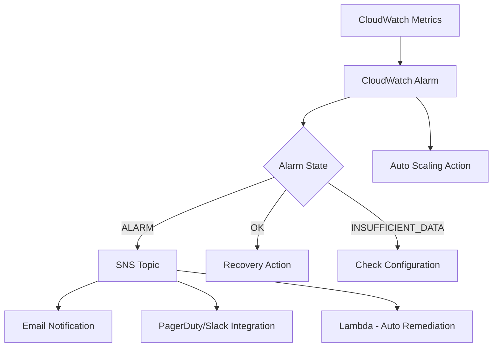

# How to Use Ansible to Manage AWS CloudWatch Alarms

Author: [nawazdhandala](https://www.github.com/nawazdhandala)

Tags: Ansible, AWS, CloudWatch, Monitoring, Alerting

Description: Comprehensive guide to creating and managing AWS CloudWatch alarms with Ansible for monitoring EC2, RDS, ALB, and custom application metrics.

---

CloudWatch alarms are the first line of defense in AWS monitoring. They watch your metrics and fire when something goes wrong, sending notifications, triggering auto-scaling actions, or running Lambda functions. Setting up alarms manually through the console is slow, and it is nearly impossible to maintain consistency across environments.

Ansible lets you define your entire alarm set in code. This guide covers creating alarms for common AWS services, configuring composite alarms, and building a monitoring framework you can deploy to any environment.

## Prerequisites

You need:

- Ansible 2.14+
- The `amazon.aws` collection
- AWS credentials with CloudWatch permissions
- Python boto3

```bash
# Install dependencies
ansible-galaxy collection install amazon.aws
pip install boto3 botocore
```

## CloudWatch Alarm Architecture

Here is how alarms fit into a monitoring system:



## Creating a Basic EC2 CPU Alarm

The `amazon.aws.cloudwatch_metric_alarm` module creates alarms:

```yaml
# create-ec2-alarms.yml - EC2 monitoring alarms
---
- name: Create EC2 CloudWatch Alarms
  hosts: localhost
  connection: local
  gather_facts: false

  vars:
    aws_region: us-east-1
    instance_id: i-0abc123def456789
    alarm_topic: arn:aws:sns:us-east-1:123456789012:ops-alerts

  tasks:
    # Alert when CPU stays above 80% for 15 minutes
    - name: Create high CPU alarm
      amazon.aws.cloudwatch_metric_alarm:
        alarm_name: "ec2-{{ instance_id }}-high-cpu"
        metric_name: CPUUtilization
        namespace: AWS/EC2
        statistic: Average
        comparison: GreaterThanThreshold
        threshold: 80.0
        period: 300
        evaluation_periods: 3
        dimensions:
          InstanceId: "{{ instance_id }}"
        alarm_actions:
          - "{{ alarm_topic }}"
        ok_actions:
          - "{{ alarm_topic }}"
        alarm_description: "CPU utilization above 80% for 15 minutes"
        region: "{{ aws_region }}"
        state: present

    # Alert when the instance status check fails
    - name: Create status check alarm
      amazon.aws.cloudwatch_metric_alarm:
        alarm_name: "ec2-{{ instance_id }}-status-check"
        metric_name: StatusCheckFailed
        namespace: AWS/EC2
        statistic: Maximum
        comparison: GreaterThanThreshold
        threshold: 0
        period: 60
        evaluation_periods: 2
        dimensions:
          InstanceId: "{{ instance_id }}"
        alarm_actions:
          - "{{ alarm_topic }}"
          - "arn:aws:automate:{{ aws_region }}:ec2:recover"
        alarm_description: "Instance status check failed"
        region: "{{ aws_region }}"
        state: present
```

The status check alarm includes an auto-recovery action. When the alarm triggers, AWS will attempt to recover the instance by migrating it to healthy hardware.

## RDS Database Alarms

Database monitoring is critical. Here are the key metrics to watch:

```yaml
# rds-alarms.yml - Comprehensive RDS monitoring
---
- name: Create RDS Alarms
  hosts: localhost
  connection: local
  gather_facts: false

  vars:
    aws_region: us-east-1
    db_instance: myapp-production-db
    alarm_topic: arn:aws:sns:us-east-1:123456789012:ops-alerts

  tasks:
    # CPU above 80% for 10 minutes
    - name: RDS high CPU alarm
      amazon.aws.cloudwatch_metric_alarm:
        alarm_name: "rds-{{ db_instance }}-high-cpu"
        metric_name: CPUUtilization
        namespace: AWS/RDS
        statistic: Average
        comparison: GreaterThanThreshold
        threshold: 80.0
        period: 300
        evaluation_periods: 2
        dimensions:
          DBInstanceIdentifier: "{{ db_instance }}"
        alarm_actions:
          - "{{ alarm_topic }}"
        ok_actions:
          - "{{ alarm_topic }}"
        alarm_description: "RDS CPU above 80%"
        region: "{{ aws_region }}"
        state: present

    # Free storage below 10 GB
    - name: RDS low storage alarm
      amazon.aws.cloudwatch_metric_alarm:
        alarm_name: "rds-{{ db_instance }}-low-storage"
        metric_name: FreeStorageSpace
        namespace: AWS/RDS
        statistic: Average
        comparison: LessThanThreshold
        threshold: 10737418240
        period: 300
        evaluation_periods: 1
        dimensions:
          DBInstanceIdentifier: "{{ db_instance }}"
        alarm_actions:
          - "{{ alarm_topic }}"
        alarm_description: "RDS free storage below 10GB"
        region: "{{ aws_region }}"
        state: present

    # Database connections above 80% of max
    - name: RDS high connections alarm
      amazon.aws.cloudwatch_metric_alarm:
        alarm_name: "rds-{{ db_instance }}-high-connections"
        metric_name: DatabaseConnections
        namespace: AWS/RDS
        statistic: Average
        comparison: GreaterThanThreshold
        threshold: 160
        period: 300
        evaluation_periods: 2
        dimensions:
          DBInstanceIdentifier: "{{ db_instance }}"
        alarm_actions:
          - "{{ alarm_topic }}"
        alarm_description: "RDS connections above 160 (80% of max 200)"
        region: "{{ aws_region }}"
        state: present

    # Read latency above 20ms
    - name: RDS read latency alarm
      amazon.aws.cloudwatch_metric_alarm:
        alarm_name: "rds-{{ db_instance }}-read-latency"
        metric_name: ReadLatency
        namespace: AWS/RDS
        statistic: Average
        comparison: GreaterThanThreshold
        threshold: 0.02
        period: 300
        evaluation_periods: 3
        dimensions:
          DBInstanceIdentifier: "{{ db_instance }}"
        alarm_actions:
          - "{{ alarm_topic }}"
        alarm_description: "RDS read latency above 20ms"
        region: "{{ aws_region }}"
        state: present
```

## ALB Alarms

Monitor your load balancers for errors and latency:

```yaml
# alb-alarms.yml - Application Load Balancer monitoring
---
- name: Create ALB Alarms
  hosts: localhost
  connection: local
  gather_facts: false

  vars:
    aws_region: us-east-1
    alb_arn_suffix: app/myapp-alb/1234567890abc
    target_group_suffix: targetgroup/myapp-tg/abc123def456
    alarm_topic: arn:aws:sns:us-east-1:123456789012:ops-alerts

  tasks:
    # 5xx errors from the ALB itself
    - name: ALB 5xx errors alarm
      amazon.aws.cloudwatch_metric_alarm:
        alarm_name: "alb-myapp-5xx-errors"
        metric_name: HTTPCode_ELB_5XX_Count
        namespace: AWS/ApplicationELB
        statistic: Sum
        comparison: GreaterThanThreshold
        threshold: 10
        period: 300
        evaluation_periods: 1
        dimensions:
          LoadBalancer: "{{ alb_arn_suffix }}"
        alarm_actions:
          - "{{ alarm_topic }}"
        treat_missing_data: notBreaching
        alarm_description: "ALB returning more than 10 5xx errors in 5 minutes"
        region: "{{ aws_region }}"
        state: present

    # Target response time above 2 seconds
    - name: ALB high latency alarm
      amazon.aws.cloudwatch_metric_alarm:
        alarm_name: "alb-myapp-high-latency"
        metric_name: TargetResponseTime
        namespace: AWS/ApplicationELB
        statistic: Average
        comparison: GreaterThanThreshold
        threshold: 2.0
        period: 300
        evaluation_periods: 2
        dimensions:
          LoadBalancer: "{{ alb_arn_suffix }}"
        alarm_actions:
          - "{{ alarm_topic }}"
        alarm_description: "Average response time above 2 seconds"
        region: "{{ aws_region }}"
        state: present

    # Unhealthy target count
    - name: ALB unhealthy targets alarm
      amazon.aws.cloudwatch_metric_alarm:
        alarm_name: "alb-myapp-unhealthy-targets"
        metric_name: UnHealthyHostCount
        namespace: AWS/ApplicationELB
        statistic: Average
        comparison: GreaterThanThreshold
        threshold: 0
        period: 60
        evaluation_periods: 3
        dimensions:
          LoadBalancer: "{{ alb_arn_suffix }}"
          TargetGroup: "{{ target_group_suffix }}"
        alarm_actions:
          - "{{ alarm_topic }}"
        alarm_description: "One or more targets are unhealthy"
        region: "{{ aws_region }}"
        state: present
```

The `treat_missing_data: notBreaching` setting is important for count metrics. If there are no 5xx errors, CloudWatch does not report a data point. Without this setting, the alarm would go to INSUFFICIENT_DATA state when things are actually fine.

## SQS Queue Depth Alarm

Monitor queue depth to detect processing backlogs:

```yaml
# Alert when messages pile up in the queue
- name: SQS queue depth alarm
  amazon.aws.cloudwatch_metric_alarm:
    alarm_name: "sqs-myapp-queue-depth"
    metric_name: ApproximateNumberOfMessagesVisible
    namespace: AWS/SQS
    statistic: Average
    comparison: GreaterThanThreshold
    threshold: 1000
    period: 300
    evaluation_periods: 2
    dimensions:
      QueueName: myapp-work-queue
    alarm_actions:
      - "{{ alarm_topic }}"
    alarm_description: "SQS queue has more than 1000 pending messages"
    region: us-east-1
    state: present
```

## Alarm Set for a Complete Application

Define all alarms for an application in one playbook:

```yaml
# app-monitoring.yml - Complete monitoring setup using variables
---
- name: Application Monitoring Setup
  hosts: localhost
  connection: local
  gather_facts: false

  vars:
    aws_region: us-east-1
    env: production
    app: myapp
    alarm_topic: arn:aws:sns:us-east-1:123456789012:ops-alerts
    alarms:
      - name: "{{ app }}-{{ env }}-cpu"
        metric: CPUUtilization
        namespace: AWS/EC2
        threshold: 80
        comparison: GreaterThanThreshold
        period: 300
        eval_periods: 3
        statistic: Average
        dimensions:
          AutoScalingGroupName: "{{ app }}-{{ env }}-asg"
        description: "CPU above 80% for 15 minutes"

      - name: "{{ app }}-{{ env }}-memory"
        metric: mem_used_percent
        namespace: CWAgent
        threshold: 85
        comparison: GreaterThanThreshold
        period: 300
        eval_periods: 2
        statistic: Average
        dimensions:
          AutoScalingGroupName: "{{ app }}-{{ env }}-asg"
        description: "Memory above 85%"

      - name: "{{ app }}-{{ env }}-disk"
        metric: disk_used_percent
        namespace: CWAgent
        threshold: 90
        comparison: GreaterThanThreshold
        period: 300
        eval_periods: 1
        statistic: Average
        dimensions:
          AutoScalingGroupName: "{{ app }}-{{ env }}-asg"
        description: "Disk usage above 90%"

  tasks:
    # Create all alarms from the variable list
    - name: Create monitoring alarms
      amazon.aws.cloudwatch_metric_alarm:
        alarm_name: "{{ item.name }}"
        metric_name: "{{ item.metric }}"
        namespace: "{{ item.namespace }}"
        statistic: "{{ item.statistic }}"
        comparison: "{{ item.comparison }}"
        threshold: "{{ item.threshold }}"
        period: "{{ item.period }}"
        evaluation_periods: "{{ item.eval_periods }}"
        dimensions: "{{ item.dimensions }}"
        alarm_actions:
          - "{{ alarm_topic }}"
        ok_actions:
          - "{{ alarm_topic }}"
        alarm_description: "{{ item.description }}"
        region: "{{ aws_region }}"
        state: present
      loop: "{{ alarms }}"
      loop_control:
        label: "{{ item.name }}"
```

## Deleting Alarms

```yaml
# Remove an alarm
- name: Delete CloudWatch alarm
  amazon.aws.cloudwatch_metric_alarm:
    alarm_name: "old-unused-alarm"
    region: us-east-1
    state: absent
```

## Wrapping Up

CloudWatch alarms defined in Ansible give you a monitoring framework that is consistent, version controlled, and replicable. Start with the essential metrics for each service (CPU, memory, errors, latency), set appropriate thresholds based on your application's normal behavior, and always configure both alarm and recovery notifications. Use the variable-driven approach to maintain a clear picture of your entire monitoring setup in one place.
