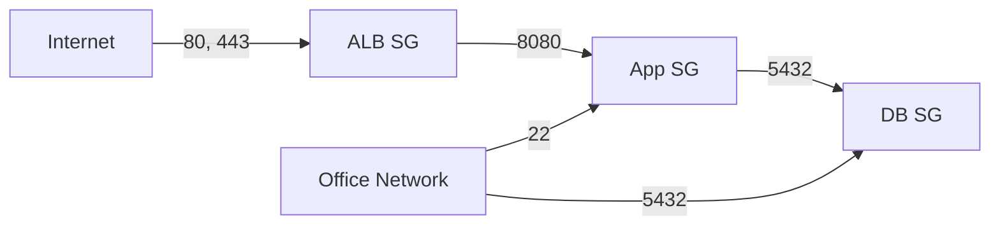

# How to Use Ansible to Manage AWS EC2 Security Groups

Author: [nawazdhandala](https://www.github.com/nawazdhandala)

Tags: Ansible, AWS, Security Groups, Networking, EC2

Description: Create and manage AWS EC2 security groups with Ansible to control inbound and outbound traffic rules as code for repeatable network security.

---

Security groups are the fundamental network firewall in AWS. Every EC2 instance, RDS database, and Lambda function that runs inside a VPC needs at least one security group. Managing them through the AWS console works until you have dozens of groups across multiple accounts and regions. Ansible lets you define security groups as code, version them in Git, and apply them consistently across environments.

## The Basics of Security Groups

A security group acts as a virtual firewall. It has inbound rules (what traffic can reach the resource) and outbound rules (what traffic can leave). By default, a new security group allows all outbound traffic and blocks all inbound traffic.

Key characteristics:
- Security groups are stateful. If you allow inbound traffic on port 80, the response traffic is automatically allowed outbound.
- You can reference other security groups as sources/destinations, not just CIDR blocks.
- Each VPC has a default security group that allows all traffic between members.

## Creating a Simple Security Group

```yaml
# create-security-group.yml
---
- name: Create a web server security group
  hosts: localhost
  connection: local
  gather_facts: false

  vars:
    aws_region: us-east-1
    vpc_id: vpc-0123456789abcdef0

  tasks:
    - name: Create web server security group
      amazon.aws.ec2_security_group:
        name: web-server-sg
        description: Allow HTTP, HTTPS, and SSH access for web servers
        vpc_id: "{{ vpc_id }}"
        region: "{{ aws_region }}"
        rules:
          - proto: tcp
            from_port: 80
            to_port: 80
            cidr_ip: 0.0.0.0/0
            rule_desc: HTTP from anywhere
          - proto: tcp
            from_port: 443
            to_port: 443
            cidr_ip: 0.0.0.0/0
            rule_desc: HTTPS from anywhere
          - proto: tcp
            from_port: 22
            to_port: 22
            cidr_ip: 10.0.0.0/8
            rule_desc: SSH from internal network
        rules_egress:
          - proto: all
            cidr_ip: 0.0.0.0/0
            rule_desc: Allow all outbound
        tags:
          Name: web-server-sg
          Environment: production
          ManagedBy: ansible
        state: present
      register: sg

    - name: Show security group details
      ansible.builtin.debug:
        msg: "Security group ID: {{ sg.group_id }}"
```

## Managing Multiple Security Groups

In a typical application, you have separate security groups for each tier: web, application, and database.

```yaml
# multi-tier-security-groups.yml
---
- name: Create multi-tier security groups
  hosts: localhost
  connection: local
  gather_facts: false

  vars:
    aws_region: us-east-1
    vpc_id: vpc-0123456789abcdef0
    office_cidr: "203.0.113.0/24"

  tasks:
    # Load balancer security group - public facing
    - name: Create ALB security group
      amazon.aws.ec2_security_group:
        name: alb-sg
        description: Application Load Balancer - public HTTP/HTTPS
        vpc_id: "{{ vpc_id }}"
        region: "{{ aws_region }}"
        rules:
          - proto: tcp
            from_port: 80
            to_port: 80
            cidr_ip: 0.0.0.0/0
            rule_desc: HTTP from internet
          - proto: tcp
            from_port: 443
            to_port: 443
            cidr_ip: 0.0.0.0/0
            rule_desc: HTTPS from internet
        tags:
          Name: alb-sg
          Tier: public
          ManagedBy: ansible
      register: alb_sg

    # Application security group - only from ALB
    - name: Create application security group
      amazon.aws.ec2_security_group:
        name: app-sg
        description: Application servers - traffic from ALB only
        vpc_id: "{{ vpc_id }}"
        region: "{{ aws_region }}"
        rules:
          - proto: tcp
            from_port: 8080
            to_port: 8080
            group_id: "{{ alb_sg.group_id }}"
            rule_desc: App traffic from ALB
          - proto: tcp
            from_port: 22
            to_port: 22
            cidr_ip: "{{ office_cidr }}"
            rule_desc: SSH from office
        tags:
          Name: app-sg
          Tier: application
          ManagedBy: ansible
      register: app_sg

    # Database security group - only from application servers
    - name: Create database security group
      amazon.aws.ec2_security_group:
        name: db-sg
        description: Database servers - traffic from app tier only
        vpc_id: "{{ vpc_id }}"
        region: "{{ aws_region }}"
        rules:
          - proto: tcp
            from_port: 5432
            to_port: 5432
            group_id: "{{ app_sg.group_id }}"
            rule_desc: PostgreSQL from app servers
          - proto: tcp
            from_port: 5432
            to_port: 5432
            cidr_ip: "{{ office_cidr }}"
            rule_desc: PostgreSQL from office for admin
        rules_egress:
          - proto: tcp
            from_port: 443
            to_port: 443
            cidr_ip: 0.0.0.0/0
            rule_desc: HTTPS outbound for updates
        tags:
          Name: db-sg
          Tier: database
          ManagedBy: ansible
      register: db_sg

    - name: Show all security group IDs
      ansible.builtin.debug:
        msg:
          - "ALB SG: {{ alb_sg.group_id }}"
          - "App SG: {{ app_sg.group_id }}"
          - "DB SG: {{ db_sg.group_id }}"
```

## Security Group Architecture



## Referencing Security Groups by Name

You can reference security groups by name instead of ID, which makes playbooks more readable. But be careful: names are not unique across VPCs.

```yaml
# Reference by group name
- name: Create app server security group
  amazon.aws.ec2_security_group:
    name: app-sg
    vpc_id: "{{ vpc_id }}"
    region: "{{ aws_region }}"
    rules:
      - proto: tcp
        from_port: 8080
        to_port: 8080
        group_name: alb-sg
        rule_desc: Traffic from ALB
```

## Data-Driven Security Groups

For large environments, define security groups in a variable file and create them in a loop.

```yaml
# vars/security-groups.yml
---
security_groups:
  - name: bastion-sg
    description: Bastion host access
    rules:
      - proto: tcp
        from_port: 22
        to_port: 22
        cidr_ip: "{{ office_cidr }}"
        rule_desc: SSH from office

  - name: monitoring-sg
    description: Monitoring servers
    rules:
      - proto: tcp
        from_port: 9090
        to_port: 9090
        cidr_ip: 10.0.0.0/8
        rule_desc: Prometheus
      - proto: tcp
        from_port: 3000
        to_port: 3000
        cidr_ip: 10.0.0.0/8
        rule_desc: Grafana
      - proto: tcp
        from_port: 22
        to_port: 22
        group_name: bastion-sg
        rule_desc: SSH from bastion

  - name: cache-sg
    description: Redis/Memcached
    rules:
      - proto: tcp
        from_port: 6379
        to_port: 6379
        group_name: app-sg
        rule_desc: Redis from app servers
```

```yaml
# create-from-vars.yml
---
- name: Create security groups from variable definitions
  hosts: localhost
  connection: local
  gather_facts: false

  vars_files:
    - vars/security-groups.yml

  vars:
    aws_region: us-east-1
    vpc_id: vpc-0123456789abcdef0
    office_cidr: "203.0.113.0/24"

  tasks:
    - name: Create security groups
      amazon.aws.ec2_security_group:
        name: "{{ item.name }}"
        description: "{{ item.description }}"
        vpc_id: "{{ vpc_id }}"
        region: "{{ aws_region }}"
        rules: "{{ item.rules }}"
        tags:
          Name: "{{ item.name }}"
          ManagedBy: ansible
      loop: "{{ security_groups }}"
      register: created_sgs
```

## Purging Rules

By default, the `ec2_security_group` module only adds rules. It does not remove rules that are not in your playbook. To enforce your rules as the only rules (removing any manually-added rules), set `purge_rules` and `purge_rules_egress` to `true`.

```yaml
# Enforce exact rules - remove anything not defined here
- name: Enforce web security group rules
  amazon.aws.ec2_security_group:
    name: web-server-sg
    vpc_id: "{{ vpc_id }}"
    region: "{{ aws_region }}"
    purge_rules: true
    purge_rules_egress: true
    rules:
      - proto: tcp
        from_port: 80
        to_port: 80
        cidr_ip: 0.0.0.0/0
        rule_desc: HTTP
      - proto: tcp
        from_port: 443
        to_port: 443
        cidr_ip: 0.0.0.0/0
        rule_desc: HTTPS
    rules_egress:
      - proto: all
        cidr_ip: 0.0.0.0/0
    tags:
      Name: web-server-sg
      ManagedBy: ansible
```

This is the recommended approach for production. If someone adds a rule manually through the console, the next Ansible run removes it. This ensures your Git repository is the single source of truth.

## Querying Existing Security Groups

```yaml
# Get information about existing security groups
- name: Get all security groups in VPC
  amazon.aws.ec2_security_group_info:
    region: "{{ aws_region }}"
    filters:
      vpc-id: "{{ vpc_id }}"
  register: all_sgs

- name: List security groups
  ansible.builtin.debug:
    msg: "{{ item.group_name }}: {{ item.group_id }} ({{ item.description }})"
  loop: "{{ all_sgs.security_groups }}"
  loop_control:
    label: "{{ item.group_name }}"

# Find a specific security group
- name: Get web server security group
  amazon.aws.ec2_security_group_info:
    region: "{{ aws_region }}"
    filters:
      group-name: web-server-sg
      vpc-id: "{{ vpc_id }}"
  register: web_sg_info

- name: Show current rules
  ansible.builtin.debug:
    msg: "{{ web_sg_info.security_groups[0].ip_permissions }}"
```

## IPv6 Support

Security groups support both IPv4 and IPv6 rules.

```yaml
# Security group with IPv6 rules
- name: Create dual-stack security group
  amazon.aws.ec2_security_group:
    name: web-dual-stack-sg
    vpc_id: "{{ vpc_id }}"
    region: "{{ aws_region }}"
    rules:
      - proto: tcp
        from_port: 443
        to_port: 443
        cidr_ip: 0.0.0.0/0
        rule_desc: HTTPS IPv4
      - proto: tcp
        from_port: 443
        to_port: 443
        cidr_ipv6: "::/0"
        rule_desc: HTTPS IPv6
```

## Deleting Security Groups

```yaml
# Remove a security group
- name: Delete unused security group
  amazon.aws.ec2_security_group:
    name: old-test-sg
    vpc_id: "{{ vpc_id }}"
    region: "{{ aws_region }}"
    state: absent
```

A security group cannot be deleted if it is still attached to any resource (EC2 instance, RDS instance, ENI). Ansible will return an error if you try. Detach the security group from all resources first.

## Security Group Limits

AWS has default limits on security groups:
- 2,500 security groups per VPC
- 60 inbound and 60 outbound rules per security group
- 5 security groups per network interface

If you hit the rules-per-group limit, consider consolidating CIDR ranges. Instead of 10 rules for 10 individual IPs, use a single rule with a summarized CIDR block. For complex rule sets, AWS also supports prefix lists that can hold multiple CIDR ranges in a single reference.

## Wrapping Up

Security groups as code with Ansible means your network security is versioned, reviewable, and reproducible. Use `purge_rules: true` to enforce that only Ansible-defined rules exist. Structure your groups by tier (ALB, app, DB) and reference groups by ID for cross-group rules. Store the definitions in variable files so they are easy to compare across environments. The investment in codifying security groups pays off every time you set up a new environment or need to audit what traffic is allowed where.
