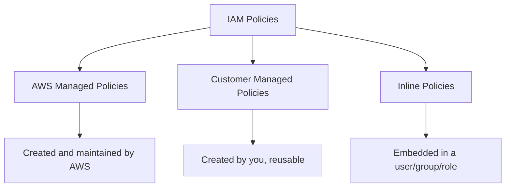

# How to Use Ansible to Manage AWS IAM Policies

Author: [nawazdhandala](https://www.github.com/nawazdhandala)

Tags: Ansible, AWS, IAM, Security, Policies

Description: Comprehensive guide to creating and managing AWS IAM policies with Ansible covering custom policies, policy versioning, and least-privilege patterns.

---

IAM policies are JSON documents that define what actions are allowed or denied on AWS resources. They are the foundation of AWS security, and getting them right matters. A policy that is too broad opens security holes. A policy that is too restrictive breaks applications. Managing these documents manually across environments is a recipe for drift and inconsistency.

Ansible lets you define IAM policies in code, version control them, and apply them consistently. This guide covers creating managed policies, inline policies, policy versions, and practical patterns for common AWS services.

## Prerequisites

You need:

- Ansible 2.14+
- The `amazon.aws` collection
- AWS credentials with IAM permissions
- Python boto3

```bash
# Install dependencies
ansible-galaxy collection install amazon.aws
pip install boto3 botocore
```

## Types of IAM Policies

AWS has several types of IAM policies:



AWS managed policies cover common use cases. Customer managed policies are reusable policies you create yourself. Inline policies are embedded directly in a user, group, or role and are not reusable.

## Creating a Customer Managed Policy

Use `community.aws.iam_managed_policy` to create reusable policies:

```yaml
# create-policy.yml - Create a custom managed policy
---
- name: Create IAM Managed Policy
  hosts: localhost
  connection: local
  gather_facts: false

  tasks:
    # Create a policy that allows read access to specific S3 buckets
    - name: Create S3 read policy
      community.aws.iam_managed_policy:
        policy_name: AppS3ReadAccess
        state: present
        policy_description: "Allows read access to application S3 buckets"
        policy: |
          {
            "Version": "2012-10-17",
            "Statement": [
              {
                "Sid": "AllowS3BucketListing",
                "Effect": "Allow",
                "Action": [
                  "s3:ListBucket",
                  "s3:GetBucketLocation"
                ],
                "Resource": [
                  "arn:aws:s3:::myapp-assets-*",
                  "arn:aws:s3:::myapp-config-*"
                ]
              },
              {
                "Sid": "AllowS3ObjectRead",
                "Effect": "Allow",
                "Action": [
                  "s3:GetObject",
                  "s3:GetObjectVersion"
                ],
                "Resource": [
                  "arn:aws:s3:::myapp-assets-*/*",
                  "arn:aws:s3:::myapp-config-*/*"
                ]
              }
            ]
          }
      register: policy_result

    - name: Show policy ARN
      ansible.builtin.debug:
        msg: "Policy ARN: {{ policy_result.policy.arn }}"
```

## Creating Inline Policies

Inline policies are attached directly to a specific user, group, or role:

```yaml
# Attach an inline policy to a role
- name: Attach inline policy to Lambda role
  amazon.aws.iam_policy:
    iam_type: role
    iam_name: myapp-lambda-role
    policy_name: LambdaDynamoDBAccess
    state: present
    policy_json: |
      {
        "Version": "2012-10-17",
        "Statement": [
          {
            "Effect": "Allow",
            "Action": [
              "dynamodb:GetItem",
              "dynamodb:PutItem",
              "dynamodb:UpdateItem",
              "dynamodb:DeleteItem",
              "dynamodb:Query",
              "dynamodb:Scan"
            ],
            "Resource": "arn:aws:dynamodb:us-east-1:123456789012:table/myapp-users"
          }
        ]
      }
```

```yaml
# Attach an inline policy to a group
- name: Attach inline policy to developers group
  amazon.aws.iam_policy:
    iam_type: group
    iam_name: developers
    policy_name: DeveloperEC2Access
    state: present
    policy_json: |
      {
        "Version": "2012-10-17",
        "Statement": [
          {
            "Effect": "Allow",
            "Action": [
              "ec2:DescribeInstances",
              "ec2:DescribeSecurityGroups",
              "ec2:DescribeSubnets",
              "ec2:DescribeVpcs"
            ],
            "Resource": "*"
          },
          {
            "Effect": "Allow",
            "Action": [
              "ec2:StartInstances",
              "ec2:StopInstances"
            ],
            "Resource": "*",
            "Condition": {
              "StringEquals": {
                "ec2:ResourceTag/Environment": "development"
              }
            }
          }
        ]
      }
```

The second statement uses a condition to restrict start/stop permissions to instances tagged with `Environment: development`. This is a common pattern for giving developers access to their own resources without affecting production.

## Building Policies with Variables

Hardcoding account IDs and resource names in policies is fragile. Use Ansible variables:

```yaml
# policy-with-vars.yml - Dynamic policy using variables
---
- name: Create Dynamic Policy
  hosts: localhost
  connection: local
  gather_facts: false

  vars:
    aws_account_id: "123456789012"
    aws_region: us-east-1
    app_name: myapp
    environment: production
    s3_buckets:
      - "{{ app_name }}-{{ environment }}-assets"
      - "{{ app_name }}-{{ environment }}-uploads"
      - "{{ app_name }}-{{ environment }}-backups"

  tasks:
    # Build the policy document dynamically
    - name: Create application access policy
      community.aws.iam_managed_policy:
        policy_name: "{{ app_name }}-{{ environment }}-access"
        state: present
        policy_description: "Access policy for {{ app_name }} {{ environment }}"
        policy: "{{ lookup('template', 'templates/app-policy.json.j2') }}"
```

And the Jinja2 template:

```json
{
  "Version": "2012-10-17",
  "Statement": [
    {
      "Sid": "S3Access",
      "Effect": "Allow",
      "Action": [
        "s3:GetObject",
        "s3:PutObject",
        "s3:DeleteObject"
      ],
      "Resource": [

        "arn:aws:s3:::{{ bucket }}/*",


      ]
    },
    {
      "Sid": "SQSAccess",
      "Effect": "Allow",
      "Action": [
        "sqs:SendMessage",
        "sqs:ReceiveMessage",
        "sqs:DeleteMessage",
        "sqs:GetQueueAttributes"
      ],
      "Resource": "arn:aws:sqs:{{ aws_region }}:{{ aws_account_id }}:{{ app_name }}-{{ environment }}-*"
    }
  ]
}
```

## Common Policy Patterns

Here are policies you will use frequently:

### Read-Only Access to CloudWatch Logs

```yaml
# Allow reading logs but not deleting them
- name: CloudWatch Logs read policy
  community.aws.iam_managed_policy:
    policy_name: CloudWatchLogsReadAccess
    state: present
    policy: |
      {
        "Version": "2012-10-17",
        "Statement": [
          {
            "Effect": "Allow",
            "Action": [
              "logs:DescribeLogGroups",
              "logs:DescribeLogStreams",
              "logs:GetLogEvents",
              "logs:FilterLogEvents"
            ],
            "Resource": "arn:aws:logs:*:*:log-group:/aws/lambda/myapp-*"
          }
        ]
      }
```

### CI/CD Deployment Policy

```yaml
# Policy for a CI/CD pipeline to deploy applications
- name: CI/CD deployment policy
  community.aws.iam_managed_policy:
    policy_name: CICDDeploymentPolicy
    state: present
    policy: |
      {
        "Version": "2012-10-17",
        "Statement": [
          {
            "Sid": "ECRAccess",
            "Effect": "Allow",
            "Action": [
              "ecr:GetAuthorizationToken",
              "ecr:BatchCheckLayerAvailability",
              "ecr:PutImage",
              "ecr:InitiateLayerUpload",
              "ecr:UploadLayerPart",
              "ecr:CompleteLayerUpload"
            ],
            "Resource": "*"
          },
          {
            "Sid": "ECSDeployAccess",
            "Effect": "Allow",
            "Action": [
              "ecs:UpdateService",
              "ecs:DescribeServices",
              "ecs:DescribeTaskDefinition",
              "ecs:RegisterTaskDefinition",
              "ecs:ListTasks",
              "ecs:DescribeTasks"
            ],
            "Resource": "*"
          },
          {
            "Sid": "PassRoleForECS",
            "Effect": "Allow",
            "Action": "iam:PassRole",
            "Resource": [
              "arn:aws:iam::123456789012:role/myapp-ecs-*"
            ]
          }
        ]
      }
```

### Deny Specific Actions

```yaml
# Deny policy to prevent dangerous actions
- name: Deny dangerous actions policy
  community.aws.iam_managed_policy:
    policy_name: DenyDangerousActions
    state: present
    policy: |
      {
        "Version": "2012-10-17",
        "Statement": [
          {
            "Sid": "DenyAccountLevelChanges",
            "Effect": "Deny",
            "Action": [
              "organizations:LeaveOrganization",
              "iam:CreateUser",
              "iam:DeleteUser",
              "iam:CreateRole",
              "iam:DeleteRole"
            ],
            "Resource": "*"
          },
          {
            "Sid": "DenyProductionDeletion",
            "Effect": "Deny",
            "Action": [
              "rds:DeleteDBInstance",
              "rds:DeleteDBCluster",
              "s3:DeleteBucket"
            ],
            "Resource": "*",
            "Condition": {
              "StringEquals": {
                "aws:ResourceTag/Environment": "production"
              }
            }
          }
        ]
      }
```

## Attaching Managed Policies to Roles

After creating custom policies, attach them to roles:

```yaml
# Attach a custom managed policy to an existing role
- name: Update role with new policies
  amazon.aws.iam_role:
    name: myapp-ec2-role
    state: present
    managed_policies:
      - arn:aws:iam::123456789012:policy/AppS3ReadAccess
      - arn:aws:iam::aws:policy/CloudWatchAgentServerPolicy
      - arn:aws:iam::aws:policy/AmazonSSMManagedInstanceCore
    purge_policies: true
```

Setting `purge_policies: true` removes any managed policies not listed. This ensures the role has exactly the policies you specify, nothing more.

## Removing Policies

Delete a managed policy:

```yaml
# Delete a customer managed policy
- name: Delete old policy
  community.aws.iam_managed_policy:
    policy_name: OldUnusedPolicy
    state: absent
```

Remove an inline policy:

```yaml
# Remove an inline policy from a role
- name: Remove inline policy
  amazon.aws.iam_policy:
    iam_type: role
    iam_name: myapp-lambda-role
    policy_name: OldPermissions
    state: absent
```

## Wrapping Up

IAM policies defined in Ansible playbooks give you visibility, consistency, and control over your AWS security posture. Use customer managed policies for permissions you need to reuse, inline policies for one-off permissions, and always follow the principle of least privilege. Store your policies in version control, review changes carefully, and test in non-production accounts before applying to production.
