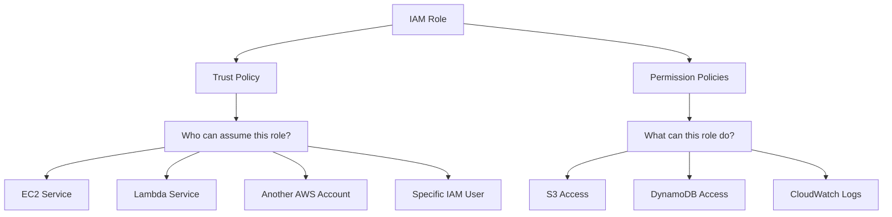

# How to Use Ansible to Manage AWS IAM Roles

Author: [nawazdhandala](https://www.github.com/nawazdhandala)

Tags: Ansible, AWS, IAM, Security, Roles

Description: Practical guide to creating and managing AWS IAM roles with Ansible including trust policies, permission boundaries, and cross-account access.

---

IAM roles are the backbone of secure access in AWS. Unlike IAM users with long-lived credentials, roles provide temporary credentials that services, applications, and users can assume when needed. Every EC2 instance, Lambda function, and ECS task should use a role instead of hardcoded access keys.

This guide covers creating IAM roles with Ansible, configuring trust policies, attaching permissions, and setting up common patterns like cross-account access and service roles.

## Prerequisites

You need:

- Ansible 2.14+
- The `amazon.aws` collection
- AWS credentials with IAM admin permissions
- Python boto3

```bash
# Install dependencies
ansible-galaxy collection install amazon.aws
pip install boto3 botocore
```

## How IAM Roles Work

An IAM role has two key components: a trust policy (who can assume the role) and permission policies (what the role can do).



## Creating a Basic EC2 Instance Role

The most common use case is creating a role that EC2 instances can assume:

```yaml
# create-ec2-role.yml - IAM role for EC2 instances
---
- name: Create EC2 Instance Role
  hosts: localhost
  connection: local
  gather_facts: false

  tasks:
    # Create the role with a trust policy allowing EC2 to assume it
    - name: Create EC2 instance role
      amazon.aws.iam_role:
        name: myapp-ec2-role
        state: present
        assume_role_policy_document: |
          {
            "Version": "2012-10-17",
            "Statement": [
              {
                "Effect": "Allow",
                "Principal": {
                  "Service": "ec2.amazonaws.com"
                },
                "Action": "sts:AssumeRole"
              }
            ]
          }
        managed_policies:
          - arn:aws:iam::aws:policy/CloudWatchAgentServerPolicy
          - arn:aws:iam::aws:policy/AmazonSSMManagedInstanceCore
        tags:
          Application: myapp
          Environment: production
      register: role_result

    - name: Show role ARN
      ansible.builtin.debug:
        msg: "Role ARN: {{ role_result.iam_role.arn }}"
```

The trust policy says "EC2 instances are allowed to assume this role." The managed policies give the role permissions to send CloudWatch metrics and use Systems Manager.

## Creating an Instance Profile

EC2 instances do not directly use IAM roles. They use instance profiles, which are wrappers around roles:

```yaml
# Create an instance profile and attach the role to it
- name: Create instance profile
  amazon.aws.iam_instance_profile:
    name: myapp-ec2-profile
    role: myapp-ec2-role
    state: present
  register: profile_result

- name: Show instance profile ARN
  ansible.builtin.debug:
    msg: "Instance Profile: {{ profile_result.iam_instance_profile.arn }}"
```

When launching an EC2 instance, you reference the instance profile name, not the role name directly.

## Lambda Execution Role

Lambda functions need a role with specific trust policy for the Lambda service:

```yaml
# create-lambda-role.yml - IAM role for Lambda functions
---
- name: Create Lambda Execution Role
  hosts: localhost
  connection: local
  gather_facts: false

  tasks:
    - name: Create Lambda role
      amazon.aws.iam_role:
        name: myapp-lambda-role
        state: present
        assume_role_policy_document: |
          {
            "Version": "2012-10-17",
            "Statement": [
              {
                "Effect": "Allow",
                "Principal": {
                  "Service": "lambda.amazonaws.com"
                },
                "Action": "sts:AssumeRole"
              }
            ]
          }
        managed_policies:
          - arn:aws:iam::aws:policy/service-role/AWSLambdaBasicExecutionRole
        tags:
          Application: myapp
          Service: lambda

    # Add a custom inline policy for specific permissions
    - name: Attach inline policy for S3 and DynamoDB access
      amazon.aws.iam_policy:
        iam_type: role
        iam_name: myapp-lambda-role
        policy_name: LambdaAppPermissions
        state: present
        policy_json: |
          {
            "Version": "2012-10-17",
            "Statement": [
              {
                "Effect": "Allow",
                "Action": [
                  "s3:GetObject",
                  "s3:PutObject"
                ],
                "Resource": "arn:aws:s3:::myapp-data-bucket/*"
              },
              {
                "Effect": "Allow",
                "Action": [
                  "dynamodb:GetItem",
                  "dynamodb:PutItem",
                  "dynamodb:Query"
                ],
                "Resource": "arn:aws:dynamodb:us-east-1:123456789012:table/myapp-*"
              }
            ]
          }
```

The `AWSLambdaBasicExecutionRole` managed policy gives Lambda permission to write logs to CloudWatch. The inline policy adds application-specific S3 and DynamoDB access.

## Cross-Account Access Role

When you need to access resources in another AWS account, create a role that can be assumed from the other account:

```yaml
# cross-account-role.yml - Role for cross-account access
---
- name: Create Cross-Account Role
  hosts: localhost
  connection: local
  gather_facts: false

  vars:
    trusted_account_id: "987654321098"

  tasks:
    # This role allows a specific account to assume it
    - name: Create cross-account role
      amazon.aws.iam_role:
        name: cross-account-read-role
        state: present
        assume_role_policy_document: |
          {
            "Version": "2012-10-17",
            "Statement": [
              {
                "Effect": "Allow",
                "Principal": {
                  "AWS": "arn:aws:iam::{{ trusted_account_id }}:root"
                },
                "Action": "sts:AssumeRole",
                "Condition": {
                  "Bool": {
                    "aws:MultiFactorAuthPresent": "true"
                  }
                }
              }
            ]
          }
        managed_policies:
          - arn:aws:iam::aws:policy/ReadOnlyAccess
        max_session_duration: 3600
        tags:
          Purpose: cross-account-access
          TrustedAccount: "{{ trusted_account_id }}"
```

The condition requiring MFA adds a layer of security. Users in the trusted account must authenticate with MFA before they can assume this role.

## ECS Task Role

ECS tasks (containers) have two types of roles: the task role (what the container can do) and the task execution role (what ECS needs to launch the container):

```yaml
# ecs-roles.yml - Both roles needed for ECS tasks
---
- name: Create ECS Roles
  hosts: localhost
  connection: local
  gather_facts: false

  tasks:
    # Task execution role - used by ECS agent to pull images and write logs
    - name: Create ECS task execution role
      amazon.aws.iam_role:
        name: myapp-ecs-execution-role
        state: present
        assume_role_policy_document: |
          {
            "Version": "2012-10-17",
            "Statement": [
              {
                "Effect": "Allow",
                "Principal": {
                  "Service": "ecs-tasks.amazonaws.com"
                },
                "Action": "sts:AssumeRole"
              }
            ]
          }
        managed_policies:
          - arn:aws:iam::aws:policy/service-role/AmazonECSTaskExecutionRolePolicy

    # Task role - permissions your application code needs
    - name: Create ECS task role
      amazon.aws.iam_role:
        name: myapp-ecs-task-role
        state: present
        assume_role_policy_document: |
          {
            "Version": "2012-10-17",
            "Statement": [
              {
                "Effect": "Allow",
                "Principal": {
                  "Service": "ecs-tasks.amazonaws.com"
                },
                "Action": "sts:AssumeRole"
              }
            ]
          }
        managed_policies: []
        tags:
          Application: myapp
          Service: ecs

    # Give the task role access to application resources
    - name: Attach application permissions to task role
      amazon.aws.iam_policy:
        iam_type: role
        iam_name: myapp-ecs-task-role
        policy_name: AppPermissions
        state: present
        policy_json: |
          {
            "Version": "2012-10-17",
            "Statement": [
              {
                "Effect": "Allow",
                "Action": [
                  "sqs:SendMessage",
                  "sqs:ReceiveMessage",
                  "sqs:DeleteMessage"
                ],
                "Resource": "arn:aws:sqs:us-east-1:123456789012:myapp-*"
              },
              {
                "Effect": "Allow",
                "Action": [
                  "secretsmanager:GetSecretValue"
                ],
                "Resource": "arn:aws:secretsmanager:us-east-1:123456789012:secret:myapp/*"
              }
            ]
          }
```

## Permission Boundaries

Permission boundaries limit the maximum permissions a role can have, even if broader policies are attached:

```yaml
# Create a role with a permission boundary
- name: Create role with permission boundary
  amazon.aws.iam_role:
    name: developer-deploy-role
    state: present
    assume_role_policy_document: |
      {
        "Version": "2012-10-17",
        "Statement": [
          {
            "Effect": "Allow",
            "Principal": {
              "AWS": "arn:aws:iam::123456789012:root"
            },
            "Action": "sts:AssumeRole"
          }
        ]
      }
    boundary: arn:aws:iam::123456789012:policy/DeveloperBoundary
    managed_policies:
      - arn:aws:iam::aws:policy/PowerUserAccess
```

Even though the role has PowerUserAccess, the boundary policy restricts what it can actually do. This is useful for delegating role creation to developers without giving them full admin power.

## Listing and Auditing Roles

Query existing roles for auditing:

```yaml
# Get information about a specific role
- name: Get role details
  amazon.aws.iam_role_info:
    name: myapp-ec2-role
  register: role_info

- name: Display role policies
  ansible.builtin.debug:
    msg:
      - "Role: {{ role_info.iam_roles[0].role_name }}"
      - "ARN: {{ role_info.iam_roles[0].arn }}"
      - "Policies: {{ role_info.iam_roles[0].attached_policies }}"
```

## Deleting Roles

To delete a role, you must first detach all policies and remove it from instance profiles:

```yaml
# Clean up and delete a role
- name: Delete IAM role
  amazon.aws.iam_role:
    name: old-unused-role
    state: absent
```

The Ansible module handles detaching managed policies automatically when deleting. But inline policies and instance profile associations may need to be cleaned up separately.

## Wrapping Up

IAM roles are the right way to grant AWS access to services and applications. With Ansible, you can define roles declaratively, track changes in version control, and apply them consistently across environments. Start with the principle of least privilege, use managed policies where possible, add inline policies for application-specific needs, and always include proper tagging for auditing.
