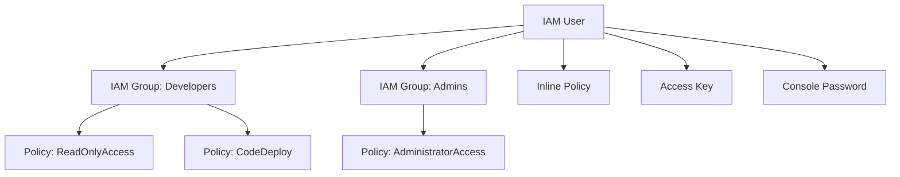

# How to Use Ansible to Manage AWS IAM Users

Author: [nawazdhandala](https://www.github.com/nawazdhandala)

Tags: Ansible, AWS, IAM, Security, User Management

Description: Learn how to create, manage, and audit AWS IAM users with Ansible including access keys, group memberships, and policy attachments.

---

IAM user management is one of those tasks that seems simple until you have fifty users across three AWS accounts. Creating users through the console is tedious, error-prone, and impossible to audit consistently. With Ansible, you define your IAM users in code, apply changes consistently, and have a clear record of who has access to what.

This guide covers creating IAM users, managing their credentials, assigning them to groups, attaching policies, and handling the entire user lifecycle with Ansible.

## Prerequisites

You need:

- Ansible 2.14+
- The `amazon.aws` collection
- AWS credentials with IAM administrative permissions
- Python boto3

```bash
# Install dependencies
ansible-galaxy collection install amazon.aws
pip install boto3 botocore
```

## IAM User Structure

Here is how IAM users fit into the broader access control picture:



Best practice is to attach policies to groups, then add users to groups. This keeps permissions manageable as your team grows.

## Creating a Single IAM User

The `amazon.aws.iam_user` module handles user creation:

```yaml
# create-user.yml - Create a single IAM user
---
- name: Create IAM User
  hosts: localhost
  connection: local
  gather_facts: false

  vars:
    aws_region: us-east-1

  tasks:
    # Create the IAM user
    - name: Create IAM user
      amazon.aws.iam_user:
        name: john.doe
        state: present
        tags:
          Department: Engineering
          Team: Platform
          Email: john.doe@example.com
      register: user_result

    - name: Show user ARN
      ansible.builtin.debug:
        msg: "User ARN: {{ user_result.iam_user.user.arn }}"
```

This creates the user but does not give them any way to log in. You need to set up either console access or programmatic access separately.

## Creating Access Keys

For programmatic access (CLI, SDKs, APIs), create access keys:

```yaml
# Create an access key for the user
- name: Create access key for user
  amazon.aws.iam_access_key:
    user_name: john.doe
    state: present
  register: access_key

# Store the credentials securely - they are only shown once
- name: Display access key details
  ansible.builtin.debug:
    msg:
      - "Access Key ID: {{ access_key.access_key.access_key_id }}"
      - "Secret Key: {{ access_key.secret_access_key }}"
  no_log: false
```

The secret access key is only available at creation time. If you lose it, you need to create a new key pair. In production, you would store these credentials in a secrets manager, not just print them.

## Managing Console Access

To give a user AWS console login access:

```yaml
# Set up console access with a login profile
- name: Create login profile for console access
  community.aws.iam_user_login_profile:
    user_name: john.doe
    password: "{{ initial_password }}"
    password_reset_required: true
    state: present
```

Setting `password_reset_required: true` forces the user to change their password on first login. This is a security best practice.

## Creating IAM Groups and Adding Users

Manage permissions through groups rather than attaching policies directly to users:

```yaml
# manage-groups.yml - Create groups and add users
---
- name: Manage IAM Groups
  hosts: localhost
  connection: local
  gather_facts: false

  tasks:
    # Create the developers group
    - name: Create developers group
      amazon.aws.iam_group:
        name: developers
        state: present
        managed_policies:
          - arn:aws:iam::aws:policy/AmazonEC2ReadOnlyAccess
          - arn:aws:iam::aws:policy/AmazonS3ReadOnlyAccess
          - arn:aws:iam::aws:policy/CloudWatchReadOnlyAccess
        users:
          - john.doe
          - jane.smith
          - bob.wilson

    # Create the admins group with broader access
    - name: Create admins group
      amazon.aws.iam_group:
        name: admins
        state: present
        managed_policies:
          - arn:aws:iam::aws:policy/AdministratorAccess
        users:
          - alice.admin
```

When you update the `users` list and run the playbook again, Ansible will add new users and remove users no longer in the list.

## Bulk User Management

For larger teams, define users in a variable file and loop through them:

```yaml
# vars/users.yml - User definitions
---
iam_users:
  - name: john.doe
    groups:
      - developers
      - ci-cd
    tags:
      Department: Engineering
      Team: Backend
  - name: jane.smith
    groups:
      - developers
      - data-team
    tags:
      Department: Engineering
      Team: Data
  - name: bob.wilson
    groups:
      - developers
    tags:
      Department: Engineering
      Team: Frontend
  - name: alice.admin
    groups:
      - admins
    tags:
      Department: Operations
      Team: Platform
```

```yaml
# manage-users.yml - Create and manage multiple users from variable file
---
- name: Manage IAM Users
  hosts: localhost
  connection: local
  gather_facts: false
  vars_files:
    - vars/users.yml

  tasks:
    # Create all users defined in the variable file
    - name: Create IAM users
      amazon.aws.iam_user:
        name: "{{ item.name }}"
        state: present
        tags: "{{ item.tags }}"
      loop: "{{ iam_users }}"
      loop_control:
        label: "{{ item.name }}"

    # Add each user to their assigned groups
    - name: Add users to groups
      ansible.builtin.command:
        cmd: >
          aws iam add-user-to-group
          --user-name {{ item.0.name }}
          --group-name {{ item.1 }}
      loop: "{{ iam_users | subelements('groups') }}"
      loop_control:
        label: "{{ item.0.name }} -> {{ item.1 }}"
      changed_when: true
```

## Enforcing MFA

You can create a policy that requires MFA for all actions except setting up MFA itself:

```yaml
# Create a policy that denies everything without MFA
- name: Create MFA enforcement policy
  amazon.aws.iam_policy:
    iam_type: group
    iam_name: developers
    policy_name: RequireMFA
    state: present
    policy_json: |
      {
        "Version": "2012-10-17",
        "Statement": [
          {
            "Sid": "AllowViewAccountInfo",
            "Effect": "Allow",
            "Action": [
              "iam:ListVirtualMFADevices",
              "iam:GetAccountPasswordPolicy"
            ],
            "Resource": "*"
          },
          {
            "Sid": "AllowManageOwnMFA",
            "Effect": "Allow",
            "Action": [
              "iam:CreateVirtualMFADevice",
              "iam:EnableMFADevice",
              "iam:ResyncMFADevice",
              "iam:ListMFADevices"
            ],
            "Resource": [
              "arn:aws:iam::*:mfa/${aws:username}",
              "arn:aws:iam::*:user/${aws:username}"
            ]
          },
          {
            "Sid": "DenyAllExceptMFAWithoutMFA",
            "Effect": "Deny",
            "NotAction": [
              "iam:CreateVirtualMFADevice",
              "iam:EnableMFADevice",
              "iam:ListMFADevices",
              "iam:GetUser",
              "iam:ListVirtualMFADevices",
              "iam:ChangePassword",
              "sts:GetSessionToken"
            ],
            "Resource": "*",
            "Condition": {
              "BoolIfExists": {
                "aws:MultiFactorAuthPresent": "false"
              }
            }
          }
        ]
      }
```

## Rotating Access Keys

Regularly rotating access keys is a security requirement in many organizations:

```yaml
# rotate-keys.yml - Rotate access keys for a user
---
- name: Rotate IAM Access Keys
  hosts: localhost
  connection: local
  gather_facts: false

  vars:
    target_user: john.doe

  tasks:
    # List existing access keys
    - name: Get current access keys
      amazon.aws.iam_access_key_info:
        user_name: "{{ target_user }}"
      register: current_keys

    # Create a new access key
    - name: Create new access key
      amazon.aws.iam_access_key:
        user_name: "{{ target_user }}"
        state: present
      register: new_key

    # Deactivate the old key (do not delete yet - give time to update configs)
    - name: Deactivate old access keys
      amazon.aws.iam_access_key:
        user_name: "{{ target_user }}"
        access_key_id: "{{ item.access_key_id }}"
        state: present
        enabled: false
      loop: "{{ current_keys.iam_access_keys }}"
      when: item.access_key_id != new_key.access_key.access_key_id
      loop_control:
        label: "{{ item.access_key_id }}"

    - name: Show new credentials
      ansible.builtin.debug:
        msg:
          - "New Access Key: {{ new_key.access_key.access_key_id }}"
          - "Update your configurations, then delete old keys"
```

## Deactivating and Removing Users

When someone leaves the team, deactivate their access first, then remove them:

```yaml
# offboard-user.yml - Safely remove a departing user
---
- name: Offboard IAM User
  hosts: localhost
  connection: local
  gather_facts: false

  vars:
    departing_user: john.doe

  tasks:
    # Deactivate all access keys first
    - name: Get access keys
      amazon.aws.iam_access_key_info:
        user_name: "{{ departing_user }}"
      register: keys

    - name: Deactivate all access keys
      amazon.aws.iam_access_key:
        user_name: "{{ departing_user }}"
        access_key_id: "{{ item.access_key_id }}"
        state: absent
      loop: "{{ keys.iam_access_keys }}"
      loop_control:
        label: "{{ item.access_key_id }}"

    # Remove the user (this also removes group memberships)
    - name: Delete IAM user
      amazon.aws.iam_user:
        name: "{{ departing_user }}"
        state: absent
```

## Auditing User Access

Query existing users to audit their access:

```yaml
# Gather information about all IAM users
- name: Get all IAM users
  amazon.aws.iam_user_info:
  register: all_users

- name: List users and their creation dates
  ansible.builtin.debug:
    msg: "{{ item.user_name }} - Created: {{ item.create_date }}"
  loop: "{{ all_users.iam_users }}"
  loop_control:
    label: "{{ item.user_name }}"
```

## Wrapping Up

Managing IAM users with Ansible gives you a clear, auditable, version-controlled approach to access management. Define users in variable files, manage permissions through groups, enforce MFA, and automate key rotation. The investment in setting up these playbooks pays for itself the first time you need to onboard five new team members or audit who has access to what across your AWS accounts.
