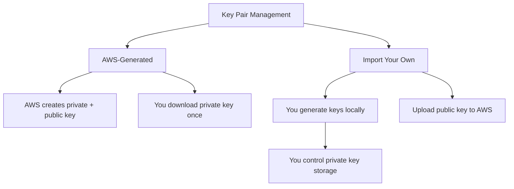

# How to Use Ansible to Manage AWS Key Pairs

Author: [nawazdhandala](https://www.github.com/nawazdhandala)

Tags: Ansible, AWS, Key Pairs, SSH, Security

Description: Manage AWS EC2 key pairs with Ansible including creation, importing public keys, rotation, and secure key distribution practices.

---

Every EC2 instance needs a key pair for SSH access, and managing those key pairs across multiple regions and accounts gets messy fast. Keys get created ad hoc, nobody remembers which key goes with which environment, and old keys linger long after the people who created them have left the organization. Ansible provides a clean way to manage key pairs programmatically, making key rotation and distribution part of your infrastructure automation.

## Prerequisites

- Ansible 2.9+ with the `amazon.aws` collection
- AWS credentials with `ec2:CreateKeyPair`, `ec2:DeleteKeyPair`, `ec2:DescribeKeyPairs`, and `ec2:ImportKeyPair` permissions
- OpenSSH installed on your control machine (for key generation)

```bash
# Install the AWS collection
ansible-galaxy collection install amazon.aws
```

## Two Approaches to Key Pairs

AWS supports two workflows for key pairs:



The first approach has AWS generate the key pair and return the private key to you once. The second approach has you generate the key pair locally and import just the public key into AWS. I strongly prefer the import approach because it means the private key never passes through the AWS API, and you have full control over how it is stored and distributed.

## Creating a Key Pair (AWS-Generated)

If you want AWS to generate the key pair:

```yaml
# create-key-pair.yml - Have AWS generate a new key pair
---
- name: Create AWS Key Pair
  hosts: localhost
  connection: local
  gather_facts: false

  vars:
    aws_region: us-east-1
    key_name: "prod-web-servers"
    key_output_dir: "/opt/ansible/keys"

  tasks:
    - name: Ensure key output directory exists
      ansible.builtin.file:
        path: "{{ key_output_dir }}"
        state: directory
        mode: "0700"

    - name: Create the key pair in AWS
      amazon.aws.ec2_key:
        region: "{{ aws_region }}"
        name: "{{ key_name }}"
        state: present
        key_type: ed25519
        tags:
          Environment: production
          ManagedBy: ansible
      register: key_result

    - name: Save private key to file (only on first creation)
      ansible.builtin.copy:
        content: "{{ key_result.key.private_key }}"
        dest: "{{ key_output_dir }}/{{ key_name }}.pem"
        mode: "0600"
      when: key_result.key.private_key is defined

    - name: Show key fingerprint
      ansible.builtin.debug:
        msg: "Key '{{ key_name }}' fingerprint: {{ key_result.key.fingerprint }}"
```

The private key is only returned when the key pair is first created. On subsequent runs, the module returns the fingerprint but not the private key. If you lose the private key, you cannot retrieve it from AWS; you have to create a new key pair. The `key_type: ed25519` creates a modern Ed25519 key instead of the default RSA, which is shorter and generally considered more secure.

## Importing an Existing Public Key

The recommended approach for production environments:

```yaml
# import-key-pair.yml - Generate a key pair locally and import the public key
---
- name: Import Key Pair to AWS
  hosts: localhost
  connection: local
  gather_facts: false

  vars:
    aws_region: us-east-1
    key_name: "prod-bastion"
    key_dir: "/opt/ansible/keys"
    key_comment: "prod-bastion-{{ lookup('pipe', 'date +%Y%m') }}"

  tasks:
    - name: Ensure key directory exists with restricted permissions
      ansible.builtin.file:
        path: "{{ key_dir }}"
        state: directory
        mode: "0700"

    - name: Generate an Ed25519 key pair locally
      community.crypto.openssh_keypair:
        path: "{{ key_dir }}/{{ key_name }}"
        type: ed25519
        comment: "{{ key_comment }}"
        state: present
      register: local_key

    - name: Read the public key
      ansible.builtin.slurp:
        src: "{{ key_dir }}/{{ key_name }}.pub"
      register: public_key_content

    - name: Import public key to AWS
      amazon.aws.ec2_key:
        region: "{{ aws_region }}"
        name: "{{ key_name }}"
        key_material: "{{ public_key_content.content | b64decode }}"
        state: present
        tags:
          Environment: production
          ManagedBy: ansible
          KeyType: imported
      register: import_result

    - name: Confirm import
      ansible.builtin.debug:
        msg: "Key '{{ key_name }}' imported. Fingerprint: {{ import_result.key.fingerprint }}"
```

This approach keeps the private key on your control machine (or in a secrets manager) and only sends the public key to AWS. The key never traverses the API in its private form.

## Managing Key Pairs Across Multiple Regions

If you deploy instances in multiple regions, you need the same key pair in each:

```yaml
# multi-region-keys.yml - Import key pairs across multiple AWS regions
---
- name: Multi-Region Key Pair Management
  hosts: localhost
  connection: local
  gather_facts: false

  vars:
    key_name: "operations-team"
    key_dir: "/opt/ansible/keys"
    regions:
      - us-east-1
      - us-west-2
      - eu-west-1
      - ap-southeast-1

  tasks:
    - name: Generate the key pair locally if it does not exist
      community.crypto.openssh_keypair:
        path: "{{ key_dir }}/{{ key_name }}"
        type: ed25519
        comment: "{{ key_name }}-multi-region"
        state: present

    - name: Read the public key
      ansible.builtin.slurp:
        src: "{{ key_dir }}/{{ key_name }}.pub"
      register: pub_key

    - name: Import key pair to each region
      amazon.aws.ec2_key:
        region: "{{ item }}"
        name: "{{ key_name }}"
        key_material: "{{ pub_key.content | b64decode }}"
        state: present
        tags:
          ManagedBy: ansible
          Scope: multi-region
      loop: "{{ regions }}"
      register: import_results

    - name: Show results per region
      ansible.builtin.debug:
        msg: "{{ item.item }}: {{ item.key.fingerprint }}"
      loop: "{{ import_results.results }}"
```

## Key Pair Rotation

Key rotation is a security best practice. Here is a playbook that creates a new key pair, updates the authorized_keys on running instances, and then removes the old key pair from AWS:

```yaml
# rotate-key-pair.yml - Rotate an SSH key pair with zero-downtime
---
- name: Rotate SSH Key Pair
  hosts: localhost
  connection: local
  gather_facts: false

  vars:
    aws_region: us-east-1
    old_key_name: "prod-web-2025"
    new_key_name: "prod-web-2026"
    key_dir: "/opt/ansible/keys"

  tasks:
    - name: Generate new key pair
      community.crypto.openssh_keypair:
        path: "{{ key_dir }}/{{ new_key_name }}"
        type: ed25519
        comment: "{{ new_key_name }}"
        state: present

    - name: Read new public key
      ansible.builtin.slurp:
        src: "{{ key_dir }}/{{ new_key_name }}.pub"
      register: new_pub_key

    - name: Import new key pair to AWS
      amazon.aws.ec2_key:
        region: "{{ aws_region }}"
        name: "{{ new_key_name }}"
        key_material: "{{ new_pub_key.content | b64decode }}"
        state: present
        tags:
          ManagedBy: ansible
          RotatedFrom: "{{ old_key_name }}"

    - name: Get instances using the old key pair
      amazon.aws.ec2_instance_info:
        region: "{{ aws_region }}"
        filters:
          key-name: "{{ old_key_name }}"
          instance-state-name: running
      register: old_key_instances

    - name: Display instances to update
      ansible.builtin.debug:
        msg: "Found {{ old_key_instances.instances | length }} instances using {{ old_key_name }}"

---
# Second play: update authorized_keys on each instance
- name: Deploy New SSH Key to Instances
  hosts: "{{ target_hosts | default('tag_KeyPair_' + old_key_name) }}"
  become: true

  vars:
    new_key_name: "prod-web-2026"
    key_dir: "/opt/ansible/keys"

  tasks:
    - name: Read the new public key
      ansible.builtin.slurp:
        src: "{{ key_dir }}/{{ new_key_name }}.pub"
      register: new_key
      delegate_to: localhost
      become: false

    - name: Add the new key to authorized_keys
      ansible.posix.authorized_key:
        user: ec2-user
        key: "{{ new_key.content | b64decode }}"
        state: present

    - name: Verify SSH works with new key
      ansible.builtin.wait_for_connection:
        timeout: 30
      vars:
        ansible_ssh_private_key_file: "{{ key_dir }}/{{ new_key_name }}"

    - name: Remove old key from authorized_keys
      ansible.posix.authorized_key:
        user: ec2-user
        key: "{{ lookup('file', key_dir + '/' + old_key_name + '.pub') }}"
        state: absent
```

The rotation follows a safe sequence: add the new key first, verify connectivity with it, then remove the old key. This prevents lockout scenarios where you remove the old key before the new one is in place.

## Listing and Auditing Key Pairs

For compliance auditing, you may need to inventory all key pairs:

```yaml
# audit-key-pairs.yml - List all key pairs and check for compliance
---
- name: Audit AWS Key Pairs
  hosts: localhost
  connection: local
  gather_facts: false

  vars:
    aws_region: us-east-1
    approved_keys:
      - "prod-web-2026"
      - "prod-bastion"
      - "operations-team"

  tasks:
    - name: List all key pairs in the region
      amazon.aws.ec2_key_info:
        region: "{{ aws_region }}"
      register: all_keys

    - name: Display all key pairs
      ansible.builtin.debug:
        msg: "{{ item.key_name }} ({{ item.key_type | default('rsa') }}) - Fingerprint: {{ item.key_fingerprint }}"
      loop: "{{ all_keys.keypairs }}"

    - name: Identify unapproved key pairs
      ansible.builtin.set_fact:
        unapproved: "{{ all_keys.keypairs | map(attribute='key_name') | difference(approved_keys) | list }}"

    - name: Report unapproved keys
      ansible.builtin.debug:
        msg: "WARNING: Unapproved key pairs found: {{ unapproved | join(', ') }}"
      when: unapproved | length > 0
```

## Deleting Key Pairs

Clean up key pairs that are no longer needed:

```yaml
# delete-key-pairs.yml - Remove old or unused key pairs
---
- name: Delete Unused Key Pairs
  hosts: localhost
  connection: local
  gather_facts: false

  vars:
    aws_region: us-east-1
    keys_to_delete:
      - "dev-test-temp"
      - "old-bastion-key"
      - "jenkins-deploy-2024"

  tasks:
    - name: Check if any instances still use these keys
      amazon.aws.ec2_instance_info:
        region: "{{ aws_region }}"
        filters:
          key-name: "{{ item }}"
          instance-state-name:
            - running
            - stopped
      loop: "{{ keys_to_delete }}"
      register: key_usage

    - name: Warn about keys still in use
      ansible.builtin.debug:
        msg: "WARNING: Key '{{ item.item }}' is still used by {{ item.instances | length }} instance(s)"
      loop: "{{ key_usage.results }}"
      when: item.instances | length > 0

    - name: Delete key pairs not in use
      amazon.aws.ec2_key:
        region: "{{ aws_region }}"
        name: "{{ item.item }}"
        state: absent
      loop: "{{ key_usage.results }}"
      when: item.instances | length == 0
```

This playbook includes a safety check that refuses to delete key pairs that are still referenced by running or stopped instances. This prevents you from deleting a key that someone might need to access their server.

## Summary

Managing AWS key pairs with Ansible gives you a controlled, auditable process for SSH access management. The key best practices are: always import your own keys rather than having AWS generate them, store private keys in a secrets manager rather than on disk, implement regular key rotation, and audit your key pairs periodically to remove unused ones. By treating key pair management as code, you reduce the risk of stale keys lingering in your accounts and make it straightforward to trace which keys are used where.
