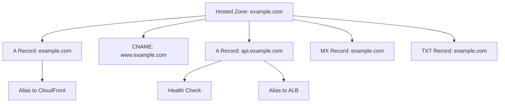

# How to Use Ansible to Manage AWS Route53 DNS

Author: [nawazdhandala](https://www.github.com/nawazdhandala)

Tags: Ansible, AWS, Route53, DNS, Networking

Description: Practical guide to managing AWS Route53 hosted zones and DNS records with Ansible including A records, CNAME records, aliases, and health checks.

---

DNS management is one of those tasks that feels simple until you are managing dozens of records across multiple hosted zones. One typo in a DNS record can take down your entire application. Manual changes through the Route53 console do not leave an audit trail, and there is no easy way to replicate DNS configurations across environments.

Ansible solves these problems by letting you define DNS records as code. This guide covers creating hosted zones, managing various record types, using alias records, and implementing health checks with Route53.

## Prerequisites

You need:

- Ansible 2.14+
- The `amazon.aws` and `community.aws` collections
- AWS credentials with Route53 permissions
- Python boto3

```bash
# Install dependencies
ansible-galaxy collection install amazon.aws community.aws
pip install boto3 botocore
```

## Route53 Concepts

Here is how Route53 components relate to each other:



A hosted zone contains all DNS records for a domain. Each record maps a name to an IP address, another domain name, or some other value.

## Creating a Hosted Zone

```yaml
# create-zone.yml - Create a Route53 hosted zone
---
- name: Create Route53 Hosted Zone
  hosts: localhost
  connection: local
  gather_facts: false

  tasks:
    # Create a public hosted zone for the domain
    - name: Create hosted zone
      amazon.aws.route53_zone:
        zone: example.com
        state: present
        comment: "Production domain managed by Ansible"
      register: zone_result

    - name: Show hosted zone ID and nameservers
      ansible.builtin.debug:
        msg:
          - "Zone ID: {{ zone_result.zone_id }}"
          - "Name servers: {{ zone_result.name_servers }}"
```

After creating the zone, you need to update your domain registrar with the nameservers shown in the output. Until you do that, the zone will not actually serve DNS queries.

## Creating DNS Records

The `amazon.aws.route53` module manages individual records:

```yaml
# manage-records.yml - Create and manage DNS records
---
- name: Manage Route53 DNS Records
  hosts: localhost
  connection: local
  gather_facts: false

  vars:
    hosted_zone: example.com
    aws_region: us-east-1

  tasks:
    # Create an A record pointing to a specific IP
    - name: Create A record for web server
      amazon.aws.route53:
        zone: "{{ hosted_zone }}"
        record: "web.{{ hosted_zone }}"
        type: A
        value: 203.0.113.10
        ttl: 300
        state: present
        overwrite: true

    # Create a CNAME record
    - name: Create CNAME for www
      amazon.aws.route53:
        zone: "{{ hosted_zone }}"
        record: "www.{{ hosted_zone }}"
        type: CNAME
        value: "web.{{ hosted_zone }}"
        ttl: 300
        state: present
        overwrite: true

    # Create an MX record for email
    - name: Create MX records
      amazon.aws.route53:
        zone: "{{ hosted_zone }}"
        record: "{{ hosted_zone }}"
        type: MX
        value:
          - "10 mail1.example.com"
          - "20 mail2.example.com"
        ttl: 3600
        state: present
        overwrite: true

    # Create a TXT record for SPF
    - name: Create SPF record
      amazon.aws.route53:
        zone: "{{ hosted_zone }}"
        record: "{{ hosted_zone }}"
        type: TXT
        value: '"v=spf1 include:_spf.google.com ~all"'
        ttl: 3600
        state: present
        overwrite: true
```

The `overwrite: true` parameter is important. Without it, Ansible will fail if the record already exists instead of updating it.

## Alias Records

Alias records are a Route53-specific feature that lets you point a domain directly at AWS resources (ALB, CloudFront, S3) without the performance penalty of a CNAME:

```yaml
# Create alias records for AWS resources
- name: Alias record pointing to ALB
  amazon.aws.route53:
    zone: "{{ hosted_zone }}"
    record: "api.{{ hosted_zone }}"
    type: A
    alias: true
    alias_hosted_zone_id: Z35SXDOTRQ7X7K
    value: "myapp-alb-1234567890.us-east-1.elb.amazonaws.com"
    state: present
    overwrite: true

# Alias to a CloudFront distribution
- name: Alias record pointing to CloudFront
  amazon.aws.route53:
    zone: "{{ hosted_zone }}"
    record: "cdn.{{ hosted_zone }}"
    type: A
    alias: true
    alias_hosted_zone_id: Z2FDTNDATAQYW2
    value: "d1234567890.cloudfront.net"
    state: present
    overwrite: true
```

The `alias_hosted_zone_id` is specific to each AWS service and region. For ALBs, it varies by region. For CloudFront, it is always `Z2FDTNDATAQYW2`. For S3 website hosting, it depends on the region.

## Weighted Routing

Distribute traffic across multiple endpoints:

```yaml
# Weighted routing to split traffic between two servers
- name: Create weighted record - server 1 (70% traffic)
  amazon.aws.route53:
    zone: "{{ hosted_zone }}"
    record: "app.{{ hosted_zone }}"
    type: A
    value: 203.0.113.10
    ttl: 60
    identifier: server-1
    weight: 70
    state: present
    overwrite: true

- name: Create weighted record - server 2 (30% traffic)
  amazon.aws.route53:
    zone: "{{ hosted_zone }}"
    record: "app.{{ hosted_zone }}"
    type: A
    value: 203.0.113.20
    ttl: 60
    identifier: server-2
    weight: 30
    state: present
    overwrite: true
```

Weighted routing is useful for canary deployments. Route a small percentage of traffic to the new version and increase it gradually.

## Health Checks

Route53 health checks monitor your endpoints and can automatically route traffic away from unhealthy ones:

```yaml
# Create a health check for the API endpoint
- name: Create Route53 health check
  community.aws.route53_health_check:
    state: present
    fqdn: "api.example.com"
    port: 443
    type: HTTPS
    resource_path: /health
    request_interval: 30
    failure_threshold: 3
    tags:
      Name: api-health-check
      Environment: production
  register: health_check

# Use the health check with a failover routing policy
- name: Primary record with health check
  amazon.aws.route53:
    zone: "{{ hosted_zone }}"
    record: "api.{{ hosted_zone }}"
    type: A
    value: 203.0.113.10
    ttl: 60
    identifier: primary
    failover: PRIMARY
    health_check: "{{ health_check.health_check.id }}"
    state: present
    overwrite: true

- name: Secondary failover record
  amazon.aws.route53:
    zone: "{{ hosted_zone }}"
    record: "api.{{ hosted_zone }}"
    type: A
    value: 203.0.113.20
    ttl: 60
    identifier: secondary
    failover: SECONDARY
    state: present
    overwrite: true
```

If the primary endpoint fails the health check three times in a row, Route53 automatically routes traffic to the secondary endpoint.

## Bulk Record Management

For managing many records, use a variable file:

```yaml
# vars/dns-records.yml - All DNS records for the domain
---
dns_records:
  - record: "web.example.com"
    type: A
    value: "203.0.113.10"
    ttl: 300
  - record: "api.example.com"
    type: A
    value: "203.0.113.20"
    ttl: 60
  - record: "www.example.com"
    type: CNAME
    value: "web.example.com"
    ttl: 300
  - record: "staging.example.com"
    type: CNAME
    value: "staging-alb-1234567890.us-east-1.elb.amazonaws.com"
    ttl: 300
```

```yaml
# Apply all DNS records from the variable file
- name: Create all DNS records
  amazon.aws.route53:
    zone: example.com
    record: "{{ item.record }}"
    type: "{{ item.type }}"
    value: "{{ item.value }}"
    ttl: "{{ item.ttl }}"
    state: present
    overwrite: true
  loop: "{{ dns_records }}"
  loop_control:
    label: "{{ item.record }}"
```

## Private Hosted Zones

For internal DNS within a VPC:

```yaml
# Create a private hosted zone for internal services
- name: Create private hosted zone
  amazon.aws.route53_zone:
    zone: internal.myapp.com
    state: present
    vpc_id: vpc-0abc123def456789
    vpc_region: us-east-1
    comment: "Internal DNS for myapp VPC"
  register: private_zone

# Add internal service records
- name: Create internal service record
  amazon.aws.route53:
    zone: internal.myapp.com
    private_zone: true
    record: "db.internal.myapp.com"
    type: CNAME
    value: "myapp-db.cluster-abc123.us-east-1.rds.amazonaws.com"
    ttl: 60
    state: present
    overwrite: true
```

Private hosted zones are only resolvable from within the associated VPC. This is perfect for internal service discovery.

## Deleting Records

```yaml
# Delete a DNS record
- name: Remove old record
  amazon.aws.route53:
    zone: example.com
    record: "old-service.example.com"
    type: A
    value: 203.0.113.99
    state: absent
```

You must specify the exact value when deleting a record. Route53 needs to match the record precisely.

## Wrapping Up

Managing DNS with Ansible and Route53 gives you version-controlled, auditable, and repeatable DNS management. Define all your records in variable files, use alias records for AWS resources, implement health checks for critical endpoints, and leverage routing policies for traffic management. The ability to review DNS changes in a pull request before they go live is alone worth the automation effort.
