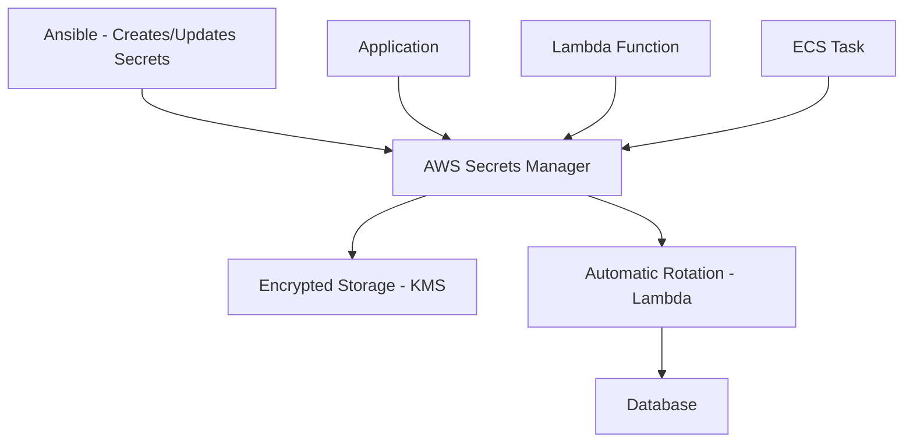

# How to Use Ansible to Manage AWS Secrets Manager

Author: [nawazdhandala](https://www.github.com/nawazdhandala)

Tags: Ansible, AWS, Secrets Manager, Security, DevOps

Description: Learn how to create, update, and retrieve secrets from AWS Secrets Manager using Ansible for secure credential management in automation workflows.

---

Hardcoding passwords, API keys, and database credentials in your code or configuration files is a security nightmare. AWS Secrets Manager provides a centralized place to store and rotate these secrets, and your applications can retrieve them at runtime instead of having them baked into the deployment.

Managing secrets through the console works for small teams, but when you have dozens of services across multiple environments, you need automation. Ansible lets you create, update, and retrieve secrets programmatically while keeping the actual secret values out of your playbooks using Ansible Vault.

## Prerequisites

You need:

- Ansible 2.14+
- The `amazon.aws` and `community.aws` collections
- AWS credentials with Secrets Manager permissions
- Python boto3

```bash
# Install dependencies
ansible-galaxy collection install amazon.aws community.aws
pip install boto3 botocore
```

## Secrets Manager Architecture

Here is how Secrets Manager fits into an application:



Applications retrieve secrets at runtime. Rotation happens automatically on a schedule.

## Creating a Simple Secret

```yaml
# create-secret.yml - Store a secret in Secrets Manager
---
- name: Create Secret in Secrets Manager
  hosts: localhost
  connection: local
  gather_facts: false

  vars:
    aws_region: us-east-1

  tasks:
    # Create a secret with a simple string value
    - name: Create API key secret
      community.aws.secretsmanager_secret:
        name: myapp/production/api-key
        description: "API key for third-party service"
        secret: "sk-abc123def456ghi789"
        region: "{{ aws_region }}"
        state: present
        tags:
          Environment: production
          Application: myapp
          Type: api-key
      register: secret_result

    - name: Show secret ARN
      ansible.builtin.debug:
        msg: "Secret ARN: {{ secret_result.secret.arn }}"
```

## Creating a JSON Secret

Most secrets are structured data with multiple fields:

```yaml
# create-db-secret.yml - Store database credentials as JSON
---
- name: Create Database Secret
  hosts: localhost
  connection: local
  gather_facts: false

  vars:
    aws_region: us-east-1
    db_credentials:
      engine: postgres
      host: myapp-db.cluster-abc123.us-east-1.rds.amazonaws.com
      port: 5432
      dbname: myapp
      username: myapp_admin
      password: "{{ vault_db_password }}"

  tasks:
    # Store database credentials as a JSON secret
    - name: Create database credentials secret
      community.aws.secretsmanager_secret:
        name: myapp/production/database
        description: "Production database credentials"
        secret: "{{ db_credentials | to_json }}"
        region: "{{ aws_region }}"
        state: present
        tags:
          Environment: production
          Application: myapp
          Type: database
```

The `vault_db_password` variable should be stored in an Ansible Vault encrypted file. This way, the actual password never appears in plain text in your playbooks or version control.

## Using Ansible Vault for Secret Values

Store sensitive values in an encrypted vault file:

```bash
# Create an encrypted vault file
ansible-vault create vars/secrets.yml
```

Inside the vault file:

```yaml
vault_db_password: "super-secret-password-here"
vault_api_key: "sk-production-key-12345"
vault_jwt_secret: "jwt-signing-secret-value"
```

Reference it in your playbook:

```yaml
# playbook using vault-encrypted secrets
---
- name: Create Secrets
  hosts: localhost
  vars_files:
    - vars/secrets.yml
  tasks:
    - name: Store database secret
      community.aws.secretsmanager_secret:
        name: myapp/production/database
        secret: |
          {
            "host": "db.example.com",
            "username": "admin",
            "password": "{{ vault_db_password }}"
          }
        region: us-east-1
        state: present
```

Run with:

```bash
ansible-playbook create-secrets.yml --ask-vault-pass
```

## Retrieving Secrets in Playbooks

Use the lookup plugin to fetch secrets during playbook execution:

```yaml
# Retrieve a secret value and use it in the playbook
- name: Get secret from Secrets Manager
  ansible.builtin.set_fact:
    db_credentials: "{{ lookup('amazon.aws.secretsmanager_secret', 'myapp/production/database', region='us-east-1') | from_json }}"

- name: Use the secret in a template
  ansible.builtin.template:
    src: templates/app-config.yml.j2
    dest: /opt/myapp/config.yml
    mode: "0600"
  vars:
    db_host: "{{ db_credentials.host }}"
    db_user: "{{ db_credentials.username }}"
    db_pass: "{{ db_credentials.password }}"
```

## Bulk Secret Management

Create all secrets for an application at once:

```yaml
# bulk-secrets.yml - Create multiple secrets for an application
---
- name: Create Application Secrets
  hosts: localhost
  connection: local
  gather_facts: false
  vars_files:
    - vars/secrets.yml

  vars:
    aws_region: us-east-1
    env: production
    app: myapp
    secrets:
      - name: "{{ app }}/{{ env }}/database"
        description: "Database credentials"
        value:
          host: "db.internal.example.com"
          port: 5432
          username: "{{ app }}_admin"
          password: "{{ vault_db_password }}"
          dbname: "{{ app }}"
      - name: "{{ app }}/{{ env }}/redis"
        description: "Redis connection details"
        value:
          host: "redis.internal.example.com"
          port: 6379
          auth_token: "{{ vault_redis_auth }}"
      - name: "{{ app }}/{{ env }}/external-api"
        description: "External API credentials"
        value:
          api_key: "{{ vault_api_key }}"
          api_secret: "{{ vault_api_secret }}"
          base_url: "https://api.partner.com/v2"
      - name: "{{ app }}/{{ env }}/jwt"
        description: "JWT signing configuration"
        value:
          secret: "{{ vault_jwt_secret }}"
          issuer: "myapp-production"
          expiry_hours: 24

  tasks:
    # Create each secret from the variable list
    - name: Create application secrets
      community.aws.secretsmanager_secret:
        name: "{{ item.name }}"
        description: "{{ item.description }}"
        secret: "{{ item.value | to_json }}"
        region: "{{ aws_region }}"
        state: present
        tags:
          Environment: "{{ env }}"
          Application: "{{ app }}"
      loop: "{{ secrets }}"
      loop_control:
        label: "{{ item.name }}"
      no_log: true
```

The `no_log: true` directive prevents Ansible from printing secret values in the output.

## KMS Encryption

By default, Secrets Manager uses an AWS-managed KMS key. For tighter control, use your own:

```yaml
# Create a secret encrypted with a custom KMS key
- name: Create KMS-encrypted secret
  community.aws.secretsmanager_secret:
    name: myapp/production/sensitive-config
    description: "Highly sensitive configuration"
    secret: "{{ sensitive_data | to_json }}"
    kms_key_id: "arn:aws:kms:us-east-1:123456789012:key/abc-123-def-456"
    region: us-east-1
    state: present
```

## Secret Rotation

Set up automatic rotation using a Lambda function:

```yaml
# Configure automatic secret rotation
- name: Enable secret rotation
  ansible.builtin.command:
    cmd: >
      aws secretsmanager rotate-secret
      --secret-id myapp/production/database
      --rotation-lambda-arn arn:aws:lambda:us-east-1:123456789012:function:secret-rotator
      --rotation-rules '{"AutomaticallyAfterDays": 30}'
      --region us-east-1
  changed_when: true
```

The Lambda function handles the actual rotation logic: creating a new password, updating the database, and storing the new credentials in Secrets Manager.

## Multi-Environment Secret Management

Use a consistent naming convention and deploy secrets per environment:

```yaml
# deploy-env-secrets.yml - Deploy secrets for any environment
---
- name: Deploy Environment Secrets
  hosts: localhost
  connection: local
  gather_facts: false
  vars_files:
    - "vars/secrets-{{ env }}.yml"

  vars:
    aws_region: us-east-1
    app: myapp

  tasks:
    - name: Create database secret
      community.aws.secretsmanager_secret:
        name: "{{ app }}/{{ env }}/database"
        secret: "{{ db_creds | to_json }}"
        region: "{{ aws_region }}"
        state: present
        tags:
          Environment: "{{ env }}"
      no_log: true
```

Run for different environments:

```bash
# Deploy secrets for staging
ansible-playbook deploy-env-secrets.yml -e "env=staging" --ask-vault-pass

# Deploy secrets for production
ansible-playbook deploy-env-secrets.yml -e "env=production" --ask-vault-pass
```

## Resource Policy for Cross-Account Access

Allow another AWS account to read your secrets:

```yaml
# Set a resource policy on the secret
- name: Configure cross-account access
  ansible.builtin.command:
    cmd: >
      aws secretsmanager put-resource-policy
      --secret-id myapp/production/shared-config
      --resource-policy '{
        "Version": "2012-10-17",
        "Statement": [{
          "Sid": "AllowCrossAccountRead",
          "Effect": "Allow",
          "Principal": {
            "AWS": "arn:aws:iam::987654321098:root"
          },
          "Action": "secretsmanager:GetSecretValue",
          "Resource": "*"
        }]
      }'
      --region us-east-1
  changed_when: true
```

## Deleting Secrets

Secrets Manager has a recovery window by default:

```yaml
# Schedule secret for deletion (30-day recovery window by default)
- name: Delete secret
  community.aws.secretsmanager_secret:
    name: myapp/staging/old-api-key
    region: us-east-1
    state: absent
    recovery_window: 7
```

The `recovery_window` gives you 7 days to cancel the deletion if it was a mistake. Set it to 0 for immediate deletion (not recommended for production).

## Wrapping Up

AWS Secrets Manager with Ansible provides a secure, automated approach to credential management. Store all your secrets centrally, use Ansible Vault to protect secret values in your playbooks, enable rotation for database credentials, and use a consistent naming convention across environments. The combination of Ansible Vault for protecting values during deployment and Secrets Manager for storing them at rest gives you security at every stage of the process.
