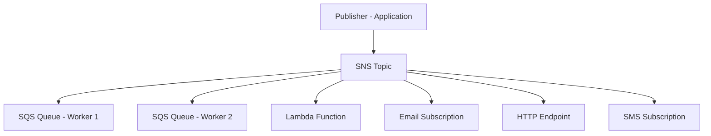

# How to Use Ansible to Manage AWS SNS Topics

Author: [nawazdhandala](https://www.github.com/nawazdhandala)

Tags: Ansible, AWS, SNS, Messaging, Notifications

Description: Learn how to create and manage AWS SNS topics and subscriptions with Ansible for event-driven architectures and notification systems.

---

SNS (Simple Notification Service) is the publish-subscribe messaging service in AWS. It lets you send messages to multiple subscribers at once, whether those subscribers are email addresses, SQS queues, Lambda functions, or HTTP endpoints. SNS is the glue in event-driven architectures, and managing topics and subscriptions through the console gets tedious fast when you have more than a handful.

This guide covers creating SNS topics, managing subscriptions, configuring access policies, and building notification workflows with Ansible.

## Prerequisites

You need:

- Ansible 2.14+
- The `community.aws` collection
- AWS credentials with SNS permissions
- Python boto3

```bash
# Install dependencies
ansible-galaxy collection install community.aws
pip install boto3 botocore
```

## SNS Architecture

Here is how SNS fits into a typical event-driven system:



A publisher sends a message to the topic. SNS delivers copies of that message to every active subscription.

## Creating a Basic SNS Topic

The `community.aws.sns_topic` module handles topic operations:

```yaml
# create-topic.yml - Create a basic SNS topic
---
- name: Create SNS Topic
  hosts: localhost
  connection: local
  gather_facts: false

  vars:
    aws_region: us-east-1
    topic_name: myapp-notifications

  tasks:
    # Create the SNS topic
    - name: Create SNS topic
      community.aws.sns_topic:
        name: "{{ topic_name }}"
        region: "{{ aws_region }}"
        state: present
        display_name: "MyApp Notifications"
        tags:
          Environment: production
          Application: myapp
      register: topic_result

    - name: Show topic ARN
      ansible.builtin.debug:
        msg: "Topic ARN: {{ topic_result.sns_arn }}"
```

## Adding Subscriptions

You can add subscriptions directly when creating the topic:

```yaml
# create-topic-with-subs.yml - Topic with multiple subscription types
---
- name: Create SNS Topic with Subscriptions
  hosts: localhost
  connection: local
  gather_facts: false

  vars:
    aws_region: us-east-1

  tasks:
    # Create topic with email and SQS subscriptions
    - name: Create alerts topic with subscriptions
      community.aws.sns_topic:
        name: myapp-alerts
        region: "{{ aws_region }}"
        state: present
        display_name: "MyApp Alerts"
        subscriptions:
          # Email subscription - requires confirmation by the recipient
          - endpoint: ops-team@example.com
            protocol: email
          # Another email subscriber
          - endpoint: on-call@example.com
            protocol: email
          # SQS queue subscription - no confirmation needed
          - endpoint: arn:aws:sqs:us-east-1:123456789012:myapp-alert-processor
            protocol: sqs
          # Lambda function subscription
          - endpoint: arn:aws:lambda:us-east-1:123456789012:function:alert-handler
            protocol: lambda
          # HTTPS endpoint
          - endpoint: https://hooks.example.com/sns-webhook
            protocol: https
      register: topic_result
```

Email subscriptions require the recipient to click a confirmation link. SQS, Lambda, and HTTP/HTTPS subscriptions are confirmed automatically if the target resource has the right permissions.

## Topic Access Policy

Control who can publish to or subscribe to your topic:

```yaml
# Create topic with a custom access policy
- name: Create topic with access policy
  community.aws.sns_topic:
    name: myapp-events
    region: us-east-1
    state: present
    policy:
      Version: "2012-10-17"
      Statement:
        # Allow CloudWatch to publish alarm notifications
        - Sid: AllowCloudWatchAlarms
          Effect: Allow
          Principal:
            Service: cloudwatch.amazonaws.com
          Action: sns:Publish
          Resource: "arn:aws:sns:us-east-1:123456789012:myapp-events"
        # Allow S3 to publish event notifications
        - Sid: AllowS3Notifications
          Effect: Allow
          Principal:
            Service: s3.amazonaws.com
          Action: sns:Publish
          Resource: "arn:aws:sns:us-east-1:123456789012:myapp-events"
          Condition:
            StringEquals:
              aws:SourceAccount: "123456789012"
        # Allow specific IAM roles to publish
        - Sid: AllowAppPublish
          Effect: Allow
          Principal:
            AWS: "arn:aws:iam::123456789012:role/myapp-service-role"
          Action: sns:Publish
          Resource: "arn:aws:sns:us-east-1:123456789012:myapp-events"
```

## FIFO Topics

For ordering guarantees and deduplication, use FIFO topics:

```yaml
# Create a FIFO SNS topic (name must end with .fifo)
- name: Create FIFO topic for ordered events
  community.aws.sns_topic:
    name: myapp-order-events.fifo
    region: us-east-1
    state: present
    display_name: "Order Processing Events"
    topic_type: fifo
    content_based_deduplication: true
    subscriptions:
      # FIFO topics can only deliver to FIFO SQS queues
      - endpoint: arn:aws:sqs:us-east-1:123456789012:order-processor.fifo
        protocol: sqs
```

FIFO topics guarantee message ordering within a message group and prevent duplicate messages. They can only have SQS FIFO queues as subscribers.

## Publishing Messages with Ansible

While you typically publish from application code, you can also publish from Ansible:

```yaml
# Publish a notification to an SNS topic
- name: Send deployment notification
  community.aws.sns:
    topic: arn:aws:sns:us-east-1:123456789012:myapp-notifications
    msg: "Deployment complete: myapp v{{ app_version }} deployed to {{ environment }}"
    subject: "Deployment Notification - {{ environment }}"
    region: us-east-1

# Publish with message attributes for filtering
- name: Send structured alert
  community.aws.sns:
    topic: arn:aws:sns:us-east-1:123456789012:myapp-alerts
    msg: |
      {
        "alert_type": "deployment",
        "environment": "{{ environment }}",
        "version": "{{ app_version }}",
        "timestamp": "{{ ansible_date_time.iso8601 | default('now') }}"
      }
    subject: "Alert: Deployment in {{ environment }}"
    message_attributes:
      alert_type:
        data_type: String
        string_value: deployment
      severity:
        data_type: String
        string_value: info
    region: us-east-1
```

## Subscription Filtering

Message attributes allow subscribers to filter which messages they receive:

```yaml
# Create topic with filtered subscriptions
- name: Create topic with subscription filters
  community.aws.sns_topic:
    name: myapp-events
    region: us-east-1
    state: present
    subscriptions:
      # This queue only receives critical alerts
      - endpoint: arn:aws:sqs:us-east-1:123456789012:critical-alerts
        protocol: sqs
        attributes:
          FilterPolicy: '{"severity": ["critical"]}'
      # This queue receives all alerts
      - endpoint: arn:aws:sqs:us-east-1:123456789012:all-alerts
        protocol: sqs
      # This Lambda only processes order events
      - endpoint: arn:aws:lambda:us-east-1:123456789012:function:order-processor
        protocol: lambda
        attributes:
          FilterPolicy: '{"event_type": ["order_created", "order_updated"]}'
```

## Multi-Environment Setup

Create a standard set of topics for each environment:

```yaml
# multi-env-topics.yml - Create topics per environment
---
- name: Create Environment Topics
  hosts: localhost
  connection: local
  gather_facts: false

  vars:
    aws_region: us-east-1
    env: production
    project: myapp
    topics:
      - name: "{{ project }}-{{ env }}-alerts"
        display: "{{ project }} Alerts ({{ env }})"
      - name: "{{ project }}-{{ env }}-events"
        display: "{{ project }} Events ({{ env }})"
      - name: "{{ project }}-{{ env }}-notifications"
        display: "{{ project }} Notifications ({{ env }})"

  tasks:
    - name: Create all topics
      community.aws.sns_topic:
        name: "{{ item.name }}"
        region: "{{ aws_region }}"
        state: present
        display_name: "{{ item.display }}"
        tags:
          Environment: "{{ env }}"
          Project: "{{ project }}"
      loop: "{{ topics }}"
      loop_control:
        label: "{{ item.name }}"
```

## Server-Side Encryption

Enable encryption for topics that carry sensitive data:

```yaml
# Create encrypted topic using AWS KMS
- name: Create encrypted SNS topic
  community.aws.sns_topic:
    name: myapp-sensitive-events
    region: us-east-1
    state: present
    kms_master_key_id: "alias/myapp-sns-key"
    tags:
      Environment: production
      DataClassification: sensitive
```

## Deleting Topics

```yaml
# Delete an SNS topic and all its subscriptions
- name: Delete SNS topic
  community.aws.sns_topic:
    name: old-unused-topic
    region: us-east-1
    state: absent
```

When you delete a topic, all subscriptions are automatically removed.

## Wrapping Up

SNS topics with Ansible give you a repeatable way to set up messaging infrastructure. Define your topics, subscriptions, access policies, and filtering rules in code. Use email subscriptions for human notifications, SQS for reliable message processing, and Lambda for serverless event handling. Version control your SNS configuration alongside the rest of your infrastructure, and you will have a consistent messaging setup across all your environments.
