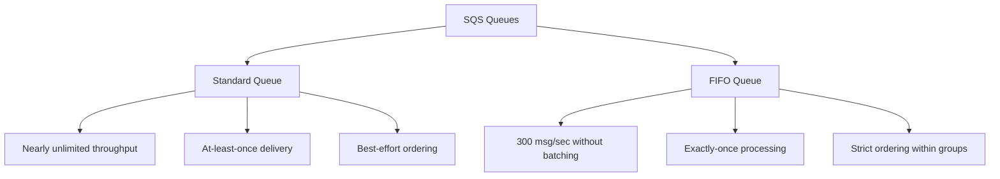

# How to Use Ansible to Manage AWS SQS Queues

Author: [nawazdhandala](https://www.github.com/nawazdhandala)

Tags: Ansible, AWS, SQS, Messaging, Queue Management

Description: Practical guide to creating and configuring AWS SQS queues with Ansible including dead-letter queues, FIFO queues, and access policies.

---

SQS (Simple Queue Service) is the backbone of asynchronous processing in AWS. It decouples your services so that a spike in traffic does not overwhelm your processing systems. Messages sit in the queue until a consumer picks them up, providing built-in buffering and retry capabilities.

Managing SQS queues through the console works for a couple of queues. But when you have a microservices architecture with dozens of queues, dead-letter queues, and access policies, you need automation. Ansible handles all of this cleanly.

This guide covers creating standard and FIFO queues, configuring dead-letter queues, setting access policies, and managing the full queue lifecycle.

## Prerequisites

You need:

- Ansible 2.14+
- The `community.aws` collection
- AWS credentials with SQS permissions
- Python boto3

```bash
# Install dependencies
ansible-galaxy collection install community.aws
pip install boto3 botocore
```

## SQS Queue Types

SQS offers two queue types:



Standard queues handle massive throughput but messages might be delivered more than once or out of order. FIFO queues guarantee ordering and exactly-once delivery but have lower throughput.

## Creating a Standard Queue

The `community.aws.sqs_queue` module handles queue operations:

```yaml
# create-queue.yml - Create a basic SQS queue
---
- name: Create SQS Queue
  hosts: localhost
  connection: local
  gather_facts: false

  vars:
    aws_region: us-east-1
    queue_name: myapp-work-queue

  tasks:
    # Create a standard queue with common production settings
    - name: Create SQS queue
      community.aws.sqs_queue:
        name: "{{ queue_name }}"
        region: "{{ aws_region }}"
        state: present
        default_visibility_timeout: 60
        message_retention_period: 345600
        maximum_message_size: 262144
        delay_seconds: 0
        receive_message_wait_time_seconds: 20
        tags:
          Environment: production
          Application: myapp
      register: queue_result

    - name: Show queue URL
      ansible.builtin.debug:
        msg: "Queue URL: {{ queue_result.queue_url }}"
```

Key settings explained:

- `default_visibility_timeout: 60` means after a consumer reads a message, other consumers cannot see it for 60 seconds. This gives the consumer time to process and delete it.
- `message_retention_period: 345600` keeps messages for 4 days (in seconds) if they are not processed.
- `receive_message_wait_time_seconds: 20` enables long polling, which reduces empty responses and saves money.

## Creating a Dead-Letter Queue

Dead-letter queues catch messages that fail processing repeatedly:

```yaml
# create-with-dlq.yml - Queue with dead-letter queue setup
---
- name: Create Queue with Dead-Letter Queue
  hosts: localhost
  connection: local
  gather_facts: false

  vars:
    aws_region: us-east-1
    main_queue: myapp-orders
    dlq_name: myapp-orders-dlq

  tasks:
    # Create the dead-letter queue first
    - name: Create dead-letter queue
      community.aws.sqs_queue:
        name: "{{ dlq_name }}"
        region: "{{ aws_region }}"
        state: present
        message_retention_period: 1209600
        tags:
          Environment: production
          Type: dead-letter-queue
      register: dlq_result

    # Create the main queue with redrive policy pointing to the DLQ
    - name: Create main queue with redrive policy
      community.aws.sqs_queue:
        name: "{{ main_queue }}"
        region: "{{ aws_region }}"
        state: present
        default_visibility_timeout: 60
        receive_message_wait_time_seconds: 20
        redrive_policy:
          maxReceiveCount: 3
          deadLetterTargetArn: "{{ dlq_result.queue_arn }}"
        tags:
          Environment: production
          Type: main-queue
      register: main_queue_result

    - name: Show queue URLs
      ansible.builtin.debug:
        msg:
          - "Main Queue: {{ main_queue_result.queue_url }}"
          - "DLQ: {{ dlq_result.queue_url }}"
```

The `maxReceiveCount: 3` setting means a message that has been received (but not deleted) 3 times gets moved to the dead-letter queue. This prevents poison messages from blocking your consumers forever.

## Creating a FIFO Queue

FIFO queues maintain strict message ordering:

```yaml
# create-fifo-queue.yml - FIFO queue for ordered processing
---
- name: Create FIFO Queue
  hosts: localhost
  connection: local
  gather_facts: false

  tasks:
    # FIFO queue names must end with .fifo
    - name: Create FIFO queue
      community.aws.sqs_queue:
        name: myapp-order-processing.fifo
        region: us-east-1
        state: present
        fifo_queue: true
        content_based_deduplication: true
        default_visibility_timeout: 120
        receive_message_wait_time_seconds: 20
        tags:
          Environment: production
          Type: fifo-queue
      register: fifo_result

    # FIFO dead-letter queue (also must be FIFO)
    - name: Create FIFO dead-letter queue
      community.aws.sqs_queue:
        name: myapp-order-processing-dlq.fifo
        region: us-east-1
        state: present
        fifo_queue: true
        message_retention_period: 1209600
        tags:
          Type: fifo-dlq

    - name: Show FIFO queue URL
      ansible.builtin.debug:
        msg: "FIFO Queue: {{ fifo_result.queue_url }}"
```

`content_based_deduplication: true` tells SQS to use the message body's SHA-256 hash for deduplication. Without it, you need to provide a deduplication ID with each message.

## Queue Access Policies

Control which AWS services and accounts can interact with your queue:

```yaml
# Create queue with access policy allowing SNS and specific roles
- name: Create queue with access policy
  community.aws.sqs_queue:
    name: myapp-event-processor
    region: us-east-1
    state: present
    default_visibility_timeout: 60
    receive_message_wait_time_seconds: 20
    policy: |
      {
        "Version": "2012-10-17",
        "Statement": [
          {
            "Sid": "AllowSNSPublish",
            "Effect": "Allow",
            "Principal": {
              "Service": "sns.amazonaws.com"
            },
            "Action": "sqs:SendMessage",
            "Resource": "arn:aws:sqs:us-east-1:123456789012:myapp-event-processor",
            "Condition": {
              "ArnEquals": {
                "aws:SourceArn": "arn:aws:sns:us-east-1:123456789012:myapp-events"
              }
            }
          },
          {
            "Sid": "AllowAppConsume",
            "Effect": "Allow",
            "Principal": {
              "AWS": "arn:aws:iam::123456789012:role/myapp-worker-role"
            },
            "Action": [
              "sqs:ReceiveMessage",
              "sqs:DeleteMessage",
              "sqs:GetQueueAttributes"
            ],
            "Resource": "arn:aws:sqs:us-east-1:123456789012:myapp-event-processor"
          }
        ]
      }
```

## Server-Side Encryption

Enable encryption at rest for queues carrying sensitive data:

```yaml
# Create encrypted queue using AWS-managed KMS key
- name: Create encrypted queue
  community.aws.sqs_queue:
    name: myapp-sensitive-data
    region: us-east-1
    state: present
    kms_master_key_id: alias/aws/sqs
    kms_data_key_reuse_period_seconds: 300
    tags:
      DataClassification: sensitive
```

For custom KMS keys, replace `alias/aws/sqs` with your key ID or alias. The `kms_data_key_reuse_period_seconds` controls how long SQS caches the data key before requesting a new one from KMS.

## Multiple Queues for a Microservices Architecture

Define all your service queues in one playbook:

```yaml
# microservices-queues.yml - Create all queues for a microservices system
---
- name: Create Microservices Queues
  hosts: localhost
  connection: local
  gather_facts: false

  vars:
    aws_region: us-east-1
    env: production
    services:
      - name: order-service
        visibility_timeout: 120
        max_receive: 5
      - name: notification-service
        visibility_timeout: 30
        max_receive: 3
      - name: payment-service
        visibility_timeout: 180
        max_receive: 5
      - name: inventory-service
        visibility_timeout: 60
        max_receive: 3

  tasks:
    # Create DLQs for all services
    - name: Create dead-letter queues
      community.aws.sqs_queue:
        name: "{{ env }}-{{ item.name }}-dlq"
        region: "{{ aws_region }}"
        state: present
        message_retention_period: 1209600
        tags:
          Environment: "{{ env }}"
          Service: "{{ item.name }}"
          Type: dlq
      loop: "{{ services }}"
      loop_control:
        label: "{{ item.name }}-dlq"
      register: dlq_results

    # Create main queues with redrive policies
    - name: Create main queues
      community.aws.sqs_queue:
        name: "{{ env }}-{{ item.0.name }}"
        region: "{{ aws_region }}"
        state: present
        default_visibility_timeout: "{{ item.0.visibility_timeout }}"
        receive_message_wait_time_seconds: 20
        redrive_policy:
          maxReceiveCount: "{{ item.0.max_receive }}"
          deadLetterTargetArn: "{{ item.1.queue_arn }}"
        tags:
          Environment: "{{ env }}"
          Service: "{{ item.0.name }}"
          Type: main-queue
      loop: "{{ services | zip(dlq_results.results) | list }}"
      loop_control:
        label: "{{ item.0.name }}"
```

## Querying Queue Information

Get details about existing queues:

```yaml
# Get queue attributes
- name: Get queue information
  ansible.builtin.command:
    cmd: >
      aws sqs get-queue-attributes
      --queue-url {{ queue_url }}
      --attribute-names All
      --region us-east-1
      --output json
  register: queue_attrs

- name: Show queue metrics
  ansible.builtin.debug:
    msg: "{{ queue_attrs.stdout | from_json }}"
```

## Deleting Queues

```yaml
# Delete a queue (all messages in it are lost)
- name: Delete SQS queue
  community.aws.sqs_queue:
    name: old-unused-queue
    region: us-east-1
    state: absent
```

Deleting a queue is permanent and removes all messages. AWS also reserves the queue name for 60 seconds after deletion, so you cannot immediately recreate it with the same name.

## Wrapping Up

SQS queues managed through Ansible give you consistent, reproducible messaging infrastructure. Always pair your queues with dead-letter queues to catch failing messages, use long polling to reduce costs, and set appropriate visibility timeouts based on your processing time. For microservices architectures, define all your queues in one playbook to maintain a clear picture of your system's communication patterns.
