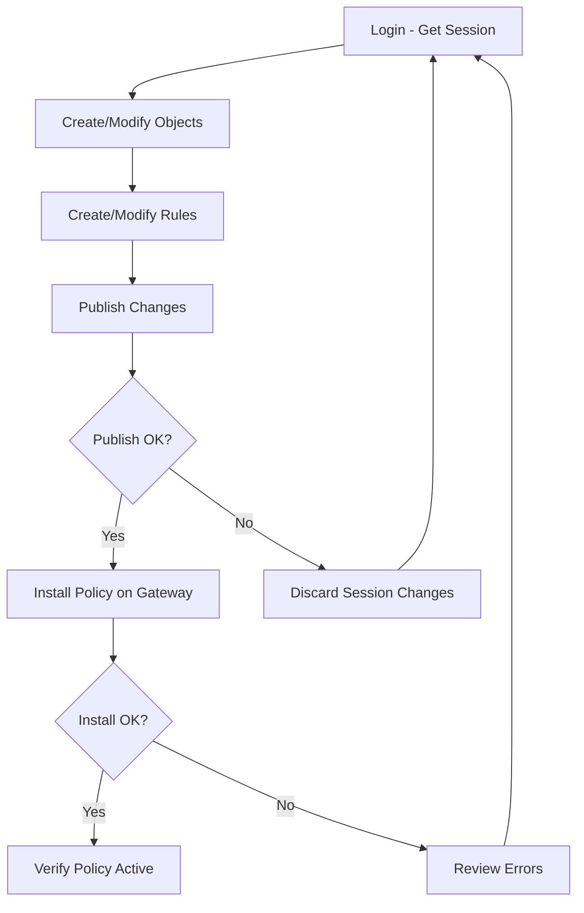

# How to Use Ansible to Manage Check Point Firewalls

Author: [nawazdhandala](https://www.github.com/nawazdhandala)

Tags: Ansible, Check Point, Firewall, Network Automation, Security

Description: Automate Check Point firewall management with Ansible using the check_point.mgmt collection for security policy and object management.

---

Check Point firewalls are a staple in enterprise security. Managing them through SmartConsole works well enough for small environments, but once you have policies spanning multiple gateways and management servers, automation becomes essential. Ansible's Check Point collection lets you interact with the Check Point Management API to automate policy creation, object management, and even session handling.

This post covers setting up Ansible for Check Point management, handling the session-based API model, and writing playbooks for common firewall tasks.

## Understanding Check Point's API Model

Before diving into playbooks, it helps to understand how Check Point's API differs from other firewall vendors. Check Point uses a session-based model:

1. You log in and get a session ID (SID)
2. You make changes within that session
3. You publish changes to make them visible to other admins
4. You install the policy on gateways to make changes active

The Ansible collection handles sessions automatically, but you still need to publish and install policies.

## Installing the Collection

```bash
# Install the Check Point management collection
ansible-galaxy collection install check_point.mgmt

# Install the required Python SDK
pip install cpapi
```

## Authentication Setup

Store your Check Point management server credentials securely.

```yaml
# group_vars/checkpoint/vault.yml (encrypt with ansible-vault)
checkpoint_server: "192.168.1.100"
checkpoint_user: "ansible-admin"
checkpoint_password: "your-secure-password"
checkpoint_domain: "SMC User"
```

Create the inventory for your Check Point management server.

```ini
# inventory/checkpoint.ini
[checkpoint]
cp-mgmt ansible_host=192.168.1.100

[checkpoint:vars]
ansible_connection=httpapi
ansible_httpapi_use_ssl=true
ansible_httpapi_validate_certs=false
ansible_network_os=check_point.mgmt.checkpoint
ansible_httpapi_port=443
```

## Creating Network Objects

Start by creating the network objects that your security rules will reference.

```yaml
# playbooks/create_objects.yml
---
- name: Create Check Point Network Objects
  hosts: checkpoint
  gather_facts: false

  collections:
    - check_point.mgmt

  tasks:
    # Create host objects for individual servers
    - name: Create web server host
      cp_mgmt_host:
        name: "web-server-01"
        ip_address: "10.0.1.10"
        color: "blue"
        comments: "Production web server - Managed by Ansible"
        state: present

    - name: Create database server host
      cp_mgmt_host:
        name: "db-server-01"
        ip_address: "10.0.2.10"
        color: "red"
        comments: "Production database server - Managed by Ansible"
        state: present

    # Create a network object for an entire subnet
    - name: Create server network
      cp_mgmt_network:
        name: "server-network"
        subnet: "10.0.0.0"
        mask_length: 16
        color: "green"
        comments: "Server network - Managed by Ansible"
        state: present

    # Create a group containing the web servers
    - name: Create web servers group
      cp_mgmt_group:
        name: "web-servers"
        members:
          - "web-server-01"
        color: "blue"
        comments: "Web server group - Managed by Ansible"
        state: present
```

## Creating Service Objects

If you need custom service definitions beyond the built-in ones, create them with Ansible.

```yaml
# playbooks/create_services.yml
---
- name: Create Check Point Service Objects
  hosts: checkpoint
  gather_facts: false

  collections:
    - check_point.mgmt

  tasks:
    # Create a custom TCP service for your application
    - name: Create custom app service
      cp_mgmt_service_tcp:
        name: "app-service-8443"
        port: "8443"
        comments: "Custom application HTTPS port"
        state: present

    # Create a service group for web services
    - name: Create web services group
      cp_mgmt_service_group:
        name: "web-services"
        members:
          - "http"
          - "https"
          - "app-service-8443"
        comments: "Web service group - Managed by Ansible"
        state: present
```

## Creating Security Rules

Now create the access rules that reference your objects.

```yaml
# playbooks/create_rules.yml
---
- name: Manage Check Point Access Rules
  hosts: checkpoint
  gather_facts: false

  collections:
    - check_point.mgmt

  tasks:
    # Create a rule allowing web traffic to the web servers
    - name: Create web access rule
      cp_mgmt_access_rule:
        layer: "Network"
        name: "Allow-Web-Traffic"
        position: "top"
        source:
          - "Any"
        destination:
          - "web-servers"
        service:
          - "web-services"
        action: "Accept"
        track:
          type: "Log"
        comments: "Allow web traffic to web servers"
        state: present

    # Create a rule allowing database access from web servers only
    - name: Create database access rule
      cp_mgmt_access_rule:
        layer: "Network"
        name: "Allow-DB-Access"
        position:
          above: "Cleanup Rule"
        source:
          - "web-servers"
        destination:
          - "db-server-01"
        service:
          - "MySQL"
        action: "Accept"
        track:
          type: "Log"
        comments: "Allow DB access from web servers only"
        state: present
```

## Publishing and Installing Policy

This is the critical part that is unique to Check Point. Changes sit in your session until published, and they are not active on gateways until the policy is installed.

```yaml
# playbooks/publish_and_install.yml
---
- name: Publish and Install Check Point Policy
  hosts: checkpoint
  gather_facts: false

  collections:
    - check_point.mgmt

  tasks:
    # Publish all pending changes from the current session
    - name: Publish changes
      cp_mgmt_publish:
      register: publish_result

    - name: Show publish result
      debug:
        var: publish_result

    # Install the policy on the gateway
    - name: Install policy on gateway
      cp_mgmt_install_policy:
        policy_package: "Standard"
        targets:
          - "gw-dc1"
        access: true
        threat_prevention: true
      register: install_result

    - name: Show install result
      debug:
        var: install_result
```

## Full Workflow Playbook

In practice, you combine object creation, rule creation, publishing, and installation into a single workflow.

```yaml
# playbooks/full_workflow.yml
---
- name: Complete Check Point Policy Update
  hosts: checkpoint
  gather_facts: false

  collections:
    - check_point.mgmt

  tasks:
    - name: Create host object
      cp_mgmt_host:
        name: "new-app-server"
        ip_address: "10.0.3.10"
        state: present

    - name: Create access rule for new server
      cp_mgmt_access_rule:
        layer: "Network"
        name: "Allow-New-App"
        position: "top"
        source:
          - "Any"
        destination:
          - "new-app-server"
        service:
          - "https"
        action: "Accept"
        track:
          type: "Log"
        state: present

    # Always publish after making changes
    - name: Publish changes
      cp_mgmt_publish:

    # Install policy to activate changes on gateways
    - name: Install access policy
      cp_mgmt_install_policy:
        policy_package: "Standard"
        targets:
          - "gw-dc1"
        access: true
```

## Check Point Automation Workflow



## Discarding Changes

If something goes wrong, you can discard unpublished changes.

```yaml
# Discard changes if something goes wrong
- name: Discard session changes
  cp_mgmt_discard:
  when: something_failed is defined and something_failed
```

## Gathering Information

Pull existing configuration data for auditing.

```yaml
# playbooks/audit_rules.yml
---
- name: Audit Check Point Rules
  hosts: checkpoint
  gather_facts: false

  collections:
    - check_point.mgmt

  tasks:
    # Get all access rules from the Network layer
    - name: Get all access rules
      cp_mgmt_access_rule_facts:
        layer: "Network"
        limit: 500
        details_level: "full"
      register: all_rules

    - name: Display rule count
      debug:
        msg: "Total rules: {{ all_rules.ansible_facts.access_rule.total }}"
```

## Tips for Check Point Automation

1. Always publish after making changes. Unpublished changes lock objects and block other administrators.
2. Use `cp_mgmt_discard` in error handlers to clean up failed sessions.
3. The `position` parameter in rules matters. Use "top", "bottom", or reference another rule to control placement.
4. Check Point has a 50-object limit per API call for some operations. Use pagination when querying large rule bases.
5. Policy installation can take several minutes on large environments. Set appropriate timeouts in your playbooks.
6. Use the `auto_publish_session` connection variable to automatically publish after each task if you want simpler playbooks.

Check Point automation with Ansible works well once you understand the session/publish/install model. The biggest benefit is being able to version control your security policies in Git and apply them consistently across multiple management servers.
