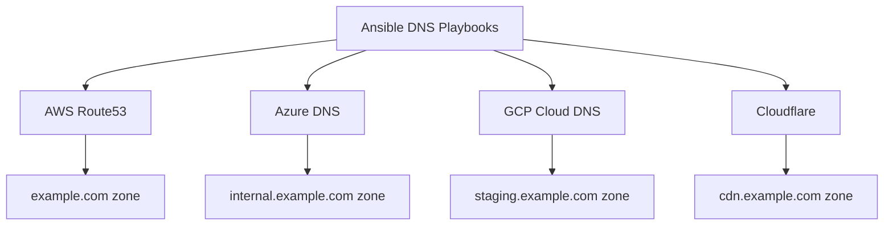

# How to Use Ansible to Manage Cloud DNS Across Providers

Author: [nawazdhandala](https://www.github.com/nawazdhandala)

Tags: Ansible, DNS, Multi-Cloud, Route53, Cloud DNS

Description: Manage DNS records across AWS Route53, Azure DNS, GCP Cloud DNS, and Cloudflare using Ansible for unified DNS automation.

---

DNS is one of those things that touches everything in your infrastructure. Whether you are pointing a domain to a load balancer, creating service discovery records, or managing SSL validation entries, DNS changes happen constantly. When your DNS is spread across multiple providers, keeping it consistent and auditable becomes a real challenge. Ansible lets you manage DNS records across providers from a single set of playbooks.

This guide covers managing DNS on AWS Route53, Azure DNS, GCP Cloud DNS, and Cloudflare using Ansible.

## Prerequisites

Install the collections for the DNS providers you use.

```bash
# Install collections for different DNS providers
ansible-galaxy collection install amazon.aws
ansible-galaxy collection install azure.azcollection
ansible-galaxy collection install google.cloud
ansible-galaxy collection install community.general

# Install Python SDKs
pip install boto3 botocore
pip install azure-mgmt-dns azure-identity
pip install google-cloud-dns
pip install cloudflare
```

## DNS Management Architecture



## Defining DNS Records Centrally

Start by defining all your DNS records in a single source of truth, regardless of which provider hosts each zone.

```yaml
# vars/dns_records.yml
---
dns_zones:
  - zone: example.com
    provider: route53
    records:
      - name: ""
        type: A
        values: ["203.0.113.10"]
        ttl: 300
      - name: www
        type: CNAME
        values: ["example.com"]
        ttl: 3600
      - name: api
        type: A
        values: ["203.0.113.20", "203.0.113.21"]
        ttl: 60
      - name: mail
        type: MX
        values:
          - "10 mail1.example.com"
          - "20 mail2.example.com"
        ttl: 3600

  - zone: internal.example.com
    provider: azure
    resource_group: dns-rg
    records:
      - name: db-master
        type: A
        values: ["10.1.0.10"]
        ttl: 300
      - name: db-replica
        type: A
        values: ["10.1.0.11"]
        ttl: 300
      - name: redis
        type: A
        values: ["10.1.0.20"]
        ttl: 300

  - zone: staging.example.com
    provider: gcp
    project: my-project-id
    records:
      - name: app
        type: A
        values: ["10.2.0.10"]
        ttl: 300
      - name: web
        type: CNAME
        values: ["staging-lb.example.com."]
        ttl: 300
```

## Managing AWS Route53 Records

```yaml
# playbooks/dns-route53.yml
---
- name: Manage Route53 DNS records
  hosts: localhost
  gather_facts: false
  vars_files:
    - ../vars/dns_records.yml

  tasks:
    # Get the hosted zone ID
    - name: Get Route53 hosted zone
      amazon.aws.route53_zone:
        zone: "example.com"
        state: present
      register: zone_info

    # Create or update each record
    - name: Manage Route53 records
      amazon.aws.route53:
        zone: "example.com"
        record: "{{ (item.name ~ '.' ~ 'example.com') if item.name else 'example.com' }}"
        type: "{{ item.type }}"
        value: "{{ item.values }}"
        ttl: "{{ item.ttl }}"
        overwrite: true
        state: present
      loop: "{{ (dns_zones | selectattr('zone', 'equalto', 'example.com') | first).records }}"
      loop_control:
        label: "{{ item.name | default('@') }}.example.com ({{ item.type }})"
```

## Managing Azure DNS Records

```yaml
# playbooks/dns-azure.yml
---
- name: Manage Azure DNS records
  hosts: localhost
  gather_facts: false
  vars_files:
    - ../vars/dns_records.yml

  vars:
    azure_zone: "internal.example.com"
    azure_rg: "dns-rg"

  tasks:
    # Ensure the DNS zone exists
    - name: Create Azure DNS zone
      azure.azcollection.azure_rm_dnszone:
        resource_group: "{{ azure_rg }}"
        name: "{{ azure_zone }}"
        state: present

    # Create A records
    - name: Manage Azure DNS A records
      azure.azcollection.azure_rm_dnsrecordset:
        resource_group: "{{ azure_rg }}"
        zone_name: "{{ azure_zone }}"
        relative_name: "{{ item.name }}"
        record_type: "{{ item.type }}"
        time_to_live: "{{ item.ttl }}"
        records:
          - entry: "{{ record_value }}"
      vars:
        zone_records: "{{ (dns_zones | selectattr('zone', 'equalto', azure_zone) | first).records }}"
      loop: "{{ zone_records | selectattr('type', 'equalto', 'A') | list }}"
      loop_control:
        label: "{{ item.name }}.{{ azure_zone }}"
        loop_var: item
```

## Managing GCP Cloud DNS Records

```yaml
# playbooks/dns-gcp.yml
---
- name: Manage GCP Cloud DNS records
  hosts: localhost
  gather_facts: false
  vars_files:
    - ../vars/dns_records.yml
    - ../vars/gcp.yml

  vars:
    gcp_zone_name: staging-example-com
    gcp_dns_zone: staging.example.com

  tasks:
    # Ensure the managed zone exists
    - name: Create GCP DNS managed zone
      google.cloud.gcp_dns_managed_zone:
        name: "{{ gcp_zone_name }}"
        dns_name: "{{ gcp_dns_zone }}."
        description: "Staging environment DNS zone"
        project: "{{ gcp_project }}"
        auth_kind: serviceaccount
        service_account_file: "{{ gcp_service_account_file }}"
        state: present

    # Create DNS record sets
    - name: Manage GCP DNS records
      google.cloud.gcp_dns_resource_record_set:
        managed_zone:
          name: "{{ gcp_zone_name }}"
        name: "{{ item.name }}.{{ gcp_dns_zone }}."
        type: "{{ item.type }}"
        ttl: "{{ item.ttl }}"
        rrdatas: "{{ item.values }}"
        project: "{{ gcp_project }}"
        auth_kind: serviceaccount
        service_account_file: "{{ gcp_service_account_file }}"
        state: present
      loop: "{{ (dns_zones | selectattr('zone', 'equalto', gcp_dns_zone) | first).records }}"
      loop_control:
        label: "{{ item.name }}.{{ gcp_dns_zone }} ({{ item.type }})"
```

## Managing Cloudflare DNS

```yaml
# playbooks/dns-cloudflare.yml
---
- name: Manage Cloudflare DNS records
  hosts: localhost
  gather_facts: false

  vars:
    cloudflare_api_token: "{{ vault_cloudflare_token }}"
    cloudflare_zone: "example.com"
    cloudflare_records:
      - name: cdn
        type: CNAME
        value: cdn.example.com.cdn.cloudflare.net
        proxied: true
      - name: static
        type: CNAME
        value: static-assets.s3.amazonaws.com
        proxied: true
      - name: api-v2
        type: A
        value: 203.0.113.50
        proxied: false

  tasks:
    # Manage Cloudflare DNS records
    - name: Create or update Cloudflare records
      community.general.cloudflare_dns:
        api_token: "{{ cloudflare_api_token }}"
        zone: "{{ cloudflare_zone }}"
        record: "{{ item.name }}"
        type: "{{ item.type }}"
        value: "{{ item.value }}"
        proxied: "{{ item.proxied | default(false) }}"
        state: present
      loop: "{{ cloudflare_records }}"
      loop_control:
        label: "{{ item.name }}.{{ cloudflare_zone }} ({{ item.type }})"
```

## Unified DNS Management Role

Wrap all providers into a single role that picks the right module based on the provider.

```yaml
# roles/dns_manager/tasks/main.yml
---
- name: Process DNS zones
  ansible.builtin.include_tasks: "provider-{{ item.provider }}.yml"
  loop: "{{ dns_zones }}"
  loop_control:
    label: "{{ item.zone }} ({{ item.provider }})"
    loop_var: zone_config
```

```yaml
# roles/dns_manager/tasks/provider-route53.yml
---
- name: Manage Route53 records for {{ zone_config.zone }}
  amazon.aws.route53:
    zone: "{{ zone_config.zone }}"
    record: "{{ (item.name ~ '.' ~ zone_config.zone) if item.name else zone_config.zone }}"
    type: "{{ item.type }}"
    value: "{{ item.values }}"
    ttl: "{{ item.ttl }}"
    overwrite: true
    state: present
  loop: "{{ zone_config.records }}"
  loop_control:
    label: "{{ item.name | default('@') }}.{{ zone_config.zone }}"
```

```yaml
# roles/dns_manager/tasks/provider-azure.yml
---
- name: Manage Azure DNS records for {{ zone_config.zone }}
  azure.azcollection.azure_rm_dnsrecordset:
    resource_group: "{{ zone_config.resource_group }}"
    zone_name: "{{ zone_config.zone }}"
    relative_name: "{{ item.name }}"
    record_type: "{{ item.type }}"
    time_to_live: "{{ item.ttl }}"
    records:
      - entry: "{{ item.values[0] }}"
  loop: "{{ zone_config.records }}"
  loop_control:
    label: "{{ item.name }}.{{ zone_config.zone }}"
```

## DNS Validation Playbook

Verify that your DNS records are correctly resolving.

```yaml
# playbooks/validate-dns.yml
---
- name: Validate DNS records
  hosts: localhost
  gather_facts: false
  vars_files:
    - ../vars/dns_records.yml

  tasks:
    # Check each record resolves correctly
    - name: Validate DNS resolution
      ansible.builtin.command:
        cmd: "dig +short {{ item.1.name }}.{{ item.0.zone }} {{ item.1.type }}"
      register: dig_results
      changed_when: false
      loop: "{{ dns_zones | subelements('records') }}"
      loop_control:
        label: "{{ item.1.name }}.{{ item.0.zone }} ({{ item.1.type }})"
      when: item.1.name != ""

    - name: Show DNS validation results
      ansible.builtin.debug:
        msg: "{{ item.item.1.name }}.{{ item.item.0.zone }}: {{ item.stdout_lines }}"
      loop: "{{ dig_results.results }}"
      loop_control:
        label: "{{ item.item.1.name | default('root') }}"
      when: item.stdout is defined
```

## Automated Certificate DNS Validation

A common DNS task is creating validation records for SSL certificates.

```yaml
# playbooks/cert-validation-dns.yml
---
- name: Create DNS validation records for ACM certificates
  hosts: localhost
  gather_facts: false

  vars:
    certificates:
      - domain: "example.com"
        validation_name: "_acme-challenge"
        validation_value: "abcdef1234567890"
        dns_provider: route53
      - domain: "staging.example.com"
        validation_name: "_acme-challenge"
        validation_value: "0987654321fedcba"
        dns_provider: gcp

  tasks:
    # Create validation records on Route53
    - name: Create Route53 validation records
      amazon.aws.route53:
        zone: "{{ item.domain }}"
        record: "{{ item.validation_name }}.{{ item.domain }}"
        type: TXT
        value: "\"{{ item.validation_value }}\""
        ttl: 60
        state: present
      loop: "{{ certificates | selectattr('dns_provider', 'equalto', 'route53') | list }}"
      loop_control:
        label: "{{ item.domain }}"
```

## Tips for Multi-Provider DNS

1. **Centralize your DNS record definitions.** Even if records live on different providers, define them all in one place. This makes auditing and change management much simpler.
2. **Use low TTLs for records that might change.** Set TTL to 60 seconds for records that point to infrastructure you might need to failover. Higher TTLs (3600+) are fine for stable records like MX entries.
3. **Always validate after changes.** DNS propagation issues are real. After applying changes, run a validation playbook to confirm the records resolve correctly.
4. **Version control your DNS.** Treat DNS like code. Every change should be a commit with a message explaining why it was made. This is invaluable when debugging why something changed.
5. **Watch out for trailing dots.** Some DNS modules expect fully qualified domain names with a trailing dot, others do not. Check the module documentation for your provider.
6. **Plan for DNS failover.** If you are multi-cloud for redundancy, your DNS needs to support health-check-based routing. Route53 and Cloudflare both support this natively.

Managing DNS across providers with Ansible turns a fragmented, manual process into something consistent and auditable. The initial setup takes some effort, but once your DNS-as-code is in place, changes become pull requests instead of manual console clicks.
