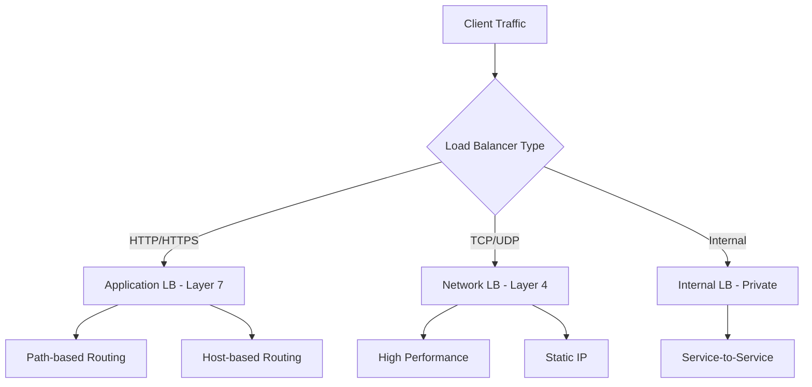

# How to Use Ansible to Manage Cloud Load Balancers

Author: [nawazdhandala](https://www.github.com/nawazdhandala)

Tags: Ansible, Load Balancers, AWS ALB, Cloud Infrastructure, High Availability

Description: Manage cloud load balancers on AWS, Azure, and GCP using Ansible for automated traffic distribution and health monitoring.

---

Load balancers are the front door to your applications. They distribute traffic, provide health checking, handle SSL termination, and enable zero-downtime deployments. Configuring them manually through cloud consoles is slow and error-prone, especially when you need consistent configurations across multiple environments. Ansible gives you a declarative way to manage load balancers across cloud providers.

This guide covers setting up and managing load balancers on AWS (ALB/NLB), Azure (Load Balancer), and GCP (Cloud Load Balancing) using Ansible.

## Load Balancer Types



## AWS Application Load Balancer

### Creating an ALB with Target Groups

```yaml
# playbooks/aws-alb.yml
---
- name: Configure AWS Application Load Balancer
  hosts: localhost
  gather_facts: false

  vars:
    aws_region: us-east-1
    project: myapp
    env: production
    vpc_id: vpc-0123456789abcdef0
    public_subnets:
      - subnet-0aaa
      - subnet-0bbb
      - subnet-0ccc

  tasks:
    # Create security group for the ALB
    - name: Create ALB security group
      amazon.aws.ec2_security_group:
        name: "{{ project }}-{{ env }}-alb-sg"
        description: "ALB security group - allows HTTP and HTTPS"
        vpc_id: "{{ vpc_id }}"
        region: "{{ aws_region }}"
        rules:
          - proto: tcp
            ports: [80]
            cidr_ip: 0.0.0.0/0
            rule_desc: "HTTP from anywhere"
          - proto: tcp
            ports: [443]
            cidr_ip: 0.0.0.0/0
            rule_desc: "HTTPS from anywhere"
        state: present
      register: alb_sg

    # Create the target group for web servers
    - name: Create web target group
      community.aws.elb_target_group:
        name: "{{ project }}-{{ env }}-web-tg"
        protocol: HTTP
        port: 80
        vpc_id: "{{ vpc_id }}"
        health_check_protocol: HTTP
        health_check_path: /health
        health_check_port: "traffic-port"
        health_check_interval: 15
        health_check_timeout: 5
        healthy_threshold_count: 3
        unhealthy_threshold_count: 3
        target_type: instance
        targets:
          - Id: i-0123456789abcdef0
            Port: 80
          - Id: i-0123456789abcdef1
            Port: 80
          - Id: i-0123456789abcdef2
            Port: 80
        region: "{{ aws_region }}"
        state: present
      register: web_tg

    # Create an API target group
    - name: Create API target group
      community.aws.elb_target_group:
        name: "{{ project }}-{{ env }}-api-tg"
        protocol: HTTP
        port: 8080
        vpc_id: "{{ vpc_id }}"
        health_check_protocol: HTTP
        health_check_path: /api/health
        health_check_port: "traffic-port"
        target_type: instance
        targets:
          - Id: i-0123456789abcdef3
            Port: 8080
          - Id: i-0123456789abcdef4
            Port: 8080
        region: "{{ aws_region }}"
        state: present
      register: api_tg

    # Create the Application Load Balancer
    - name: Create Application Load Balancer
      amazon.aws.elb_application_lb:
        name: "{{ project }}-{{ env }}-alb"
        subnets: "{{ public_subnets }}"
        security_groups:
          - "{{ alb_sg.group_id }}"
        scheme: internet-facing
        listeners:
          # HTTP listener that redirects to HTTPS
          - Protocol: HTTP
            Port: 80
            DefaultActions:
              - Type: redirect
                RedirectConfig:
                  Protocol: HTTPS
                  Port: "443"
                  StatusCode: HTTP_301
          # HTTPS listener with path-based routing
          - Protocol: HTTPS
            Port: 443
            SslPolicy: ELBSecurityPolicy-TLS13-1-2-2021-06
            Certificates:
              - CertificateArn: "arn:aws:acm:us-east-1:123456789012:certificate/abc123"
            DefaultActions:
              - Type: forward
                TargetGroupArn: "{{ web_tg.target_group_arn }}"
            Rules:
              - Conditions:
                  - Field: path-pattern
                    Values: ["/api/*"]
                Priority: 10
                Actions:
                  - Type: forward
                    TargetGroupArn: "{{ api_tg.target_group_arn }}"
        tags:
          Project: "{{ project }}"
          Environment: "{{ env }}"
        region: "{{ aws_region }}"
        state: present
      register: alb

    - name: Show ALB DNS name
      ansible.builtin.debug:
        msg: "ALB DNS: {{ alb.dns_name }}"
```

### AWS Network Load Balancer

For TCP/UDP traffic or when you need static IPs and ultra-low latency.

```yaml
# playbooks/aws-nlb.yml
---
- name: Configure AWS Network Load Balancer
  hosts: localhost
  gather_facts: false

  vars:
    aws_region: us-east-1

  tasks:
    # Create NLB target group
    - name: Create NLB target group
      community.aws.elb_target_group:
        name: myapp-prod-tcp-tg
        protocol: TCP
        port: 443
        vpc_id: "{{ vpc_id }}"
        health_check_protocol: TCP
        health_check_port: "443"
        health_check_interval: 10
        healthy_threshold_count: 3
        unhealthy_threshold_count: 3
        target_type: instance
        targets:
          - Id: i-0123456789abcdef0
            Port: 443
          - Id: i-0123456789abcdef1
            Port: 443
        region: "{{ aws_region }}"
        state: present
      register: nlb_tg

    # Create the Network Load Balancer
    - name: Create Network Load Balancer
      amazon.aws.elb_network_lb:
        name: myapp-prod-nlb
        subnets: "{{ public_subnets }}"
        scheme: internet-facing
        cross_zone_load_balancing: true
        listeners:
          - Protocol: TCP
            Port: 443
            DefaultActions:
              - Type: forward
                TargetGroupArn: "{{ nlb_tg.target_group_arn }}"
        region: "{{ aws_region }}"
        state: present
```

## Azure Load Balancer

```yaml
# playbooks/azure-load-balancer.yml
---
- name: Configure Azure Load Balancer
  hosts: localhost
  gather_facts: false

  vars:
    resource_group: myapp-rg
    location: eastus

  tasks:
    # Create a public IP for the load balancer
    - name: Create public IP
      azure.azcollection.azure_rm_publicipaddress:
        resource_group: "{{ resource_group }}"
        name: myapp-lb-pip
        allocation_method: Static
        sku: Standard
        state: present
      register: public_ip

    # Create the load balancer
    - name: Create Azure Load Balancer
      azure.azcollection.azure_rm_loadbalancer:
        resource_group: "{{ resource_group }}"
        name: myapp-lb
        sku: Standard
        frontend_ip_configurations:
          - name: frontend
            public_ip_address: myapp-lb-pip
        backend_address_pools:
          - name: web-backend-pool
        probes:
          - name: http-health-probe
            port: 80
            protocol: Http
            request_path: /health
            interval: 15
            fail_count: 3
        load_balancing_rules:
          - name: http-rule
            frontend_ip_configuration: frontend
            backend_address_pool: web-backend-pool
            probe: http-health-probe
            protocol: Tcp
            frontend_port: 80
            backend_port: 80
            load_distribution: Default
          - name: https-rule
            frontend_ip_configuration: frontend
            backend_address_pool: web-backend-pool
            probe: http-health-probe
            protocol: Tcp
            frontend_port: 443
            backend_port: 443
            load_distribution: Default
        state: present
      register: lb

    - name: Show Load Balancer IP
      ansible.builtin.debug:
        msg: "LB IP: {{ public_ip.state.ip_address }}"
```

## GCP Load Balancer

GCP load balancing is more complex because it uses multiple interconnected resources.

```yaml
# playbooks/gcp-load-balancer.yml
---
- name: Configure GCP HTTP(S) Load Balancer
  hosts: localhost
  gather_facts: false

  vars:
    gcp_project: my-project-id
    gcp_auth_kind: serviceaccount
    gcp_service_account_file: /path/to/sa-key.json

  tasks:
    # Create a health check
    - name: Create HTTP health check
      google.cloud.gcp_compute_health_check:
        name: myapp-http-health-check
        http_health_check:
          port: 80
          request_path: /health
        check_interval_sec: 10
        timeout_sec: 5
        healthy_threshold: 3
        unhealthy_threshold: 3
        project: "{{ gcp_project }}"
        auth_kind: "{{ gcp_auth_kind }}"
        service_account_file: "{{ gcp_service_account_file }}"
        state: present
      register: health_check

    # Create an instance group
    - name: Create instance group
      google.cloud.gcp_compute_instance_group:
        name: myapp-web-group
        zone: us-central1-a
        named_ports:
          - name: http
            port: 80
        project: "{{ gcp_project }}"
        auth_kind: "{{ gcp_auth_kind }}"
        service_account_file: "{{ gcp_service_account_file }}"
        state: present
      register: instance_group

    # Create backend service
    - name: Create backend service
      google.cloud.gcp_compute_backend_service:
        name: myapp-backend-service
        health_checks:
          - "{{ health_check.selfLink }}"
        backends:
          - group: "{{ instance_group.selfLink }}"
            balancing_mode: UTILIZATION
            max_utilization: 0.8
        port_name: http
        protocol: HTTP
        timeout_sec: 30
        project: "{{ gcp_project }}"
        auth_kind: "{{ gcp_auth_kind }}"
        service_account_file: "{{ gcp_service_account_file }}"
        state: present
      register: backend

    # Create URL map
    - name: Create URL map
      google.cloud.gcp_compute_url_map:
        name: myapp-url-map
        default_service: "{{ backend }}"
        project: "{{ gcp_project }}"
        auth_kind: "{{ gcp_auth_kind }}"
        service_account_file: "{{ gcp_service_account_file }}"
        state: present
      register: url_map

    # Create target HTTP proxy
    - name: Create HTTP proxy
      google.cloud.gcp_compute_target_http_proxy:
        name: myapp-http-proxy
        url_map: "{{ url_map }}"
        project: "{{ gcp_project }}"
        auth_kind: "{{ gcp_auth_kind }}"
        service_account_file: "{{ gcp_service_account_file }}"
        state: present
      register: http_proxy

    # Create global forwarding rule
    - name: Create forwarding rule
      google.cloud.gcp_compute_global_forwarding_rule:
        name: myapp-forwarding-rule
        target: "{{ http_proxy.selfLink }}"
        port_range: "80-80"
        ip_protocol: TCP
        project: "{{ gcp_project }}"
        auth_kind: "{{ gcp_auth_kind }}"
        service_account_file: "{{ gcp_service_account_file }}"
        state: present
      register: forwarding_rule

    - name: Show load balancer IP
      ansible.builtin.debug:
        msg: "LB IP: {{ forwarding_rule.IPAddress }}"
```

## Health Check Verification

After configuring load balancers, verify health checks are passing.

```yaml
# playbooks/verify-lb-health.yml
---
- name: Verify load balancer health
  hosts: localhost
  gather_facts: false

  tasks:
    # Check AWS target group health
    - name: Check target group health
      community.aws.elb_target_group_info:
        names:
          - myapp-prod-web-tg
        region: us-east-1
        collect_targets_health: true
      register: tg_health

    - name: Display target health
      ansible.builtin.debug:
        msg: "{{ item.target_id }}: {{ item.target_health.state }}"
      loop: "{{ tg_health.target_groups[0].targets_health_description }}"
      loop_control:
        label: "{{ item.target_id }}"

    # Assert all targets are healthy
    - name: Verify all targets are healthy
      ansible.builtin.assert:
        that:
          - item.target_health.state == 'healthy'
        fail_msg: "Target {{ item.target_id }} is {{ item.target_health.state }}"
      loop: "{{ tg_health.target_groups[0].targets_health_description }}"
      loop_control:
        label: "{{ item.target_id }}"

    # Test the load balancer endpoint
    - name: Test ALB endpoint
      ansible.builtin.uri:
        url: "https://{{ alb_dns_name }}/health"
        method: GET
        status_code: 200
        timeout: 10
      register: health_result

    - name: Show health check result
      ansible.builtin.debug:
        msg: "Load balancer health: {{ health_result.status }}"
```

## Blue-Green Deployment with Load Balancer

Use target group switching for zero-downtime deployments.

```yaml
# playbooks/blue-green-deploy.yml
---
- name: Blue-green deployment via target group switch
  hosts: localhost
  gather_facts: false

  vars:
    aws_region: us-east-1
    active_color: blue
    new_color: green

  tasks:
    # Get current listener rules
    - name: Get ALB listener info
      community.aws.elb_application_lb_info:
        names:
          - myapp-prod-alb
        region: "{{ aws_region }}"
      register: alb_info

    # Switch the default target group
    - name: Update listener to point to new target group
      amazon.aws.elb_application_lb:
        name: myapp-prod-alb
        listeners:
          - Protocol: HTTPS
            Port: 443
            SslPolicy: ELBSecurityPolicy-TLS13-1-2-2021-06
            Certificates:
              - CertificateArn: "{{ acm_cert_arn }}"
            DefaultActions:
              - Type: forward
                TargetGroupArn: "arn:aws:elasticloadbalancing:us-east-1:123456789012:targetgroup/myapp-prod-{{ new_color }}-tg/abc123"
        region: "{{ aws_region }}"
        state: present

    - name: Verify new deployment is healthy
      ansible.builtin.uri:
        url: "https://{{ alb_dns_name }}/health"
        method: GET
        status_code: 200
      retries: 5
      delay: 10
```

## Load Balancer Tips

1. **Always configure health checks.** Without health checks, the load balancer will send traffic to unhealthy instances. Set the health check path to something that actually tests your application, not just the web server.
2. **Use connection draining.** When removing a target, connection draining gives active requests time to complete. Set it to 30-60 seconds for web traffic.
3. **ALB vs NLB vs CLB.** Use ALB for HTTP/HTTPS with path-based routing. Use NLB for TCP/UDP, static IPs, or extreme performance. Classic Load Balancers are legacy at this point.
4. **Cross-zone load balancing matters.** Enable it to distribute traffic evenly across all AZs. Without it, an AZ with fewer instances gets the same amount of traffic as one with more.
5. **Monitor 5xx errors.** A spike in 5xx errors from the load balancer usually means your backend is overloaded or failing. Set up CloudWatch alarms on this metric.
6. **SSL termination at the LB is usually right.** Terminating SSL at the load balancer reduces CPU load on your backends and simplifies certificate management.

Automating load balancer configuration with Ansible means your traffic distribution layer is just as reproducible as the rest of your infrastructure. Changes become auditable, rollbacks become possible, and new environment setups go from hours to minutes.
