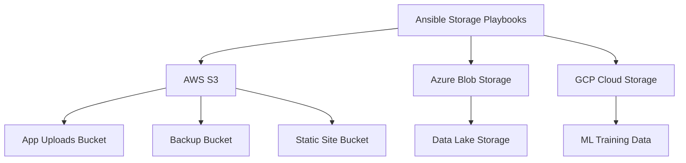

# How to Use Ansible to Manage Cloud Storage

Author: [nawazdhandala](https://www.github.com/nawazdhandala)

Tags: Ansible, Cloud Storage, AWS S3, Azure Blob, GCP Storage

Description: Manage cloud storage across AWS S3, Azure Blob Storage, and GCP Cloud Storage using Ansible for buckets, policies, and lifecycle rules.

---

Cloud storage is one of the most widely used cloud services. From hosting static websites to storing database backups, almost every application depends on object storage in some form. Managing buckets, access policies, lifecycle rules, and replication across providers is tedious when done manually. Ansible automates all of it, giving you version-controlled, repeatable storage configurations.

This guide covers managing storage on AWS S3, Azure Blob Storage, and GCP Cloud Storage using Ansible.

## Prerequisites

Install collections for each storage provider.

```bash
# Install cloud collections
ansible-galaxy collection install amazon.aws
ansible-galaxy collection install azure.azcollection
ansible-galaxy collection install google.cloud

# Install Python SDKs
pip install boto3 botocore
pip install azure-storage-blob azure-mgmt-storage azure-identity
pip install google-cloud-storage
```

## Storage Architecture Overview



## Managing AWS S3 Buckets

### Creating Buckets

```yaml
# playbooks/manage-s3-buckets.yml
---
- name: Manage AWS S3 buckets
  hosts: localhost
  gather_facts: false

  vars:
    aws_region: us-east-1
    buckets:
      - name: myapp-uploads-prod
        versioning: true
        encryption: AES256
        public_access: false
      - name: myapp-backups-prod
        versioning: true
        encryption: AES256
        public_access: false
      - name: myapp-static-prod
        versioning: false
        encryption: AES256
        public_access: true

  tasks:
    # Create S3 buckets with proper settings
    - name: Create S3 buckets
      amazon.aws.s3_bucket:
        name: "{{ item.name }}"
        region: "{{ aws_region }}"
        versioning: "{{ item.versioning }}"
        encryption: "{{ item.encryption }}"
        public_access:
          block_public_acls: "{{ not item.public_access }}"
          block_public_policy: "{{ not item.public_access }}"
          ignore_public_acls: "{{ not item.public_access }}"
          restrict_public_buckets: "{{ not item.public_access }}"
        tags:
          Environment: production
          ManagedBy: ansible
        state: present
      loop: "{{ buckets }}"
      loop_control:
        label: "{{ item.name }}"
```

### S3 Lifecycle Rules

Lifecycle rules automatically transition or delete objects based on age.

```yaml
# playbooks/s3-lifecycle-rules.yml
---
- name: Configure S3 lifecycle rules
  hosts: localhost
  gather_facts: false

  tasks:
    # Set lifecycle rules for the backup bucket
    - name: Configure backup retention lifecycle
      amazon.aws.s3_lifecycle:
        name: myapp-backups-prod
        rule_id: backup-retention
        status: enabled
        prefix: ""
        transitions:
          - days: 30
            storage_class: STANDARD_IA
          - days: 90
            storage_class: GLACIER
          - days: 365
            storage_class: DEEP_ARCHIVE
        expiration_days: 730
        state: present

    # Lifecycle for upload bucket to clean temp files
    - name: Configure upload cleanup
      amazon.aws.s3_lifecycle:
        name: myapp-uploads-prod
        rule_id: cleanup-temp-uploads
        status: enabled
        prefix: "temp/"
        expiration_days: 7
        state: present

    # Clean up incomplete multipart uploads
    - name: Clean up incomplete multipart uploads
      amazon.aws.s3_lifecycle:
        name: myapp-uploads-prod
        rule_id: abort-multipart
        status: enabled
        prefix: ""
        abort_incomplete_multipart_upload_days: 3
        state: present
```

### S3 Bucket Policies

```yaml
# playbooks/s3-bucket-policies.yml
---
- name: Configure S3 bucket policies
  hosts: localhost
  gather_facts: false

  tasks:
    # Apply a read-only public policy for the static site bucket
    - name: Set static site bucket policy
      amazon.aws.s3_bucket:
        name: myapp-static-prod
        policy: |
          {
            "Version": "2012-10-17",
            "Statement": [
              {
                "Sid": "PublicReadGetObject",
                "Effect": "Allow",
                "Principal": "*",
                "Action": "s3:GetObject",
                "Resource": "arn:aws:s3:::myapp-static-prod/*"
              }
            ]
          }
        state: present

    # Enable static website hosting
    - name: Enable static website hosting
      amazon.aws.s3_website:
        name: myapp-static-prod
        suffix: index.html
        error_key: error.html
        state: present
```

### S3 Cross-Region Replication

```yaml
# playbooks/s3-replication.yml
---
- name: Configure S3 cross-region replication
  hosts: localhost
  gather_facts: false

  tasks:
    # Create destination bucket in another region
    - name: Create replication destination bucket
      amazon.aws.s3_bucket:
        name: myapp-backups-prod-dr
        region: us-west-2
        versioning: true
        state: present

    # Note: replication configuration requires using the AWS CLI or boto3 directly
    - name: Configure replication rule
      ansible.builtin.command:
        cmd: >
          aws s3api put-bucket-replication
          --bucket myapp-backups-prod
          --replication-configuration '{
            "Role": "arn:aws:iam::123456789012:role/s3-replication-role",
            "Rules": [{
              "Status": "Enabled",
              "Priority": 1,
              "Filter": {},
              "Destination": {
                "Bucket": "arn:aws:s3:::myapp-backups-prod-dr",
                "StorageClass": "STANDARD_IA"
              }
            }]
          }'
      changed_when: true
```

## Managing Azure Blob Storage

```yaml
# playbooks/manage-azure-storage.yml
---
- name: Manage Azure Storage accounts and containers
  hosts: localhost
  gather_facts: false

  vars:
    resource_group: storage-rg
    location: eastus

  tasks:
    # Create storage account
    - name: Create Azure storage account
      azure.azcollection.azure_rm_storageaccount:
        resource_group: "{{ resource_group }}"
        name: myappstorageprod
        type: Standard_LRS
        location: "{{ location }}"
        kind: StorageV2
        access_tier: Hot
        https_only: true
        minimum_tls_version: TLS1_2
        blob_cors:
          - allowed_origins: ["https://myapp.com"]
            allowed_methods: ["GET", "PUT"]
            allowed_headers: ["*"]
            max_age_in_seconds: 3600
        tags:
          Environment: production
        state: present

    # Create blob containers
    - name: Create uploads container
      azure.azcollection.azure_rm_storageblob:
        resource_group: "{{ resource_group }}"
        storage_account_name: myappstorageprod
        container: uploads
        public_access: off
        state: present

    - name: Create backups container
      azure.azcollection.azure_rm_storageblob:
        resource_group: "{{ resource_group }}"
        storage_account_name: myappstorageprod
        container: backups
        public_access: off
        state: present

    - name: Create public assets container
      azure.azcollection.azure_rm_storageblob:
        resource_group: "{{ resource_group }}"
        storage_account_name: myappstorageprod
        container: static-assets
        public_access: blob
        state: present
```

## Managing GCP Cloud Storage

```yaml
# playbooks/manage-gcp-storage.yml
---
- name: Manage GCP Cloud Storage buckets
  hosts: localhost
  gather_facts: false

  vars:
    gcp_project: my-project-id
    gcp_auth_kind: serviceaccount
    gcp_service_account_file: /path/to/sa-key.json

  tasks:
    # Create a standard storage bucket
    - name: Create application bucket
      google.cloud.gcp_storage_bucket:
        name: myapp-data-prod
        project: "{{ gcp_project }}"
        location: US
        storage_class: STANDARD
        versioning:
          enabled: true
        lifecycle:
          rule:
            - action:
                type: SetStorageClass
                storage_class: NEARLINE
              condition:
                age: 30
            - action:
                type: SetStorageClass
                storage_class: COLDLINE
              condition:
                age: 90
            - action:
                type: Delete
              condition:
                age: 365
        labels:
          environment: production
          managed-by: ansible
        auth_kind: "{{ gcp_auth_kind }}"
        service_account_file: "{{ gcp_service_account_file }}"
        state: present

    # Create a bucket for ML training data
    - name: Create ML data bucket
      google.cloud.gcp_storage_bucket:
        name: myapp-ml-training-data
        project: "{{ gcp_project }}"
        location: US-CENTRAL1
        storage_class: STANDARD
        uniform_bucket_level_access: true
        labels:
          environment: production
          team: data-science
        auth_kind: "{{ gcp_auth_kind }}"
        service_account_file: "{{ gcp_service_account_file }}"
        state: present
```

## Uploading Files to Cloud Storage

Ansible can upload files to any cloud storage provider.

```yaml
# playbooks/upload-files.yml
---
- name: Upload files to cloud storage
  hosts: localhost
  gather_facts: false

  tasks:
    # Upload to S3
    - name: Upload config to S3
      amazon.aws.s3_object:
        bucket: myapp-config-prod
        object: app/config.yml
        src: /tmp/config.yml
        mode: put
        encryption: AES256
        tags:
          Version: "2.5.0"

    # Upload to Azure
    - name: Upload to Azure Blob
      azure.azcollection.azure_rm_storageblob:
        resource_group: storage-rg
        storage_account_name: myappstorageprod
        container: config
        blob: app/config.yml
        src: /tmp/config.yml
        blob_type: block
        content_type: application/yaml

    # Upload to GCP
    - name: Upload to GCP Cloud Storage
      google.cloud.gcp_storage_object:
        bucket: myapp-config-prod
        name: app/config.yml
        src: /tmp/config.yml
        project: my-project-id
        auth_kind: serviceaccount
        service_account_file: /path/to/sa-key.json
        state: present
```

## Database Backup to Cloud Storage

A practical example of automated database backups to cloud storage.

```yaml
# playbooks/backup-to-cloud.yml
---
- name: Backup database to cloud storage
  hosts: databases
  become: true

  vars:
    backup_date: "{{ ansible_date_time.date }}"
    backup_file: "db-backup-{{ backup_date }}.sql.gz"

  tasks:
    # Create the database dump
    - name: Dump PostgreSQL database
      ansible.builtin.shell:
        cmd: "pg_dump -U postgres myapp | gzip > /tmp/{{ backup_file }}"
      changed_when: true

    # Upload to S3
    - name: Upload backup to S3
      amazon.aws.s3_object:
        bucket: myapp-backups-prod
        object: "database/{{ backup_file }}"
        src: "/tmp/{{ backup_file }}"
        mode: put
        encryption: AES256
      delegate_to: localhost

    # Clean up local backup
    - name: Remove local backup file
      ansible.builtin.file:
        path: "/tmp/{{ backup_file }}"
        state: absent
```

## Storage Audit Playbook

Periodically check your storage configurations for compliance.

```yaml
# playbooks/audit-storage.yml
---
- name: Audit cloud storage configurations
  hosts: localhost
  gather_facts: false

  tasks:
    # Check S3 bucket encryption
    - name: List S3 buckets
      amazon.aws.s3_bucket_info:
      register: s3_buckets

    - name: Check each bucket for encryption
      amazon.aws.s3_bucket_info:
        name: "{{ item.name }}"
        bucket_facts:
          bucket_encryption: true
          public_access_block: true
      loop: "{{ s3_buckets.buckets }}"
      loop_control:
        label: "{{ item.name }}"
      register: bucket_details

    - name: Report unencrypted buckets
      ansible.builtin.debug:
        msg: "WARNING: {{ item.item.name }} may not have encryption enabled"
      loop: "{{ bucket_details.results }}"
      loop_control:
        label: "{{ item.item.name }}"
      when: item.bucket_encryption is not defined or item.bucket_encryption | length == 0
```

## Tips for Cloud Storage Management

1. **Enable versioning on important buckets.** Accidental deletions happen. Versioning lets you recover deleted objects. The storage cost increase is minimal compared to the risk of data loss.
2. **Lifecycle rules save money.** Data that is accessed frequently today will be accessed rarely in six months. Automatic transition to cheaper storage classes (Glacier, Coldline, Cool) cuts costs significantly.
3. **Block public access by default.** Create all buckets with public access blocked. Only enable it explicitly for buckets that truly need it (like static website hosting).
4. **Use separate buckets for different data types.** Do not mix application uploads with database backups. Different data types have different lifecycle, access, and compliance requirements.
5. **Encrypt everything.** Server-side encryption should be the default for every bucket. Use customer-managed keys (CMK) for sensitive data where you need the ability to rotate or revoke keys.
6. **Monitor storage costs.** Cloud storage bills can grow silently. Set up cost alerts and use Ansible to regularly audit bucket sizes and lifecycle rule effectiveness.

Managing cloud storage with Ansible gives you consistent, auditable configurations across all your storage resources. When an auditor asks about your data retention policy, you can point to the playbook instead of hoping someone remembers to configure each bucket correctly.
