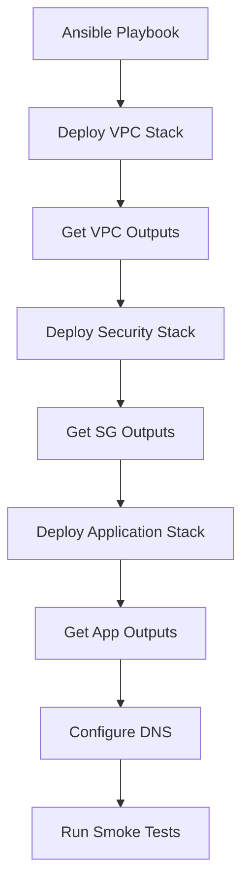

# How to Use Ansible to Manage CloudFormation Stacks

Author: [nawazdhandala](https://www.github.com/nawazdhandala)

Tags: Ansible, AWS, CloudFormation, Infrastructure as Code, DevOps

Description: Learn how to create, update, and manage AWS CloudFormation stacks using Ansible for orchestrated infrastructure deployments.

---

AWS CloudFormation is AWS's native infrastructure-as-code service. It lets you define your AWS resources in JSON or YAML templates and provision them as stacks. While you can manage CloudFormation through the AWS CLI or console, using Ansible adds orchestration capabilities: you can deploy multiple stacks in the right order, pass outputs between them, and integrate stack management into larger deployment workflows.

This guide covers creating, updating, and managing CloudFormation stacks with Ansible, including stack dependencies and output handling.

## Prerequisites

You need:

- Ansible 2.12+ with the `amazon.aws` collection
- Python `boto3` and `botocore` libraries
- AWS credentials configured (environment variables, AWS CLI profile, or IAM role)

```bash
# Install the AWS collection and Python SDK
ansible-galaxy collection install amazon.aws
pip install boto3 botocore
```

## Why Ansible + CloudFormation?

You might wonder why you would use Ansible to manage CloudFormation instead of just using the AWS CLI. Here are the main reasons:

- **Orchestration**: Deploy multiple stacks in sequence, passing outputs from one as parameters to the next.
- **Integration**: Combine CloudFormation deployments with non-AWS tasks (DNS updates, configuration management, notifications).
- **Idempotency**: Ansible handles the create-or-update logic for you.
- **Variable management**: Use Ansible's variable system, Vault encryption, and inventory to manage stack parameters.



## Creating a Basic Stack

The `amazon.aws.cloudformation` module handles stack lifecycle management.

```yaml
# playbooks/deploy-stack.yml
---
- name: Deploy CloudFormation stack
  hosts: localhost
  gather_facts: false

  vars:
    aws_region: us-east-1
    stack_name: my-vpc-stack

  tasks:
    # Deploy a VPC CloudFormation stack
    - name: Create VPC stack
      amazon.aws.cloudformation:
        stack_name: "{{ stack_name }}"
        state: present
        region: "{{ aws_region }}"
        template_body: "{{ lookup('file', '../templates/vpc.yml') }}"
        template_parameters:
          VpcCidr: "10.0.0.0/16"
          Environment: production
          ProjectName: myapp
        tags:
          Environment: production
          ManagedBy: ansible
      register: vpc_stack

    - name: Show stack outputs
      ansible.builtin.debug:
        var: vpc_stack.stack_outputs
```

The CloudFormation template.

```yaml
# templates/vpc.yml
AWSTemplateFormatVersion: '2010-09-09'
Description: VPC with public and private subnets

Parameters:
  VpcCidr:
    Type: String
    Default: '10.0.0.0/16'
  Environment:
    Type: String
    AllowedValues: [production, staging, development]
  ProjectName:
    Type: String

Resources:
  VPC:
    Type: AWS::EC2::VPC
    Properties:
      CidrBlock: !Ref VpcCidr
      EnableDnsSupport: true
      EnableDnsHostnames: true
      Tags:
        - Key: Name
          Value: !Sub '${ProjectName}-${Environment}-vpc'

  PublicSubnet1:
    Type: AWS::EC2::Subnet
    Properties:
      VpcId: !Ref VPC
      CidrBlock: !Select [0, !Cidr [!Ref VpcCidr, 4, 8]]
      AvailabilityZone: !Select [0, !GetAZs '']
      MapPublicIpOnLaunch: true
      Tags:
        - Key: Name
          Value: !Sub '${ProjectName}-${Environment}-public-1'

  PublicSubnet2:
    Type: AWS::EC2::Subnet
    Properties:
      VpcId: !Ref VPC
      CidrBlock: !Select [1, !Cidr [!Ref VpcCidr, 4, 8]]
      AvailabilityZone: !Select [1, !GetAZs '']
      MapPublicIpOnLaunch: true
      Tags:
        - Key: Name
          Value: !Sub '${ProjectName}-${Environment}-public-2'

  PrivateSubnet1:
    Type: AWS::EC2::Subnet
    Properties:
      VpcId: !Ref VPC
      CidrBlock: !Select [2, !Cidr [!Ref VpcCidr, 4, 8]]
      AvailabilityZone: !Select [0, !GetAZs '']
      Tags:
        - Key: Name
          Value: !Sub '${ProjectName}-${Environment}-private-1'

  InternetGateway:
    Type: AWS::EC2::InternetGateway

  AttachGateway:
    Type: AWS::EC2::VPCGatewayAttachment
    Properties:
      VpcId: !Ref VPC
      InternetGatewayId: !Ref InternetGateway

Outputs:
  VpcId:
    Value: !Ref VPC
    Export:
      Name: !Sub '${AWS::StackName}-VpcId'
  PublicSubnet1Id:
    Value: !Ref PublicSubnet1
    Export:
      Name: !Sub '${AWS::StackName}-PublicSubnet1Id'
  PublicSubnet2Id:
    Value: !Ref PublicSubnet2
    Export:
      Name: !Sub '${AWS::StackName}-PublicSubnet2Id'
  PrivateSubnet1Id:
    Value: !Ref PrivateSubnet1
    Export:
      Name: !Sub '${AWS::StackName}-PrivateSubnet1Id'
```

## Chaining Stacks with Outputs

The real power comes from deploying dependent stacks and passing outputs between them.

```yaml
# playbooks/deploy-full-infrastructure.yml
---
- name: Deploy complete infrastructure via CloudFormation
  hosts: localhost
  gather_facts: false

  vars:
    aws_region: us-east-1
    environment: production
    project: myapp

  tasks:
    # Step 1: Deploy the VPC stack
    - name: Deploy VPC stack
      amazon.aws.cloudformation:
        stack_name: "{{ project }}-{{ environment }}-vpc"
        state: present
        region: "{{ aws_region }}"
        template_body: "{{ lookup('file', '../templates/vpc.yml') }}"
        template_parameters:
          VpcCidr: "10.0.0.0/16"
          Environment: "{{ environment }}"
          ProjectName: "{{ project }}"
        tags:
          Environment: "{{ environment }}"
      register: vpc_stack

    # Step 2: Deploy security groups using VPC outputs
    - name: Deploy security group stack
      amazon.aws.cloudformation:
        stack_name: "{{ project }}-{{ environment }}-security"
        state: present
        region: "{{ aws_region }}"
        template_body: "{{ lookup('file', '../templates/security-groups.yml') }}"
        template_parameters:
          VpcId: "{{ vpc_stack.stack_outputs.VpcId }}"
          Environment: "{{ environment }}"
        tags:
          Environment: "{{ environment }}"
      register: security_stack

    # Step 3: Deploy the application stack
    - name: Deploy application stack
      amazon.aws.cloudformation:
        stack_name: "{{ project }}-{{ environment }}-app"
        state: present
        region: "{{ aws_region }}"
        template_body: "{{ lookup('file', '../templates/application.yml') }}"
        template_parameters:
          VpcId: "{{ vpc_stack.stack_outputs.VpcId }}"
          PublicSubnet1: "{{ vpc_stack.stack_outputs.PublicSubnet1Id }}"
          PublicSubnet2: "{{ vpc_stack.stack_outputs.PublicSubnet2Id }}"
          WebSgId: "{{ security_stack.stack_outputs.WebSecurityGroupId }}"
          AppSgId: "{{ security_stack.stack_outputs.AppSecurityGroupId }}"
          Environment: "{{ environment }}"
          InstanceType: t3.medium
          KeyName: deploy-key
        tags:
          Environment: "{{ environment }}"
      register: app_stack

    # Step 4: Display all important outputs
    - name: Show deployment summary
      ansible.builtin.debug:
        msg: |
          VPC ID: {{ vpc_stack.stack_outputs.VpcId }}
          ALB DNS: {{ app_stack.stack_outputs.AlbDnsName | default('N/A') }}
          App URL: {{ app_stack.stack_outputs.AppUrl | default('N/A') }}
```

## Using CloudFormation with S3 Templates

For large templates, upload them to S3 first.

```yaml
# playbooks/deploy-from-s3.yml
---
- name: Deploy stack from S3 template
  hosts: localhost
  gather_facts: false

  vars:
    aws_region: us-east-1
    template_bucket: my-cfn-templates
    template_key: "production/app-stack-v2.yml"

  tasks:
    # Upload template to S3 first
    - name: Upload template to S3
      amazon.aws.s3_object:
        bucket: "{{ template_bucket }}"
        object: "{{ template_key }}"
        src: "../templates/application.yml"
        mode: put
        region: "{{ aws_region }}"

    # Deploy using the S3 URL
    - name: Deploy stack from S3
      amazon.aws.cloudformation:
        stack_name: myapp-production-app
        state: present
        region: "{{ aws_region }}"
        template_url: "https://{{ template_bucket }}.s3.amazonaws.com/{{ template_key }}"
        template_parameters:
          Environment: production
        capabilities:
          - CAPABILITY_IAM
          - CAPABILITY_NAMED_IAM
        tags:
          Environment: production
```

## Stack Updates and Change Sets

For production stacks, use change sets to preview changes before applying them.

```yaml
# playbooks/update-with-changeset.yml
---
- name: Update stack with change set review
  hosts: localhost
  gather_facts: false

  vars:
    aws_region: us-east-1
    stack_name: myapp-production-app

  tasks:
    # Create a change set without executing it
    - name: Create change set
      amazon.aws.cloudformation:
        stack_name: "{{ stack_name }}"
        state: present
        region: "{{ aws_region }}"
        template_body: "{{ lookup('file', '../templates/application.yml') }}"
        template_parameters:
          Environment: production
          InstanceType: t3.large
        create_changeset: true
        changeset_name: "update-instance-type"
        tags:
          Environment: production
      register: changeset

    - name: Show change set details
      ansible.builtin.debug:
        var: changeset

    # In a real workflow, you would review the changes
    # and then apply them in a separate step
```

## Stack Deletion

Clean up stacks when environments are no longer needed. Delete in reverse dependency order.

```yaml
# playbooks/teardown-stacks.yml
---
- name: Tear down CloudFormation stacks
  hosts: localhost
  gather_facts: false

  vars:
    aws_region: us-east-1
    environment: staging
    project: myapp

  tasks:
    # Delete in reverse order of creation
    - name: Delete application stack
      amazon.aws.cloudformation:
        stack_name: "{{ project }}-{{ environment }}-app"
        state: absent
        region: "{{ aws_region }}"

    - name: Delete security stack
      amazon.aws.cloudformation:
        stack_name: "{{ project }}-{{ environment }}-security"
        state: absent
        region: "{{ aws_region }}"

    - name: Delete VPC stack
      amazon.aws.cloudformation:
        stack_name: "{{ project }}-{{ environment }}-vpc"
        state: absent
        region: "{{ aws_region }}"
```

## Monitoring Stack Events

Check stack status and events for troubleshooting.

```yaml
# playbooks/check-stack-status.yml
---
- name: Check CloudFormation stack status
  hosts: localhost
  gather_facts: false

  vars:
    aws_region: us-east-1

  tasks:
    # Get information about a stack
    - name: Get stack info
      amazon.aws.cloudformation_info:
        stack_name: myapp-production-vpc
        region: "{{ aws_region }}"
        stack_events: true
      register: stack_info

    - name: Show stack status
      ansible.builtin.debug:
        msg: |
          Stack: {{ stack_info.cloudformation.keys() | first }}
          Status: {{ stack_info.cloudformation['myapp-production-vpc'].stack_description.stack_status }}

    # Fail the playbook if stack is in a bad state
    - name: Assert stack is healthy
      ansible.builtin.assert:
        that:
          - "'FAILED' not in stack_info.cloudformation['myapp-production-vpc'].stack_description.stack_status"
          - "'ROLLBACK' not in stack_info.cloudformation['myapp-production-vpc'].stack_description.stack_status"
        fail_msg: "Stack is in an unhealthy state!"
```

## Practical Tips

1. **Always add `CAPABILITY_IAM`** when your templates create IAM resources. Without it, the stack creation will fail with a vague error.
2. **Use change sets for production updates.** Blindly updating a production stack can cause resource replacement you did not expect. Change sets show you exactly what will happen.
3. **Delete stacks in reverse dependency order.** CloudFormation will refuse to delete a stack if another stack's export references it.
4. **Template size limits exist.** Templates sent in the request body cannot exceed 51,200 bytes. For larger templates, upload to S3 first and use `template_url`.
5. **Stack outputs are your API.** Think of CloudFormation outputs as the public interface of your stack. Other stacks and Ansible playbooks should only reference outputs, never hardcode resource IDs.
6. **Tag everything.** Stack-level tags propagate to most resources created by the stack. This is essential for cost tracking and resource identification.

Using Ansible to orchestrate CloudFormation gives you the best of both worlds: AWS-native resource management with the flexibility of Ansible's orchestration and integration capabilities.
