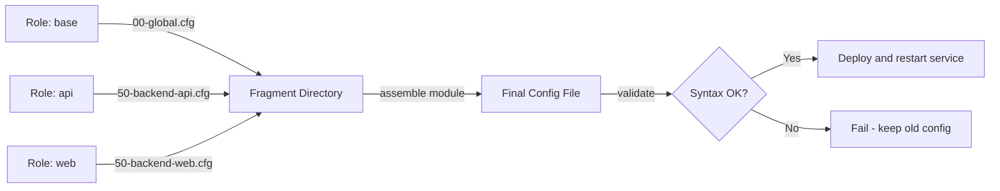

# How to Use Ansible to Manage Configuration File Fragments

Author: [nawazdhandala](https://www.github.com/nawazdhandala)

Tags: Ansible, Configuration Management, DevOps, Linux

Description: Learn how to manage configuration file fragments with Ansible using assemble, template, and drop-in directory patterns.

---

Many Linux services support a "drop-in" configuration model where you split configuration across multiple files in a `.d` directory. Think `/etc/sudoers.d/`, `/etc/cron.d/`, `/etc/nginx/conf.d/`, or `/etc/sysctl.d/`. This pattern plays nicely with automation because different roles or teams can manage their own fragment without stomping on each other. Ansible has built-in support for this workflow, and this post shows you how to use it effectively.

## Why Configuration Fragments Matter

When a single monolithic config file is managed by Ansible, any role that needs to modify it has to own the entire file. This causes collisions: Role A overwrites what Role B just wrote. Fragments solve this by letting each role drop its own file into a directory, and the service reads all of them.

Some services natively support fragment directories. Others need you to assemble fragments into a single file. Ansible handles both cases.

## The assemble Module

The `assemble` module takes all files from a source directory and concatenates them into a single destination file. This is perfect for services that expect one config file but you want to manage it in pieces.

Here is an example that builds an HAProxy configuration from fragments:

```yaml
# Create a directory to hold HAProxy config fragments
- name: Create HAProxy config fragments directory
  ansible.builtin.file:
    path: /etc/haproxy/conf.d
    state: directory
    owner: root
    group: root
    mode: '0755'

# Drop the global section as fragment 00
- name: Deploy HAProxy global config
  ansible.builtin.copy:
    content: |
      global
          log /dev/log local0
          maxconn 4096
          user haproxy
          group haproxy
          daemon
    dest: /etc/haproxy/conf.d/00-global.cfg
    mode: '0644'

# Drop the defaults section as fragment 10
- name: Deploy HAProxy defaults config
  ansible.builtin.copy:
    content: |
      defaults
          log     global
          mode    http
          option  httplog
          timeout connect 5s
          timeout client  30s
          timeout server  30s
    dest: /etc/haproxy/conf.d/10-defaults.cfg
    mode: '0644'

# Assemble all fragments into the final haproxy.cfg
- name: Assemble HAProxy configuration
  ansible.builtin.assemble:
    src: /etc/haproxy/conf.d
    dest: /etc/haproxy/haproxy.cfg
    owner: root
    group: root
    mode: '0644'
    validate: '/usr/sbin/haproxy -c -f %s'
  notify: restart haproxy
```

The numeric prefixes (`00-`, `10-`) control the order. The `assemble` module sorts files alphabetically before concatenating. The `validate` parameter runs a syntax check before replacing the live config, which is critical for services like HAProxy that will refuse to start with a bad config.

## Adding Backend Fragments from Different Roles

The real power shows up when multiple roles contribute fragments independently. Imagine a role for your API servers and another for your static file servers, each dropping their own backend definition:

```yaml
# In the api_servers role
- name: Deploy API backend fragment
  ansible.builtin.template:
    src: haproxy_backend.cfg.j2
    dest: /etc/haproxy/conf.d/50-backend-api.cfg
    mode: '0644'
  notify: assemble haproxy config

# In the static_servers role
- name: Deploy static backend fragment
  ansible.builtin.template:
    src: haproxy_backend_static.cfg.j2
    dest: /etc/haproxy/conf.d/50-backend-static.cfg
    mode: '0644'
  notify: assemble haproxy config
```

Both roles trigger the same handler:

```yaml
# handlers/main.yml
- name: assemble haproxy config
  ansible.builtin.assemble:
    src: /etc/haproxy/conf.d
    dest: /etc/haproxy/haproxy.cfg
    validate: '/usr/sbin/haproxy -c -f %s'
  notify: restart haproxy

- name: restart haproxy
  ansible.builtin.service:
    name: haproxy
    state: restarted
```

## Fragment Numbering Conventions

A consistent numbering scheme prevents headaches as your config grows. Here is a convention that works well:

```
00-09: Global settings
10-19: Defaults
20-29: Frontend definitions
30-39: Middleware / ACLs
40-49: Backend definitions (infrastructure)
50-59: Backend definitions (applications)
90-99: Overrides and local customizations
```

Leave gaps between numbers so you can insert new fragments without renaming existing ones.

## Managing Nginx Server Blocks as Fragments

Nginx natively supports an include directive, so you can skip the `assemble` step entirely and just manage individual files in `conf.d` or `sites-available`:

```yaml
# Deploy an Nginx server block from a template
- name: Deploy Nginx site config for myapp
  ansible.builtin.template:
    src: nginx_site.conf.j2
    dest: /etc/nginx/sites-available/myapp.conf
    owner: root
    group: root
    mode: '0644'
  notify: reload nginx

# Enable the site by creating a symlink
- name: Enable myapp site
  ansible.builtin.file:
    src: /etc/nginx/sites-available/myapp.conf
    dest: /etc/nginx/sites-enabled/myapp.conf
    state: link
  notify: reload nginx
```

The template might look like:

```jinja2
{# templates/nginx_site.conf.j2 #}
server {
    listen {{ nginx_listen_port | default(80) }};
    server_name {{ server_name }};

    root {{ document_root }};
    index index.html;

    access_log /var/log/nginx/{{ server_name }}.access.log;
    error_log /var/log/nginx/{{ server_name }}.error.log;


    location {{ location.path }} {
        {{ location.directives | indent(8) }}
    }

}
```

## Cleaning Up Stale Fragments

One gotcha with fragment directories is that removed roles leave behind orphaned config files. The `assemble` module does not clean up files that should no longer be there. You need to handle this explicitly.

```yaml
# List all expected fragments
- name: Set list of expected config fragments
  ansible.builtin.set_fact:
    expected_fragments:
      - 00-global.cfg
      - 10-defaults.cfg
      - 20-frontend-http.cfg
      - 50-backend-api.cfg

# Find actual fragments on disk
- name: Find existing config fragments
  ansible.builtin.find:
    paths: /etc/haproxy/conf.d
    patterns: '*.cfg'
  register: existing_fragments

# Remove fragments that are not in the expected list
- name: Remove stale config fragments
  ansible.builtin.file:
    path: "{{ item.path }}"
    state: absent
  loop: "{{ existing_fragments.files }}"
  when: item.path | basename not in expected_fragments
  loop_control:
    label: "{{ item.path | basename }}"
  notify: assemble haproxy config
```

## Using blockinfile as an Alternative

For services that do not support fragment directories, `blockinfile` lets you manage a specific section within a larger config file. Each block is wrapped in markers so Ansible can find and update it.

```yaml
# Add a managed block to sshd_config for a specific team
- name: Add SFTP config block for data team
  ansible.builtin.blockinfile:
    path: /etc/ssh/sshd_config
    marker: "# {mark} ANSIBLE MANAGED - data team sftp"
    insertafter: EOF
    block: |
      Match Group datateam
          ChrootDirectory /data/sftp/%u
          ForceCommand internal-sftp
          AllowTcpForwarding no
          X11Forwarding no
  notify: restart sshd
```

Multiple roles can each insert their own block with different markers, and they will not conflict.

## The Fragment Workflow

Here is a visual overview of the fragment management approach:



## Best Practices

Keep these in mind when working with fragments:

1. Always use a numeric prefix for ordering. Alphabetical ordering without numbers leads to surprises.
2. Use the `validate` parameter whenever the service provides a config check command.
3. Clean up stale fragments explicitly. Ansible will not do it for you.
4. Set `backup: yes` on the assembled file so you can roll back quickly.
5. Use handlers to batch the assemble step. If three roles each update a fragment, you only want to assemble and restart once at the end.

Configuration fragments are a pattern that scales well. Once you get the numbering convention down and build the assemble step into your handlers, adding new services or backends becomes a matter of dropping one more template into the right directory.
