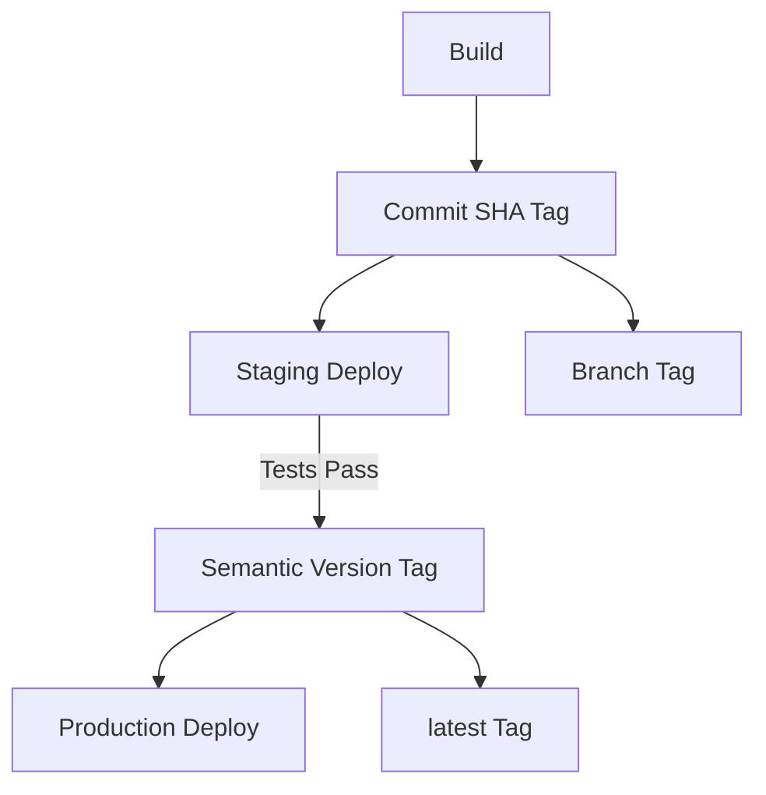

# How to Use Ansible to Manage Container Image Tags

Author: [nawazdhandala](https://www.github.com/nawazdhandala)

Tags: Ansible, Docker, Container Images, Tags, DevOps

Description: Manage Docker container image tagging strategies with Ansible including semantic versioning, git-based tags, and promotion workflows.

---

Container image tags determine which version of your application runs in each environment. A good tagging strategy ensures you can identify exactly what is deployed, roll back to previous versions, and promote images from staging to production. Ansible can automate image tagging, retagging, and cleanup as part of your deployment workflow.

## Tagging Strategies



## Automated Tagging

```yaml
# roles/image_tags/tasks/tag.yml
# Apply multiple tags to a container image
- name: Get git commit SHA
  ansible.builtin.command: git rev-parse --short HEAD
  register: git_sha
  changed_when: false
  delegate_to: localhost

- name: Get git branch name
  ansible.builtin.command: git rev-parse --abbrev-ref HEAD
  register: git_branch
  changed_when: false
  delegate_to: localhost

- name: Build image with multiple tags
  community.docker.docker_image:
    name: "{{ registry }}/{{ image_name }}"
    tag: "{{ item }}"
    source: build
    build:
      path: "{{ build_context }}"
    push: true
  loop:
    - "{{ app_version }}"
    - "{{ git_sha.stdout }}"
    - "{{ git_branch.stdout | replace('/', '-') }}"
    - "build-{{ ansible_date_time.epoch }}"
  loop_control:
    label: "{{ item }}"
```

## Image Promotion

```yaml
# roles/image_tags/tasks/promote.yml
# Promote an image from staging to production tag
- name: Pull staging image
  community.docker.docker_image:
    name: "{{ registry }}/{{ image_name }}"
    tag: "staging-{{ promote_version }}"
    source: pull

- name: Retag for production
  community.docker.docker_image:
    name: "{{ registry }}/{{ image_name }}"
    tag: "staging-{{ promote_version }}"
    repository: "{{ registry }}/{{ image_name }}"
    push: true
    source: local
  loop:
    - "production-{{ promote_version }}"
    - "{{ promote_version }}"
    - "latest"
```

## Tag Cleanup

```yaml
# roles/image_tags/tasks/cleanup.yml
# Remove old image tags from registry and local storage
- name: List local images
  community.docker.docker_image_info:
    name: "{{ registry }}/{{ image_name }}"
  register: local_images

- name: Remove old local images
  community.docker.docker_image:
    name: "{{ item.RepoTags[0].split(':')[0] }}"
    tag: "{{ item.RepoTags[0].split(':')[1] }}"
    state: absent
  loop: "{{ local_images.images }}"
  when:
    - item.RepoTags | length > 0
    - item.RepoTags[0].split(':')[1] not in protected_tags
  loop_control:
    label: "{{ item.RepoTags | default(['untagged']) }}"
```


## Common Use Cases

Here are several practical scenarios where this module proves essential in real-world playbooks.

### Infrastructure Provisioning Workflow

```yaml
# Complete workflow incorporating this module
- name: Infrastructure provisioning
  hosts: all
  become: true
  gather_facts: true
  tasks:
    - name: Gather system information
      ansible.builtin.setup:
        gather_subset:
          - hardware
          - network

    - name: Display system summary
      ansible.builtin.debug:
        msg: >-
          Host {{ inventory_hostname }} has
          {{ ansible_memtotal_mb }}MB RAM,
          {{ ansible_processor_vcpus }} vCPUs,
          running {{ ansible_distribution }} {{ ansible_distribution_version }}

    - name: Install required packages
      ansible.builtin.package:
        name:
          - curl
          - wget
          - git
          - vim
          - htop
          - jq
        state: present

    - name: Configure system timezone
      ansible.builtin.timezone:
        name: "{{ system_timezone | default('UTC') }}"

    - name: Configure hostname
      ansible.builtin.hostname:
        name: "{{ inventory_hostname }}"

    - name: Update /etc/hosts
      ansible.builtin.lineinfile:
        path: /etc/hosts
        regexp: '^127\.0\.1\.1'
        line: "127.0.1.1 {{ inventory_hostname }}"

    - name: Configure SSH hardening
      ansible.builtin.lineinfile:
        path: /etc/ssh/sshd_config
        regexp: "{{ item.regexp }}"
        line: "{{ item.line }}"
      loop:
        - { regexp: '^PermitRootLogin', line: 'PermitRootLogin no' }
        - { regexp: '^PasswordAuthentication', line: 'PasswordAuthentication no' }
      notify: restart sshd

    - name: Configure firewall rules
      community.general.ufw:
        rule: allow
        port: "{{ item }}"
        proto: tcp
      loop:
        - "22"
        - "80"
        - "443"

    - name: Enable firewall
      community.general.ufw:
        state: enabled
        policy: deny

  handlers:
    - name: restart sshd
      ansible.builtin.service:
        name: sshd
        state: restarted
```

### Integration with Monitoring

```yaml
# Using gathered facts to configure monitoring thresholds
- name: Configure monitoring based on system specs
  hosts: all
  become: true
  tasks:
    - name: Set monitoring thresholds based on hardware
      ansible.builtin.template:
        src: monitoring_config.yml.j2
        dest: /etc/monitoring/config.yml
      vars:
        memory_warning_threshold: "{{ (ansible_memtotal_mb * 0.8) | int }}"
        memory_critical_threshold: "{{ (ansible_memtotal_mb * 0.95) | int }}"
        cpu_warning_threshold: 80
        cpu_critical_threshold: 95

    - name: Register host with monitoring system
      ansible.builtin.uri:
        url: "https://monitoring.example.com/api/hosts"
        method: POST
        body_format: json
        body:
          hostname: "{{ inventory_hostname }}"
          ip_address: "{{ ansible_default_ipv4.address }}"
          os: "{{ ansible_distribution }}"
          memory_mb: "{{ ansible_memtotal_mb }}"
          cpus: "{{ ansible_processor_vcpus }}"
        headers:
          Authorization: "Bearer {{ monitoring_api_token }}"
        status_code: [200, 201, 409]
```

### Error Handling Patterns

```yaml
# Robust error handling with this module
- name: Robust task execution
  hosts: all
  tasks:
    - name: Attempt primary operation
      ansible.builtin.command: /opt/app/primary-task.sh
      register: primary_result
      failed_when: false

    - name: Handle primary failure with fallback
      ansible.builtin.command: /opt/app/fallback-task.sh
      when: primary_result.rc != 0
      register: fallback_result

    - name: Report final status
      ansible.builtin.debug:
        msg: >-
          Task completed via {{ 'primary' if primary_result.rc == 0 else 'fallback' }} path.
          Return code: {{ primary_result.rc if primary_result.rc == 0 else fallback_result.rc }}

    - name: Fail if both paths failed
      ansible.builtin.fail:
        msg: "Both primary and fallback operations failed"
      when:
        - primary_result.rc != 0
        - fallback_result is defined
        - fallback_result.rc != 0
```

### Scheduling and Automation

```yaml
# Set up scheduled compliance scans using cron
- name: Configure automated scans
  hosts: all
  become: true
  tasks:
    - name: Create scan script
      ansible.builtin.copy:
        dest: /opt/scripts/compliance_scan.sh
        mode: '0755'
        content: |
          #!/bin/bash
          cd /opt/ansible
          ansible-playbook playbooks/validate.yml -i inventory/ > /var/log/compliance_scan.log 2>&1
          EXIT_CODE=$?
          if [ $EXIT_CODE -ne 0 ]; then
            curl -X POST https://hooks.example.com/alert \
              -H "Content-Type: application/json" \
              -d "{\"text\":\"Compliance scan failed on $(hostname)\"}"
          fi
          exit $EXIT_CODE

    - name: Schedule weekly compliance scan
      ansible.builtin.cron:
        name: "Weekly compliance scan"
        minute: "0"
        hour: "3"
        weekday: "1"
        job: "/opt/scripts/compliance_scan.sh"
        user: ansible
```


## Conclusion

A consistent image tagging strategy managed by Ansible ensures you always know what is deployed where. Tag with git SHAs for traceability, semantic versions for releases, and environment labels for promotion workflows. Automate the tagging, promotion, and cleanup with Ansible playbooks so the process is repeatable and auditable.
