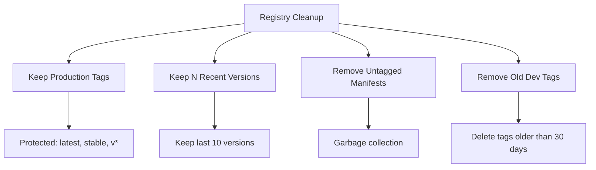

# How to Use Ansible to Manage Container Registry Cleanup

Author: [nawazdhandala](https://www.github.com/nawazdhandala)

Tags: Ansible, Docker, Container Registry, Cleanup, DevOps

Description: Automate container registry cleanup with Ansible to remove old images, enforce retention policies, and reclaim storage space.

---

Container registries accumulate images over time. Without cleanup, storage costs grow and registry performance degrades. Ansible can enforce retention policies that keep the images you need and remove everything else automatically.

## Registry Cleanup Strategy



## Docker Hub Cleanup

```yaml
# roles/registry_cleanup/tasks/dockerhub.yml
# Clean up old images from Docker Hub
- name: Get repository tags
  ansible.builtin.uri:
    url: "https://hub.docker.com/v2/repositories/{{ dockerhub_user }}/{{ repo_name }}/tags?page_size=100"
    headers:
      Authorization: "Bearer {{ dockerhub_token }}"
  register: tags_response

- name: Identify tags to delete
  ansible.builtin.set_fact:
    tags_to_delete: >-
      {{ tags_response.json.results
         | rejectattr('name', 'in', protected_tags)
         | sort(attribute='last_updated')
         | list
         | slice(0, -keep_count)
         | list }}

- name: Delete old tags
  ansible.builtin.uri:
    url: "https://hub.docker.com/v2/repositories/{{ dockerhub_user }}/{{ repo_name }}/tags/{{ item.name }}/"
    method: DELETE
    headers:
      Authorization: "Bearer {{ dockerhub_token }}"
    status_code: [204, 404]
  loop: "{{ tags_to_delete }}"
  loop_control:
    label: "{{ item.name }}"
```

## AWS ECR Cleanup

```yaml
# roles/registry_cleanup/tasks/ecr.yml
# Clean up old images from AWS ECR
- name: Get ECR images
  ansible.builtin.command:
    cmd: >
      aws ecr describe-images
      --repository-name {{ repo_name }}
      --region {{ aws_region }}
      --query 'imageDetails[?imagePushedAt<`{{ cutoff_date }}`].imageDigest'
      --output json
  register: old_images
  changed_when: false

- name: Delete old ECR images
  ansible.builtin.command:
    cmd: >
      aws ecr batch-delete-image
      --repository-name {{ repo_name }}
      --region {{ aws_region }}
      --image-ids '{{ old_images.stdout }}'
  when: (old_images.stdout | from_json | length) > 0
  changed_when: true

- name: Apply lifecycle policy
  ansible.builtin.command:
    cmd: >
      aws ecr put-lifecycle-policy
      --repository-name {{ repo_name }}
      --region {{ aws_region }}
      --lifecycle-policy-text '{{ ecr_lifecycle_policy | to_json }}'
  changed_when: true
```

```yaml
# defaults/main.yml
ecr_lifecycle_policy:
  rules:
    - rulePriority: 1
      description: "Keep last 20 tagged images"
      selection:
        tagStatus: tagged
        tagPrefixList: ["v"]
        countType: imageCountMoreThan
        countNumber: 20
      action:
        type: expire
    - rulePriority: 2
      description: "Remove untagged images after 7 days"
      selection:
        tagStatus: untagged
        countType: sinceImagePushed
        countUnit: days
        countNumber: 7
      action:
        type: expire
```

## Private Registry Garbage Collection

```yaml
# roles/registry_cleanup/tasks/private.yml
# Run garbage collection on private Docker registry
- name: Run registry garbage collection
  ansible.builtin.command:
    cmd: >
      docker exec registry bin/registry
      garbage-collect /etc/docker/registry/config.yml
      --delete-untagged
  changed_when: true
  when: registry_type == 'distribution'
```

## Scheduled Cleanup

```yaml
# playbooks/scheduled_cleanup.yml
# Run registry cleanup on schedule
- name: Registry cleanup
  hosts: localhost
  connection: local
  tasks:
    - name: Clean Docker Hub repositories
      ansible.builtin.include_role:
        name: registry_cleanup
        tasks_from: dockerhub
      loop: "{{ dockerhub_repos }}"
      vars:
        repo_name: "{{ item }}"

    - name: Clean ECR repositories
      ansible.builtin.include_role:
        name: registry_cleanup
        tasks_from: ecr
      loop: "{{ ecr_repos }}"
      vars:
        repo_name: "{{ item }}"
```


## Common Use Cases

Here are several practical scenarios where this module proves essential in real-world playbooks.

### Infrastructure Provisioning Workflow

```yaml
# Complete workflow incorporating this module
- name: Infrastructure provisioning
  hosts: all
  become: true
  gather_facts: true
  tasks:
    - name: Gather system information
      ansible.builtin.setup:
        gather_subset:
          - hardware
          - network

    - name: Display system summary
      ansible.builtin.debug:
        msg: >-
          Host {{ inventory_hostname }} has
          {{ ansible_memtotal_mb }}MB RAM,
          {{ ansible_processor_vcpus }} vCPUs,
          running {{ ansible_distribution }} {{ ansible_distribution_version }}

    - name: Install required packages
      ansible.builtin.package:
        name:
          - curl
          - wget
          - git
          - vim
          - htop
          - jq
        state: present

    - name: Configure system timezone
      ansible.builtin.timezone:
        name: "{{ system_timezone | default('UTC') }}"

    - name: Configure hostname
      ansible.builtin.hostname:
        name: "{{ inventory_hostname }}"

    - name: Update /etc/hosts
      ansible.builtin.lineinfile:
        path: /etc/hosts
        regexp: '^127\.0\.1\.1'
        line: "127.0.1.1 {{ inventory_hostname }}"

    - name: Configure SSH hardening
      ansible.builtin.lineinfile:
        path: /etc/ssh/sshd_config
        regexp: "{{ item.regexp }}"
        line: "{{ item.line }}"
      loop:
        - { regexp: '^PermitRootLogin', line: 'PermitRootLogin no' }
        - { regexp: '^PasswordAuthentication', line: 'PasswordAuthentication no' }
      notify: restart sshd

    - name: Configure firewall rules
      community.general.ufw:
        rule: allow
        port: "{{ item }}"
        proto: tcp
      loop:
        - "22"
        - "80"
        - "443"

    - name: Enable firewall
      community.general.ufw:
        state: enabled
        policy: deny

  handlers:
    - name: restart sshd
      ansible.builtin.service:
        name: sshd
        state: restarted
```

### Integration with Monitoring

```yaml
# Using gathered facts to configure monitoring thresholds
- name: Configure monitoring based on system specs
  hosts: all
  become: true
  tasks:
    - name: Set monitoring thresholds based on hardware
      ansible.builtin.template:
        src: monitoring_config.yml.j2
        dest: /etc/monitoring/config.yml
      vars:
        memory_warning_threshold: "{{ (ansible_memtotal_mb * 0.8) | int }}"
        memory_critical_threshold: "{{ (ansible_memtotal_mb * 0.95) | int }}"
        cpu_warning_threshold: 80
        cpu_critical_threshold: 95

    - name: Register host with monitoring system
      ansible.builtin.uri:
        url: "https://monitoring.example.com/api/hosts"
        method: POST
        body_format: json
        body:
          hostname: "{{ inventory_hostname }}"
          ip_address: "{{ ansible_default_ipv4.address }}"
          os: "{{ ansible_distribution }}"
          memory_mb: "{{ ansible_memtotal_mb }}"
          cpus: "{{ ansible_processor_vcpus }}"
        headers:
          Authorization: "Bearer {{ monitoring_api_token }}"
        status_code: [200, 201, 409]
```

### Error Handling Patterns

```yaml
# Robust error handling with this module
- name: Robust task execution
  hosts: all
  tasks:
    - name: Attempt primary operation
      ansible.builtin.command: /opt/app/primary-task.sh
      register: primary_result
      failed_when: false

    - name: Handle primary failure with fallback
      ansible.builtin.command: /opt/app/fallback-task.sh
      when: primary_result.rc != 0
      register: fallback_result

    - name: Report final status
      ansible.builtin.debug:
        msg: >-
          Task completed via {{ 'primary' if primary_result.rc == 0 else 'fallback' }} path.
          Return code: {{ primary_result.rc if primary_result.rc == 0 else fallback_result.rc }}

    - name: Fail if both paths failed
      ansible.builtin.fail:
        msg: "Both primary and fallback operations failed"
      when:
        - primary_result.rc != 0
        - fallback_result is defined
        - fallback_result.rc != 0
```

### Scheduling and Automation

```yaml
# Set up scheduled compliance scans using cron
- name: Configure automated scans
  hosts: all
  become: true
  tasks:
    - name: Create scan script
      ansible.builtin.copy:
        dest: /opt/scripts/compliance_scan.sh
        mode: '0755'
        content: |
          #!/bin/bash
          cd /opt/ansible
          ansible-playbook playbooks/validate.yml -i inventory/ > /var/log/compliance_scan.log 2>&1
          EXIT_CODE=$?
          if [ $EXIT_CODE -ne 0 ]; then
            curl -X POST https://hooks.example.com/alert \
              -H "Content-Type: application/json" \
              -d "{\"text\":\"Compliance scan failed on $(hostname)\"}"
          fi
          exit $EXIT_CODE

    - name: Schedule weekly compliance scan
      ansible.builtin.cron:
        name: "Weekly compliance scan"
        minute: "0"
        hour: "3"
        weekday: "1"
        job: "/opt/scripts/compliance_scan.sh"
        user: ansible
```


## Conclusion

Registry cleanup is housekeeping that pays for itself through reduced storage costs and faster image pulls. Ansible automates retention policies across Docker Hub, AWS ECR, and private registries. Set it up as a scheduled job and forget about it. Your registries will stay lean and your storage bills will stay manageable.
