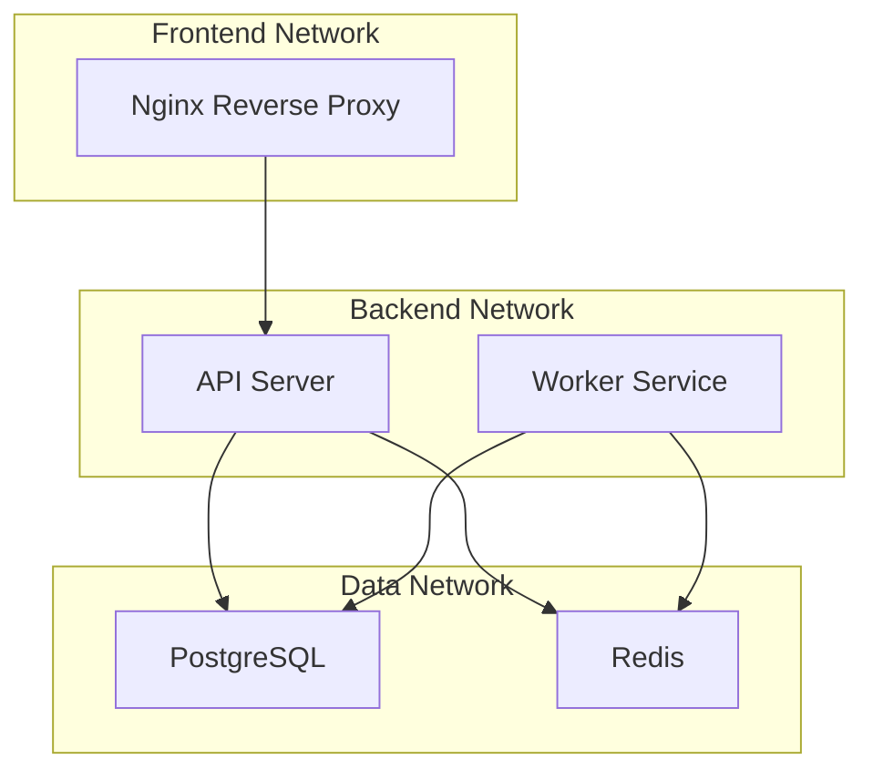

# How to Use Ansible to Manage Docker Networks

Author: [nawazdhandala](https://www.github.com/nawazdhandala)

Tags: Ansible, Docker, Docker Networks, Container Networking, DevOps

Description: Practical guide to creating and managing Docker networks with Ansible, covering bridge, overlay, and macvlan networks with real-world examples.

---

Docker networking is what allows containers to communicate with each other and with the outside world. By default, Docker creates a bridge network that all containers can connect to, but in any real application you want custom networks that isolate services, control traffic flow, and provide service discovery. Ansible's `docker_network` module makes managing Docker networks straightforward and repeatable.

## Docker Network Types

Before we jump into Ansible playbooks, let us understand the available network drivers:

- **bridge**: The default. Creates an isolated network on a single host. Containers on the same bridge network can communicate.
- **host**: Removes network isolation. The container shares the host's network stack. Useful for performance-sensitive applications.
- **overlay**: Spans multiple Docker hosts. Used with Docker Swarm for multi-host networking.
- **macvlan**: Assigns a MAC address to the container, making it appear as a physical device on the network.
- **none**: No networking. The container is completely isolated.

## Prerequisites

```bash
# Install the community.docker collection
ansible-galaxy collection install community.docker

# Install the Docker Python SDK
pip install docker
```

## Creating a Basic Bridge Network

The most common use case is creating custom bridge networks to isolate groups of containers.

```yaml
# create-bridge-network.yml - Create a custom Docker bridge network
---
- name: Create Docker Bridge Network
  hosts: docker_hosts
  become: true

  tasks:
    - name: Create the application network
      community.docker.docker_network:
        name: app-network
        driver: bridge
        state: present
      register: network

    - name: Show network details
      ansible.builtin.debug:
        msg: |
          Network: {{ network.network.Name }}
          Driver: {{ network.network.Driver }}
          Subnet: {{ network.network.IPAM.Config[0].Subnet }}
          Gateway: {{ network.network.IPAM.Config[0].Gateway }}
```

## Network with Custom IPAM

When you need control over IP address assignment, specify custom IPAM (IP Address Management) configuration.

```yaml
# custom-ipam-network.yml - Network with specific subnet configuration
---
- name: Create Network with Custom IPAM
  hosts: docker_hosts
  become: true

  tasks:
    - name: Create network with specific subnet
      community.docker.docker_network:
        name: backend-network
        driver: bridge
        ipam_config:
          - subnet: "172.20.0.0/16"
            gateway: "172.20.0.1"
            iprange: "172.20.1.0/24"
        state: present
      register: backend_net

    - name: Create a second network for the frontend
      community.docker.docker_network:
        name: frontend-network
        driver: bridge
        ipam_config:
          - subnet: "172.21.0.0/16"
            gateway: "172.21.0.1"
        state: present
      register: frontend_net

    - name: Show both networks
      ansible.builtin.debug:
        msg: |
          Backend: {{ backend_net.network.Name }} (172.20.0.0/16)
          Frontend: {{ frontend_net.network.Name }} (172.21.0.0/16)
```

## Network Architecture for a Typical Application



## Isolating Services with Multiple Networks

In production, you typically want different services on different networks. The web server talks to the API, but it should not be able to talk directly to the database.

```yaml
# multi-network-setup.yml - Isolate services with separate networks
---
- name: Multi-Network Application Setup
  hosts: docker_hosts
  become: true

  tasks:
    # Create three separate networks
    - name: Create frontend network
      community.docker.docker_network:
        name: frontend
        driver: bridge
        ipam_config:
          - subnet: "172.30.0.0/24"

    - name: Create backend network
      community.docker.docker_network:
        name: backend
        driver: bridge
        ipam_config:
          - subnet: "172.31.0.0/24"

    - name: Create data network
      community.docker.docker_network:
        name: data
        driver: bridge
        ipam_config:
          - subnet: "172.32.0.0/24"
        # Disable inter-container communication except through links
        internal: true

    # Deploy containers on appropriate networks
    - name: Start nginx on frontend network
      community.docker.docker_container:
        name: nginx
        image: nginx:1.25
        state: started
        ports:
          - "80:80"
          - "443:443"
        networks:
          - name: frontend

    # API server on both frontend and data networks
    - name: Start API server on frontend and data networks
      community.docker.docker_container:
        name: api
        image: myapp-api:latest
        state: started
        networks:
          - name: frontend
            aliases:
              - api-server
          - name: data
            aliases:
              - api

    # Database only on the data network (isolated)
    - name: Start PostgreSQL on data network only
      community.docker.docker_container:
        name: postgres
        image: postgres:16
        state: started
        env:
          POSTGRES_PASSWORD: "secretpass"
        networks:
          - name: data
            aliases:
              - db
              - database
        # No port mapping - only accessible through the data network
      no_log: true

    # Redis only on the data network
    - name: Start Redis on data network
      community.docker.docker_container:
        name: redis
        image: redis:7
        state: started
        networks:
          - name: data
            aliases:
              - cache
```

With this setup:
- nginx can talk to the API (both on frontend network)
- The API can talk to PostgreSQL and Redis (both on data network)
- nginx cannot talk to PostgreSQL or Redis directly (not on the data network)
- The data network is internal, so no external access is possible

## Network with Labels and Options

```yaml
# labeled-network.yml - Create network with labels and driver options
---
- name: Create Labeled Docker Network
  hosts: docker_hosts
  become: true

  tasks:
    - name: Create network with labels and options
      community.docker.docker_network:
        name: monitored-network
        driver: bridge
        labels:
          environment: "production"
          team: "backend"
          managed_by: "ansible"
        driver_options:
          com.docker.network.bridge.name: "br-monitored"
          com.docker.network.bridge.enable_icc: "true"
          com.docker.network.bridge.enable_ip_masquerade: "true"
        ipam_config:
          - subnet: "172.25.0.0/24"
            gateway: "172.25.0.1"
        state: present
```

## Connecting and Disconnecting Containers

You can connect running containers to networks or disconnect them without stopping the container.

```yaml
# manage-container-networks.yml - Connect/disconnect containers from networks
---
- name: Manage Container Network Connections
  hosts: docker_hosts
  become: true

  tasks:
    # Connect a running container to an additional network
    - name: Connect API to the monitoring network
      community.docker.docker_container:
        name: api
        # Must specify the image even when just updating networks
        image: myapp-api:latest
        state: started
        networks:
          - name: frontend
          - name: data
          # Add the monitoring network
          - name: monitoring
        # This keeps existing network connections
        purge_networks: false

    # Or use the docker_network module to add a container
    - name: Connect the worker to the data network
      community.docker.docker_network:
        name: data
        connected:
          - worker
        appends: true
        state: present
```

## Gathering Network Information

```yaml
# network-info.yml - Get information about Docker networks
---
- name: Docker Network Information
  hosts: docker_hosts
  become: true

  tasks:
    - name: Get info about a specific network
      community.docker.docker_network_info:
        name: app-network
      register: net_info

    - name: Show network details
      ansible.builtin.debug:
        msg: |
          Name: {{ net_info.network.Name }}
          Driver: {{ net_info.network.Driver }}
          Scope: {{ net_info.network.Scope }}
          Internal: {{ net_info.network.Internal }}
          Subnet: {{ net_info.network.IPAM.Config[0].Subnet }}
          Connected containers: {{ net_info.network.Containers | length }}
      when: net_info.exists

    - name: List connected containers
      ansible.builtin.debug:
        msg: "Container: {{ item.value.Name }} - IP: {{ item.value.IPv4Address }}"
      loop: "{{ net_info.network.Containers | dict2items }}"
      when: net_info.exists
```

## Cleaning Up Networks

Remove networks that are no longer needed.

```yaml
# cleanup-networks.yml - Remove unused Docker networks
---
- name: Cleanup Docker Networks
  hosts: docker_hosts
  become: true

  tasks:
    # Remove a specific network
    - name: Remove the old staging network
      community.docker.docker_network:
        name: staging-network
        state: absent
        force: true

    # Remove multiple networks
    - name: Remove old project networks
      community.docker.docker_network:
        name: "{{ item }}"
        state: absent
      loop:
        - "old-frontend"
        - "old-backend"
        - "test-network"
      ignore_errors: true

    # Prune all unused networks
    - name: Prune unused networks
      community.docker.docker_prune:
        networks: true
      register: prune_result

    - name: Show cleanup results
      ansible.builtin.debug:
        msg: "Removed {{ prune_result.networks | default([]) | length }} unused networks"
```

## Complete Application Network Setup

Here is a comprehensive example that sets up networks for a microservices application.

```yaml
# microservice-networks.yml - Complete network setup for microservices
---
- name: Microservices Network Architecture
  hosts: docker_hosts
  become: true

  vars:
    networks:
      - name: public-ingress
        subnet: "172.40.0.0/24"
        internal: false
        labels:
          tier: "ingress"
      - name: service-mesh
        subnet: "172.41.0.0/24"
        internal: false
        labels:
          tier: "services"
      - name: data-tier
        subnet: "172.42.0.0/24"
        internal: true
        labels:
          tier: "data"
      - name: monitoring
        subnet: "172.43.0.0/24"
        internal: false
        labels:
          tier: "monitoring"

  tasks:
    - name: Create all application networks
      community.docker.docker_network:
        name: "{{ item.name }}"
        driver: bridge
        ipam_config:
          - subnet: "{{ item.subnet }}"
        internal: "{{ item.internal }}"
        labels: "{{ item.labels | combine({'managed_by': 'ansible'}) }}"
        state: present
      loop: "{{ networks }}"

    - name: Show created networks
      ansible.builtin.debug:
        msg: |
          Created {{ networks | length }} networks:
          
          - {{ net.name }} ({{ net.subnet }}) [internal]

          
```

## Best Practices

1. **Use custom networks instead of the default bridge.** Custom networks provide DNS-based service discovery (containers can reach each other by name), which the default bridge does not.

2. **Isolate data services.** Put databases and caches on an internal network that only the services that need them can access.

3. **Use meaningful network names.** Names like `frontend`, `backend`, and `data` are much clearer than `net1`, `net2`, `net3`.

4. **Specify subnets explicitly.** Let Docker auto-assign subnets and you might get conflicts with your host network. Explicit subnets prevent surprises.

5. **Use network aliases.** Aliases let containers refer to services by a human-readable name regardless of the container name.

6. **Label your networks.** Labels make it easier to understand what each network is for and which team manages it.

7. **Clean up unused networks.** Like images and volumes, unused networks clutter up your Docker host. Prune them regularly.

## Conclusion

Docker networking is the backbone of container communication, and Ansible makes managing it systematic and repeatable. By creating isolated networks for different tiers of your application, you get better security through network segmentation, cleaner service discovery through DNS, and a clearer picture of how your services communicate. The `docker_network` module covers everything from simple bridge networks to complex multi-network microservice architectures, giving you full control over your container networking through code.
