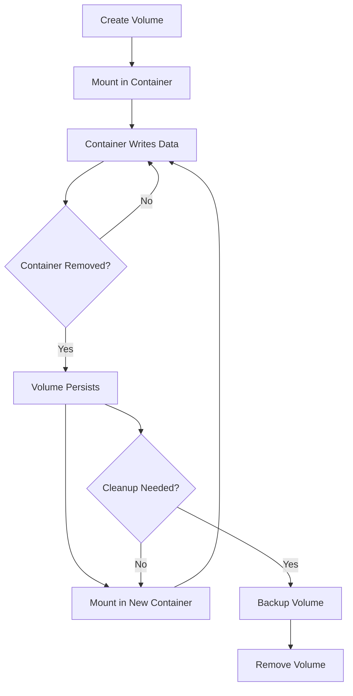

# How to Use Ansible to Manage Docker Volumes

Author: [nawazdhandala](https://www.github.com/nawazdhandala)

Tags: Ansible, Docker, Docker Volumes, Data Persistence, DevOps

Description: Learn how to create, manage, and maintain Docker volumes with Ansible for persistent data storage in containerized applications.

---

Containers are ephemeral by design. When a container is removed, everything inside it disappears. That is fine for stateless web servers, but not for databases, file uploads, application logs, or any other data that needs to survive container restarts. Docker volumes solve this problem by providing persistent storage that lives outside the container lifecycle. In this post, we will manage Docker volumes with Ansible, covering creation, usage, backup, and cleanup.

## Types of Docker Storage

Docker offers several ways to persist data:

- **Volumes**: Managed by Docker, stored in `/var/lib/docker/volumes/`. The recommended approach.
- **Bind mounts**: Maps a host directory into the container. Useful but tightly couples the container to the host filesystem.
- **tmpfs mounts**: Stored in memory only. Gone when the container stops.

Volumes are preferred because Docker manages their lifecycle, they work on both Linux and Windows, they can use volume drivers for remote storage, and they are safer (they do not expose host paths to containers).

## Prerequisites

```bash
# Install the community.docker collection
ansible-galaxy collection install community.docker

# Install the Docker Python SDK
pip install docker
```

## Creating a Basic Volume

```yaml
# create-volume.yml - Create a Docker volume
---
- name: Create Docker Volume
  hosts: docker_hosts
  become: true

  tasks:
    - name: Create a named volume for database data
      community.docker.docker_volume:
        name: postgres-data
        state: present
      register: volume

    - name: Show volume details
      ansible.builtin.debug:
        msg: |
          Volume: {{ volume.volume.Name }}
          Driver: {{ volume.volume.Driver }}
          Mountpoint: {{ volume.volume.Mountpoint }}
```

## Creating Volumes with Labels

Labels help you organize and track volumes, especially when you have dozens of them.

```yaml
# labeled-volumes.yml - Create volumes with descriptive labels
---
- name: Create Labeled Docker Volumes
  hosts: docker_hosts
  become: true

  tasks:
    - name: Create volumes with labels
      community.docker.docker_volume:
        name: "{{ item.name }}"
        labels:
          application: "{{ item.app }}"
          purpose: "{{ item.purpose }}"
          environment: "production"
          managed_by: "ansible"
        state: present
      loop:
        - name: app-postgres-data
          app: myapp
          purpose: database-storage
        - name: app-redis-data
          app: myapp
          purpose: cache-storage
        - name: app-uploads
          app: myapp
          purpose: user-uploads
        - name: app-logs
          app: myapp
          purpose: application-logs
```

## Using Volumes with Containers

Creating a volume is only useful if you mount it into a container.

```yaml
# use-volumes.yml - Mount volumes into containers
---
- name: Use Volumes with Containers
  hosts: docker_hosts
  become: true

  tasks:
    # Create the volumes
    - name: Create data volumes
      community.docker.docker_volume:
        name: "{{ item }}"
        state: present
      loop:
        - postgres-data
        - redis-data
        - app-uploads

    # Use volumes in containers
    - name: Start PostgreSQL with a persistent volume
      community.docker.docker_container:
        name: postgres
        image: postgres:16
        state: started
        restart_policy: unless-stopped
        env:
          POSTGRES_PASSWORD: "secretpass"
          POSTGRES_DB: "myapp"
          PGDATA: "/var/lib/postgresql/data/pgdata"
        volumes:
          # Named volume for database data
          - "postgres-data:/var/lib/postgresql/data"
      no_log: true

    - name: Start Redis with persistent volume
      community.docker.docker_container:
        name: redis
        image: redis:7
        state: started
        restart_policy: unless-stopped
        command: "redis-server --appendonly yes"
        volumes:
          - "redis-data:/data"

    - name: Start application with upload volume
      community.docker.docker_container:
        name: myapp
        image: myapp:latest
        state: started
        restart_policy: unless-stopped
        volumes:
          # Named volume for user uploads
          - "app-uploads:/app/uploads"
          # Bind mount for read-only config
          - "/etc/myapp/config.yml:/app/config.yml:ro"
          # tmpfs for temporary files (in-memory only)
        tmpfs:
          - "/tmp"
```

## Volume Lifecycle



## Volume Drivers for Remote Storage

Docker supports volume drivers that store data on remote systems like NFS, cloud storage, or distributed file systems.

```yaml
# remote-volumes.yml - Volumes with custom drivers
---
- name: Create Volumes with Custom Drivers
  hosts: docker_hosts
  become: true

  tasks:
    # NFS volume (requires nfs-client on the host)
    - name: Create NFS-backed volume
      community.docker.docker_volume:
        name: shared-nfs-data
        driver: local
        driver_options:
          type: nfs
          o: "addr=nfs-server.example.com,rw,nfsvers=4"
          device: ":/exports/shared"
        state: present

    # Local volume with specific mount options
    - name: Create volume with specific filesystem options
      community.docker.docker_volume:
        name: fast-io-data
        driver: local
        driver_options:
          type: tmpfs
          device: tmpfs
          o: "size=1g,uid=1000"
        state: present

    - name: Use NFS volume in a container
      community.docker.docker_container:
        name: app-with-nfs
        image: myapp:latest
        state: started
        volumes:
          - "shared-nfs-data:/app/shared"
```

## Backing Up Docker Volumes

Volumes need to be backed up, especially for databases. Here is how to back up a volume using a temporary container.

```yaml
# backup-volume.yml - Backup a Docker volume to a tar file
---
- name: Backup Docker Volume
  hosts: docker_hosts
  become: true

  vars:
    volume_name: "postgres-data"
    backup_dir: "/opt/backups/docker-volumes"
    timestamp: "{{ lookup('pipe', 'date +%Y%m%d-%H%M%S') }}"

  tasks:
    - name: Create backup directory
      ansible.builtin.file:
        path: "{{ backup_dir }}"
        state: directory
        mode: "0755"

    # Stop the container using the volume (for consistent backup)
    - name: Stop PostgreSQL for consistent backup
      community.docker.docker_container:
        name: postgres
        state: stopped

    # Create a backup using a temporary container
    - name: Backup volume to tar file
      community.docker.docker_container:
        name: volume-backup
        image: alpine:3.19
        state: started
        command: >
          tar czf /backup/{{ volume_name }}-{{ timestamp }}.tar.gz
          -C /source .
        volumes:
          - "{{ volume_name }}:/source:ro"
          - "{{ backup_dir }}:/backup"
        auto_remove: true
        detach: false
      register: backup_result

    # Restart the container
    - name: Start PostgreSQL again
      community.docker.docker_container:
        name: postgres
        image: postgres:16
        state: started

    - name: Verify backup was created
      ansible.builtin.stat:
        path: "{{ backup_dir }}/{{ volume_name }}-{{ timestamp }}.tar.gz"
      register: backup_file

    - name: Show backup info
      ansible.builtin.debug:
        msg: |
          Backup created: {{ backup_dir }}/{{ volume_name }}-{{ timestamp }}.tar.gz
          Size: {{ (backup_file.stat.size / 1024 / 1024) | round(2) }} MB
      when: backup_file.stat.exists
```

## Restoring a Volume from Backup

```yaml
# restore-volume.yml - Restore a Docker volume from a tar backup
---
- name: Restore Docker Volume from Backup
  hosts: docker_hosts
  become: true

  vars:
    volume_name: "postgres-data-restored"
    backup_file: "/opt/backups/docker-volumes/postgres-data-20260220-143022.tar.gz"

  tasks:
    # Create a fresh volume
    - name: Create the target volume
      community.docker.docker_volume:
        name: "{{ volume_name }}"
        state: present

    # Restore from the backup
    - name: Restore data from backup
      community.docker.docker_container:
        name: volume-restore
        image: alpine:3.19
        state: started
        command: >
          tar xzf /backup/{{ backup_file | basename }}
          -C /target
        volumes:
          - "{{ volume_name }}:/target"
          - "{{ backup_file | dirname }}:/backup:ro"
        auto_remove: true
        detach: false

    - name: Verify restoration
      community.docker.docker_container:
        name: volume-verify
        image: alpine:3.19
        state: started
        command: "ls -la /data"
        volumes:
          - "{{ volume_name }}:/data:ro"
        auto_remove: true
        detach: false
      register: verify_result

    - name: Show restored contents
      ansible.builtin.debug:
        msg: "{{ verify_result.container.Output }}"
```

## Volume Information and Inspection

```yaml
# volume-info.yml - Inspect Docker volumes
---
- name: Docker Volume Information
  hosts: docker_hosts
  become: true

  tasks:
    - name: Get info about a specific volume
      community.docker.docker_volume_info:
        name: postgres-data
      register: vol_info

    - name: Show volume details
      ansible.builtin.debug:
        msg: |
          Name: {{ vol_info.volume.Name }}
          Driver: {{ vol_info.volume.Driver }}
          Mountpoint: {{ vol_info.volume.Mountpoint }}
          Labels: {{ vol_info.volume.Labels | default({}) }}
          Created: {{ vol_info.volume.CreatedAt }}
      when: vol_info.exists

    # Check disk usage of volumes
    - name: Check volume disk usage
      ansible.builtin.command: du -sh /var/lib/docker/volumes/{{ item }}
      loop:
        - postgres-data
        - redis-data
        - app-uploads
      register: disk_usage
      changed_when: false
      become: true

    - name: Show disk usage
      ansible.builtin.debug:
        msg: "{{ item.stdout }}"
      loop: "{{ disk_usage.results }}"
```

## Cleaning Up Volumes

Unused volumes waste disk space. Here is how to clean them up safely.

```yaml
# cleanup-volumes.yml - Remove unused Docker volumes
---
- name: Cleanup Docker Volumes
  hosts: docker_hosts
  become: true

  vars:
    # Volumes that should never be deleted
    protected_volumes:
      - postgres-data
      - redis-data

  tasks:
    # Remove a specific volume
    - name: Remove a specific unused volume
      community.docker.docker_volume:
        name: old-test-data
        state: absent

    # Remove multiple volumes
    - name: Remove old project volumes
      community.docker.docker_volume:
        name: "{{ item }}"
        state: absent
      loop:
        - "staging-db-data"
        - "test-uploads"
        - "temp-cache"
      ignore_errors: true

    # Prune all unused volumes (careful with this)
    - name: Prune unused volumes
      community.docker.docker_prune:
        volumes: true
        volumes_filters:
          # Only prune volumes with specific labels
          label: "environment=staging"
      register: prune_result

    - name: Show cleanup results
      ansible.builtin.debug:
        msg: "Removed {{ prune_result.volumes | default([]) | length }} unused volumes"
```

## Complete Volume Management Example

Here is a comprehensive playbook that manages volumes for an entire application.

```yaml
# app-volumes.yml - Complete volume management for an application
---
- name: Application Volume Management
  hosts: docker_hosts
  become: true

  vars:
    app_name: "myapp"
    environment: "production"

    volumes:
      - name: "{{ app_name }}-db"
        labels:
          purpose: "database"
          backup: "daily"
      - name: "{{ app_name }}-cache"
        labels:
          purpose: "cache"
          backup: "none"
      - name: "{{ app_name }}-uploads"
        labels:
          purpose: "user-uploads"
          backup: "daily"
      - name: "{{ app_name }}-logs"
        labels:
          purpose: "application-logs"
          backup: "weekly"

  tasks:
    - name: Create all application volumes
      community.docker.docker_volume:
        name: "{{ item.name }}"
        labels: "{{ item.labels | combine({
          'application': app_name,
          'environment': environment,
          'managed_by': 'ansible'
        }) }}"
        state: present
      loop: "{{ volumes }}"

    - name: Show volume summary
      ansible.builtin.debug:
        msg: |
          Created {{ volumes | length }} volumes for {{ app_name }}:
          
          - {{ vol.name }} ({{ vol.labels.purpose }}, backup: {{ vol.labels.backup }})
          
```

## Best Practices

1. **Use named volumes over bind mounts.** Named volumes are managed by Docker, portable, and easier to back up. Bind mounts tie your container to specific host paths.

2. **Label your volumes.** Labels help identify what each volume is for, which application owns it, and whether it needs to be backed up.

3. **Back up volumes regularly.** Database volumes should be backed up daily at minimum. Use the temporary container approach shown above.

4. **Be careful with volume pruning.** `docker volume prune` removes ALL unused volumes. There is no undo. Always check what will be removed before pruning.

5. **Use read-only mounts for config files.** If a container only needs to read a file, mount it with `:ro`. This prevents accidental writes.

6. **Monitor volume disk usage.** Volumes can grow without bound. Set up monitoring and alerts for `/var/lib/docker/volumes/` disk usage.

7. **Never share a database volume between containers.** Two database engines writing to the same volume will corrupt data. Use proper replication instead.

## Conclusion

Docker volumes are the standard way to persist data in containerized environments, and Ansible gives you a clean, declarative way to manage them. From creating labeled volumes to backing them up, restoring from backups, and cleaning up unused ones, Ansible handles the full volume lifecycle. The key is to treat volumes as first-class infrastructure resources, label them properly, back them up regularly, and clean up what you do not need.
