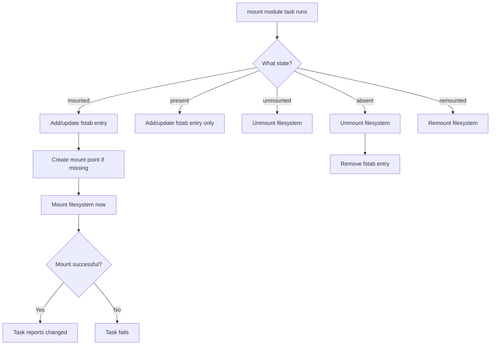

# How to Use Ansible to Manage /etc/fstab Entries

Author: [nawazdhandala](https://www.github.com/nawazdhandala)

Tags: Ansible, Linux, Storage, Configuration Management

Description: Learn how to use the Ansible mount module to manage /etc/fstab entries for persistent filesystem mounts across reboots on your managed hosts.

---

The `/etc/fstab` file controls which filesystems are mounted at boot time on a Linux system. Getting it wrong can prevent a server from booting, so manual editing is risky. Ansible's `mount` module provides a safe, idempotent way to manage fstab entries. It can add new mounts, modify existing ones, unmount filesystems, and remove entries, all without the risk of typos that come with manual editing.

## Understanding the mount Module States

The `mount` module has several states that control its behavior.

| State | Modifies fstab | Mounts filesystem |
|-------|---------------|-------------------|
| mounted | Yes | Yes |
| present | Yes | No |
| unmounted | No | Unmounts |
| absent | Removes entry | Unmounts |
| remounted | No | Remounts |

The distinction between `mounted` and `present` is important: `present` adds the entry to fstab without actually mounting the filesystem (useful for entries that will take effect at next boot), while `mounted` both adds the entry and mounts the filesystem immediately.

## Basic Mount Entry

Here is how to add a filesystem mount that takes effect immediately and persists across reboots.

```yaml
# Mount a data disk and add to fstab
- name: Mount data volume
  ansible.posix.mount:
    path: /data
    src: /dev/sdb1
    fstype: ext4
    opts: defaults,noatime
    state: mounted
```

This adds the following line to `/etc/fstab`:

```
/dev/sdb1 /data ext4 defaults,noatime 0 0
```

## Mounting NFS Shares

NFS mounts are one of the most common fstab entries managed by Ansible.

```yaml
# Mount an NFS share for shared application data
- name: Mount NFS share for app data
  ansible.posix.mount:
    path: /mnt/appdata
    src: "nfs-server.internal:/exports/appdata"
    fstype: nfs
    opts: "rw,soft,intr,timeo=30,retrans=3"
    state: mounted

# Mount NFS share for read-only shared configs
- name: Mount NFS config share
  ansible.posix.mount:
    path: /mnt/configs
    src: "nfs-server.internal:/exports/configs"
    fstype: nfs
    opts: "ro,soft,intr"
    state: mounted
```

## Using UUIDs Instead of Device Names

Device names like `/dev/sdb1` can change between reboots. UUIDs are more reliable.

```yaml
# Mount using UUID for reliability
- name: Mount data partition using UUID
  ansible.posix.mount:
    path: /data
    src: "UUID=a1b2c3d4-e5f6-7890-abcd-ef1234567890"
    fstype: xfs
    opts: defaults,noatime
    state: mounted
```

You can gather UUIDs using a fact-gathering task.

```yaml
# Find the UUID of a block device
- name: Get UUID of /dev/sdb1
  ansible.builtin.command: blkid -s UUID -o value /dev/sdb1
  register: disk_uuid
  changed_when: false

- name: Mount data disk by UUID
  ansible.posix.mount:
    path: /data
    src: "UUID={{ disk_uuid.stdout }}"
    fstype: ext4
    opts: defaults,noatime
    state: mounted
```

## Managing tmpfs Mounts

Temporary filesystems in RAM are useful for performance-sensitive directories.

```yaml
# Create a tmpfs mount for application temp directory
- name: Mount tmpfs for application temp files
  ansible.posix.mount:
    path: /opt/myapp/tmp
    src: tmpfs
    fstype: tmpfs
    opts: "size=512M,mode=1777,nosuid,nodev"
    state: mounted

# Create a tmpfs mount for shared memory
- name: Mount tmpfs for shared memory
  ansible.posix.mount:
    path: /dev/shm
    src: tmpfs
    fstype: tmpfs
    opts: "defaults,size=2G"
    state: mounted
```

## Managing Swap Entries

```yaml
# Add a swap partition to fstab
- name: Enable swap partition
  ansible.posix.mount:
    path: none
    src: /dev/sdc1
    fstype: swap
    opts: sw
    state: present

- name: Activate swap
  ansible.builtin.command: swapon /dev/sdc1
  when: ansible_swaptotal_mb == 0

# Add a swap file to fstab
- name: Create swap file
  ansible.builtin.command:
    cmd: fallocate -l 4G /swapfile
    creates: /swapfile

- name: Set swap file permissions
  ansible.builtin.file:
    path: /swapfile
    mode: '0600'

- name: Format swap file
  ansible.builtin.command:
    cmd: mkswap /swapfile
  register: mkswap_result
  changed_when: "'Setting up swapspace' in mkswap_result.stdout"

- name: Add swap file to fstab
  ansible.posix.mount:
    path: swap
    src: /swapfile
    fstype: swap
    opts: sw
    state: present
```

## Modifying Existing Mount Options

To change the mount options of an existing entry, just specify the new options. The `mount` module will update the fstab entry and remount if the state is `mounted`.

```yaml
# Update mount options for an existing mount
- name: Update data mount with performance options
  ansible.posix.mount:
    path: /data
    src: "UUID=a1b2c3d4-e5f6-7890-abcd-ef1234567890"
    fstype: xfs
    opts: "defaults,noatime,nodiratime,discard"
    state: mounted
```

## Removing Mount Entries

The `absent` state unmounts the filesystem and removes the fstab entry.

```yaml
# Remove a mount entry completely
- name: Remove old NFS mount
  ansible.posix.mount:
    path: /mnt/old-share
    state: absent

# Just unmount without removing fstab entry
- name: Temporarily unmount for maintenance
  ansible.posix.mount:
    path: /data
    state: unmounted
```

## Managing Multiple Mounts

Use a variable-driven approach for managing many mounts.

```yaml
---
- name: Configure all filesystem mounts
  hosts: app_servers
  become: yes
  vars:
    filesystem_mounts:
      - path: /data
        src: "UUID=a1b2c3d4-e5f6-7890-abcd-ef1234567890"
        fstype: xfs
        opts: "defaults,noatime"
      - path: /mnt/nfs-share
        src: "nfs-server:/exports/data"
        fstype: nfs
        opts: "rw,soft,intr"
      - path: /opt/myapp/tmp
        src: tmpfs
        fstype: tmpfs
        opts: "size=1G,mode=1777"
      - path: /mnt/backup
        src: "backup-server:/exports/backups"
        fstype: nfs
        opts: "rw,soft,intr,noexec"

  tasks:
    - name: Create mount point directories
      ansible.builtin.file:
        path: "{{ item.path }}"
        state: directory
        mode: '0755'
      loop: "{{ filesystem_mounts }}"

    - name: Configure filesystem mounts
      ansible.posix.mount:
        path: "{{ item.path }}"
        src: "{{ item.src }}"
        fstype: "{{ item.fstype }}"
        opts: "{{ item.opts }}"
        state: mounted
      loop: "{{ filesystem_mounts }}"
```

## Bind Mounts

Bind mounts let you mount a directory at a second location.

```yaml
# Create a bind mount to expose logs in a different location
- name: Bind mount application logs to shared location
  ansible.posix.mount:
    path: /var/shared/logs/myapp
    src: /opt/myapp/logs
    fstype: none
    opts: bind
    state: mounted
```

## Ensuring the Filesystem Exists First

Always make sure the filesystem is created before trying to mount it.

```yaml
# Create filesystem and mount it
- name: Create ext4 filesystem on data disk
  community.general.filesystem:
    dev: /dev/sdb1
    fstype: ext4

- name: Create mount point
  ansible.builtin.file:
    path: /data
    state: directory
    mode: '0755'

- name: Mount data filesystem
  ansible.posix.mount:
    path: /data
    src: /dev/sdb1
    fstype: ext4
    opts: defaults,noatime
    state: mounted
```

## Dump and Pass Numbers

The `dump` and `passno` parameters control backup frequency and filesystem check order.

```yaml
# Set dump and pass numbers explicitly
- name: Mount root filesystem with fsck priority
  ansible.posix.mount:
    path: /
    src: "UUID=root-uuid-here"
    fstype: ext4
    opts: defaults
    dump: '1'
    passno: '1'
    state: present

- name: Mount data partition with lower fsck priority
  ansible.posix.mount:
    path: /data
    src: "UUID=data-uuid-here"
    fstype: ext4
    opts: defaults
    dump: '1'
    passno: '2'
    state: mounted
```

## Mount Management Flow



## Safety Tips

1. Always use `backup: yes` when first managing an existing fstab file
2. Use `present` state first if you want to test without actually mounting
3. Use UUIDs or LABEL instead of device names for persistent identification
4. Test NFS mount options on one host before rolling out to all servers
5. Never remove the root filesystem entry

```yaml
# Back up fstab before making changes (first time only)
- name: Backup original fstab
  ansible.builtin.copy:
    src: /etc/fstab
    dest: /etc/fstab.ansible-backup
    remote_src: yes
    force: no
    mode: '0644'
```

## Summary

The `mount` module is the safe way to manage `/etc/fstab` entries in Ansible. Its multiple states give you fine-grained control over whether entries are just written to fstab or also immediately mounted. Use UUIDs for reliable device identification, the variable-driven loop pattern for managing many mounts, and always create the mount point directory before mounting. Whether you are setting up NFS shares, tmpfs mounts, bind mounts, or local disk partitions, the `mount` module handles it all with proper idempotency.
