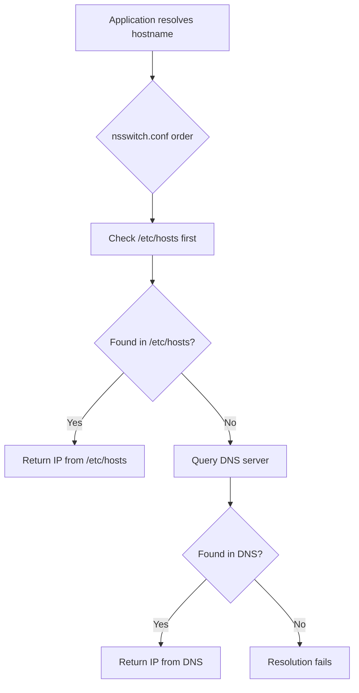

# How to Use Ansible to Manage /etc/hosts File

Author: [nawazdhandala](https://www.github.com/nawazdhandala)

Tags: Ansible, Networking, Linux, Configuration Management

Description: Learn how to use Ansible to manage /etc/hosts entries across your infrastructure for consistent hostname resolution without DNS dependencies.

---

The `/etc/hosts` file provides local hostname-to-IP mappings that take priority over DNS resolution on most Linux systems. In environments where DNS is not available, not reliable, or not yet configured, managing `/etc/hosts` entries across your servers is essential. Ansible provides several ways to do this, from simple one-off entries to dynamically building complete hosts files from inventory data.

## Using the lineinfile Module

For adding or updating individual entries, `lineinfile` is the most straightforward approach.

```yaml
# Add a single host entry to /etc/hosts
- name: Add database server to /etc/hosts
  ansible.builtin.lineinfile:
    path: /etc/hosts
    regexp: '.*db-primary\.internal$'
    line: "10.0.1.50    db-primary.internal db-primary"
    state: present
    backup: yes
```

The `regexp` parameter matches existing entries for the same hostname, so running the task again updates the IP if it changed rather than adding a duplicate line.

## Managing Multiple Entries with Loops

Most of the time you need to manage several entries at once.

```yaml
# Add multiple host entries to /etc/hosts
- name: Add infrastructure hosts to /etc/hosts
  ansible.builtin.lineinfile:
    path: /etc/hosts
    regexp: '.*{{ item.name }}$'
    line: "{{ item.ip }}    {{ item.fqdn }} {{ item.name }}"
    state: present
  loop:
    - { ip: "10.0.1.50", fqdn: "db-primary.internal.company.com", name: "db-primary" }
    - { ip: "10.0.1.51", fqdn: "db-replica.internal.company.com", name: "db-replica" }
    - { ip: "10.0.1.60", fqdn: "cache-01.internal.company.com", name: "cache-01" }
    - { ip: "10.0.1.70", fqdn: "mq-01.internal.company.com", name: "mq-01" }
    - { ip: "10.0.1.80", fqdn: "monitor.internal.company.com", name: "monitor" }
```

## Using Variables from Inventory

The real power comes from building host entries dynamically from your Ansible inventory.

```yaml
# Add all hosts in the inventory to each server's /etc/hosts
- name: Build /etc/hosts entries from inventory
  ansible.builtin.lineinfile:
    path: /etc/hosts
    regexp: '.*{{ hostvars[item].inventory_hostname }}$'
    line: "{{ hostvars[item].ansible_host }}    {{ hostvars[item].inventory_hostname }}.{{ domain }} {{ hostvars[item].inventory_hostname }}"
    state: present
  loop: "{{ groups['all'] }}"
  vars:
    domain: internal.company.com
```

This adds every host from your inventory to every server's `/etc/hosts` file, using the `ansible_host` variable for the IP and the inventory hostname for the name.

## Using the template Module for Full Control

For complete control over the hosts file, use a template. This approach is cleaner when you need to manage the entire file.

```yaml
# Deploy a complete /etc/hosts file from a template
- name: Deploy /etc/hosts from template
  ansible.builtin.template:
    src: templates/hosts.j2
    dest: /etc/hosts
    owner: root
    group: root
    mode: '0644'
    backup: yes
```

Here is the Jinja2 template.

```jinja2
# /etc/hosts - managed by Ansible
# Do not edit manually

# Loopback
127.0.0.1       localhost
::1             localhost ip6-localhost ip6-loopback

# This host
{{ ansible_default_ipv4.address }}    {{ ansible_fqdn }} {{ ansible_hostname }}

# Infrastructure services

{{ hostvars[host].ansible_host }}    {{ host }}.{{ domain }} {{ host }}



{{ hostvars[host].ansible_host }}    {{ host }}.{{ domain }} {{ host }}



{{ hostvars[host].ansible_host }}    {{ host }}.{{ domain }} {{ host }}


# Custom static entries

{{ entry.ip }}    {{ entry.fqdn }} {{ entry.name }}

```

## Cluster-Aware /etc/hosts Management

In a cluster scenario, each server needs to know about all other cluster members. Here is how to set that up dynamically.

```yaml
---
- name: Configure cluster node discovery via /etc/hosts
  hosts: cluster_nodes
  become: yes
  vars:
    cluster_domain: cluster.local

  tasks:
    # Gather facts from all cluster nodes first
    - name: Gather facts from all cluster nodes
      ansible.builtin.setup:
      delegate_to: "{{ item }}"
      delegate_facts: yes
      loop: "{{ groups['cluster_nodes'] }}"
      when: hostvars[item].ansible_default_ipv4 is not defined

    - name: Add all cluster nodes to /etc/hosts
      ansible.builtin.lineinfile:
        path: /etc/hosts
        regexp: '.*{{ item }}\.{{ cluster_domain }}$'
        line: "{{ hostvars[item].ansible_default_ipv4.address }}    {{ item }}.{{ cluster_domain }} {{ item }}"
        state: present
      loop: "{{ groups['cluster_nodes'] }}"
```

## Removing Entries

Remove old or decommissioned host entries.

```yaml
# Remove a decommissioned server from /etc/hosts
- name: Remove old database server from /etc/hosts
  ansible.builtin.lineinfile:
    path: /etc/hosts
    regexp: '.*db-old\.internal'
    state: absent

# Remove multiple decommissioned entries
- name: Remove decommissioned servers from /etc/hosts
  ansible.builtin.lineinfile:
    path: /etc/hosts
    regexp: '.*{{ item }}$'
    state: absent
  loop:
    - db-old
    - cache-deprecated
    - legacy-web
```

## Handling IPv6 Entries

Do not forget about IPv6 if your infrastructure uses it.

```yaml
# Add both IPv4 and IPv6 entries
- name: Add IPv4 entries for app servers
  ansible.builtin.lineinfile:
    path: /etc/hosts
    regexp: '^{{ item.ipv4 }}\s+{{ item.name }}'
    line: "{{ item.ipv4 }}    {{ item.fqdn }} {{ item.name }}"
    state: present
  loop: "{{ app_servers }}"

- name: Add IPv6 entries for app servers
  ansible.builtin.lineinfile:
    path: /etc/hosts
    regexp: '^{{ item.ipv6 }}\s+{{ item.name }}'
    line: "{{ item.ipv6 }}    {{ item.fqdn }} {{ item.name }}"
    state: present
  loop: "{{ app_servers }}"
  when: item.ipv6 is defined
```

## Preserving System Defaults

When managing `/etc/hosts`, always preserve the localhost entries that the system expects.

```yaml
# Ensure localhost entries are always present
- name: Ensure localhost IPv4 entry exists
  ansible.builtin.lineinfile:
    path: /etc/hosts
    regexp: '^127\.0\.0\.1'
    line: '127.0.0.1       localhost'
    state: present
    insertbefore: BOF

- name: Ensure localhost IPv6 entry exists
  ansible.builtin.lineinfile:
    path: /etc/hosts
    regexp: '^::1'
    line: '::1             localhost ip6-localhost ip6-loopback'
    state: present
    insertafter: '^127\.0\.0\.1'
```

## A Complete Role

Here is a reusable role for managing `/etc/hosts`.

```yaml
# roles/etc_hosts/tasks/main.yml
---
- name: Ensure localhost entries are present
  ansible.builtin.lineinfile:
    path: /etc/hosts
    regexp: "{{ item.regexp }}"
    line: "{{ item.line }}"
    state: present
  loop:
    - { regexp: '^127\.0\.0\.1', line: '127.0.0.1       localhost' }
    - { regexp: '^::1', line: '::1             localhost ip6-localhost ip6-loopback' }

- name: Add this host's own entry
  ansible.builtin.lineinfile:
    path: /etc/hosts
    regexp: '.*{{ ansible_hostname }}$'
    line: "{{ ansible_default_ipv4.address }}    {{ ansible_fqdn }} {{ ansible_hostname }}"
    state: present

- name: Add managed host entries
  ansible.builtin.lineinfile:
    path: /etc/hosts
    regexp: '.*{{ item.name }}$'
    line: "{{ item.ip }}    {{ item.fqdn | default(item.name + '.' + hosts_domain) }} {{ item.name }}"
    state: present
  loop: "{{ managed_hosts_entries | default([]) }}"

- name: Add inventory-based entries for specified groups
  ansible.builtin.lineinfile:
    path: /etc/hosts
    regexp: '.*{{ item }}\.{{ hosts_domain }}$'
    line: "{{ hostvars[item].ansible_host }}    {{ item }}.{{ hosts_domain }} {{ item }}"
    state: present
  loop: "{{ hosts_inventory_groups | map('extract', groups) | flatten | unique }}"
  when: hostvars[item].ansible_host is defined
```

## Resolution Order Visualization



## Summary

Managing `/etc/hosts` with Ansible gives you reliable hostname resolution that does not depend on DNS availability. Use `lineinfile` for individual entries, loops for multiple hosts, and templates when you need full control over the file format. Dynamic generation from inventory data is the most powerful approach because it automatically updates when you add or remove hosts from your inventory. Always preserve the localhost entries, use the `regexp` parameter to prevent duplicates, and keep a backup of the file before making changes.
