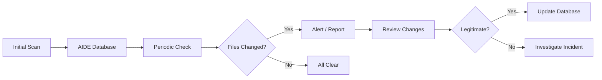

# How to Use Ansible to Manage File Integrity Monitoring (AIDE)

Author: [nawazdhandala](https://www.github.com/nawazdhandala)

Tags: Ansible, AIDE, File Integrity Monitoring, Security, Compliance

Description: Deploy and manage AIDE (Advanced Intrusion Detection Environment) across your servers using Ansible for automated file integrity monitoring.

---

File integrity monitoring (FIM) is a security control that alerts you when files on your system change unexpectedly. If someone modifies a binary, changes a configuration file, or plants a backdoor, FIM catches it. AIDE (Advanced Intrusion Detection Environment) is the go-to open-source FIM tool for Linux, and automating its deployment with Ansible ensures consistent monitoring across your entire fleet.

I have used AIDE in PCI DSS and HIPAA environments where file integrity monitoring is not optional. In this post, I will show you how to install, configure, initialize, and manage AIDE with Ansible playbooks.

## How AIDE Works

AIDE takes a snapshot of your file system (a database of checksums, permissions, ownership, and other attributes) and then compares the current state against that snapshot on subsequent runs. Any differences are reported.



## Installing AIDE

First, install AIDE on all target servers.

This playbook installs AIDE on both Debian and RHEL systems:

```yaml
# install_aide.yml - Install AIDE file integrity monitoring
---
- name: Install AIDE
  hosts: all
  become: true

  tasks:
    - name: Install AIDE on Debian/Ubuntu
      ansible.builtin.apt:
        name: aide
        state: present
        update_cache: true
      when: ansible_os_family == "Debian"

    - name: Install AIDE on RHEL/CentOS
      ansible.builtin.yum:
        name: aide
        state: present
      when: ansible_os_family == "RedHat"

    - name: Create AIDE log directory
      ansible.builtin.file:
        path: /var/log/aide
        state: directory
        owner: root
        group: root
        mode: '0700'

    - name: Create AIDE database directory
      ansible.builtin.file:
        path: /var/lib/aide
        state: directory
        owner: root
        group: root
        mode: '0700'
```

## Configuring AIDE

The AIDE configuration file defines which directories to monitor and what attributes to check.

This playbook deploys a comprehensive AIDE configuration:

```yaml
# configure_aide.yml - Deploy AIDE configuration
---
- name: Configure AIDE
  hosts: all
  become: true

  vars:
    aide_db_path: /var/lib/aide/aide.db
    aide_db_new_path: /var/lib/aide/aide.db.new
    aide_log_path: /var/log/aide/aide.log

    # Directories to exclude from monitoring
    aide_exclude_dirs:
      - /proc
      - /sys
      - /run
      - /dev
      - /tmp
      - /var/tmp
      - /var/log
      - /var/spool
      - /var/cache
      - /home

    # Additional directories to monitor
    aide_extra_monitor_dirs:
      - /opt/application/bin
      - /opt/application/config

  tasks:
    - name: Deploy AIDE configuration
      ansible.builtin.template:
        src: aide.conf.j2
        dest: /etc/aide/aide.conf
        owner: root
        group: root
        mode: '0600'
      when: ansible_os_family == "Debian"

    - name: Deploy AIDE configuration (RHEL)
      ansible.builtin.template:
        src: aide.conf.j2
        dest: /etc/aide.conf
        owner: root
        group: root
        mode: '0600'
      when: ansible_os_family == "RedHat"
```

The AIDE configuration template:

```ini
# templates/aide.conf.j2 - AIDE configuration
# Managed by Ansible

# Database locations
database_in=file:{{ aide_db_path }}
database_out=file:{{ aide_db_new_path }}
database_new=file:{{ aide_db_new_path }}

# Logging
report_url=file:{{ aide_log_path }}
report_url=stdout

# Attribute groups
# p: permissions
# i: inode number
# n: number of hard links
# u: user ownership
# g: group ownership
# s: file size
# b: block count
# m: modification time
# c: change time
# S: check for growing size
# sha256: SHA-256 checksum
# sha512: SHA-512 checksum

# Define check levels
NORMAL = p+i+n+u+g+s+b+m+c+sha256
PERMS = p+u+g
LOG = p+u+g+i+n+S
CONTENT = sha256+ftype
DATAONLY = p+n+u+g+s+sha256

# System binaries - full integrity check
/usr/bin NORMAL
/usr/sbin NORMAL
/bin NORMAL
/sbin NORMAL

# Libraries - full integrity check
/usr/lib NORMAL
/usr/lib64 NORMAL
/lib NORMAL
/lib64 NORMAL

# Configuration files - monitor permissions and content
/etc NORMAL

# Boot files
/boot NORMAL

# Kernel modules
/lib/modules NORMAL


# Additional monitored directory
{{ dir }} NORMAL


# Excluded directories

!{{ dir }}


# Specific exclusions for files that change frequently
!/etc/mtab
!/etc/resolv.conf
!/etc/hostname
```

## Initializing the AIDE Database

After installing and configuring AIDE, you need to create the initial database. This is the baseline that all future checks compare against.

This playbook initializes the AIDE database on each host:

```yaml
# init_aide.yml - Initialize AIDE database
---
- name: Initialize AIDE database
  hosts: all
  become: true

  tasks:
    - name: Check if AIDE database exists
      ansible.builtin.stat:
        path: /var/lib/aide/aide.db
      register: aide_db

    - name: Initialize AIDE database (this takes several minutes)
      ansible.builtin.command: aide --init
      when: not aide_db.stat.exists
      async: 600  # Allow up to 10 minutes
      poll: 30
      register: aide_init

    - name: Move new database to active location
      ansible.builtin.copy:
        src: /var/lib/aide/aide.db.new
        dest: /var/lib/aide/aide.db
        remote_src: true
        owner: root
        group: root
        mode: '0600'
      when: aide_init.changed | default(false)

    - name: Record initialization timestamp
      ansible.builtin.copy:
        content: "AIDE database initialized: {{ ansible_date_time.iso8601 }}\n"
        dest: /var/lib/aide/aide.initialized
        mode: '0644'
      when: aide_init.changed | default(false)
```

## Setting Up Automated Checks

AIDE should run periodically to detect changes. This playbook configures a cron job and a script for automated checking.

This sets up a daily AIDE check with email reporting:

```yaml
# aide_cron.yml - Schedule automated AIDE checks
---
- name: Configure automated AIDE checks
  hosts: all
  become: true

  vars:
    aide_check_hour: 3
    aide_check_minute: 30
    aide_alert_email: security@example.com

  tasks:
    - name: Deploy AIDE check script
      ansible.builtin.copy:
        content: |
          #!/bin/bash
          # AIDE integrity check script - Managed by Ansible
          LOGFILE=/var/log/aide/aide-check-$(date +%Y%m%d).log
          AIDE_BIN=$(which aide)

          echo "AIDE check started: $(date)" > "$LOGFILE"
          $AIDE_BIN --check >> "$LOGFILE" 2>&1
          EXIT_CODE=$?

          if [ $EXIT_CODE -ne 0 ]; then
              echo "AIDE detected changes on $(hostname)" | \
                  mail -s "AIDE Alert: Changes detected on $(hostname)" \
                  {{ aide_alert_email }} < "$LOGFILE"
          fi

          # Rotate old logs (keep 30 days)
          find /var/log/aide/ -name "aide-check-*.log" -mtime +30 -delete

          exit $EXIT_CODE
        dest: /usr/local/bin/aide-check.sh
        owner: root
        group: root
        mode: '0700'

    - name: Schedule daily AIDE check
      ansible.builtin.cron:
        name: "AIDE integrity check"
        hour: "{{ aide_check_hour }}"
        minute: "{{ aide_check_minute }}"
        job: "/usr/local/bin/aide-check.sh"
        user: root
        state: present
```

## Updating the Database After Legitimate Changes

When you intentionally change files (like deploying a new application version), you need to update the AIDE database so those changes are not flagged.

This playbook updates the AIDE baseline after authorized changes:

```yaml
# update_aide_db.yml - Update AIDE database after legitimate changes
---
- name: Update AIDE database
  hosts: all
  become: true

  tasks:
    - name: Run AIDE update (generates new database with current state)
      ansible.builtin.command: aide --update
      async: 600
      poll: 30
      register: aide_update

    - name: Backup current database
      ansible.builtin.copy:
        src: /var/lib/aide/aide.db
        dest: "/var/lib/aide/aide.db.backup.{{ ansible_date_time.iso8601_basic_short }}"
        remote_src: true
        mode: '0600'

    - name: Replace database with updated version
      ansible.builtin.copy:
        src: /var/lib/aide/aide.db.new
        dest: /var/lib/aide/aide.db
        remote_src: true
        owner: root
        group: root
        mode: '0600'

    - name: Log the database update
      ansible.builtin.lineinfile:
        path: /var/lib/aide/aide.updates.log
        line: "Database updated: {{ ansible_date_time.iso8601 }} by Ansible"
        create: true
        mode: '0644'
```

## Integrating AIDE with Your Deployment Pipeline

If you deploy applications with Ansible, integrate AIDE database updates into your deployment playbook:

```yaml
# deploy_with_aide.yml - Application deployment with AIDE integration
---
- name: Deploy application with AIDE integration
  hosts: webservers
  become: true

  tasks:
    - name: Pre-deployment AIDE check
      ansible.builtin.command: aide --check
      register: pre_check
      failed_when: false
      changed_when: false

    - name: Warn if unexpected changes detected before deployment
      ansible.builtin.debug:
        msg: "WARNING: Unexpected file changes detected before deployment!"
      when: pre_check.rc != 0

    # ... your deployment tasks here ...

    - name: Post-deployment AIDE update
      ansible.builtin.command: aide --update
      async: 600
      poll: 30

    - name: Activate new AIDE database
      ansible.builtin.copy:
        src: /var/lib/aide/aide.db.new
        dest: /var/lib/aide/aide.db
        remote_src: true
        owner: root
        group: root
        mode: '0600'
```

## Centralized Reporting

For visibility across your fleet, collect AIDE reports to a central location:

```yaml
# collect_aide_reports.yml - Gather AIDE reports centrally
---
- name: Collect AIDE reports
  hosts: all
  become: true

  tasks:
    - name: Run AIDE check
      ansible.builtin.command: aide --check
      register: aide_result
      failed_when: false
      changed_when: false

    - name: Save report locally
      ansible.builtin.copy:
        content: |
          Host: {{ inventory_hostname }}
          Date: {{ ansible_date_time.iso8601 }}
          Status: {{ 'CHANGES DETECTED' if aide_result.rc != 0 else 'OK' }}
          ---
          {{ aide_result.stdout }}
        dest: /var/log/aide/latest-check.txt
        mode: '0600'

    - name: Fetch reports to controller
      ansible.builtin.fetch:
        src: /var/log/aide/latest-check.txt
        dest: "./aide-reports/{{ inventory_hostname }}.txt"
        flat: true
```

## Production Tips

Here is what I have learned running AIDE across large environments:

1. **The initial database creation is slow.** On servers with large file systems, it can take 10+ minutes. Use the `async` parameter in Ansible to avoid timeouts.
2. **Exclude directories that change frequently.** Log directories, temp files, and cache directories will generate noise. Tune your exclusion list.
3. **Protect the AIDE database.** If an attacker can modify the database, they can hide their changes. Consider storing a copy off-server.
4. **Coordinate with deployments.** Every application deployment changes files. Build AIDE database updates into your deployment pipeline.
5. **Review alerts promptly.** FIM is useless if nobody looks at the reports. Integrate with your alerting system.

AIDE with Ansible gives you scalable file integrity monitoring that meets compliance requirements and provides real security value. The key is automating not just the installation but the entire lifecycle: initialization, checking, updating, and reporting.
