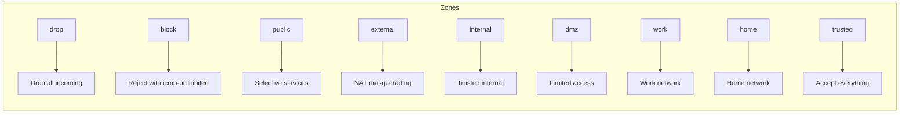

# How to Use Ansible to Manage Firewall Zones

Author: [nawazdhandala](https://www.github.com/nawazdhandala)

Tags: Ansible, Firewalld, Firewall Zones, Security, Linux

Description: Manage firewalld zones across your Linux servers using Ansible to control network access with zone-based firewall policies.

---

Firewalld zones give you a way to categorize network interfaces and connections into trust levels. Instead of writing raw iptables rules, you work with named zones like "public", "internal", "dmz", and "trusted", each with its own set of allowed services and ports. Managing these zones across a fleet of servers by hand is tedious and error-prone. Ansible has excellent built-in support for firewalld that makes this manageable.

In this post, I will walk through how to use Ansible to create custom zones, assign interfaces, manage services and ports, and enforce consistent firewall policies across your infrastructure.

## Understanding Firewalld Zones

Firewalld comes with several predefined zones, each with a different default behavior:



Each network interface is assigned to a zone, and the zone determines what traffic is allowed.

## Basic Firewalld Management

Let's start with the basics: ensuring firewalld is installed, running, and configured with the right default zone.

This playbook sets up firewalld with a secure default configuration:

```yaml
# setup_firewalld.yml - Install and configure firewalld
---
- name: Set up firewalld
  hosts: all
  become: true

  vars:
    default_zone: public

  tasks:
    - name: Install firewalld
      ansible.builtin.package:
        name: firewalld
        state: present

    - name: Start and enable firewalld
      ansible.builtin.service:
        name: firewalld
        state: started
        enabled: true

    - name: Set default zone
      ansible.posix.firewalld:
        zone: "{{ default_zone }}"
        state: enabled
        permanent: true
        immediate: true
      register: zone_set

    - name: Make zone the default
      ansible.builtin.command: firewall-cmd --set-default-zone={{ default_zone }}
      when: zone_set.changed
      changed_when: true

    - name: Verify default zone
      ansible.builtin.command: firewall-cmd --get-default-zone
      register: current_zone
      changed_when: false

    - name: Report current zone
      ansible.builtin.debug:
        msg: "Default zone: {{ current_zone.stdout }}"
```

## Managing Services in Zones

Firewalld uses service definitions instead of raw port numbers. This makes rules more readable and maintainable.

This playbook configures allowed services per zone:

```yaml
# manage_zone_services.yml - Configure services in firewalld zones
---
- name: Manage firewalld zone services
  hosts: all
  become: true

  vars:
    zone_services:
      public:
        allowed:
          - ssh
          - http
          - https
        denied:
          - cockpit
          - dhcpv6-client
      internal:
        allowed:
          - ssh
          - http
          - https
          - ntp
          - dns
          - prometheus-node-exporter

  tasks:
    - name: Enable allowed services in zones
      ansible.posix.firewalld:
        zone: "{{ item.0.key }}"
        service: "{{ item.1 }}"
        permanent: true
        immediate: true
        state: enabled
      loop: "{{ zone_services | dict2items | subelements('value.allowed') }}"

    - name: Remove denied services from zones
      ansible.posix.firewalld:
        zone: "{{ item.0.key }}"
        service: "{{ item.1 }}"
        permanent: true
        immediate: true
        state: disabled
      loop: "{{ zone_services | dict2items | subelements('value.denied', skip_missing=True) }}"
```

## Creating Custom Zones

Predefined zones might not match your needs. Here is how to create custom zones.

This playbook creates custom zones for specific use cases:

```yaml
# custom_zones.yml - Create and configure custom firewalld zones
---
- name: Create custom firewalld zones
  hosts: all
  become: true

  vars:
    custom_zones:
      - name: app-tier
        description: "Application server zone"
        target: "DROP"
        services:
          - ssh
        ports:
          - "8080/tcp"
          - "8443/tcp"
        sources:
          - "10.1.0.0/16"

      - name: db-tier
        description: "Database server zone"
        target: "DROP"
        services:
          - ssh
        ports:
          - "5432/tcp"
          - "6379/tcp"
        sources:
          - "10.2.0.0/16"

      - name: monitoring
        description: "Monitoring and metrics zone"
        target: "DROP"
        services:
          - ssh
        ports:
          - "9090/tcp"
          - "9100/tcp"
          - "3000/tcp"
        sources:
          - "10.4.0.0/16"

  tasks:
    - name: Create custom zones
      ansible.builtin.command: "firewall-cmd --permanent --new-zone={{ item.name }}"
      loop: "{{ custom_zones }}"
      register: zone_create
      failed_when: false
      changed_when: "'ALREADY_ENABLED' not in zone_create.stderr"

    - name: Reload firewalld to activate new zones
      ansible.builtin.command: firewall-cmd --reload
      changed_when: true

    - name: Set zone targets
      ansible.builtin.command: "firewall-cmd --permanent --zone={{ item.name }} --set-target={{ item.target }}"
      loop: "{{ custom_zones }}"
      changed_when: true

    - name: Add services to custom zones
      ansible.posix.firewalld:
        zone: "{{ item.0.name }}"
        service: "{{ item.1 }}"
        permanent: true
        immediate: true
        state: enabled
      loop: "{{ custom_zones | subelements('services') }}"

    - name: Add ports to custom zones
      ansible.posix.firewalld:
        zone: "{{ item.0.name }}"
        port: "{{ item.1 }}"
        permanent: true
        immediate: true
        state: enabled
      loop: "{{ custom_zones | subelements('ports') }}"

    - name: Add source networks to custom zones
      ansible.posix.firewalld:
        zone: "{{ item.0.name }}"
        source: "{{ item.1 }}"
        permanent: true
        immediate: true
        state: enabled
      loop: "{{ custom_zones | subelements('sources') }}"
```

## Assigning Interfaces to Zones

Each network interface should be assigned to the appropriate zone based on its function.

This playbook assigns interfaces to specific zones:

```yaml
# assign_interfaces.yml - Assign network interfaces to zones
---
- name: Assign interfaces to firewalld zones
  hosts: all
  become: true

  vars:
    interface_zone_map:
      eth0: public       # Internet-facing interface
      eth1: internal     # Internal network
      eth2: db-tier      # Database network

  tasks:
    - name: Gather network interface facts
      ansible.builtin.setup:
        gather_subset:
          - network

    - name: Assign interfaces to zones
      ansible.posix.firewalld:
        zone: "{{ item.value }}"
        interface: "{{ item.key }}"
        permanent: true
        immediate: true
        state: enabled
      loop: "{{ interface_zone_map | dict2items }}"
      when: item.key in ansible_interfaces

    - name: Verify interface assignments
      ansible.builtin.command: "firewall-cmd --get-zone-of-interface={{ item.key }}"
      loop: "{{ interface_zone_map | dict2items }}"
      register: zone_check
      changed_when: false
      failed_when: false

    - name: Report assignments
      ansible.builtin.debug:
        msg: "{{ item.item.key }}: {{ item.stdout }}"
      loop: "{{ zone_check.results }}"
```

## Rich Rules for Fine-Grained Control

When simple service and port rules are not enough, firewalld rich rules give you more control.

This playbook configures rich rules for specific traffic policies:

```yaml
# rich_rules.yml - Configure firewalld rich rules
---
- name: Configure rich rules
  hosts: all
  become: true

  vars:
    firewall_rich_rules:
      - zone: public
        rule: 'rule family="ipv4" source address="10.0.0.0/8" service name="ssh" accept'
      - zone: public
        rule: 'rule family="ipv4" source address="192.168.1.0/24" service name="http" accept'
      - zone: public
        rule: 'rule family="ipv4" source address="0.0.0.0/0" service name="ssh" log prefix="SSH-ATTEMPT" level="info" limit value="5/m" drop'
      - zone: public
        rule: 'rule family="ipv4" source address="0.0.0.0/0" port port="3306" protocol="tcp" reject'

  tasks:
    - name: Add rich rules
      ansible.posix.firewalld:
        zone: "{{ item.zone }}"
        rich_rule: "{{ item.rule }}"
        permanent: true
        immediate: true
        state: enabled
      loop: "{{ firewall_rich_rules }}"
```

## Role-Based Zone Configuration

Here is a complete role that applies different zone configurations based on server role:

```yaml
# roles/firewall_zones/defaults/main.yml
---
firewall_default_zone: public
firewall_log_denied: unicast
firewall_role: base

# Base rules applied to all servers
firewall_base_services:
  - ssh

firewall_base_rich_rules:
  - 'rule family="ipv4" source address="10.4.0.0/16" port port="9100" protocol="tcp" accept'

# Role-specific configurations
firewall_role_configs:
  webserver:
    services: [http, https]
    ports: []
  appserver:
    services: []
    ports: ["8080/tcp", "8443/tcp"]
  database:
    services: []
    ports: ["5432/tcp"]
  monitoring:
    services: [http, https]
    ports: ["9090/tcp", "3000/tcp"]
```

```yaml
# roles/firewall_zones/tasks/main.yml
---
- name: Ensure firewalld is running
  ansible.builtin.service:
    name: firewalld
    state: started
    enabled: true

- name: Set default zone
  ansible.builtin.command: "firewall-cmd --set-default-zone={{ firewall_default_zone }}"
  changed_when: true

- name: Enable log of denied packets
  ansible.builtin.command: "firewall-cmd --set-log-denied={{ firewall_log_denied }}"
  changed_when: true

- name: Apply base services
  ansible.posix.firewalld:
    zone: "{{ firewall_default_zone }}"
    service: "{{ item }}"
    permanent: true
    immediate: true
    state: enabled
  loop: "{{ firewall_base_services }}"

- name: Apply role-specific services
  ansible.posix.firewalld:
    zone: "{{ firewall_default_zone }}"
    service: "{{ item }}"
    permanent: true
    immediate: true
    state: enabled
  loop: "{{ firewall_role_configs[firewall_role].services | default([]) }}"

- name: Apply role-specific ports
  ansible.posix.firewalld:
    zone: "{{ firewall_default_zone }}"
    port: "{{ item }}"
    permanent: true
    immediate: true
    state: enabled
  loop: "{{ firewall_role_configs[firewall_role].ports | default([]) }}"
```

## Auditing Zone Configuration

Regularly verify your firewall zones are configured correctly:

```yaml
# audit_zones.yml - Audit firewalld zone configuration
---
- name: Audit firewalld zones
  hosts: all
  become: true

  tasks:
    - name: Get active zones
      ansible.builtin.command: firewall-cmd --get-active-zones
      register: active_zones
      changed_when: false

    - name: List all zone details
      ansible.builtin.command: firewall-cmd --list-all-zones
      register: all_zones
      changed_when: false

    - name: Check for open ports in public zone
      ansible.builtin.command: firewall-cmd --zone=public --list-ports
      register: public_ports
      changed_when: false

    - name: Report zone summary
      ansible.builtin.debug:
        msg:
          - "Active zones: {{ active_zones.stdout_lines }}"
          - "Open ports in public: {{ public_ports.stdout }}"
```

## Practical Tips

1. **Start with the public zone locked down.** Only add services as needed. It is easier to open ports than to close them after a breach.
2. **Use service definitions over port numbers.** `service: http` is clearer than `port: 80/tcp` and updates automatically if the service definition changes.
3. **Test with --runtime.** Before making permanent changes, test rules in runtime mode first. If something breaks, a firewall reload or reboot restores the previous state.
4. **Log denied traffic.** Set `--set-log-denied=unicast` to log blocked packets for troubleshooting without flooding your logs with broadcast noise.
5. **Back up zone configs.** Store your zone configurations in version control through Ansible, so you can always restore a known good state.

Firewalld zones with Ansible give you a clean, maintainable way to manage network access across your fleet. The zone model is easier to reason about than raw iptables rules, and Ansible ensures consistency everywhere.
