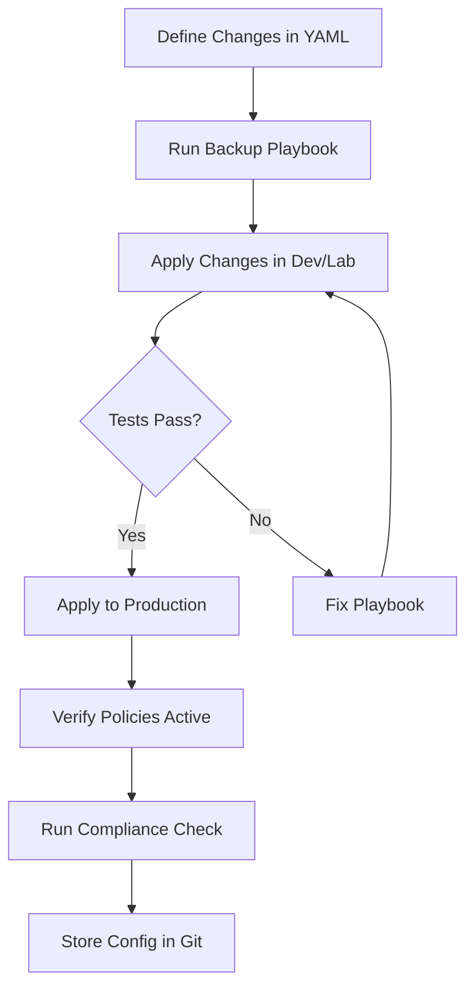

# How to Use Ansible to Manage FortiGate Firewalls

Author: [nawazdhandala](https://www.github.com/nawazdhandala)

Tags: Ansible, FortiGate, Fortinet, Network Automation, Firewall

Description: Automate FortiGate firewall management with Ansible using the fortinet.fortios collection for policy management, VPN configuration, and more.

---

FortiGate firewalls from Fortinet are everywhere in enterprise networks. If you are managing more than a handful of them, you already know how tedious it gets clicking through the FortiOS web UI to make the same change across multiple devices. Ansible has a well-maintained collection for FortiOS that lets you automate nearly every aspect of FortiGate management.

This guide covers setting up the Ansible FortiOS collection, writing playbooks for common firewall tasks, and handling some of the gotchas you will run into.

## Installing the FortiOS Collection

The official Fortinet collection is available from Ansible Galaxy. Install it along with the required Python library.

```bash
# Install the Fortinet Ansible collection
ansible-galaxy collection install fortinet.fortios

# Install the Python library for FortiOS API communication
pip install fortiosapi
```

## Authentication Setup

FortiGate supports both API token and username/password authentication. API tokens are the recommended approach for automation because they can be scoped to specific permissions.

Generate an API token in FortiOS under System > Administrators > Create New > REST API Admin.

```yaml
# group_vars/fortigate/vault.yml (encrypt with ansible-vault)
fortigate_host: "192.168.1.1"
fortigate_token: "your-api-token-here"
fortigate_vdom: "root"
```

Create your inventory file.

```ini
# inventory/fortigate.ini
[fortigate]
fg-dc1 ansible_host=192.168.1.1
fg-dc2 ansible_host=192.168.2.1

[fortigate:vars]
ansible_connection=httpapi
ansible_httpapi_use_ssl=true
ansible_httpapi_validate_certs=false
ansible_httpapi_port=443
ansible_network_os=fortinet.fortios.fortios
```

## Creating Firewall Policies

The most common task is managing firewall policies. Here is a playbook that creates a policy allowing web traffic.

```yaml
# playbooks/create_firewall_policy.yml
---
- name: Manage FortiGate Firewall Policies
  hosts: fortigate
  gather_facts: false

  vars_files:
    - ../group_vars/fortigate/vault.yml

  collections:
    - fortinet.fortios

  tasks:
    # Create a firewall policy allowing HTTP and HTTPS from LAN to WAN
    - name: Create web access policy
      fortios_firewall_policy:
        vdom: "{{ fortigate_vdom }}"
        state: present
        firewall_policy:
          policyid: 100
          name: "Allow-Web-Traffic"
          srcintf:
            - name: "port2"
          dstintf:
            - name: "port1"
          srcaddr:
            - name: "all"
          dstaddr:
            - name: "all"
          service:
            - name: "HTTP"
            - name: "HTTPS"
          action: "accept"
          schedule: "always"
          logtraffic: "all"
          nat: "enable"
          status: "enable"
          comments: "Managed by Ansible"
```

## Managing Address Objects

Before referencing specific hosts in policies, create address objects.

```yaml
# playbooks/manage_addresses.yml
---
- name: Manage FortiGate Address Objects
  hosts: fortigate
  gather_facts: false

  collections:
    - fortinet.fortios

  vars:
    # Define servers as a list for bulk creation
    servers:
      - name: "web-srv-01"
        subnet: "10.0.1.10 255.255.255.255"
        comment: "Production web server 1"
      - name: "web-srv-02"
        subnet: "10.0.1.11 255.255.255.255"
        comment: "Production web server 2"
      - name: "db-srv-01"
        subnet: "10.0.2.10 255.255.255.255"
        comment: "Production DB server"

  tasks:
    # Create each address object
    - name: Create address objects
      fortios_firewall_address:
        vdom: "root"
        state: present
        firewall_address:
          name: "{{ item.name }}"
          subnet: "{{ item.subnet }}"
          type: "ipmask"
          comment: "{{ item.comment }}"
      loop: "{{ servers }}"

    # Group web servers into an address group
    - name: Create web server address group
      fortios_firewall_addrgrp:
        vdom: "root"
        state: present
        firewall_addrgrp:
          name: "web-servers-group"
          member:
            - name: "web-srv-01"
            - name: "web-srv-02"
          comment: "All web servers - Managed by Ansible"
```

## Configuring VPN Tunnels

Site-to-site VPN setup is one of those tasks that benefits hugely from automation. Here is how to configure an IPSec VPN tunnel.

```yaml
# playbooks/configure_vpn.yml
---
- name: Configure Site-to-Site VPN
  hosts: fortigate
  gather_facts: false

  collections:
    - fortinet.fortios

  tasks:
    # Phase 1 configuration for the IPSec tunnel
    - name: Configure VPN Phase 1
      fortios_vpn_ipsec_phase1_interface:
        vdom: "root"
        state: present
        vpn_ipsec_phase1_interface:
          name: "vpn-to-branch"
          interface: "port1"
          ike_version: "2"
          peertype: "any"
          proposal: "aes256-sha256"
          remote_gw: "203.0.113.1"
          psksecret: "{{ vault_vpn_psk }}"
          dhgrp: "14"
          dpd: "on-demand"
          comments: "VPN to branch office"

    # Phase 2 configuration for the IPSec tunnel
    - name: Configure VPN Phase 2
      fortios_vpn_ipsec_phase2_interface:
        vdom: "root"
        state: present
        vpn_ipsec_phase2_interface:
          name: "vpn-to-branch-p2"
          phase1name: "vpn-to-branch"
          proposal: "aes256-sha256"
          dhgrp: "14"
          src_subnet: "10.0.0.0 255.255.0.0"
          dst_subnet: "10.1.0.0 255.255.0.0"
          comments: "Phase 2 for branch VPN"
```

## Backing Up Configuration

Always back up before making changes. FortiOS lets you pull the full configuration through the API.

```yaml
# playbooks/backup_config.yml
---
- name: Backup FortiGate Configuration
  hosts: fortigate
  gather_facts: false

  collections:
    - fortinet.fortios

  tasks:
    # Pull the full system configuration
    - name: Get full configuration backup
      fortios_monitor_fact:
        vdom: "root"
        selector: "system_config_backup"
        params:
          scope: "global"
      register: config_backup

    # Save it to a local file with a timestamp
    - name: Save backup to local file
      delegate_to: localhost
      copy:
        content: "{{ config_backup.meta.raw }}"
        dest: "/backups/fortigate/{{ inventory_hostname }}-{{ lookup('pipe', 'date +%Y%m%d') }}.conf"
```

## Managing Static Routes

Network routing changes are another common automation target.

```yaml
# playbooks/manage_routes.yml
---
- name: Manage FortiGate Static Routes
  hosts: fortigate
  gather_facts: false

  collections:
    - fortinet.fortios

  tasks:
    # Add a static route for the branch office network
    - name: Add static route to branch network
      fortios_router_static:
        vdom: "root"
        state: present
        router_static:
          seq_num: 10
          dst: "10.1.0.0 255.255.0.0"
          gateway: "192.168.1.254"
          device: "port1"
          distance: 10
          comment: "Route to branch office via WAN"
```

## FortiGate Automation Workflow

Here is the workflow I recommend for managing FortiGate firewalls with Ansible.



## Gathering Facts and Compliance

You can pull information from FortiGate for compliance checks and auditing.

```yaml
# playbooks/gather_facts.yml
---
- name: Gather FortiGate Facts
  hosts: fortigate
  gather_facts: false

  collections:
    - fortinet.fortios

  tasks:
    # Get all firewall policies for auditing
    - name: Get all firewall policies
      fortios_configuration_fact:
        vdom: "root"
        selector: "firewall_policy"
      register: all_policies

    # Find any policy with action "accept" and "all" source
    - name: Flag overly permissive rules
      debug:
        msg: "WARNING: Policy {{ item.policyid }} - {{ item.name }} allows all sources"
      loop: "{{ all_policies.meta.results }}"
      when: >
        item.srcaddr | selectattr('name', 'equalto', 'all') | list | length > 0
        and item.action == 'accept'
```

## Practical Tips

Here are some things I have picked up from automating FortiGate firewalls in production:

1. FortiGate changes take effect immediately, unlike Palo Alto which requires a commit step. This means you should be extra careful with your playbook testing.
2. Use `state: absent` to remove objects, but watch out for dependency ordering. You cannot delete an address object that is still referenced by a policy.
3. The `policyid` field is important. If you do not specify it, FortiOS will auto-assign one, which makes idempotency harder to manage.
4. Always use VDOMs in your playbooks even if you only have one. It makes your playbooks portable across different FortiGate setups.
5. The `fortios_monitor_fact` module is extremely useful for pulling operational data like interface stats, VPN status, and session counts.

FortiGate automation with Ansible scales well. I have seen teams manage hundreds of FortiGate devices with a handful of well-structured playbooks. The key is keeping your variable definitions clean and testing thoroughly in a lab environment before rolling changes to production.
