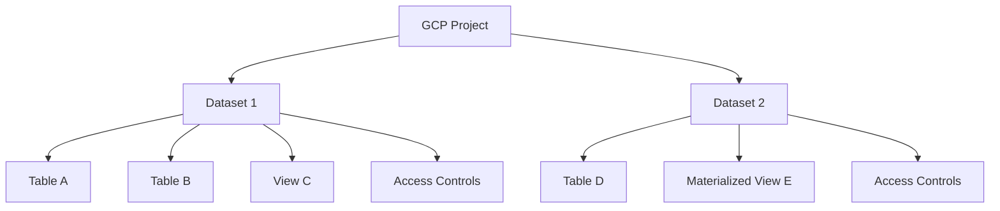

# How to Use Ansible to Manage GCP BigQuery Datasets

Author: [nawazdhandala](https://www.github.com/nawazdhandala)

Tags: Ansible, GCP, BigQuery, Data Warehouse, Analytics

Description: Create and manage GCP BigQuery datasets, tables, and access controls with Ansible for reproducible data warehouse infrastructure.

---

BigQuery is Google's serverless data warehouse that can process petabytes of data with SQL queries. Before you can load data or run queries, you need to set up datasets (which are containers for tables), define table schemas, configure access controls, and set up expiration policies. Managing this through the console works for a quick prototype, but production data platforms need version-controlled infrastructure. Ansible lets you define your BigQuery resources as code, making it possible to replicate your data warehouse setup across projects and environments.

## BigQuery Resource Hierarchy



Datasets are the primary organizational unit. They hold tables, views, and access controls. Each dataset belongs to a specific location (region or multi-region), and once created, the location cannot be changed.

## Prerequisites

- Ansible 2.9+ with the `google.cloud` collection
- GCP service account with BigQuery Admin role
- BigQuery API enabled

```bash
ansible-galaxy collection install google.cloud
pip install google-auth requests google-api-python-client

gcloud services enable bigquery.googleapis.com --project=my-project-123
```

## Creating a Dataset

```yaml
# create-dataset.yml - Create a BigQuery dataset
---
- name: Create BigQuery Dataset
  hosts: localhost
  connection: local
  gather_facts: false

  vars:
    gcp_project: "my-project-123"
    gcp_cred_kind: "serviceaccount"
    gcp_cred_file: "/opt/ansible/gcp-credentials.json"

  tasks:
    - name: Create the analytics dataset
      google.cloud.gcp_bigquery_dataset:
        name: "analytics"
        friendly_name: "Analytics Data"
        description: "Main analytics dataset containing user events and product metrics"
        location: "US"
        default_table_expiration_ms: 0
        default_partition_expiration_ms: 0
        labels:
          environment: production
          team: data-engineering
          managed_by: ansible
        project: "{{ gcp_project }}"
        auth_kind: "{{ gcp_cred_kind }}"
        service_account_file: "{{ gcp_cred_file }}"
        state: present
      register: dataset

    - name: Show dataset details
      ansible.builtin.debug:
        msg: "Dataset '{{ dataset.datasetReference.datasetId }}' created in {{ dataset.location }}"
```

The `location` parameter is permanent. Choose `US` or `EU` for multi-region availability, or a specific region like `us-central1` if you need data residency. Setting `default_table_expiration_ms` to 0 means tables never expire automatically. For temporary or staging datasets, you might set this to something like 2592000000 (30 days in milliseconds).

## Creating Multiple Datasets

A typical data platform has several datasets for different purposes:

```yaml
# create-datasets.yml - Create all datasets for a data platform
---
- name: Create Data Platform Datasets
  hosts: localhost
  connection: local
  gather_facts: false

  vars:
    gcp_project: "my-project-123"
    gcp_cred_kind: "serviceaccount"
    gcp_cred_file: "/opt/ansible/gcp-credentials.json"
    datasets:
      - name: "raw_events"
        friendly_name: "Raw Events"
        description: "Raw event data ingested from applications"
        location: "US"
        default_table_expiration_ms: 7776000000  # 90 days
      - name: "analytics"
        friendly_name: "Analytics"
        description: "Processed analytics data and aggregations"
        location: "US"
        default_table_expiration_ms: 0
      - name: "ml_features"
        friendly_name: "ML Features"
        description: "Feature store for machine learning models"
        location: "US"
        default_table_expiration_ms: 0
      - name: "staging"
        friendly_name: "Staging Area"
        description: "Temporary staging tables for ETL pipelines"
        location: "US"
        default_table_expiration_ms: 86400000  # 24 hours
      - name: "reporting"
        friendly_name: "Reporting"
        description: "Views and tables for BI dashboards"
        location: "US"
        default_table_expiration_ms: 0

  tasks:
    - name: Create each dataset
      google.cloud.gcp_bigquery_dataset:
        name: "{{ item.name }}"
        friendly_name: "{{ item.friendly_name }}"
        description: "{{ item.description }}"
        location: "{{ item.location }}"
        default_table_expiration_ms: "{{ item.default_table_expiration_ms }}"
        labels:
          environment: production
          managed_by: ansible
        project: "{{ gcp_project }}"
        auth_kind: "{{ gcp_cred_kind }}"
        service_account_file: "{{ gcp_cred_file }}"
        state: present
      loop: "{{ datasets }}"
      register: dataset_results

    - name: Summary
      ansible.builtin.debug:
        msg: "Created {{ dataset_results.results | length }} datasets"
```

Notice the expiration strategies: raw events expire after 90 days (they have been processed by then), staging tables expire after 24 hours (they are temporary by definition), and analytics and reporting datasets have no expiration (this data needs to be available long-term).

## Creating Tables with Schema Definitions

```yaml
# create-tables.yml - Create BigQuery tables with specific schemas
---
- name: Create BigQuery Tables
  hosts: localhost
  connection: local
  gather_facts: false

  vars:
    gcp_project: "my-project-123"
    gcp_cred_kind: "serviceaccount"
    gcp_cred_file: "/opt/ansible/gcp-credentials.json"

  tasks:
    - name: Get dataset reference
      google.cloud.gcp_bigquery_dataset:
        name: "analytics"
        location: "US"
        project: "{{ gcp_project }}"
        auth_kind: "{{ gcp_cred_kind }}"
        service_account_file: "{{ gcp_cred_file }}"
        state: present
      register: dataset

    - name: Create user_events table
      google.cloud.gcp_bigquery_table:
        name: "user_events"
        dataset: "analytics"
        friendly_name: "User Events"
        description: "All user interaction events from the application"
        time_partitioning:
          type: DAY
          field: "event_timestamp"
          expiration_ms: 15552000000  # 180 days
        clustering:
          fields:
            - "user_id"
            - "event_type"
        schema:
          fields:
            - name: "event_id"
              type: "STRING"
              mode: "REQUIRED"
              description: "Unique event identifier"
            - name: "user_id"
              type: "STRING"
              mode: "REQUIRED"
              description: "User who triggered the event"
            - name: "event_type"
              type: "STRING"
              mode: "REQUIRED"
              description: "Type of event (page_view, click, purchase, etc.)"
            - name: "event_timestamp"
              type: "TIMESTAMP"
              mode: "REQUIRED"
              description: "When the event occurred"
            - name: "properties"
              type: "RECORD"
              mode: "NULLABLE"
              description: "Event-specific properties"
              fields:
                - name: "page_url"
                  type: "STRING"
                  mode: "NULLABLE"
                - name: "referrer"
                  type: "STRING"
                  mode: "NULLABLE"
                - name: "device_type"
                  type: "STRING"
                  mode: "NULLABLE"
            - name: "session_id"
              type: "STRING"
              mode: "NULLABLE"
              description: "Browser session identifier"
        labels:
          data_classification: internal
        project: "{{ gcp_project }}"
        auth_kind: "{{ gcp_cred_kind }}"
        service_account_file: "{{ gcp_cred_file }}"
        state: present
      register: events_table

    - name: Show table info
      ansible.builtin.debug:
        msg: "Table 'user_events' created, partitioned by event_timestamp, clustered by user_id and event_type"
```

The `time_partitioning` and `clustering` configuration is where BigQuery performance and cost optimization happens. Partitioning by day on `event_timestamp` means queries that filter by date only scan the relevant partitions. Clustering by `user_id` and `event_type` further sorts data within each partition for efficient filtering. Together, these can reduce query costs by orders of magnitude on large tables.

## Configuring Dataset Access Controls

Control who can query and modify data:

```yaml
# dataset-access-controls.yml - Configure access on BigQuery datasets
---
- name: Configure Dataset Access Controls
  hosts: localhost
  connection: local
  gather_facts: false

  vars:
    gcp_project: "my-project-123"

  tasks:
    - name: Grant data analysts read access to analytics dataset
      ansible.builtin.command: >
        bq update --project_id={{ gcp_project }}
        --dataset_id=analytics
        --source=/dev/stdin <<'EOF'
        {
          "access": [
            {"role": "WRITER", "specialGroup": "projectWriters"},
            {"role": "OWNER", "specialGroup": "projectOwners"},
            {"role": "READER", "specialGroup": "projectReaders"},
            {"role": "READER", "groupByEmail": "data-analysts@example.com"},
            {"role": "WRITER", "groupByEmail": "data-engineers@example.com"},
            {"role": "READER", "userByEmail": "dashboard-sa@my-project-123.iam.gserviceaccount.com"}
          ]
        }
        EOF
      changed_when: true

    - name: Grant limited access using gcloud IAM binding
      ansible.builtin.command: >
        gcloud projects add-iam-policy-binding {{ gcp_project }}
        --member="group:data-analysts@example.com"
        --role="roles/bigquery.dataViewer"
        --quiet
      changed_when: true

    - name: Grant job execution access for analysts
      ansible.builtin.command: >
        gcloud projects add-iam-policy-binding {{ gcp_project }}
        --member="group:data-analysts@example.com"
        --role="roles/bigquery.jobUser"
        --quiet
      changed_when: true
```

Access control in BigQuery works at two levels: dataset-level access (who can read/write specific datasets) and project-level IAM (who can run queries and manage resources). Both are needed. A user with `bigquery.dataViewer` can see data, but they also need `bigquery.jobUser` to actually run queries.

## Creating Views

Views provide abstracted, query-friendly layers over raw tables:

```yaml
# create-views.yml - Create BigQuery views
---
- name: Create BigQuery Views
  hosts: localhost
  connection: local
  gather_facts: false

  vars:
    gcp_project: "my-project-123"
    gcp_cred_kind: "serviceaccount"
    gcp_cred_file: "/opt/ansible/gcp-credentials.json"

  tasks:
    - name: Create daily active users view
      google.cloud.gcp_bigquery_table:
        name: "daily_active_users"
        dataset: "reporting"
        friendly_name: "Daily Active Users"
        description: "Aggregated daily active user counts"
        view:
          query: |
            SELECT
              DATE(event_timestamp) as date,
              COUNT(DISTINCT user_id) as active_users,
              COUNT(*) as total_events
            FROM `{{ gcp_project }}.analytics.user_events`
            WHERE event_timestamp >= TIMESTAMP_SUB(CURRENT_TIMESTAMP(), INTERVAL 90 DAY)
            GROUP BY 1
            ORDER BY 1 DESC
          use_legacy_sql: false
        labels:
          type: view
          domain: user-metrics
        project: "{{ gcp_project }}"
        auth_kind: "{{ gcp_cred_kind }}"
        service_account_file: "{{ gcp_cred_file }}"
        state: present

    - name: Create event type summary view
      google.cloud.gcp_bigquery_table:
        name: "event_type_summary"
        dataset: "reporting"
        friendly_name: "Event Type Summary"
        description: "Summary of events by type for the last 30 days"
        view:
          query: |
            SELECT
              event_type,
              DATE(event_timestamp) as date,
              COUNT(*) as event_count,
              COUNT(DISTINCT user_id) as unique_users
            FROM `{{ gcp_project }}.analytics.user_events`
            WHERE event_timestamp >= TIMESTAMP_SUB(CURRENT_TIMESTAMP(), INTERVAL 30 DAY)
            GROUP BY 1, 2
            ORDER BY 2 DESC, 3 DESC
          use_legacy_sql: false
        labels:
          type: view
          domain: event-metrics
        project: "{{ gcp_project }}"
        auth_kind: "{{ gcp_cred_kind }}"
        service_account_file: "{{ gcp_cred_file }}"
        state: present
```

Views are cheaper than materialized tables because they do not store data. They run the query every time someone accesses them. For frequently accessed views on large datasets, consider materialized views instead.

## Setting Up a Complete Data Platform

Combining everything into a comprehensive setup:

```yaml
# data-platform-setup.yml - Complete BigQuery data platform
---
- name: Set Up BigQuery Data Platform
  hosts: localhost
  connection: local
  gather_facts: false

  vars:
    gcp_project: "my-project-123"
    gcp_cred_kind: "serviceaccount"
    gcp_cred_file: "/opt/ansible/gcp-credentials.json"
    location: "US"

  tasks:
    - name: Create raw data dataset
      google.cloud.gcp_bigquery_dataset:
        name: "raw"
        friendly_name: "Raw Data"
        description: "Raw ingested data before transformation"
        location: "{{ location }}"
        default_table_expiration_ms: 7776000000
        labels:
          layer: raw
          managed_by: ansible
        project: "{{ gcp_project }}"
        auth_kind: "{{ gcp_cred_kind }}"
        service_account_file: "{{ gcp_cred_file }}"
        state: present

    - name: Create transformed data dataset
      google.cloud.gcp_bigquery_dataset:
        name: "transformed"
        friendly_name: "Transformed Data"
        description: "Cleaned and transformed data ready for analysis"
        location: "{{ location }}"
        labels:
          layer: transformed
          managed_by: ansible
        project: "{{ gcp_project }}"
        auth_kind: "{{ gcp_cred_kind }}"
        service_account_file: "{{ gcp_cred_file }}"
        state: present

    - name: Create reporting dataset
      google.cloud.gcp_bigquery_dataset:
        name: "reporting"
        friendly_name: "Reporting"
        description: "Views and tables optimized for BI tools"
        location: "{{ location }}"
        labels:
          layer: reporting
          managed_by: ansible
        project: "{{ gcp_project }}"
        auth_kind: "{{ gcp_cred_kind }}"
        service_account_file: "{{ gcp_cred_file }}"
        state: present

    - name: Platform setup summary
      ansible.builtin.debug:
        msg: "Data platform datasets created: raw, transformed, reporting"
```

## Deleting Datasets

```yaml
# delete-dataset.yml - Remove a BigQuery dataset
---
- name: Delete BigQuery Dataset
  hosts: localhost
  connection: local
  gather_facts: false

  vars:
    gcp_project: "my-project-123"
    gcp_cred_kind: "serviceaccount"
    gcp_cred_file: "/opt/ansible/gcp-credentials.json"

  tasks:
    - name: Delete a dataset and all its tables
      ansible.builtin.command: >
        bq rm -r -f -d {{ gcp_project }}:old_staging_dataset
      changed_when: true

    - name: Confirm deletion
      ansible.builtin.debug:
        msg: "Dataset old_staging_dataset deleted with all contents"
```

The `-r` flag removes all tables in the dataset. Without it, BigQuery refuses to delete non-empty datasets. The `-f` flag skips the confirmation prompt.

## Summary

Managing BigQuery datasets and tables with Ansible brings the same infrastructure-as-code discipline to your data platform that you apply to compute and networking. The essential configuration decisions are: choose the right location based on data residency and latency needs, use time partitioning and clustering for cost-effective queries, set appropriate table expiration policies for each dataset tier, and configure access controls to enforce least-privilege access to sensitive data. With your BigQuery infrastructure in version-controlled playbooks, spinning up a new analytics environment or replicating your data platform across projects becomes straightforward.
