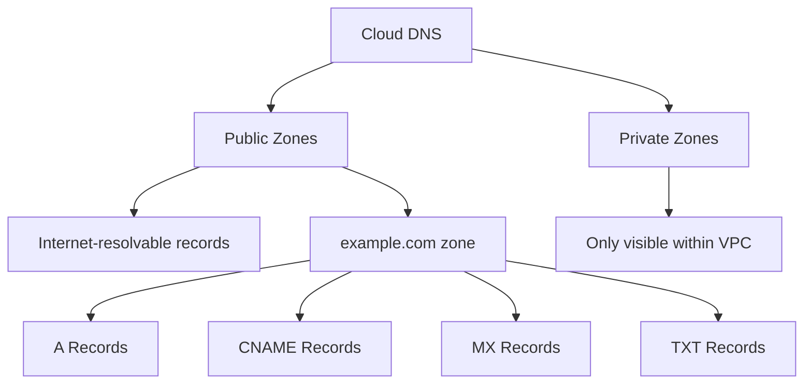

# How to Use Ansible to Manage GCP Cloud DNS

Author: [nawazdhandala](https://www.github.com/nawazdhandala)

Tags: Ansible, GCP, Cloud DNS, Networking, Domain Management

Description: Manage GCP Cloud DNS zones and records with Ansible including public and private zones, record sets, and DNS-based failover configurations.

---

DNS is the glue that connects domain names to your infrastructure. Cloud DNS is Google's scalable, reliable DNS service that you can manage programmatically. Whether you are setting up a new domain, adding records for a new service, or managing internal DNS for your VPC, Ansible lets you handle DNS changes through code rather than through the console. This is particularly valuable because DNS changes can have immediate, visible impact on your users, so having them reviewed in pull requests before deployment is worth the effort.

## Prerequisites

- Ansible 2.9+ with the `google.cloud` collection
- GCP service account with DNS Administrator role
- Cloud DNS API enabled

```bash
ansible-galaxy collection install google.cloud
pip install google-auth requests google-api-python-client

gcloud services enable dns.googleapis.com --project=my-project-123
```

## Cloud DNS Concepts



Public zones serve DNS records to the internet. Private zones serve records only to VMs within specified VPC networks, which is useful for internal service discovery.

## Creating a Public DNS Zone

```yaml
# create-public-zone.yml - Create a public Cloud DNS zone
---
- name: Create Public DNS Zone
  hosts: localhost
  connection: local
  gather_facts: false

  vars:
    gcp_project: "my-project-123"
    gcp_cred_kind: "serviceaccount"
    gcp_cred_file: "/opt/ansible/gcp-credentials.json"

  tasks:
    - name: Create a public DNS zone
      google.cloud.gcp_dns_managed_zone:
        name: "example-zone"
        dns_name: "example.com."
        description: "Public DNS zone for example.com"
        visibility: public
        project: "{{ gcp_project }}"
        auth_kind: "{{ gcp_cred_kind }}"
        service_account_file: "{{ gcp_cred_file }}"
        state: present
      register: dns_zone

    - name: Show nameservers
      ansible.builtin.debug:
        msg: "Zone created. Update your registrar with these nameservers: {{ dns_zone.nameServers | join(', ') }}"
```

After creating the zone, you need to update your domain registrar to point to the nameservers that Cloud DNS assigns. Until you do this, the zone exists but nobody on the internet will query it.

## Adding DNS Records

The `google.cloud.gcp_dns_resource_record_set` module manages individual records:

```yaml
# add-dns-records.yml - Add DNS records to a zone
---
- name: Add DNS Records
  hosts: localhost
  connection: local
  gather_facts: false

  vars:
    gcp_project: "my-project-123"
    gcp_cred_kind: "serviceaccount"
    gcp_cred_file: "/opt/ansible/gcp-credentials.json"
    zone_name: "example-zone"

  tasks:
    - name: Get the managed zone reference
      google.cloud.gcp_dns_managed_zone:
        name: "{{ zone_name }}"
        dns_name: "example.com."
        project: "{{ gcp_project }}"
        auth_kind: "{{ gcp_cred_kind }}"
        service_account_file: "{{ gcp_cred_file }}"
        state: present
      register: zone

    - name: Add A record for the root domain
      google.cloud.gcp_dns_resource_record_set:
        name: "example.com."
        type: A
        ttl: 300
        target:
          - "35.201.100.50"
          - "35.201.100.51"
        managed_zone: "{{ zone }}"
        project: "{{ gcp_project }}"
        auth_kind: "{{ gcp_cred_kind }}"
        service_account_file: "{{ gcp_cred_file }}"
        state: present

    - name: Add A record for www subdomain
      google.cloud.gcp_dns_resource_record_set:
        name: "www.example.com."
        type: A
        ttl: 300
        target:
          - "35.201.100.50"
        managed_zone: "{{ zone }}"
        project: "{{ gcp_project }}"
        auth_kind: "{{ gcp_cred_kind }}"
        service_account_file: "{{ gcp_cred_file }}"
        state: present

    - name: Add CNAME record for API subdomain
      google.cloud.gcp_dns_resource_record_set:
        name: "api.example.com."
        type: CNAME
        ttl: 300
        target:
          - "api-lb.example.com."
        managed_zone: "{{ zone }}"
        project: "{{ gcp_project }}"
        auth_kind: "{{ gcp_cred_kind }}"
        service_account_file: "{{ gcp_cred_file }}"
        state: present

    - name: Add MX records for email
      google.cloud.gcp_dns_resource_record_set:
        name: "example.com."
        type: MX
        ttl: 3600
        target:
          - "10 mail1.example.com."
          - "20 mail2.example.com."
        managed_zone: "{{ zone }}"
        project: "{{ gcp_project }}"
        auth_kind: "{{ gcp_cred_kind }}"
        service_account_file: "{{ gcp_cred_file }}"
        state: present

    - name: Add TXT record for SPF
      google.cloud.gcp_dns_resource_record_set:
        name: "example.com."
        type: TXT
        ttl: 3600
        target:
          - '"v=spf1 include:_spf.google.com ~all"'
        managed_zone: "{{ zone }}"
        project: "{{ gcp_project }}"
        auth_kind: "{{ gcp_cred_kind }}"
        service_account_file: "{{ gcp_cred_file }}"
        state: present
```

A few important details about DNS records in Cloud DNS. Every record name must end with a period (the root dot). This is the fully qualified domain name format. The TTL (Time to Live) is in seconds and controls how long DNS resolvers cache the record. Lower TTLs mean faster propagation of changes but more DNS queries to your zone.

## Managing Records in Bulk

For a complete zone setup:

```yaml
# bulk-dns-records.yml - Set up all DNS records for a domain
---
- name: Bulk DNS Record Setup
  hosts: localhost
  connection: local
  gather_facts: false

  vars:
    gcp_project: "my-project-123"
    gcp_cred_kind: "serviceaccount"
    gcp_cred_file: "/opt/ansible/gcp-credentials.json"
    zone_name: "example-zone"
    dns_records:
      - name: "example.com."
        type: A
        ttl: 300
        target: ["35.201.100.50"]
      - name: "www.example.com."
        type: CNAME
        ttl: 300
        target: ["example.com."]
      - name: "api.example.com."
        type: A
        ttl: 60
        target: ["35.201.100.60"]
      - name: "staging.example.com."
        type: A
        ttl: 300
        target: ["35.201.100.70"]
      - name: "mail.example.com."
        type: A
        ttl: 3600
        target: ["35.201.100.80"]
      - name: "example.com."
        type: MX
        ttl: 3600
        target: ["10 mail.example.com."]

  tasks:
    - name: Get the managed zone
      google.cloud.gcp_dns_managed_zone:
        name: "{{ zone_name }}"
        dns_name: "example.com."
        project: "{{ gcp_project }}"
        auth_kind: "{{ gcp_cred_kind }}"
        service_account_file: "{{ gcp_cred_file }}"
        state: present
      register: zone

    - name: Create all DNS records
      google.cloud.gcp_dns_resource_record_set:
        name: "{{ item.name }}"
        type: "{{ item.type }}"
        ttl: "{{ item.ttl }}"
        target: "{{ item.target }}"
        managed_zone: "{{ zone }}"
        project: "{{ gcp_project }}"
        auth_kind: "{{ gcp_cred_kind }}"
        service_account_file: "{{ gcp_cred_file }}"
        state: present
      loop: "{{ dns_records }}"
```

## Creating a Private DNS Zone

Private zones are great for internal service discovery:

```yaml
# create-private-zone.yml - Create a private DNS zone for internal services
---
- name: Create Private DNS Zone
  hosts: localhost
  connection: local
  gather_facts: false

  vars:
    gcp_project: "my-project-123"
    gcp_cred_kind: "serviceaccount"
    gcp_cred_file: "/opt/ansible/gcp-credentials.json"

  tasks:
    - name: Create private DNS zone
      google.cloud.gcp_dns_managed_zone:
        name: "internal-zone"
        dns_name: "internal.mycompany.com."
        description: "Private DNS zone for internal services"
        visibility: private
        private_visibility_config:
          networks:
            - network_url: "projects/{{ gcp_project }}/global/networks/production-vpc"
        project: "{{ gcp_project }}"
        auth_kind: "{{ gcp_cred_kind }}"
        service_account_file: "{{ gcp_cred_file }}"
        state: present
      register: private_zone

    - name: Add internal service records
      google.cloud.gcp_dns_resource_record_set:
        name: "{{ item.name }}"
        type: A
        ttl: 60
        target: "{{ item.ips }}"
        managed_zone: "{{ private_zone }}"
        project: "{{ gcp_project }}"
        auth_kind: "{{ gcp_cred_kind }}"
        service_account_file: "{{ gcp_cred_file }}"
        state: present
      loop:
        - name: "postgres.internal.mycompany.com."
          ips: ["10.0.1.100"]
        - name: "redis.internal.mycompany.com."
          ips: ["10.0.1.101"]
        - name: "elasticsearch.internal.mycompany.com."
          ips: ["10.0.1.102", "10.0.1.103", "10.0.1.104"]
```

VMs within the specified VPC network can resolve `postgres.internal.mycompany.com` to its private IP. VMs outside that network, and the broader internet, cannot see these records at all.

## Deleting DNS Records and Zones

```yaml
# cleanup-dns.yml - Remove DNS records and zones
---
- name: Cleanup DNS
  hosts: localhost
  connection: local
  gather_facts: false

  vars:
    gcp_project: "my-project-123"
    gcp_cred_kind: "serviceaccount"
    gcp_cred_file: "/opt/ansible/gcp-credentials.json"

  tasks:
    - name: Get the zone reference
      google.cloud.gcp_dns_managed_zone:
        name: "old-zone"
        dns_name: "old-domain.com."
        project: "{{ gcp_project }}"
        auth_kind: "{{ gcp_cred_kind }}"
        service_account_file: "{{ gcp_cred_file }}"
        state: present
      register: zone

    - name: Remove specific records
      google.cloud.gcp_dns_resource_record_set:
        name: "{{ item.name }}"
        type: "{{ item.type }}"
        managed_zone: "{{ zone }}"
        project: "{{ gcp_project }}"
        auth_kind: "{{ gcp_cred_kind }}"
        service_account_file: "{{ gcp_cred_file }}"
        state: absent
      loop:
        - { name: "www.old-domain.com.", type: "A" }
        - { name: "api.old-domain.com.", type: "CNAME" }

    - name: Delete the zone (must be empty of custom records first)
      google.cloud.gcp_dns_managed_zone:
        name: "old-zone"
        dns_name: "old-domain.com."
        project: "{{ gcp_project }}"
        auth_kind: "{{ gcp_cred_kind }}"
        service_account_file: "{{ gcp_cred_file }}"
        state: absent
```

You cannot delete a zone that contains records other than the default NS and SOA records. Remove all custom records first, then delete the zone.

## Summary

Managing Cloud DNS with Ansible makes DNS changes predictable and auditable. The key practices are: always end DNS names with a trailing dot, use low TTLs (60-300 seconds) for records that might change frequently, use private zones for internal service discovery instead of hardcoding IPs, and manage your records in a single playbook per zone so you have a complete picture of your DNS configuration. Since DNS changes affect user-facing traffic, having them go through version control and code review is one of the most impactful improvements you can make to your operations workflow.
