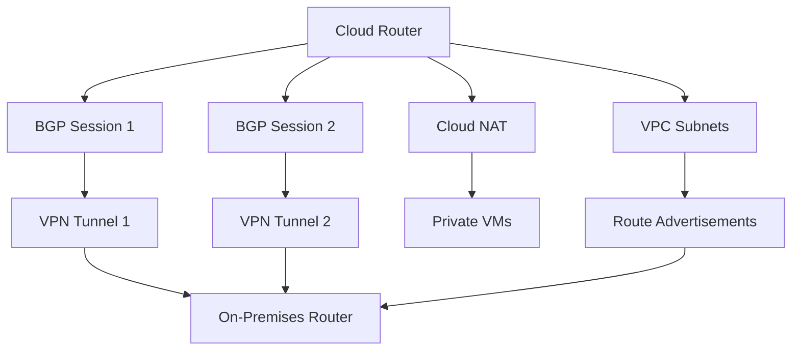

# How to Use Ansible to Manage GCP Cloud Router

Author: [nawazdhandala](https://www.github.com/nawazdhandala)

Tags: Ansible, GCP, Cloud Router, Networking, BGP

Description: Learn how to create and manage GCP Cloud Routers with Ansible for dynamic routing, VPN connectivity, and Cloud NAT integration.

---

Cloud Router is a fully distributed, managed Google Cloud service that provides dynamic routing for your VPC networks. It uses the Border Gateway Protocol (BGP) to exchange route information between your VPC network and your on-premises network or other cloud environments. Even if you are not doing hybrid networking, Cloud Router is required for Cloud NAT, Cloud Interconnect, and HA VPN. In this post, we will walk through managing Cloud Routers with Ansible.

## What Does Cloud Router Do?

Cloud Router serves several purposes depending on your architecture:

- **Dynamic route learning**: Automatically learns and advertises routes via BGP instead of requiring static route configuration.
- **Cloud NAT foundation**: Cloud NAT requires a Cloud Router to function, even though it does not use BGP in that case.
- **VPN connectivity**: HA VPN and classic VPN with dynamic routing both depend on Cloud Router.
- **Cloud Interconnect**: Both Dedicated and Partner Interconnect use Cloud Router for route exchange.

## Prerequisites

- Ansible 2.10+ with the `google.cloud` collection
- A GCP service account with Network Admin permissions
- A VPC network already created

```bash
# Install the GCP collection
ansible-galaxy collection install google.cloud
```

## Creating a Basic Cloud Router

Let us start with a simple Cloud Router in a specific region.

```yaml
# create-cloud-router.yml - Create a basic Cloud Router
---
- name: Create GCP Cloud Router
  hosts: localhost
  connection: local
  gather_facts: false

  vars:
    gcp_project: "my-project-id"
    gcp_auth_kind: "serviceaccount"
    gcp_service_account_file: "/path/to/service-account-key.json"
    region: "us-central1"
    network_name: "production-vpc"

  tasks:
    - name: Create a Cloud Router
      google.cloud.gcp_compute_router:
        name: "prod-router"
        region: "{{ region }}"
        network:
          selfLink: "projects/{{ gcp_project }}/global/networks/{{ network_name }}"
        bgp:
          # Private ASN range: 64512-65534 or 4200000000-4294967294
          asn: 64515
          advertise_mode: "DEFAULT"
        description: "Production Cloud Router for us-central1"
        project: "{{ gcp_project }}"
        auth_kind: "{{ gcp_auth_kind }}"
        service_account_file: "{{ gcp_service_account_file }}"
        state: present
      register: router

    - name: Show router details
      ansible.builtin.debug:
        msg: |
          Router: {{ router.name }}
          Region: {{ router.region }}
          ASN: {{ router.bgp.asn }}
```

## Cloud Router with Custom Route Advertisements

By default, Cloud Router advertises all subnet routes in your VPC. You can customize this to advertise only specific subnets or add custom IP ranges.

```yaml
# router-custom-advertisements.yml - Router with custom route ads
---
- name: Create Cloud Router with Custom Advertisements
  hosts: localhost
  connection: local
  gather_facts: false

  vars:
    gcp_project: "my-project-id"
    gcp_auth_kind: "serviceaccount"
    gcp_service_account_file: "/path/to/service-account-key.json"
    region: "us-central1"

  tasks:
    - name: Create router with custom route advertisements
      google.cloud.gcp_compute_router:
        name: "custom-adv-router"
        region: "{{ region }}"
        network:
          selfLink: "projects/{{ gcp_project }}/global/networks/production-vpc"
        bgp:
          asn: 64516
          # CUSTOM mode lets you control which routes are advertised
          advertise_mode: "CUSTOM"
          advertised_groups:
            # Still advertise all subnets
            - "ALL_SUBNETS"
          # Plus these custom ranges
          advertised_ip_ranges:
            - range: "10.100.0.0/16"
              description: "Custom shared services range"
            - range: "10.200.0.0/16"
              description: "Custom monitoring range"
        project: "{{ gcp_project }}"
        auth_kind: "{{ gcp_auth_kind }}"
        service_account_file: "{{ gcp_service_account_file }}"
        state: present
      register: router

    - name: Show advertisement config
      ansible.builtin.debug:
        msg: |
          Router: {{ router.name }}
          Advertise mode: CUSTOM
          Advertised groups: ALL_SUBNETS
          Custom ranges: 10.100.0.0/16, 10.200.0.0/16
```

## Cloud Router for HA VPN

One of the most common uses for Cloud Router is with HA VPN for site-to-site connectivity. Here is how to set up a Cloud Router that works with an HA VPN gateway.

```yaml
# router-for-ha-vpn.yml - Cloud Router configured for HA VPN
---
- name: Create Cloud Router for HA VPN
  hosts: localhost
  connection: local
  gather_facts: false

  vars:
    gcp_project: "my-project-id"
    gcp_auth_kind: "serviceaccount"
    gcp_service_account_file: "/path/to/service-account-key.json"
    region: "us-central1"
    # Your on-premises router ASN
    peer_asn: 65001

  tasks:
    - name: Create the Cloud Router for VPN
      google.cloud.gcp_compute_router:
        name: "vpn-router"
        region: "{{ region }}"
        network:
          selfLink: "projects/{{ gcp_project }}/global/networks/production-vpc"
        bgp:
          asn: 64517
          advertise_mode: "DEFAULT"
        project: "{{ gcp_project }}"
        auth_kind: "{{ gcp_auth_kind }}"
        service_account_file: "{{ gcp_service_account_file }}"
        state: present
      register: router

    - name: Create HA VPN gateway
      google.cloud.gcp_compute_ha_vpn_gateway:
        name: "ha-vpn-gateway"
        region: "{{ region }}"
        network:
          selfLink: "projects/{{ gcp_project }}/global/networks/production-vpc"
        project: "{{ gcp_project }}"
        auth_kind: "{{ gcp_auth_kind }}"
        service_account_file: "{{ gcp_service_account_file }}"
        state: present
      register: vpn_gateway

    - name: Create an external VPN gateway (represents on-prem)
      google.cloud.gcp_compute_external_vpn_gateway:
        name: "onprem-vpn-gateway"
        redundancy_type: "SINGLE_IP_INTERNALLY_REDUNDANT"
        interfaces:
          - id: 0
            ip_address: "203.0.113.1"
        project: "{{ gcp_project }}"
        auth_kind: "{{ gcp_auth_kind }}"
        service_account_file: "{{ gcp_service_account_file }}"
        state: present
      register: external_gateway

    - name: Show VPN setup info
      ansible.builtin.debug:
        msg: |
          Cloud Router: {{ router.name }} (ASN {{ router.bgp.asn }})
          HA VPN Gateway: {{ vpn_gateway.name }}
          External Gateway: {{ external_gateway.name }}
          Next: Create VPN tunnels and BGP sessions.
```

## Cloud Router Architecture



## Creating Routers in Multiple Regions

For multi-region deployments, you need a Cloud Router in each region.

```yaml
# multi-region-routers.yml - Deploy Cloud Routers across regions
---
- name: Create Multi-Region Cloud Routers
  hosts: localhost
  connection: local
  gather_facts: false

  vars:
    gcp_project: "my-project-id"
    gcp_auth_kind: "serviceaccount"
    gcp_service_account_file: "/path/to/service-account-key.json"
    network_name: "production-vpc"

    # Define routers for each region
    routers:
      - name: "prod-router-us-central"
        region: "us-central1"
        asn: 64520
      - name: "prod-router-us-east"
        region: "us-east1"
        asn: 64521
      - name: "prod-router-europe"
        region: "europe-west1"
        asn: 64522
      - name: "prod-router-asia"
        region: "asia-east1"
        asn: 64523

  tasks:
    - name: Create Cloud Routers in all regions
      google.cloud.gcp_compute_router:
        name: "{{ item.name }}"
        region: "{{ item.region }}"
        network:
          selfLink: "projects/{{ gcp_project }}/global/networks/{{ network_name }}"
        bgp:
          asn: "{{ item.asn }}"
          advertise_mode: "DEFAULT"
        description: "Production router for {{ item.region }}"
        project: "{{ gcp_project }}"
        auth_kind: "{{ gcp_auth_kind }}"
        service_account_file: "{{ gcp_service_account_file }}"
        state: present
      loop: "{{ routers }}"
      register: router_results

    - name: Summary of created routers
      ansible.builtin.debug:
        msg: "Router {{ item.item.name }} in {{ item.item.region }} (ASN {{ item.item.asn }})"
      loop: "{{ router_results.results }}"
```

## Cloud Router with Cloud NAT

The most common use case for Cloud Router is as the foundation for Cloud NAT. Here is the complete setup.

```yaml
# router-with-nat.yml - Cloud Router and NAT together
---
- name: Cloud Router with NAT Configuration
  hosts: localhost
  connection: local
  gather_facts: false

  vars:
    gcp_project: "my-project-id"
    gcp_auth_kind: "serviceaccount"
    gcp_service_account_file: "/path/to/service-account-key.json"
    region: "us-central1"
    network_name: "production-vpc"

  tasks:
    - name: Create the Cloud Router
      google.cloud.gcp_compute_router:
        name: "nat-router"
        region: "{{ region }}"
        network:
          selfLink: "projects/{{ gcp_project }}/global/networks/{{ network_name }}"
        bgp:
          asn: 64530
        project: "{{ gcp_project }}"
        auth_kind: "{{ gcp_auth_kind }}"
        service_account_file: "{{ gcp_service_account_file }}"
        state: present
      register: router

    - name: Configure Cloud NAT on the router
      google.cloud.gcp_compute_router_nat:
        name: "production-nat"
        router: "{{ router }}"
        region: "{{ region }}"
        nat_ip_allocate_option: "AUTO_ONLY"
        source_subnetwork_ip_ranges_to_nat: "ALL_SUBNETWORKS_ALL_IP_RANGES"
        min_ports_per_vm: 128
        log_config:
          enable: true
          filter: "ERRORS_ONLY"
        project: "{{ gcp_project }}"
        auth_kind: "{{ gcp_auth_kind }}"
        service_account_file: "{{ gcp_service_account_file }}"
        state: present
      register: nat_config

    - name: Show complete setup
      ansible.builtin.debug:
        msg: |
          Router: {{ router.name }} (ASN {{ router.bgp.asn }})
          NAT: {{ nat_config.name }}
          All VMs in {{ network_name }} / {{ region }} can now access the internet
          without public IP addresses.
```

## Gathering Router Information

Sometimes you need to check the status of existing routers.

```yaml
# get-router-info.yml - Retrieve Cloud Router details
---
- name: Get Cloud Router Information
  hosts: localhost
  connection: local
  gather_facts: false

  vars:
    gcp_project: "my-project-id"
    gcp_auth_kind: "serviceaccount"
    gcp_service_account_file: "/path/to/service-account-key.json"
    region: "us-central1"

  tasks:
    - name: Get all routers in the region
      google.cloud.gcp_compute_router_info:
        region: "{{ region }}"
        project: "{{ gcp_project }}"
        auth_kind: "{{ gcp_auth_kind }}"
        service_account_file: "{{ gcp_service_account_file }}"
      register: routers

    - name: List all routers
      ansible.builtin.debug:
        msg: |
          Router: {{ item.name }}
          Region: {{ item.region }}
          Network: {{ item.network }}
          ASN: {{ item.bgp.asn }}
      loop: "{{ routers.resources }}"
```

## Cleanup

Removing a Cloud Router requires that you first remove any dependent resources (NAT configs, VPN tunnels, BGP peers).

```yaml
# cleanup-router.yml - Remove a Cloud Router and its dependencies
---
- name: Cleanup Cloud Router
  hosts: localhost
  connection: local
  gather_facts: false

  vars:
    gcp_project: "my-project-id"
    gcp_auth_kind: "serviceaccount"
    gcp_service_account_file: "/path/to/service-account-key.json"
    region: "us-central1"

  tasks:
    - name: Get the router reference
      google.cloud.gcp_compute_router:
        name: "nat-router"
        region: "{{ region }}"
        network:
          selfLink: "projects/{{ gcp_project }}/global/networks/production-vpc"
        bgp:
          asn: 64530
        project: "{{ gcp_project }}"
        auth_kind: "{{ gcp_auth_kind }}"
        service_account_file: "{{ gcp_service_account_file }}"
        state: present
      register: router

    - name: Remove NAT configuration first
      google.cloud.gcp_compute_router_nat:
        name: "production-nat"
        router: "{{ router }}"
        region: "{{ region }}"
        project: "{{ gcp_project }}"
        auth_kind: "{{ gcp_auth_kind }}"
        service_account_file: "{{ gcp_service_account_file }}"
        state: absent

    - name: Delete the Cloud Router
      google.cloud.gcp_compute_router:
        name: "nat-router"
        region: "{{ region }}"
        network:
          selfLink: "projects/{{ gcp_project }}/global/networks/production-vpc"
        project: "{{ gcp_project }}"
        auth_kind: "{{ gcp_auth_kind }}"
        service_account_file: "{{ gcp_service_account_file }}"
        state: absent
```

## Best Practices

1. **Use unique ASN numbers.** Each Cloud Router needs an ASN. Use the private ASN range (64512-65534) and keep track of which ASN you use where to avoid conflicts.

2. **Deploy routers per region.** Cloud Routers are regional resources. If you have subnets in multiple regions, you need a router in each.

3. **Plan your route advertisements.** The default mode advertises all subnets, which is usually fine. Switch to custom mode only when you need to advertise additional ranges or restrict what gets advertised.

4. **Consider redundancy.** For production VPN connections, use HA VPN with two tunnels for 99.99% availability.

5. **Label your routers.** While Cloud Router does not support labels directly, document your routers in your Ansible playbooks and keep them in version control.

## Conclusion

Cloud Router is a foundational networking component in GCP that you will encounter in many different scenarios, from simple Cloud NAT setups to complex hybrid networking with VPN and Interconnect. Ansible gives you a clean way to manage Cloud Routers as code, making your network configuration reproducible and auditable. Whether you are setting up a single router for NAT or deploying routers across multiple regions for a global network, the playbooks in this post give you a solid starting point.
