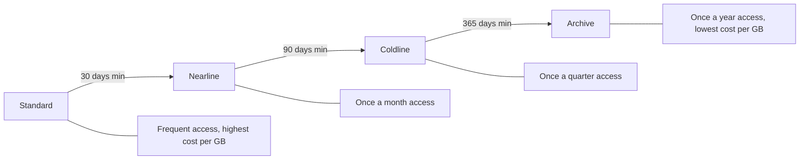

# How to Use Ansible to Manage GCP Cloud Storage Buckets

Author: [nawazdhandala](https://www.github.com/nawazdhandala)

Tags: Ansible, GCP, Cloud Storage, Object Storage, Automation

Description: Create and manage GCP Cloud Storage buckets with Ansible including lifecycle policies, versioning, access controls, and cross-region setup.

---

Cloud Storage is GCP's object storage service, used for everything from static website hosting to data lake storage to backup archives. Bucket configuration is surprisingly nuanced when you factor in storage classes, lifecycle policies, versioning, access controls, and retention policies. Managing this through the console for a single bucket is fine, but when you have dozens of buckets across multiple projects, Ansible gives you the consistency and repeatability you need.

## Prerequisites

- Ansible 2.9+ with the `google.cloud` collection
- GCP service account with Storage Admin role
- Cloud Storage API enabled

```bash
ansible-galaxy collection install google.cloud
pip install google-auth requests google-api-python-client
```

## Storage Classes

GCP offers different storage classes at different price points:



## Creating a Basic Bucket

```yaml
# create-bucket.yml - Create a Cloud Storage bucket with standard settings
---
- name: Create GCP Storage Bucket
  hosts: localhost
  connection: local
  gather_facts: false

  vars:
    gcp_project: "my-project-123"
    gcp_cred_kind: "serviceaccount"
    gcp_cred_file: "/opt/ansible/gcp-credentials.json"

  tasks:
    - name: Create a standard storage bucket
      google.cloud.gcp_storage_bucket:
        name: "my-project-app-data-prod"
        location: "US"
        storage_class: "STANDARD"
        project: "{{ gcp_project }}"
        auth_kind: "{{ gcp_cred_kind }}"
        service_account_file: "{{ gcp_cred_file }}"
        labels:
          environment: production
          team: platform
          managed_by: ansible
        state: present
      register: bucket

    - name: Show bucket details
      ansible.builtin.debug:
        msg: "Bucket '{{ bucket.name }}' created in {{ bucket.location }}"
```

Bucket names are globally unique across all of GCP, which is why I include the project name in the bucket name. The `location` can be a multi-region (like `US` or `EU`), a dual-region (like `US-EAST1+US-WEST1`), or a single region (like `us-central1`). Multi-region gives you automatic redundancy across regions but costs more.

## Creating a Bucket with Versioning

Versioning keeps a history of every object, protecting against accidental deletions and overwrites:

```yaml
# create-versioned-bucket.yml - Bucket with object versioning enabled
---
- name: Create Versioned Bucket
  hosts: localhost
  connection: local
  gather_facts: false

  vars:
    gcp_project: "my-project-123"
    gcp_cred_kind: "serviceaccount"
    gcp_cred_file: "/opt/ansible/gcp-credentials.json"

  tasks:
    - name: Create bucket with versioning and lifecycle rules
      google.cloud.gcp_storage_bucket:
        name: "my-project-config-backups"
        location: "us-central1"
        storage_class: "STANDARD"
        versioning:
          enabled: true
        lifecycle:
          rule:
            - action:
                type: Delete
              condition:
                num_newer_versions: 5
                is_live: false
            - action:
                type: SetStorageClass
                storage_class: NEARLINE
              condition:
                age: 30
                matches_storage_class:
                  - STANDARD
        project: "{{ gcp_project }}"
        auth_kind: "{{ gcp_cred_kind }}"
        service_account_file: "{{ gcp_cred_file }}"
        labels:
          purpose: config-backups
          versioned: "true"
        state: present
      register: versioned_bucket

    - name: Confirm bucket creation
      ansible.builtin.debug:
        msg: "Versioned bucket '{{ versioned_bucket.name }}' created with lifecycle rules"
```

The lifecycle rules in this example do two things: they keep only the 5 most recent versions of each object (deleting older non-current versions), and they automatically move objects older than 30 days from Standard to Nearline storage to save costs.

## Creating Buckets for Different Use Cases

Here is a playbook that creates several buckets for a typical application stack:

```yaml
# create-app-buckets.yml - Create buckets for different application needs
---
- name: Create Application Buckets
  hosts: localhost
  connection: local
  gather_facts: false

  vars:
    gcp_project: "my-project-123"
    gcp_cred_kind: "serviceaccount"
    gcp_cred_file: "/opt/ansible/gcp-credentials.json"
    project_prefix: "myproject"
    env: "prod"

    buckets:
      - name: "{{ project_prefix }}-{{ env }}-uploads"
        location: "us-central1"
        storage_class: "STANDARD"
        versioning: true
        purpose: "User uploaded files"
        lifecycle_rules:
          - action:
              type: Delete
            condition:
              age: 365
      - name: "{{ project_prefix }}-{{ env }}-logs"
        location: "us-central1"
        storage_class: "STANDARD"
        versioning: false
        purpose: "Application logs"
        lifecycle_rules:
          - action:
              type: SetStorageClass
              storage_class: COLDLINE
            condition:
              age: 90
          - action:
              type: Delete
            condition:
              age: 365
      - name: "{{ project_prefix }}-{{ env }}-backups"
        location: "US"
        storage_class: "NEARLINE"
        versioning: true
        purpose: "Database backups"
        lifecycle_rules:
          - action:
              type: SetStorageClass
              storage_class: ARCHIVE
            condition:
              age: 180
      - name: "{{ project_prefix }}-{{ env }}-static-assets"
        location: "US"
        storage_class: "STANDARD"
        versioning: false
        purpose: "Static website assets"
        lifecycle_rules: []

  tasks:
    - name: Create each application bucket
      google.cloud.gcp_storage_bucket:
        name: "{{ item.name }}"
        location: "{{ item.location }}"
        storage_class: "{{ item.storage_class }}"
        versioning:
          enabled: "{{ item.versioning }}"
        lifecycle:
          rule: "{{ item.lifecycle_rules }}"
        project: "{{ gcp_project }}"
        auth_kind: "{{ gcp_cred_kind }}"
        service_account_file: "{{ gcp_cred_file }}"
        labels:
          environment: "{{ env }}"
          purpose: "{{ item.purpose | lower | replace(' ', '-') }}"
          managed_by: ansible
        state: present
      loop: "{{ buckets }}"
      register: bucket_results

    - name: List created buckets
      ansible.builtin.debug:
        msg: "{{ item.name }} ({{ item.location }}, {{ item.storage_class }})"
      loop: "{{ bucket_results.results }}"
```

## Configuring Uniform Bucket-Level Access

GCP recommends using uniform bucket-level access instead of per-object ACLs:

```yaml
# uniform-access-bucket.yml - Bucket with uniform bucket-level access
---
- name: Create Bucket with Uniform Access
  hosts: localhost
  connection: local
  gather_facts: false

  vars:
    gcp_project: "my-project-123"
    gcp_cred_kind: "serviceaccount"
    gcp_cred_file: "/opt/ansible/gcp-credentials.json"

  tasks:
    - name: Create bucket with uniform access control
      google.cloud.gcp_storage_bucket:
        name: "my-project-secure-data"
        location: "us-central1"
        storage_class: "STANDARD"
        iam_configuration:
          uniform_bucket_level_access:
            enabled: true
        project: "{{ gcp_project }}"
        auth_kind: "{{ gcp_cred_kind }}"
        service_account_file: "{{ gcp_cred_file }}"
        labels:
          security_level: high
          managed_by: ansible
        state: present
```

With uniform access enabled, all access is controlled through IAM policies at the bucket level rather than per-object ACLs. This simplifies access management and is required for several GCP features like VPC Service Controls.

## Setting Up CORS for Web Applications

If your bucket serves content to web browsers, you need CORS configuration:

```yaml
# cors-bucket.yml - Bucket configured for web application CORS
---
- name: Create CORS-Enabled Bucket
  hosts: localhost
  connection: local
  gather_facts: false

  vars:
    gcp_project: "my-project-123"
    gcp_cred_kind: "serviceaccount"
    gcp_cred_file: "/opt/ansible/gcp-credentials.json"

  tasks:
    - name: Create bucket with CORS configuration
      google.cloud.gcp_storage_bucket:
        name: "my-project-web-assets"
        location: "US"
        storage_class: "STANDARD"
        cors:
          - origin:
              - "https://myapp.example.com"
              - "https://staging.myapp.example.com"
            method:
              - GET
              - HEAD
              - OPTIONS
            response_header:
              - Content-Type
              - Content-Length
            max_age_seconds: 3600
        project: "{{ gcp_project }}"
        auth_kind: "{{ gcp_cred_kind }}"
        service_account_file: "{{ gcp_cred_file }}"
        state: present
```

## Bucket with Retention Policy

For compliance requirements where objects must not be deleted before a certain period:

```yaml
# retention-bucket.yml - Bucket with retention policy for compliance
---
- name: Create Retention Bucket
  hosts: localhost
  connection: local
  gather_facts: false

  vars:
    gcp_project: "my-project-123"
    gcp_cred_kind: "serviceaccount"
    gcp_cred_file: "/opt/ansible/gcp-credentials.json"

  tasks:
    - name: Create bucket with 7-year retention policy
      google.cloud.gcp_storage_bucket:
        name: "my-project-audit-logs"
        location: "us-central1"
        storage_class: "COLDLINE"
        retention_policy:
          retention_period: 220752000
        versioning:
          enabled: true
        project: "{{ gcp_project }}"
        auth_kind: "{{ gcp_cred_kind }}"
        service_account_file: "{{ gcp_cred_file }}"
        labels:
          compliance: sox
          retention: 7-years
        state: present
```

The retention period is in seconds. 220,752,000 seconds equals roughly 7 years. Once a retention policy is set, objects in the bucket cannot be deleted or overwritten until the retention period expires.

## Deleting Buckets

```yaml
# delete-bucket.yml - Remove a Cloud Storage bucket
---
- name: Delete Storage Bucket
  hosts: localhost
  connection: local
  gather_facts: false

  vars:
    gcp_project: "my-project-123"
    gcp_cred_kind: "serviceaccount"
    gcp_cred_file: "/opt/ansible/gcp-credentials.json"

  tasks:
    - name: Delete the bucket
      google.cloud.gcp_storage_bucket:
        name: "old-unused-bucket"
        project: "{{ gcp_project }}"
        auth_kind: "{{ gcp_cred_kind }}"
        service_account_file: "{{ gcp_cred_file }}"
        state: absent
```

Note that you can only delete a bucket that is empty. If the bucket has objects, you need to delete them first (which you can do with the `gsutil` command or the `gcp_storage_object` module).

## Summary

Managing Cloud Storage buckets with Ansible ensures your storage configuration is consistent, documented, and repeatable. The key decisions for each bucket are the storage class (based on access frequency), the location (based on latency and compliance needs), versioning (based on data protection requirements), and lifecycle rules (to automate data tiering and deletion). By encoding these decisions in playbooks, you avoid the drift that happens when different team members create buckets with different settings through the console.
