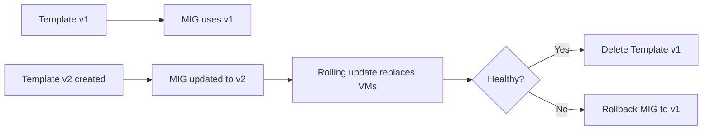

# How to Use Ansible to Manage GCP Instance Templates

Author: [nawazdhandala](https://www.github.com/nawazdhandala)

Tags: Ansible, GCP, Instance Templates, Compute Engine, Infrastructure as Code

Description: Comprehensive guide to creating and managing GCP instance templates with Ansible, covering versioning, startup scripts, and template updates.

---

Instance templates in GCP define the blueprint for virtual machine instances. They specify the machine type, boot disk image, network configuration, metadata, and everything else a VM needs. You cannot modify an instance template after creation (they are immutable), which actually turns out to be a good thing for infrastructure management. It forces you to think in terms of versions and makes rollbacks clean. Let us see how Ansible makes working with instance templates practical and repeatable.

## Why Instance Templates Matter

If you are running a single VM, you probably do not need an instance template. But the moment you scale beyond that, templates become essential:

- Managed Instance Groups require an instance template
- They ensure every VM in your fleet has the exact same configuration
- They serve as documentation of your VM configuration at each point in time
- They make it easy to roll back by switching to a previous template version

## Prerequisites

You will need:

- Ansible 2.10+ with the `google.cloud` collection
- A GCP service account with Compute Engine permissions
- The Compute Engine API enabled

```bash
# Install the Google Cloud Ansible collection
ansible-galaxy collection install google.cloud
```

## Creating a Basic Instance Template

Let us start with a straightforward template for a web server.

```yaml
# create-template.yml - Create a basic instance template
---
- name: Create GCP Instance Template
  hosts: localhost
  connection: local
  gather_facts: false

  vars:
    gcp_project: "my-project-id"
    gcp_auth_kind: "serviceaccount"
    gcp_service_account_file: "/path/to/service-account-key.json"

  tasks:
    - name: Create a web server instance template
      google.cloud.gcp_compute_instance_template:
        name: "web-server-v1"
        properties:
          machine_type: "e2-medium"
          disks:
            - auto_delete: true
              boot: true
              initialize_params:
                source_image: "projects/ubuntu-os-cloud/global/images/family/ubuntu-2204-lts"
                disk_size_gb: 20
                disk_type: "pd-balanced"
          network_interfaces:
            - network:
                selfLink: "projects/{{ gcp_project }}/global/networks/default"
              access_configs:
                - name: "External NAT"
                  type: "ONE_TO_ONE_NAT"
          labels:
            role: "web-server"
            version: "v1"
            managed_by: "ansible"
          tags:
            items:
              - "http-server"
              - "https-server"
        project: "{{ gcp_project }}"
        auth_kind: "{{ gcp_auth_kind }}"
        service_account_file: "{{ gcp_service_account_file }}"
        state: present
      register: template

    - name: Show template details
      ansible.builtin.debug:
        msg: |
          Template: {{ template.name }}
          Self link: {{ template.selfLink }}
```

## Template with Startup Script

Most production templates include a startup script that bootstraps the instance. You can embed the script inline or reference a file.

```yaml
# create-template-with-startup.yml - Template with embedded startup script
---
- name: Create Template with Startup Script
  hosts: localhost
  connection: local
  gather_facts: false

  vars:
    gcp_project: "my-project-id"
    gcp_auth_kind: "serviceaccount"
    gcp_service_account_file: "/path/to/service-account-key.json"

  tasks:
    - name: Create app server template with startup script
      google.cloud.gcp_compute_instance_template:
        name: "app-server-v1"
        properties:
          machine_type: "e2-standard-2"
          disks:
            - auto_delete: true
              boot: true
              initialize_params:
                source_image: "projects/ubuntu-os-cloud/global/images/family/ubuntu-2204-lts"
                disk_size_gb: 30
                disk_type: "pd-balanced"
            # Additional data disk
            - auto_delete: true
              boot: false
              initialize_params:
                disk_size_gb: 100
                disk_type: "pd-balanced"
          network_interfaces:
            - network:
                selfLink: "projects/{{ gcp_project }}/global/networks/default"
              subnetwork:
                selfLink: "projects/{{ gcp_project }}/regions/us-central1/subnetworks/default"
              access_configs:
                - name: "External NAT"
                  type: "ONE_TO_ONE_NAT"
          metadata:
            # Startup script runs on every boot
            startup-script: |
              #!/bin/bash
              set -e

              # Install required packages
              apt-get update
              apt-get install -y docker.io docker-compose nginx

              # Format and mount the data disk if not already done
              if ! blkid /dev/sdb > /dev/null 2>&1; then
                mkfs.ext4 -F /dev/sdb
              fi
              mkdir -p /mnt/data
              mount -o defaults,nofail /dev/sdb /mnt/data

              # Start Docker
              systemctl enable docker
              systemctl start docker

              # Pull and run the application
              docker pull myregistry/myapp:latest
              docker run -d --restart=always -p 8080:8080 myregistry/myapp:latest

              # Configure nginx as reverse proxy
              cat > /etc/nginx/sites-available/default <<'NGINX'
              server {
                  listen 80;
                  location / {
                      proxy_pass http://localhost:8080;
                      proxy_set_header Host $host;
                      proxy_set_header X-Real-IP $remote_addr;
                  }
              }
              NGINX
              systemctl restart nginx
            # Shutdown script for graceful cleanup
            shutdown-script: |
              #!/bin/bash
              docker stop $(docker ps -q) || true
          service_accounts:
            - email: "default"
              scopes:
                - "https://www.googleapis.com/auth/cloud-platform"
          labels:
            role: "app-server"
            version: "v1"
          tags:
            items:
              - "http-server"
              - "app-server"
        project: "{{ gcp_project }}"
        auth_kind: "{{ gcp_auth_kind }}"
        service_account_file: "{{ gcp_service_account_file }}"
        state: present
      register: template

    - name: Display template info
      ansible.builtin.debug:
        msg: "Template created: {{ template.name }}"
```

## Template Versioning Strategy

Since instance templates are immutable, you need a versioning strategy. Here is an approach that uses a version variable and creates new templates alongside old ones.

```yaml
# versioned-template.yml - Create versioned templates for safe rollouts
---
- name: Create Versioned Instance Template
  hosts: localhost
  connection: local
  gather_facts: false

  vars:
    gcp_project: "my-project-id"
    gcp_auth_kind: "serviceaccount"
    gcp_service_account_file: "/path/to/service-account-key.json"
    app_name: "api-server"
    app_version: "v3"
    machine_type: "e2-standard-4"
    disk_size: 50
    image_family: "ubuntu-2204-lts"

  tasks:
    - name: Create the versioned instance template
      google.cloud.gcp_compute_instance_template:
        name: "{{ app_name }}-{{ app_version }}"
        properties:
          machine_type: "{{ machine_type }}"
          disks:
            - auto_delete: true
              boot: true
              initialize_params:
                source_image: "projects/ubuntu-os-cloud/global/images/family/{{ image_family }}"
                disk_size_gb: "{{ disk_size }}"
                disk_type: "pd-balanced"
          network_interfaces:
            - network:
                selfLink: "projects/{{ gcp_project }}/global/networks/default"
              access_configs:
                - name: "External NAT"
                  type: "ONE_TO_ONE_NAT"
          labels:
            app: "{{ app_name }}"
            version: "{{ app_version }}"
            managed_by: "ansible"
          tags:
            items:
              - "{{ app_name }}"
        project: "{{ gcp_project }}"
        auth_kind: "{{ gcp_auth_kind }}"
        service_account_file: "{{ gcp_service_account_file }}"
        state: present
      register: new_template

    - name: Show the new template
      ansible.builtin.debug:
        msg: |
          New template: {{ new_template.name }}
          Use this in your MIG to perform a rolling update.
```

You can then update your MIG to use the new template:

```yaml
    - name: Update MIG to use the new template
      google.cloud.gcp_compute_instance_group_manager:
        name: "{{ app_name }}-mig"
        zone: "us-central1-a"
        base_instance_name: "{{ app_name }}"
        instance_template:
          selfLink: "{{ new_template.selfLink }}"
        target_size: 3
        project: "{{ gcp_project }}"
        auth_kind: "{{ gcp_auth_kind }}"
        service_account_file: "{{ gcp_service_account_file }}"
        state: present
```

## Template Versioning Flow



## Creating Templates from Custom Images

If you use Packer or another tool to build custom images, you can reference those in your templates:

```yaml
# template-from-custom-image.yml - Use a custom image in the template
---
- name: Create Template from Custom Image
  hosts: localhost
  connection: local
  gather_facts: false

  vars:
    gcp_project: "my-project-id"
    gcp_auth_kind: "serviceaccount"
    gcp_service_account_file: "/path/to/service-account-key.json"
    custom_image: "projects/my-project-id/global/images/my-app-image-20260220"

  tasks:
    - name: Create template using custom image
      google.cloud.gcp_compute_instance_template:
        name: "app-from-custom-image-v1"
        properties:
          machine_type: "e2-standard-2"
          disks:
            - auto_delete: true
              boot: true
              initialize_params:
                # Reference your custom Packer-built image
                source_image: "{{ custom_image }}"
                disk_size_gb: 30
                disk_type: "pd-ssd"
          network_interfaces:
            - network:
                selfLink: "projects/{{ gcp_project }}/global/networks/default"
              access_configs:
                - name: "External NAT"
                  type: "ONE_TO_ONE_NAT"
          labels:
            source_image: "my-app-image-20260220"
            managed_by: "ansible"
        project: "{{ gcp_project }}"
        auth_kind: "{{ gcp_auth_kind }}"
        service_account_file: "{{ gcp_service_account_file }}"
        state: present
```

## Listing and Cleaning Up Old Templates

Over time, old templates accumulate. Here is how to list them and remove ones you no longer need.

```yaml
# cleanup-templates.yml - Remove old instance templates
---
- name: Cleanup Old Instance Templates
  hosts: localhost
  connection: local
  gather_facts: false

  vars:
    gcp_project: "my-project-id"
    gcp_auth_kind: "serviceaccount"
    gcp_service_account_file: "/path/to/service-account-key.json"
    # Templates to keep (currently active versions)
    keep_templates:
      - "web-server-v3"
      - "api-server-v5"
      - "worker-v2"
    # Old templates to delete
    delete_templates:
      - "web-server-v1"
      - "web-server-v2"
      - "api-server-v3"
      - "api-server-v4"

  tasks:
    - name: Delete old templates that are no longer in use
      google.cloud.gcp_compute_instance_template:
        name: "{{ item }}"
        project: "{{ gcp_project }}"
        auth_kind: "{{ gcp_auth_kind }}"
        service_account_file: "{{ gcp_service_account_file }}"
        state: absent
      loop: "{{ delete_templates }}"

    - name: Confirm cleanup
      ansible.builtin.debug:
        msg: "Deleted {{ delete_templates | length }} old templates. Kept: {{ keep_templates }}"
```

## Tips for Working with Instance Templates

1. **Never reuse template names.** Since templates are immutable, trying to create a template with the same name and different properties will fail. Always increment the version.

2. **Keep startup scripts short.** Long startup scripts slow down instance boot time and are hard to debug. Consider baking most of your configuration into a custom image instead.

3. **Use service account scopes wisely.** Do not give every instance `cloud-platform` scope unless it actually needs it. Follow the principle of least privilege.

4. **Store templates in version control.** Your Ansible playbooks for templates are effectively your infrastructure documentation. Commit them alongside your application code.

5. **Test templates before rolling out.** Create a single instance from a new template and verify it works before updating your MIG.

6. **Keep at least one previous version.** Do not delete the previous template version until you have confirmed the new one is stable. You might need it for a quick rollback.

## Conclusion

Instance templates are the foundation of scalable GCP infrastructure, and Ansible gives you a clean way to manage them as code. The immutability of templates, combined with a version numbering strategy, gives you safe rollouts and easy rollbacks. Whether you are managing a handful of web servers or a large fleet of microservice instances, defining your templates in Ansible playbooks ensures consistency and makes your infrastructure changes auditable and reproducible.
