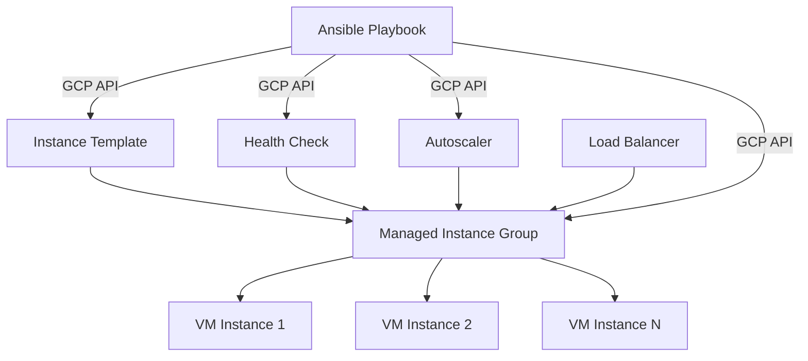

# How to Use Ansible to Manage GCP Managed Instance Groups

Author: [nawazdhandala](https://www.github.com/nawazdhandala)

Tags: Ansible, GCP, Managed Instance Groups, Autoscaling, Infrastructure as Code

Description: A practical guide to creating and managing GCP Managed Instance Groups with Ansible including autoscaling, rolling updates, and health checks.

---

Managed Instance Groups (MIGs) are one of the most useful features in Google Cloud. They let you run a group of identical VM instances that automatically scale up or down based on demand, self-heal when instances become unhealthy, and perform rolling updates without downtime. Managing MIGs through the console is tedious, especially when you have multiple environments. Ansible makes this much more manageable.

## What is a Managed Instance Group?

A MIG is a collection of VM instances that are all created from the same instance template. GCP manages these instances as a group, which means it can:

- Automatically replace instances that fail health checks
- Scale the number of instances based on CPU usage, HTTP load, or custom metrics
- Perform rolling updates when you change the instance template
- Distribute instances across multiple zones for high availability

## Prerequisites

You will need:

- Ansible 2.10+ with the `google.cloud` collection
- A GCP project with Compute Engine API enabled
- A service account with Compute Admin permissions

```bash
# Install the GCP Ansible collection
ansible-galaxy collection install google.cloud
```

## Step 1: Create an Instance Template

Before you can create a MIG, you need an instance template. The template defines what each VM in the group looks like: machine type, boot disk, startup script, network tags, and so on.

```yaml
# create-instance-template.yml - Define the VM blueprint for the MIG
---
- name: Create Instance Template for MIG
  hosts: localhost
  connection: local
  gather_facts: false

  vars:
    gcp_project: "my-project-id"
    gcp_auth_kind: "serviceaccount"
    gcp_service_account_file: "/path/to/service-account-key.json"
    template_name: "web-server-template-v1"

  tasks:
    - name: Create a boot disk for the template
      google.cloud.gcp_compute_disk:
        name: "{{ template_name }}-disk"
        size_gb: 20
        source_image: "projects/ubuntu-os-cloud/global/images/family/ubuntu-2204-lts"
        zone: "us-central1-a"
        project: "{{ gcp_project }}"
        auth_kind: "{{ gcp_auth_kind }}"
        service_account_file: "{{ gcp_service_account_file }}"
        state: present
      register: boot_disk

    - name: Create the instance template
      google.cloud.gcp_compute_instance_template:
        name: "{{ template_name }}"
        properties:
          machine_type: "e2-medium"
          disks:
            - auto_delete: true
              boot: true
              initialize_params:
                source_image: "projects/ubuntu-os-cloud/global/images/family/ubuntu-2204-lts"
                disk_size_gb: 20
                disk_type: "pd-balanced"
          network_interfaces:
            - network:
                selfLink: "projects/{{ gcp_project }}/global/networks/default"
              access_configs:
                - name: "External NAT"
                  type: "ONE_TO_ONE_NAT"
          metadata:
            # Startup script to install and configure nginx
            startup-script: |
              #!/bin/bash
              apt-get update
              apt-get install -y nginx
              echo "Hello from $(hostname)" > /var/www/html/index.html
              systemctl enable nginx
              systemctl start nginx
          tags:
            items:
              - "http-server"
              - "https-server"
          labels:
            environment: "production"
            managed_by: "ansible"
        project: "{{ gcp_project }}"
        auth_kind: "{{ gcp_auth_kind }}"
        service_account_file: "{{ gcp_service_account_file }}"
        state: present
      register: instance_template

    - name: Show template details
      ansible.builtin.debug:
        msg: "Template created: {{ instance_template.selfLink }}"
```

## Step 2: Create a Health Check

Health checks let the MIG know when an instance is unhealthy so it can replace it automatically. For a web server, an HTTP health check makes the most sense.

```yaml
# create-health-check.yml - Define how GCP checks instance health
---
- name: Create Health Check for MIG
  hosts: localhost
  connection: local
  gather_facts: false

  vars:
    gcp_project: "my-project-id"
    gcp_auth_kind: "serviceaccount"
    gcp_service_account_file: "/path/to/service-account-key.json"

  tasks:
    - name: Create an HTTP health check
      google.cloud.gcp_compute_health_check:
        name: "web-server-health-check"
        type: "HTTP"
        http_health_check:
          port: 80
          request_path: "/"
        check_interval_sec: 10
        timeout_sec: 5
        healthy_threshold: 2
        unhealthy_threshold: 3
        project: "{{ gcp_project }}"
        auth_kind: "{{ gcp_auth_kind }}"
        service_account_file: "{{ gcp_service_account_file }}"
        state: present
      register: health_check

    - name: Output health check info
      ansible.builtin.debug:
        msg: "Health check created: {{ health_check.name }}"
```

## Step 3: Create the Managed Instance Group

Now we can bring it all together and create the MIG itself.

```yaml
# create-mig.yml - Create a Managed Instance Group with autoscaling
---
- name: Create Managed Instance Group
  hosts: localhost
  connection: local
  gather_facts: false

  vars:
    gcp_project: "my-project-id"
    gcp_auth_kind: "serviceaccount"
    gcp_service_account_file: "/path/to/service-account-key.json"
    zone: "us-central1-a"
    mig_name: "web-server-mig"
    template_name: "web-server-template-v1"
    target_size: 3

  tasks:
    - name: Get the instance template reference
      google.cloud.gcp_compute_instance_template_info:
        project: "{{ gcp_project }}"
        auth_kind: "{{ gcp_auth_kind }}"
        service_account_file: "{{ gcp_service_account_file }}"
      register: templates

    - name: Create the managed instance group
      google.cloud.gcp_compute_instance_group_manager:
        name: "{{ mig_name }}"
        zone: "{{ zone }}"
        base_instance_name: "web-server"
        instance_template:
          selfLink: "projects/{{ gcp_project }}/global/instanceTemplates/{{ template_name }}"
        target_size: "{{ target_size }}"
        named_ports:
          - name: "http"
            port: 80
        project: "{{ gcp_project }}"
        auth_kind: "{{ gcp_auth_kind }}"
        service_account_file: "{{ gcp_service_account_file }}"
        state: present
      register: mig_result

    - name: Display MIG information
      ansible.builtin.debug:
        msg: |
          MIG created: {{ mig_result.name }}
          Target size: {{ mig_result.targetSize }}
          Base instance name: {{ mig_result.baseInstanceName }}
```

## Step 4: Configure Autoscaling

A MIG without autoscaling is just a static group of VMs. The real power comes from letting GCP automatically adjust the number of instances based on load.

```yaml
# configure-autoscaler.yml - Set up autoscaling policies for the MIG
---
- name: Configure Autoscaler for MIG
  hosts: localhost
  connection: local
  gather_facts: false

  vars:
    gcp_project: "my-project-id"
    gcp_auth_kind: "serviceaccount"
    gcp_service_account_file: "/path/to/service-account-key.json"
    zone: "us-central1-a"

  tasks:
    - name: Create autoscaler with CPU-based scaling
      google.cloud.gcp_compute_autoscaler:
        name: "web-server-autoscaler"
        zone: "{{ zone }}"
        target:
          selfLink: "projects/{{ gcp_project }}/zones/{{ zone }}/instanceGroupManagers/web-server-mig"
        autoscaling_policy:
          min_num_replicas: 2
          max_num_replicas: 10
          cool_down_period_sec: 60
          cpu_utilization:
            utilization_target: 0.7
        project: "{{ gcp_project }}"
        auth_kind: "{{ gcp_auth_kind }}"
        service_account_file: "{{ gcp_service_account_file }}"
        state: present
      register: autoscaler

    - name: Show autoscaler config
      ansible.builtin.debug:
        msg: |
          Autoscaler: {{ autoscaler.name }}
          Min instances: 2
          Max instances: 10
          CPU target: 70%
```

## Architecture Diagram

Here is how all these pieces fit together:



## Performing Rolling Updates

When you need to deploy a new version of your application, you create a new instance template and update the MIG to use it. GCP will gradually replace old instances with new ones.

```yaml
# rolling-update.yml - Perform a rolling update on the MIG
---
- name: Rolling Update MIG
  hosts: localhost
  connection: local
  gather_facts: false

  vars:
    gcp_project: "my-project-id"
    gcp_auth_kind: "serviceaccount"
    gcp_service_account_file: "/path/to/service-account-key.json"
    zone: "us-central1-a"
    new_template: "web-server-template-v2"

  tasks:
    - name: Create updated instance template (v2)
      google.cloud.gcp_compute_instance_template:
        name: "{{ new_template }}"
        properties:
          machine_type: "e2-medium"
          disks:
            - auto_delete: true
              boot: true
              initialize_params:
                source_image: "projects/ubuntu-os-cloud/global/images/family/ubuntu-2204-lts"
                disk_size_gb: 20
          network_interfaces:
            - network:
                selfLink: "projects/{{ gcp_project }}/global/networks/default"
              access_configs:
                - name: "External NAT"
                  type: "ONE_TO_ONE_NAT"
          metadata:
            startup-script: |
              #!/bin/bash
              apt-get update
              apt-get install -y nginx
              echo "Version 2 from $(hostname)" > /var/www/html/index.html
              systemctl enable nginx
              systemctl start nginx
          tags:
            items:
              - "http-server"
        project: "{{ gcp_project }}"
        auth_kind: "{{ gcp_auth_kind }}"
        service_account_file: "{{ gcp_service_account_file }}"
        state: present

    - name: Update MIG to use new template
      google.cloud.gcp_compute_instance_group_manager:
        name: "web-server-mig"
        zone: "{{ zone }}"
        base_instance_name: "web-server"
        instance_template:
          selfLink: "projects/{{ gcp_project }}/global/instanceTemplates/{{ new_template }}"
        target_size: 3
        project: "{{ gcp_project }}"
        auth_kind: "{{ gcp_auth_kind }}"
        service_account_file: "{{ gcp_service_account_file }}"
        state: present
```

## Cleanup Playbook

Always have a way to tear things down. This is especially useful for development environments.

```yaml
# cleanup-mig.yml - Remove the MIG and associated resources
---
- name: Cleanup MIG Resources
  hosts: localhost
  connection: local
  gather_facts: false

  vars:
    gcp_project: "my-project-id"
    gcp_auth_kind: "serviceaccount"
    gcp_service_account_file: "/path/to/service-account-key.json"
    zone: "us-central1-a"

  tasks:
    - name: Delete the autoscaler first
      google.cloud.gcp_compute_autoscaler:
        name: "web-server-autoscaler"
        zone: "{{ zone }}"
        project: "{{ gcp_project }}"
        auth_kind: "{{ gcp_auth_kind }}"
        service_account_file: "{{ gcp_service_account_file }}"
        state: absent

    - name: Delete the managed instance group
      google.cloud.gcp_compute_instance_group_manager:
        name: "web-server-mig"
        zone: "{{ zone }}"
        project: "{{ gcp_project }}"
        auth_kind: "{{ gcp_auth_kind }}"
        service_account_file: "{{ gcp_service_account_file }}"
        state: absent

    - name: Delete instance templates
      google.cloud.gcp_compute_instance_template:
        name: "{{ item }}"
        project: "{{ gcp_project }}"
        auth_kind: "{{ gcp_auth_kind }}"
        service_account_file: "{{ gcp_service_account_file }}"
        state: absent
      loop:
        - "web-server-template-v1"
        - "web-server-template-v2"
```

## Practical Tips

1. **Name your templates with versions.** Using `v1`, `v2`, etc. in template names makes rolling updates much cleaner than trying to update templates in place.

2. **Set appropriate cool-down periods.** If your instances take 3 minutes to boot and become healthy, set the autoscaler cool-down to at least 180 seconds. Otherwise, the autoscaler might keep adding instances because it thinks the new ones are not handling load.

3. **Use named ports.** If you are putting a load balancer in front of your MIG, named ports let the backend service find the right port on each instance.

4. **Start with zonal MIGs.** Regional MIGs (spread across zones) are great for production, but they add complexity. Get comfortable with zonal MIGs first.

## Conclusion

Managed Instance Groups are a powerful building block for scalable applications on GCP, and Ansible gives you a clean way to define and manage them. By combining instance templates, health checks, autoscalers, and the MIG itself in Ansible playbooks, you get infrastructure that is reproducible, version-controlled, and easy to update. The key is to break your playbooks into logical steps and use instance template versioning for safe rolling updates.
