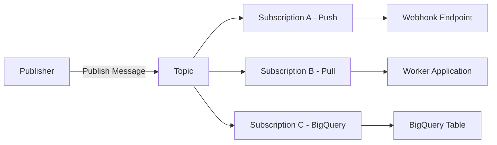

# How to Use Ansible to Manage GCP Pub/Sub Topics

Author: [nawazdhandala](https://www.github.com/nawazdhandala)

Tags: Ansible, GCP, Pub/Sub, Messaging, Event-Driven Architecture

Description: Create and manage GCP Pub/Sub topics and subscriptions with Ansible for reliable asynchronous messaging between services.

---

Pub/Sub is Google Cloud's messaging service for building event-driven architectures. It decouples producers from consumers, letting services communicate asynchronously without knowing about each other. A web application can publish an event when a user signs up, and multiple downstream services (email, analytics, provisioning) can each process that event independently. Managing Pub/Sub topics and subscriptions as infrastructure code with Ansible ensures your messaging backbone is consistent across environments and tracked in version control.

## How Pub/Sub Works



Publishers send messages to topics. Subscribers receive messages through subscriptions. Each subscription gets its own copy of every message, so multiple services can consume the same topic independently. Messages are retained until acknowledged or until the retention period expires.

## Prerequisites

- Ansible 2.9+ with the `google.cloud` collection
- GCP service account with Pub/Sub Editor role
- Pub/Sub API enabled

```bash
ansible-galaxy collection install google.cloud
pip install google-auth requests google-api-python-client

gcloud services enable pubsub.googleapis.com --project=my-project-123
```

## Creating a Topic

```yaml
# create-topic.yml - Create a Pub/Sub topic
---
- name: Create Pub/Sub Topic
  hosts: localhost
  connection: local
  gather_facts: false

  vars:
    gcp_project: "my-project-123"
    gcp_cred_kind: "serviceaccount"
    gcp_cred_file: "/opt/ansible/gcp-credentials.json"

  tasks:
    - name: Create a Pub/Sub topic
      google.cloud.gcp_pubsub_topic:
        name: "user-events"
        labels:
          environment: production
          team: backend
          managed_by: ansible
        project: "{{ gcp_project }}"
        auth_kind: "{{ gcp_cred_kind }}"
        service_account_file: "{{ gcp_cred_file }}"
        state: present
      register: topic

    - name: Show topic details
      ansible.builtin.debug:
        msg: "Topic '{{ topic.name }}' created"
```

## Creating a Topic with Message Schema

For data quality, you can enforce a schema on messages:

```yaml
# create-schema-topic.yml - Topic with message schema validation
---
- name: Create Topic with Schema
  hosts: localhost
  connection: local
  gather_facts: false

  vars:
    gcp_project: "my-project-123"
    gcp_cred_kind: "serviceaccount"
    gcp_cred_file: "/opt/ansible/gcp-credentials.json"

  tasks:
    - name: Create a Pub/Sub schema
      ansible.builtin.command: >
        gcloud pubsub schemas create user-event-schema
        --project={{ gcp_project }}
        --type=avro
        --definition='{
          "type": "record",
          "name": "UserEvent",
          "fields": [
            {"name": "user_id", "type": "string"},
            {"name": "event_type", "type": "string"},
            {"name": "timestamp", "type": "string"},
            {"name": "metadata", "type": {"type": "map", "values": "string"}}
          ]
        }'
      register: schema_result
      changed_when: "'Created schema' in schema_result.stderr"
      failed_when: "schema_result.rc != 0 and 'already exists' not in schema_result.stderr"

    - name: Create topic with schema enforcement
      ansible.builtin.command: >
        gcloud pubsub topics create user-events-validated
        --project={{ gcp_project }}
        --schema=user-event-schema
        --message-encoding=json
      register: topic_result
      changed_when: "'Created topic' in topic_result.stderr"
      failed_when: "topic_result.rc != 0 and 'already exists' not in topic_result.stderr"
```

## Creating Subscriptions

Subscriptions determine how messages are delivered to consumers:

```yaml
# create-subscriptions.yml - Create different types of subscriptions
---
- name: Create Pub/Sub Subscriptions
  hosts: localhost
  connection: local
  gather_facts: false

  vars:
    gcp_project: "my-project-123"
    gcp_cred_kind: "serviceaccount"
    gcp_cred_file: "/opt/ansible/gcp-credentials.json"
    topic_name: "user-events"

  tasks:
    - name: Get topic reference
      google.cloud.gcp_pubsub_topic:
        name: "{{ topic_name }}"
        project: "{{ gcp_project }}"
        auth_kind: "{{ gcp_cred_kind }}"
        service_account_file: "{{ gcp_cred_file }}"
        state: present
      register: topic

    - name: Create a pull subscription for the worker service
      google.cloud.gcp_pubsub_subscription:
        name: "user-events-worker"
        topic: "{{ topic }}"
        ack_deadline_seconds: 60
        message_retention_duration: "604800s"
        retain_acked_messages: false
        expiration_policy:
          ttl: ""
        retry_policy:
          minimum_backoff: "10s"
          maximum_backoff: "600s"
        labels:
          consumer: worker-service
          type: pull
        project: "{{ gcp_project }}"
        auth_kind: "{{ gcp_cred_kind }}"
        service_account_file: "{{ gcp_cred_file }}"
        state: present
      register: worker_sub

    - name: Create a pull subscription for the analytics service
      google.cloud.gcp_pubsub_subscription:
        name: "user-events-analytics"
        topic: "{{ topic }}"
        ack_deadline_seconds: 120
        message_retention_duration: "604800s"
        labels:
          consumer: analytics-service
          type: pull
        project: "{{ gcp_project }}"
        auth_kind: "{{ gcp_cred_kind }}"
        service_account_file: "{{ gcp_cred_file }}"
        state: present
      register: analytics_sub

    - name: Show subscriptions
      ansible.builtin.debug:
        msg:
          - "Worker subscription: {{ worker_sub.name }}"
          - "Analytics subscription: {{ analytics_sub.name }}"
```

Key parameters:
- `ack_deadline_seconds: 60` gives the consumer 60 seconds to acknowledge a message before Pub/Sub redelivers it
- `message_retention_duration: 604800s` keeps unacknowledged messages for 7 days (the maximum)
- `retry_policy` controls the backoff between redelivery attempts for nacked messages
- `expiration_policy.ttl: ""` (empty string) means the subscription never expires

## Creating a Push Subscription

Push subscriptions deliver messages to an HTTP endpoint:

```yaml
# create-push-subscription.yml - Create a push subscription
---
- name: Create Push Subscription
  hosts: localhost
  connection: local
  gather_facts: false

  vars:
    gcp_project: "my-project-123"
    gcp_cred_kind: "serviceaccount"
    gcp_cred_file: "/opt/ansible/gcp-credentials.json"

  tasks:
    - name: Get topic reference
      google.cloud.gcp_pubsub_topic:
        name: "user-events"
        project: "{{ gcp_project }}"
        auth_kind: "{{ gcp_cred_kind }}"
        service_account_file: "{{ gcp_cred_file }}"
        state: present
      register: topic

    - name: Create push subscription to webhook endpoint
      google.cloud.gcp_pubsub_subscription:
        name: "user-events-webhook"
        topic: "{{ topic }}"
        push_config:
          push_endpoint: "https://api.example.com/webhooks/user-events"
          oidc_token:
            service_account_email: "pubsub-push@{{ gcp_project }}.iam.gserviceaccount.com"
            audience: "https://api.example.com"
        ack_deadline_seconds: 30
        labels:
          consumer: external-webhook
          type: push
        project: "{{ gcp_project }}"
        auth_kind: "{{ gcp_cred_kind }}"
        service_account_file: "{{ gcp_cred_file }}"
        state: present
```

The `oidc_token` configuration adds an authentication header to push requests, so your endpoint can verify that the request actually came from Pub/Sub.

## Creating a Dead Letter Topic

Messages that fail processing repeatedly should go to a dead letter topic for investigation:

```yaml
# create-dead-letter.yml - Set up dead letter handling
---
- name: Create Dead Letter Topic and Subscription
  hosts: localhost
  connection: local
  gather_facts: false

  vars:
    gcp_project: "my-project-123"
    gcp_cred_kind: "serviceaccount"
    gcp_cred_file: "/opt/ansible/gcp-credentials.json"

  tasks:
    - name: Create dead letter topic
      google.cloud.gcp_pubsub_topic:
        name: "user-events-dead-letter"
        labels:
          purpose: dead-letter
          source_topic: user-events
        project: "{{ gcp_project }}"
        auth_kind: "{{ gcp_cred_kind }}"
        service_account_file: "{{ gcp_cred_file }}"
        state: present
      register: dl_topic

    - name: Create subscription on dead letter topic for monitoring
      google.cloud.gcp_pubsub_subscription:
        name: "dead-letter-monitor"
        topic: "{{ dl_topic }}"
        ack_deadline_seconds: 60
        message_retention_duration: "1209600s"
        labels:
          purpose: dead-letter-monitoring
        project: "{{ gcp_project }}"
        auth_kind: "{{ gcp_cred_kind }}"
        service_account_file: "{{ gcp_cred_file }}"
        state: present

    - name: Get main topic reference
      google.cloud.gcp_pubsub_topic:
        name: "user-events"
        project: "{{ gcp_project }}"
        auth_kind: "{{ gcp_cred_kind }}"
        service_account_file: "{{ gcp_cred_file }}"
        state: present
      register: main_topic

    - name: Create subscription with dead letter policy
      google.cloud.gcp_pubsub_subscription:
        name: "user-events-with-dlq"
        topic: "{{ main_topic }}"
        ack_deadline_seconds: 60
        dead_letter_policy:
          dead_letter_topic: "projects/{{ gcp_project }}/topics/user-events-dead-letter"
          max_delivery_attempts: 5
        labels:
          has_dead_letter: "true"
        project: "{{ gcp_project }}"
        auth_kind: "{{ gcp_cred_kind }}"
        service_account_file: "{{ gcp_cred_file }}"
        state: present
```

After 5 delivery attempts, the message is forwarded to the dead letter topic instead of being retried indefinitely. This prevents poison messages from blocking other messages in the subscription.

## Setting Up a Complete Messaging Infrastructure

Here is a playbook that creates a full messaging setup for a microservice:

```yaml
# messaging-infrastructure.yml - Complete Pub/Sub setup for an application
---
- name: Complete Messaging Infrastructure
  hosts: localhost
  connection: local
  gather_facts: false

  vars:
    gcp_project: "my-project-123"
    gcp_cred_kind: "serviceaccount"
    gcp_cred_file: "/opt/ansible/gcp-credentials.json"
    topics:
      - name: "order-created"
        subscriptions:
          - name: "order-fulfillment"
            ack_deadline: 120
          - name: "order-notification"
            ack_deadline: 30
          - name: "order-analytics"
            ack_deadline: 60
      - name: "payment-processed"
        subscriptions:
          - name: "payment-order-update"
            ack_deadline: 60
          - name: "payment-receipt"
            ack_deadline: 30
      - name: "user-signup"
        subscriptions:
          - name: "signup-welcome-email"
            ack_deadline: 30
          - name: "signup-provisioning"
            ack_deadline: 120
          - name: "signup-analytics"
            ack_deadline: 60

  tasks:
    - name: Create all topics
      google.cloud.gcp_pubsub_topic:
        name: "{{ item.name }}"
        labels:
          managed_by: ansible
          environment: production
        project: "{{ gcp_project }}"
        auth_kind: "{{ gcp_cred_kind }}"
        service_account_file: "{{ gcp_cred_file }}"
        state: present
      loop: "{{ topics }}"
      register: created_topics

    - name: Create all subscriptions
      google.cloud.gcp_pubsub_subscription:
        name: "{{ item.1.name }}"
        topic:
          name: "{{ item.0.name }}"
        ack_deadline_seconds: "{{ item.1.ack_deadline }}"
        message_retention_duration: "604800s"
        labels:
          topic: "{{ item.0.name }}"
          managed_by: ansible
        project: "{{ gcp_project }}"
        auth_kind: "{{ gcp_cred_kind }}"
        service_account_file: "{{ gcp_cred_file }}"
        state: present
      loop: "{{ topics | subelements('subscriptions') }}"

    - name: Summary
      ansible.builtin.debug:
        msg: "Created {{ topics | length }} topics and {{ topics | map(attribute='subscriptions') | map('length') | sum }} subscriptions"
```

## Deleting Topics and Subscriptions

```yaml
# cleanup-pubsub.yml - Remove topics and subscriptions
---
- name: Cleanup Pub/Sub Resources
  hosts: localhost
  connection: local
  gather_facts: false

  vars:
    gcp_project: "my-project-123"
    gcp_cred_kind: "serviceaccount"
    gcp_cred_file: "/opt/ansible/gcp-credentials.json"

  tasks:
    - name: Delete subscriptions first
      google.cloud.gcp_pubsub_subscription:
        name: "{{ item }}"
        topic:
          name: "old-topic"
        project: "{{ gcp_project }}"
        auth_kind: "{{ gcp_cred_kind }}"
        service_account_file: "{{ gcp_cred_file }}"
        state: absent
      loop:
        - "old-subscription-1"
        - "old-subscription-2"

    - name: Delete the topic
      google.cloud.gcp_pubsub_topic:
        name: "old-topic"
        project: "{{ gcp_project }}"
        auth_kind: "{{ gcp_cred_kind }}"
        service_account_file: "{{ gcp_cred_file }}"
        state: absent
```

## Summary

Managing Pub/Sub with Ansible gives you a documented, reproducible messaging infrastructure. The key practices are: create separate subscriptions for each consuming service so they process messages independently, set appropriate ack deadlines based on your processing time, implement dead letter topics for messages that repeatedly fail processing, and use message retention to protect against data loss during consumer outages. By defining your entire messaging topology in a playbook, new team members can understand the event flow by reading the code, and spinning up identical messaging infrastructure in a new environment is a single command.
