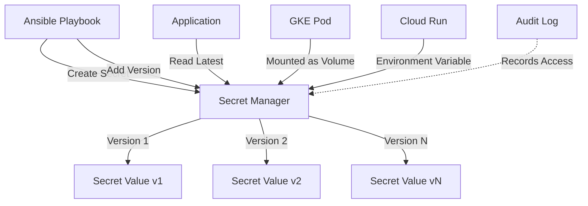

# How to Use Ansible to Manage GCP Secret Manager

Author: [nawazdhandala](https://www.github.com/nawazdhandala)

Tags: Ansible, GCP, Secret Manager, Security, Infrastructure as Code

Description: Learn how to create, store, retrieve, and rotate secrets in GCP Secret Manager using Ansible playbooks with real-world examples.

---

Hardcoding secrets in configuration files or environment variables is a problem that every operations team has dealt with at some point. GCP Secret Manager provides a centralized, audited, and access-controlled place to store sensitive data like API keys, database passwords, TLS certificates, and service account keys. In this post, we will use Ansible to manage the full lifecycle of secrets in GCP Secret Manager.

## Why Use Secret Manager?

Compared to storing secrets in files, environment variables, or even Ansible Vault, Secret Manager offers some real advantages:

- Centralized storage with fine-grained IAM access control
- Automatic versioning of secret values
- Audit logging of who accessed which secret and when
- Automatic rotation support
- Integration with other GCP services (Cloud Run, GKE, Cloud Functions)

## Prerequisites

- Ansible 2.10+ with the `google.cloud` collection
- A GCP service account with Secret Manager Admin permissions
- The Secret Manager API enabled in your project

```bash
# Install the GCP Ansible collection
ansible-galaxy collection install google.cloud

# Enable the Secret Manager API
gcloud services enable secretmanager.googleapis.com --project=my-project-id
```

## Creating a Secret

A "secret" in GCP Secret Manager is actually two things: the secret resource (a container) and one or more secret versions (the actual data). First you create the secret, then you add a version with the actual value.

```yaml
# create-secret.yml - Create a secret and add its first version
---
- name: Create Secret in GCP Secret Manager
  hosts: localhost
  connection: local
  gather_facts: false

  vars:
    gcp_project: "my-project-id"
    gcp_auth_kind: "serviceaccount"
    gcp_service_account_file: "/path/to/service-account-key.json"

  tasks:
    - name: Create the secret resource
      google.cloud.gcp_secret_manager_secret:
        name: "database-password"
        replication:
          automatic: {}
        labels:
          environment: "production"
          managed_by: "ansible"
          application: "myapp"
        project: "{{ gcp_project }}"
        auth_kind: "{{ gcp_auth_kind }}"
        service_account_file: "{{ gcp_service_account_file }}"
        state: present
      register: secret

    - name: Add the secret value as a new version
      google.cloud.gcp_secret_manager_secret_version:
        secret: "{{ secret }}"
        payload:
          data: "super-secure-db-password-2026"
        project: "{{ gcp_project }}"
        auth_kind: "{{ gcp_auth_kind }}"
        service_account_file: "{{ gcp_service_account_file }}"
        state: present
      register: version

    - name: Confirm secret creation
      ansible.builtin.debug:
        msg: |
          Secret created: {{ secret.name }}
          Version: {{ version.name }}
          Replication: automatic
```

## Creating Multiple Secrets at Once

Most applications need several secrets. Here is how to create a batch of them efficiently.

```yaml
# create-multiple-secrets.yml - Provision all secrets for an application
---
- name: Create Application Secrets
  hosts: localhost
  connection: local
  gather_facts: false

  vars:
    gcp_project: "my-project-id"
    gcp_auth_kind: "serviceaccount"
    gcp_service_account_file: "/path/to/service-account-key.json"

    # Define all secrets for the application
    app_secrets:
      - name: "myapp-db-password"
        value: "{{ lookup('password', '/dev/null length=32 chars=ascii_letters,digits') }}"
        labels:
          type: "database"
      - name: "myapp-api-key"
        value: "{{ lookup('password', '/dev/null length=48 chars=ascii_letters,digits') }}"
        labels:
          type: "api-key"
      - name: "myapp-jwt-secret"
        value: "{{ lookup('password', '/dev/null length=64 chars=ascii_letters,digits') }}"
        labels:
          type: "jwt"
      - name: "myapp-smtp-password"
        value: "{{ vault_smtp_password }}"
        labels:
          type: "smtp"

  tasks:
    - name: Create secret resources
      google.cloud.gcp_secret_manager_secret:
        name: "{{ item.name }}"
        replication:
          automatic: {}
        labels: "{{ item.labels | combine({'managed_by': 'ansible', 'app': 'myapp'}) }}"
        project: "{{ gcp_project }}"
        auth_kind: "{{ gcp_auth_kind }}"
        service_account_file: "{{ gcp_service_account_file }}"
        state: present
      loop: "{{ app_secrets }}"
      register: created_secrets

    - name: Add values to each secret
      google.cloud.gcp_secret_manager_secret_version:
        secret: "{{ item.0 }}"
        payload:
          data: "{{ item.1.value }}"
        project: "{{ gcp_project }}"
        auth_kind: "{{ gcp_auth_kind }}"
        service_account_file: "{{ gcp_service_account_file }}"
        state: present
      loop: "{{ created_secrets.results | zip(app_secrets) | list }}"

    - name: Summary
      ansible.builtin.debug:
        msg: "Created {{ app_secrets | length }} secrets for myapp"
```

## Retrieving Secrets

Reading secrets back is useful when you need to inject them into application configurations.

```yaml
# retrieve-secret.yml - Read a secret value from Secret Manager
---
- name: Retrieve Secret from GCP Secret Manager
  hosts: localhost
  connection: local
  gather_facts: false

  vars:
    gcp_project: "my-project-id"
    gcp_auth_kind: "serviceaccount"
    gcp_service_account_file: "/path/to/service-account-key.json"

  tasks:
    - name: Access the latest version of the secret
      google.cloud.gcp_secret_manager_secret_version_access:
        secret: "projects/{{ gcp_project }}/secrets/myapp-db-password"
        # Use "latest" to get the most recent version
        version: "latest"
        project: "{{ gcp_project }}"
        auth_kind: "{{ gcp_auth_kind }}"
        service_account_file: "{{ gcp_service_account_file }}"
      register: secret_data
      no_log: true

    - name: Use the secret value (do not log it)
      ansible.builtin.template:
        src: app-config.j2
        dest: /etc/myapp/config.env
        mode: "0600"
      vars:
        db_password: "{{ secret_data.payload.data | b64decode }}"
      no_log: true
```

Notice the `no_log: true` on tasks that handle secret values. This prevents Ansible from printing the secret in the console output.

## Secret Management Flow



## Rotating Secrets

Rotating a secret means adding a new version with a new value, then updating your applications to use it. Here is a playbook that rotates a database password.

```yaml
# rotate-secret.yml - Rotate a secret by adding a new version
---
- name: Rotate Database Secret
  hosts: localhost
  connection: local
  gather_facts: false

  vars:
    gcp_project: "my-project-id"
    gcp_auth_kind: "serviceaccount"
    gcp_service_account_file: "/path/to/service-account-key.json"
    secret_name: "myapp-db-password"

  tasks:
    - name: Generate a new password
      ansible.builtin.set_fact:
        new_password: "{{ lookup('password', '/dev/null length=32 chars=ascii_letters,digits,punctuation') }}"
      no_log: true

    - name: Get the secret resource
      google.cloud.gcp_secret_manager_secret:
        name: "{{ secret_name }}"
        replication:
          automatic: {}
        project: "{{ gcp_project }}"
        auth_kind: "{{ gcp_auth_kind }}"
        service_account_file: "{{ gcp_service_account_file }}"
        state: present
      register: secret

    - name: Add new version with the rotated password
      google.cloud.gcp_secret_manager_secret_version:
        secret: "{{ secret }}"
        payload:
          data: "{{ new_password }}"
        project: "{{ gcp_project }}"
        auth_kind: "{{ gcp_auth_kind }}"
        service_account_file: "{{ gcp_service_account_file }}"
        state: present
      register: new_version
      no_log: true

    - name: Rotation complete
      ansible.builtin.debug:
        msg: |
          Secret {{ secret_name }} rotated.
          New version: {{ new_version.name }}
          Remember to restart applications that use this secret.
```

## Deploying Secrets to VMs

A common pattern is to pull secrets from Secret Manager and write them to config files on your application servers.

```yaml
# deploy-secrets-to-vms.yml - Pull secrets and configure application servers
---
- name: Deploy Secrets to Application Servers
  hosts: app_servers
  become: true
  gather_facts: false

  vars:
    gcp_project: "my-project-id"
    gcp_auth_kind: "serviceaccount"
    gcp_service_account_file: "/path/to/service-account-key.json"
    secrets_to_fetch:
      - "myapp-db-password"
      - "myapp-api-key"
      - "myapp-jwt-secret"

  tasks:
    - name: Fetch all required secrets from Secret Manager
      google.cloud.gcp_secret_manager_secret_version_access:
        secret: "projects/{{ gcp_project }}/secrets/{{ item }}"
        version: "latest"
        project: "{{ gcp_project }}"
        auth_kind: "{{ gcp_auth_kind }}"
        service_account_file: "{{ gcp_service_account_file }}"
      loop: "{{ secrets_to_fetch }}"
      register: fetched_secrets
      no_log: true
      delegate_to: localhost

    - name: Build secrets dictionary
      ansible.builtin.set_fact:
        app_secrets: >-
          {{ app_secrets | default({}) | combine({
            item.item: item.payload.data | b64decode
          }) }}
      loop: "{{ fetched_secrets.results }}"
      no_log: true

    - name: Write application configuration file
      ansible.builtin.copy:
        content: |
          # Application configuration - managed by Ansible
          DB_PASSWORD={{ app_secrets['myapp-db-password'] }}
          API_KEY={{ app_secrets['myapp-api-key'] }}
          JWT_SECRET={{ app_secrets['myapp-jwt-secret'] }}
        dest: /etc/myapp/secrets.env
        mode: "0600"
        owner: myapp
        group: myapp
      no_log: true
      notify: restart myapp

  handlers:
    - name: restart myapp
      ansible.builtin.systemd:
        name: myapp
        state: restarted
```

## Cleaning Up Old Secret Versions

Over time, you accumulate many secret versions. You can disable or destroy old versions to clean up.

```yaml
# cleanup-secret-versions.yml - Disable old secret versions
---
- name: Cleanup Old Secret Versions
  hosts: localhost
  connection: local
  gather_facts: false

  vars:
    gcp_project: "my-project-id"
    gcp_auth_kind: "serviceaccount"
    gcp_service_account_file: "/path/to/service-account-key.json"
    secret_name: "myapp-db-password"

  tasks:
    - name: Disable old secret versions (keep only latest active)
      google.cloud.gcp_secret_manager_secret_version:
        secret: "projects/{{ gcp_project }}/secrets/{{ secret_name }}"
        version: "{{ item }}"
        state: disabled
        project: "{{ gcp_project }}"
        auth_kind: "{{ gcp_auth_kind }}"
        service_account_file: "{{ gcp_service_account_file }}"
      loop:
        - "1"
        - "2"
        - "3"
```

## Best Practices

1. **Always use `no_log: true`** on tasks that handle secret values. Without it, Ansible will print your secrets in plain text in the console output.

2. **Use automatic replication** unless you have specific compliance requirements. It replicates across all GCP regions automatically.

3. **Label your secrets consistently.** Labels help you find and manage secrets, especially when you have hundreds of them.

4. **Set up IAM carefully.** Follow the principle of least privilege. Applications should only have `secretmanager.secretAccessor` role, not admin access.

5. **Enable audit logging.** Know who accessed which secret and when. This is critical for security compliance.

6. **Rotate secrets regularly.** Automate rotation with a scheduled playbook or use GCP's rotation notification feature with Cloud Functions.

## Conclusion

GCP Secret Manager is a significant improvement over storing secrets in files or environment variables, and Ansible makes it practical to manage secrets as part of your infrastructure automation. By defining secret creation, retrieval, and rotation in playbooks, you get a repeatable, auditable process that integrates smoothly with the rest of your Ansible-managed infrastructure. The combination of Secret Manager's access control and Ansible's automation capabilities gives you a solid foundation for secrets management.
