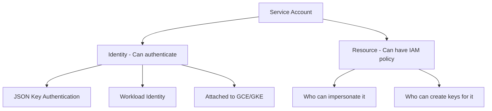

# How to Use Ansible to Manage GCP Service Accounts

Author: [nawazdhandala](https://www.github.com/nawazdhandala)

Tags: Ansible, GCP, Service Accounts, IAM, Security

Description: Create and manage GCP service accounts with Ansible including key rotation, role assignments, and workload identity configuration.

---

Service accounts are the identity mechanism for applications and services running in GCP. Unlike user accounts that represent people, service accounts represent non-human entities like VMs, containers, CI/CD pipelines, and applications. Getting service account management right is fundamental to GCP security because overly permissioned or poorly managed service accounts are a common attack vector. Ansible gives you a systematic way to create, configure, and lifecycle service accounts as part of your infrastructure code.

## Service Account Concepts



Every GCP project comes with default service accounts, but best practice is to create purpose-specific service accounts with only the permissions they need.

## Prerequisites

- Ansible 2.9+ with the `google.cloud` collection
- GCP service account with IAM Admin and Service Account Admin roles
- IAM API enabled

```bash
ansible-galaxy collection install google.cloud
pip install google-auth requests google-api-python-client
```

## Creating a Service Account

```yaml
# create-service-account.yml - Create a purpose-specific service account
---
- name: Create GCP Service Account
  hosts: localhost
  connection: local
  gather_facts: false

  vars:
    gcp_project: "my-project-123"
    gcp_cred_kind: "serviceaccount"
    gcp_cred_file: "/opt/ansible/gcp-credentials.json"

  tasks:
    - name: Create service account for the web application
      google.cloud.gcp_iam_service_account:
        name: "webapp@{{ gcp_project }}.iam.gserviceaccount.com"
        display_name: "Web Application Service Account"
        description: "Used by web application instances to access Cloud Storage and Cloud SQL"
        project: "{{ gcp_project }}"
        auth_kind: "{{ gcp_cred_kind }}"
        service_account_file: "{{ gcp_cred_file }}"
        state: present
      register: webapp_sa

    - name: Show service account details
      ansible.builtin.debug:
        msg:
          - "Email: {{ webapp_sa.email }}"
          - "Unique ID: {{ webapp_sa.uniqueId }}"
```

The service account email format is `NAME@PROJECT_ID.iam.gserviceaccount.com`. The name portion can only contain lowercase letters, digits, and hyphens.

## Creating Multiple Service Accounts

A typical project needs several service accounts for different components:

```yaml
# create-multiple-service-accounts.yml - Create all service accounts for a project
---
- name: Create Project Service Accounts
  hosts: localhost
  connection: local
  gather_facts: false

  vars:
    gcp_project: "my-project-123"
    gcp_cred_kind: "serviceaccount"
    gcp_cred_file: "/opt/ansible/gcp-credentials.json"
    service_accounts:
      - name: "webapp"
        display_name: "Web Application"
        description: "Web application backend instances"
        roles:
          - "roles/storage.objectViewer"
          - "roles/cloudsql.client"
      - name: "worker"
        display_name: "Background Worker"
        description: "Background job processing workers"
        roles:
          - "roles/storage.objectAdmin"
          - "roles/pubsub.subscriber"
      - name: "cicd-deploy"
        display_name: "CI/CD Deployment"
        description: "Deployment pipeline service account"
        roles:
          - "roles/compute.instanceAdmin.v1"
          - "roles/storage.admin"
          - "roles/run.admin"
          - "roles/iam.serviceAccountUser"
      - name: "monitoring"
        display_name: "Monitoring Agent"
        description: "Monitoring and alerting system"
        roles:
          - "roles/monitoring.viewer"
          - "roles/logging.viewer"

  tasks:
    - name: Create each service account
      google.cloud.gcp_iam_service_account:
        name: "{{ item.name }}@{{ gcp_project }}.iam.gserviceaccount.com"
        display_name: "{{ item.display_name }}"
        description: "{{ item.description }}"
        project: "{{ gcp_project }}"
        auth_kind: "{{ gcp_cred_kind }}"
        service_account_file: "{{ gcp_cred_file }}"
        state: present
      loop: "{{ service_accounts }}"
      register: sa_results

    - name: Grant roles to each service account
      ansible.builtin.command: >
        gcloud projects add-iam-policy-binding {{ gcp_project }}
        --member="serviceAccount:{{ item.0.name }}@{{ gcp_project }}.iam.gserviceaccount.com"
        --role="{{ item.1 }}"
        --quiet
      loop: "{{ service_accounts | subelements('roles') }}"
      changed_when: true

    - name: Summary
      ansible.builtin.debug:
        msg: "Created {{ service_accounts | length }} service accounts with {{ service_accounts | map(attribute='roles') | map('length') | sum }} total role bindings"
```

## Creating and Managing Service Account Keys

When applications outside GCP need to authenticate (like CI/CD systems or on-premises servers), they use JSON key files:

```yaml
# manage-sa-keys.yml - Create and manage service account keys
---
- name: Manage Service Account Keys
  hosts: localhost
  connection: local
  gather_facts: false

  vars:
    gcp_project: "my-project-123"
    gcp_cred_kind: "serviceaccount"
    gcp_cred_file: "/opt/ansible/gcp-credentials.json"
    sa_email: "cicd-deploy@{{ gcp_project }}.iam.gserviceaccount.com"
    key_output_dir: "/opt/ansible/sa-keys"

  tasks:
    - name: Ensure key output directory exists
      ansible.builtin.file:
        path: "{{ key_output_dir }}"
        state: directory
        mode: "0700"

    - name: Create a new key for the service account
      google.cloud.gcp_iam_service_account_key:
        service_account:
          name: "projects/{{ gcp_project }}/serviceAccounts/{{ sa_email }}"
        private_key_type: TYPE_GOOGLE_CREDENTIALS_FILE
        project: "{{ gcp_project }}"
        auth_kind: "{{ gcp_cred_kind }}"
        service_account_file: "{{ gcp_cred_file }}"
        state: present
      register: sa_key

    - name: Save the key file
      ansible.builtin.copy:
        content: "{{ sa_key.privateKeyData | b64decode }}"
        dest: "{{ key_output_dir }}/{{ sa_email | regex_replace('@.*', '') }}-key.json"
        mode: "0600"
      when: sa_key.privateKeyData is defined
```

A critical note about service account keys: once created, the private key is your responsibility. GCP does not store it and cannot recover it. Treat these keys like passwords. Store them in a secrets manager (like HashiCorp Vault or GCP Secret Manager), never commit them to version control, and rotate them regularly.

## Key Rotation Strategy

Regular key rotation limits the window of exposure if a key is compromised:

```yaml
# rotate-sa-key.yml - Rotate a service account key
---
- name: Rotate Service Account Key
  hosts: localhost
  connection: local
  gather_facts: false

  vars:
    gcp_project: "my-project-123"
    sa_email: "cicd-deploy@{{ gcp_project }}.iam.gserviceaccount.com"
    key_output_dir: "/opt/ansible/sa-keys"

  tasks:
    - name: List existing keys for the service account
      ansible.builtin.command: >
        gcloud iam service-accounts keys list
        --iam-account={{ sa_email }}
        --managed-by=user
        --format=json
      register: existing_keys
      changed_when: false

    - name: Parse existing keys
      ansible.builtin.set_fact:
        current_keys: "{{ existing_keys.stdout | from_json }}"

    - name: Show current key count
      ansible.builtin.debug:
        msg: "Found {{ current_keys | length }} user-managed key(s)"

    - name: Create a new key
      ansible.builtin.command: >
        gcloud iam service-accounts keys create
        {{ key_output_dir }}/{{ sa_email | regex_replace('@.*', '') }}-new-key.json
        --iam-account={{ sa_email }}
      register: new_key_result
      changed_when: true

    - name: Report new key creation
      ansible.builtin.debug:
        msg: "New key created. Update your applications to use the new key before deleting the old one."

    - name: Delete old keys (keeping only the newest)
      ansible.builtin.command: >
        gcloud iam service-accounts keys delete {{ item.name | regex_replace('.*/','') }}
        --iam-account={{ sa_email }}
        --quiet
      loop: "{{ current_keys }}"
      when: current_keys | length > 1
      changed_when: true
```

The rotation follows a safe pattern: create the new key first, deploy it to your applications, then delete the old key. Never delete the old key before the new one is in use.

## Disabling and Enabling Service Accounts

Sometimes you need to temporarily disable a service account without deleting it:

```yaml
# disable-service-account.yml - Disable a service account
---
- name: Disable Service Account
  hosts: localhost
  connection: local
  gather_facts: false

  vars:
    gcp_project: "my-project-123"
    sa_email: "compromised-sa@{{ gcp_project }}.iam.gserviceaccount.com"

  tasks:
    - name: Disable the service account
      ansible.builtin.command: >
        gcloud iam service-accounts disable {{ sa_email }}
        --project={{ gcp_project }}
      changed_when: true

    - name: Confirm disablement
      ansible.builtin.debug:
        msg: "Service account {{ sa_email }} has been disabled. All authentication attempts will fail."
```

Disabling is reversible. Re-enable with `gcloud iam service-accounts enable`.

## Auditing Service Accounts

Check for service accounts with excessive permissions or unused keys:

```yaml
# audit-service-accounts.yml - Audit service accounts in the project
---
- name: Audit Service Accounts
  hosts: localhost
  connection: local
  gather_facts: false

  vars:
    gcp_project: "my-project-123"
    gcp_cred_kind: "serviceaccount"
    gcp_cred_file: "/opt/ansible/gcp-credentials.json"

  tasks:
    - name: List all service accounts in the project
      ansible.builtin.command: >
        gcloud iam service-accounts list
        --project={{ gcp_project }}
        --format=json
      register: sa_list
      changed_when: false

    - name: Parse service accounts
      ansible.builtin.set_fact:
        all_service_accounts: "{{ sa_list.stdout | from_json }}"

    - name: Check keys for each service account
      ansible.builtin.command: >
        gcloud iam service-accounts keys list
        --iam-account={{ item.email }}
        --managed-by=user
        --format=json
      loop: "{{ all_service_accounts }}"
      register: key_results
      changed_when: false

    - name: Report service accounts with user-managed keys
      ansible.builtin.debug:
        msg: "{{ item.item.email }}: {{ (item.stdout | from_json) | length }} user-managed key(s)"
      loop: "{{ key_results.results }}"
      when: (item.stdout | from_json) | length > 0

    - name: Flag service accounts with multiple keys
      ansible.builtin.debug:
        msg: "WARNING: {{ item.item.email }} has {{ (item.stdout | from_json) | length }} keys - consider cleaning up"
      loop: "{{ key_results.results }}"
      when: (item.stdout | from_json) | length > 1
```

## Deleting Service Accounts

```yaml
# delete-service-account.yml - Remove a service account
---
- name: Delete Service Account
  hosts: localhost
  connection: local
  gather_facts: false

  vars:
    gcp_project: "my-project-123"
    gcp_cred_kind: "serviceaccount"
    gcp_cred_file: "/opt/ansible/gcp-credentials.json"

  tasks:
    - name: Delete the service account
      google.cloud.gcp_iam_service_account:
        name: "old-service@{{ gcp_project }}.iam.gserviceaccount.com"
        project: "{{ gcp_project }}"
        auth_kind: "{{ gcp_cred_kind }}"
        service_account_file: "{{ gcp_cred_file }}"
        state: absent

    - name: Confirm deletion
      ansible.builtin.debug:
        msg: "Service account deleted. Note: GCP retains the name for 30 days before allowing reuse."
```

GCP has a 30-day retention period on deleted service account names. You cannot create a new service account with the same name during this period.

## Summary

Service account management with Ansible enforces the principle of least privilege by design. The key practices are: create purpose-specific service accounts instead of reusing the default compute service account, grant only the roles each service account actually needs, prefer attached service accounts over JSON keys when running in GCP, rotate keys regularly when keys are necessary, audit periodically for unused accounts and excess keys, and disable rather than delete accounts when investigating incidents. By treating service accounts as infrastructure code, you maintain a clear record of what identities exist and what they are authorized to do.
