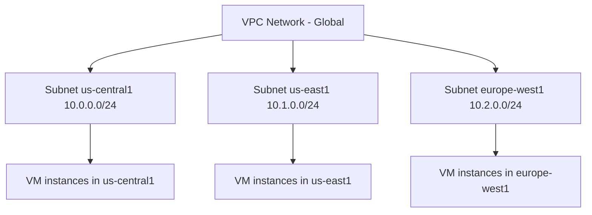

# How to Use Ansible to Manage GCP VPC Networks

Author: [nawazdhandala](https://www.github.com/nawazdhandala)

Tags: Ansible, GCP, VPC, Networking, Cloud Infrastructure

Description: Create and manage GCP VPC networks and subnets with Ansible including custom mode networks, secondary ranges, and private Google access.

---

Networking is the foundation of everything you build in GCP. Before you can launch a single VM, create a GKE cluster, or deploy a Cloud SQL instance, you need a VPC network with properly configured subnets. GCP's networking model is global by default, which gives you more flexibility than AWS's region-scoped VPCs, but also means there are different design decisions to make. Ansible lets you define your entire network topology as code and deploy it consistently across projects.

## GCP Networking Basics

GCP VPC networks are global resources. Subnets within a VPC are regional. This means a single VPC spans all regions, and you create subnets in specific regions as needed.



GCP offers two network modes:
- **Auto mode**: Automatically creates one subnet per region with predefined CIDR ranges. Quick for testing.
- **Custom mode**: You manually create subnets with CIDR ranges you choose. Required for production.

## Prerequisites

- Ansible 2.9+ with the `google.cloud` collection
- GCP service account with Network Admin role
- Compute Engine API enabled

```bash
ansible-galaxy collection install google.cloud
pip install google-auth requests google-api-python-client
```

## Creating a Custom Mode VPC Network

For production workloads, always use custom mode:

```yaml
# create-vpc.yml - Create a custom mode VPC network
---
- name: Create GCP VPC Network
  hosts: localhost
  connection: local
  gather_facts: false

  vars:
    gcp_project: "my-project-123"
    gcp_cred_kind: "serviceaccount"
    gcp_cred_file: "/opt/ansible/gcp-credentials.json"

  tasks:
    - name: Create a custom mode VPC network
      google.cloud.gcp_compute_network:
        name: "production-vpc"
        auto_create_subnetworks: false
        routing_config:
          routing_mode: GLOBAL
        project: "{{ gcp_project }}"
        auth_kind: "{{ gcp_cred_kind }}"
        service_account_file: "{{ gcp_cred_file }}"
        state: present
      register: vpc_network

    - name: Show VPC details
      ansible.builtin.debug:
        msg: "VPC '{{ vpc_network.name }}' created. Self link: {{ vpc_network.selfLink }}"
```

The `routing_mode: GLOBAL` means that Cloud Routers in this network advertise all subnets, regardless of region. With `REGIONAL` routing, each Cloud Router only advertises subnets in its own region. Global routing is what you want for most setups because it simplifies connectivity across regions.

## Creating Subnets

With a custom mode VPC, you create subnets explicitly:

```yaml
# create-subnets.yml - Create subnets in the VPC across multiple regions
---
- name: Create VPC Subnets
  hosts: localhost
  connection: local
  gather_facts: false

  vars:
    gcp_project: "my-project-123"
    gcp_cred_kind: "serviceaccount"
    gcp_cred_file: "/opt/ansible/gcp-credentials.json"
    vpc_name: "production-vpc"
    subnets:
      - name: "prod-us-central"
        region: "us-central1"
        cidr: "10.0.0.0/20"
        description: "Production subnet in US Central"
      - name: "prod-us-east"
        region: "us-east1"
        cidr: "10.0.16.0/20"
        description: "Production subnet in US East"
      - name: "prod-europe-west"
        region: "europe-west1"
        cidr: "10.0.32.0/20"
        description: "Production subnet in Europe West"

  tasks:
    - name: Get the VPC network reference
      google.cloud.gcp_compute_network_info:
        filters:
          - "name = {{ vpc_name }}"
        project: "{{ gcp_project }}"
        auth_kind: "{{ gcp_cred_kind }}"
        service_account_file: "{{ gcp_cred_file }}"
      register: vpc_info

    - name: Create each subnet
      google.cloud.gcp_compute_subnetwork:
        name: "{{ item.name }}"
        region: "{{ item.region }}"
        network:
          selfLink: "{{ vpc_info.resources[0].selfLink }}"
        ip_cidr_range: "{{ item.cidr }}"
        description: "{{ item.description }}"
        private_ip_google_access: true
        project: "{{ gcp_project }}"
        auth_kind: "{{ gcp_cred_kind }}"
        service_account_file: "{{ gcp_cred_file }}"
        state: present
      loop: "{{ subnets }}"
      register: subnet_results

    - name: Show subnet details
      ansible.builtin.debug:
        msg: "{{ item.name }} ({{ item.region }}): {{ item.ipCidrRange }}"
      loop: "{{ subnet_results.results }}"
```

The `private_ip_google_access: true` setting allows VMs without external IPs to reach Google APIs and services. This is essential for private instances that need to pull container images from GCR, write to Cloud Storage, or call any Google API.

## Creating Subnets with Secondary Ranges

GKE clusters need secondary IP ranges for pods and services. Define these on the subnet:

```yaml
# create-gke-subnet.yml - Subnet with secondary ranges for GKE
---
- name: Create GKE-Ready Subnet
  hosts: localhost
  connection: local
  gather_facts: false

  vars:
    gcp_project: "my-project-123"
    gcp_cred_kind: "serviceaccount"
    gcp_cred_file: "/opt/ansible/gcp-credentials.json"

  tasks:
    - name: Get VPC reference
      google.cloud.gcp_compute_network_info:
        filters:
          - "name = production-vpc"
        project: "{{ gcp_project }}"
        auth_kind: "{{ gcp_cred_kind }}"
        service_account_file: "{{ gcp_cred_file }}"
      register: vpc

    - name: Create subnet with secondary ranges for GKE
      google.cloud.gcp_compute_subnetwork:
        name: "gke-subnet-central"
        region: "us-central1"
        network:
          selfLink: "{{ vpc.resources[0].selfLink }}"
        ip_cidr_range: "10.1.0.0/20"
        private_ip_google_access: true
        secondary_ip_ranges:
          - range_name: "gke-pods"
            ip_cidr_range: "10.100.0.0/14"
          - range_name: "gke-services"
            ip_cidr_range: "10.104.0.0/20"
        project: "{{ gcp_project }}"
        auth_kind: "{{ gcp_cred_kind }}"
        service_account_file: "{{ gcp_cred_file }}"
        state: present
      register: gke_subnet

    - name: Show subnet and secondary ranges
      ansible.builtin.debug:
        msg:
          - "Primary: {{ gke_subnet.ipCidrRange }}"
          - "Pod range: 10.100.0.0/14 (65,536 addresses)"
          - "Service range: 10.104.0.0/20 (4,096 addresses)"
```

The pod CIDR needs to be large because each GKE node allocates a /24 block from this range by default. A /14 gives you room for about 1,000 nodes. The service CIDR can be smaller since it only needs one IP per Kubernetes Service.

## Creating a Complete Network Architecture

Here is a full network setup with public and private subnets, Cloud NAT for outbound internet access, and a Cloud Router:

```yaml
# full-network-setup.yml - Complete VPC architecture with NAT and routing
---
- name: Complete Network Setup
  hosts: localhost
  connection: local
  gather_facts: false

  vars:
    gcp_project: "my-project-123"
    gcp_cred_kind: "serviceaccount"
    gcp_cred_file: "/opt/ansible/gcp-credentials.json"
    region: "us-central1"

  tasks:
    - name: Create the VPC network
      google.cloud.gcp_compute_network:
        name: "production-vpc"
        auto_create_subnetworks: false
        routing_config:
          routing_mode: GLOBAL
        project: "{{ gcp_project }}"
        auth_kind: "{{ gcp_cred_kind }}"
        service_account_file: "{{ gcp_cred_file }}"
        state: present
      register: vpc

    - name: Create public subnet (for load balancers, bastion hosts)
      google.cloud.gcp_compute_subnetwork:
        name: "public-subnet"
        region: "{{ region }}"
        network:
          selfLink: "{{ vpc.selfLink }}"
        ip_cidr_range: "10.0.0.0/24"
        private_ip_google_access: true
        project: "{{ gcp_project }}"
        auth_kind: "{{ gcp_cred_kind }}"
        service_account_file: "{{ gcp_cred_file }}"
        state: present

    - name: Create private subnet (for application instances)
      google.cloud.gcp_compute_subnetwork:
        name: "private-subnet"
        region: "{{ region }}"
        network:
          selfLink: "{{ vpc.selfLink }}"
        ip_cidr_range: "10.0.1.0/24"
        private_ip_google_access: true
        project: "{{ gcp_project }}"
        auth_kind: "{{ gcp_cred_kind }}"
        service_account_file: "{{ gcp_cred_file }}"
        state: present

    - name: Create Cloud Router for NAT
      google.cloud.gcp_compute_router:
        name: "prod-cloud-router"
        region: "{{ region }}"
        network:
          selfLink: "{{ vpc.selfLink }}"
        project: "{{ gcp_project }}"
        auth_kind: "{{ gcp_cred_kind }}"
        service_account_file: "{{ gcp_cred_file }}"
        state: present
      register: router

    - name: Show network summary
      ansible.builtin.debug:
        msg:
          - "VPC: {{ vpc.name }}"
          - "Public subnet: 10.0.0.0/24"
          - "Private subnet: 10.0.1.0/24"
          - "Cloud Router: {{ router.name }}"
```

## Deleting Network Resources

When tearing down a network, order matters. Delete subnets before the VPC:

```yaml
# delete-network.yml - Clean up VPC and subnets
---
- name: Delete Network Resources
  hosts: localhost
  connection: local
  gather_facts: false

  vars:
    gcp_project: "my-project-123"
    gcp_cred_kind: "serviceaccount"
    gcp_cred_file: "/opt/ansible/gcp-credentials.json"

  tasks:
    - name: Delete subnets first
      google.cloud.gcp_compute_subnetwork:
        name: "{{ item.name }}"
        region: "{{ item.region }}"
        project: "{{ gcp_project }}"
        auth_kind: "{{ gcp_cred_kind }}"
        service_account_file: "{{ gcp_cred_file }}"
        state: absent
      loop:
        - { name: "public-subnet", region: "us-central1" }
        - { name: "private-subnet", region: "us-central1" }

    - name: Delete the VPC network
      google.cloud.gcp_compute_network:
        name: "production-vpc"
        project: "{{ gcp_project }}"
        auth_kind: "{{ gcp_cred_kind }}"
        service_account_file: "{{ gcp_cred_file }}"
        state: absent
```

You cannot delete a VPC that still has subnets, firewall rules, or other resources attached to it. Clean up dependencies first or you will get an error.

## Summary

GCP VPC networking with Ansible gives you a reproducible way to build your cloud network foundation. The global nature of GCP VPCs simplifies multi-region deployments compared to AWS, but you still need to think carefully about CIDR allocation, especially when planning for GKE secondary ranges. Key practices include always using custom mode networks for production, enabling private Google access on all subnets, using /20 or larger subnets to leave room for growth, and planning your IP address space upfront to avoid painful re-addressing later.
