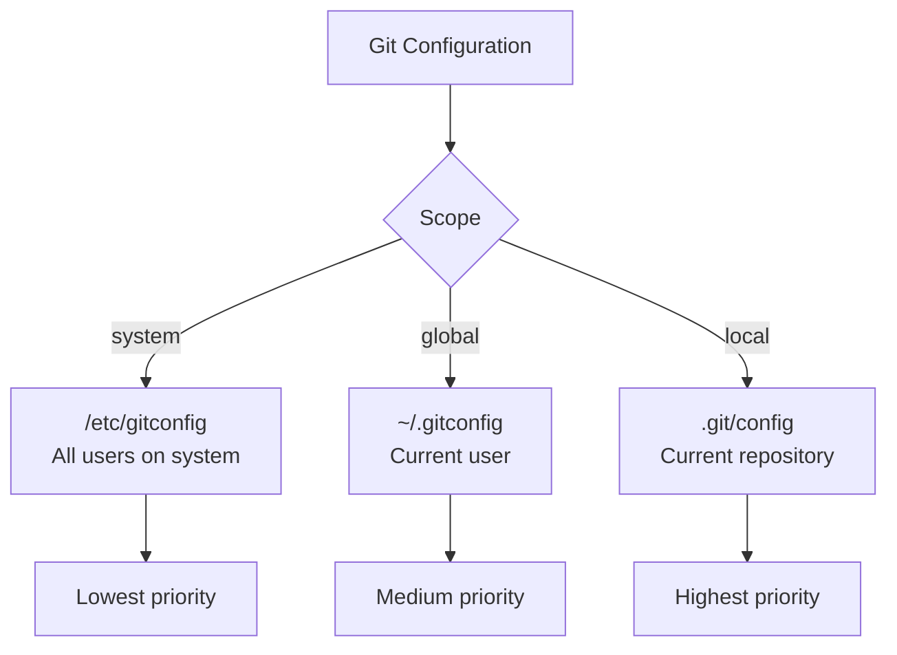

# How to Use Ansible to Manage Git Configuration on Remote Hosts

Author: [nawazdhandala](https://www.github.com/nawazdhandala)

Tags: Ansible, Git, Configuration, Remote Management

Description: Learn how to use Ansible to manage Git configuration files on remote hosts including global settings, aliases, credential helpers, and per-repository config.

---

Git configuration controls how Git behaves on a system. When managing multiple servers or developer workstations, keeping Git configuration consistent is important for reproducible workflows and security. Ansible makes it easy to deploy and manage Git configuration across your entire fleet.

## Setting Global Git Configuration

The `community.general.git_config` module manages Git settings:

```yaml
# playbook-global-config.yml
# Sets global Git configuration options on all managed hosts
- name: Configure global Git settings
  hosts: all
  become: true

  tasks:
    - name: Set global user name
      community.general.git_config:
        name: user.name
        value: "Deployment Bot"
        scope: global

    - name: Set global user email
      community.general.git_config:
        name: user.email
        value: "deploy@example.com"
        scope: global

    - name: Set default branch name
      community.general.git_config:
        name: init.defaultBranch
        value: main
        scope: global

    - name: Set pull strategy to rebase
      community.general.git_config:
        name: pull.rebase
        value: "true"
        scope: global

    - name: Set push default to current
      community.general.git_config:
        name: push.default
        value: current
        scope: global
```

## Per-User Git Configuration

Configure Git for specific users:

```yaml
# playbook-user-config.yml
# Sets Git configuration for individual developer accounts
- name: Configure Git for developers
  hosts: development_servers
  become: true
  vars:
    developers:
      - username: alice
        name: "Alice Smith"
        email: "alice@example.com"
      - username: bob
        name: "Bob Jones"
        email: "bob@example.com"

  tasks:
    - name: Set Git name for each developer
      community.general.git_config:
        name: user.name
        value: "{{ item.name }}"
        scope: global
      become_user: "{{ item.username }}"
      loop: "{{ developers }}"
      loop_control:
        label: "{{ item.username }}"

    - name: Set Git email for each developer
      community.general.git_config:
        name: user.email
        value: "{{ item.email }}"
        scope: global
      become_user: "{{ item.username }}"
      loop: "{{ developers }}"
      loop_control:
        label: "{{ item.username }}"
```

## Deploying a Complete .gitconfig File

For more complex configurations, deploy the entire file:

```yaml
# playbook-gitconfig-file.yml
# Deploys a complete .gitconfig file with aliases, colors, and custom settings
- name: Deploy complete gitconfig
  hosts: development_servers
  become: true
  vars:
    git_config_content: |
      [user]
          name = Deployment Bot
          email = deploy@example.com

      [core]
          autocrlf = input
          editor = vim
          whitespace = trailing-space,space-before-tab
          excludesfile = ~/.gitignore_global

      [init]
          defaultBranch = main

      [pull]
          rebase = true

      [push]
          default = current
          autoSetupRemote = true

      [fetch]
          prune = true

      [diff]
          algorithm = histogram
          colorMoved = default

      [merge]
          conflictstyle = diff3

      [alias]
          st = status -sb
          co = checkout
          br = branch
          ci = commit
          lg = log --graph --oneline --decorate --all
          unstage = reset HEAD --
          last = log -1 HEAD

      [color]
          ui = auto

      [credential]
          helper = cache --timeout=3600

  tasks:
    - name: Deploy .gitconfig
      ansible.builtin.copy:
        content: "{{ git_config_content }}"
        dest: /root/.gitconfig
        mode: "0644"
```

## Git Config Scope Flow



## Configuring System-Wide Settings

System-level configuration applies to all users on a machine:

```yaml
# playbook-system-config.yml
# Sets system-wide Git configuration that applies to all users
- name: Configure system-wide Git settings
  hosts: all
  become: true

  tasks:
    - name: Set system-wide configuration
      community.general.git_config:
        name: "{{ item.key }}"
        value: "{{ item.value }}"
        scope: system
      loop:
        - { key: "http.sslVerify", value: "true" }
        - { key: "http.postBuffer", value: "524288000" }
        - { key: "core.compression", value: "9" }
        - { key: "init.defaultBranch", value: "main" }
        - { key: "safe.directory", value: "*" }
```

## Managing Git Credential Helpers

```yaml
# playbook-credentials.yml
# Configures Git credential helpers for different authentication scenarios
- name: Configure Git credential helpers
  hosts: all
  become: true

  tasks:
    - name: Install credential helpers
      ansible.builtin.apt:
        name: git-credential-oauth
        state: present
      failed_when: false

    - name: Configure credential caching
      community.general.git_config:
        name: credential.helper
        value: "cache --timeout=7200"
        scope: global

    - name: Configure credential store for CI servers
      community.general.git_config:
        name: credential.helper
        value: store
        scope: global
      when: "'ci_servers' in group_names"

    - name: Store credentials for CI
      ansible.builtin.copy:
        content: |
          https://{{ lookup('env', 'GIT_USER') }}:{{ lookup('env', 'GIT_TOKEN') }}@github.com
        dest: /root/.git-credentials
        mode: "0600"
      when: "'ci_servers' in group_names"
      no_log: true
```

## Per-Repository Configuration

Set configuration for specific repositories on remote hosts:

```yaml
# playbook-repo-config.yml
# Sets per-repository Git configuration options
- name: Configure specific repositories
  hosts: webservers
  become: true

  tasks:
    - name: Set repository-specific user
      community.general.git_config:
        name: user.email
        value: "deploy@example.com"
        scope: local
        repo: /opt/myapp

    - name: Set repository-specific settings
      community.general.git_config:
        name: "{{ item.key }}"
        value: "{{ item.value }}"
        scope: local
        repo: /opt/myapp
      loop:
        - { key: "core.filemode", value: "false" }
        - { key: "receive.denyCurrentBranch", value: "updateInstead" }
```

## Deploying Global .gitignore

```yaml
# playbook-global-gitignore.yml
# Deploys a global .gitignore file with common patterns
- name: Deploy global gitignore
  hosts: all
  become: true

  tasks:
    - name: Create global gitignore file
      ansible.builtin.copy:
        content: |
          # OS files
          .DS_Store
          Thumbs.db
          *.swp
          *~

          # IDE files
          .idea/
          .vscode/
          *.sublime-*

          # Environment files
          .env
          .env.local

          # Build artifacts
          *.pyc
          __pycache__/
          node_modules/
          .npm/
          dist/
          build/

          # Logs
          *.log

          # Credentials
          *.pem
          *.key
          credentials.json
        dest: /root/.gitignore_global
        mode: "0644"

    - name: Set global excludes file
      community.general.git_config:
        name: core.excludesfile
        value: ~/.gitignore_global
        scope: global
```

## Reading Git Configuration

You can also read configuration values:

```yaml
# playbook-read-config.yml
# Reads and reports Git configuration from all hosts
- name: Read Git configuration
  hosts: all
  gather_facts: false

  tasks:
    - name: Read global Git config
      ansible.builtin.shell: git config --global --list 2>/dev/null || echo "No global config"
      register: git_config
      changed_when: false

    - name: Display configuration
      ansible.builtin.debug:
        msg: "{{ git_config.stdout_lines }}"
```

## Security-Focused Configuration

```yaml
# playbook-git-security.yml
# Applies security-focused Git configuration settings
- name: Apply secure Git configuration
  hosts: all
  become: true

  tasks:
    - name: Enforce SSL verification
      community.general.git_config:
        name: http.sslVerify
        value: "true"
        scope: system

    - name: Disable credential store in plain text (use cache instead)
      community.general.git_config:
        name: credential.helper
        value: "cache --timeout=1800"
        scope: system

    - name: Enable commit signing reminder
      community.general.git_config:
        name: commit.gpgsign
        value: "false"
        scope: system

    - name: Set safe directory for shared repos
      community.general.git_config:
        name: safe.directory
        value: /opt/shared-repos
        scope: system
```

## Summary

Managing Git configuration with Ansible ensures consistency across your infrastructure. Use the `community.general.git_config` module for individual settings, or deploy complete `.gitconfig` files with the `copy` module for complex configurations. Set system-scope settings for machine-wide defaults, global-scope for per-user preferences, and local-scope for repository-specific overrides. Pay special attention to credential helper configuration on CI servers and security settings like SSL verification. Deploy global `.gitignore` files to prevent common unwanted files from being committed across all repositories.
