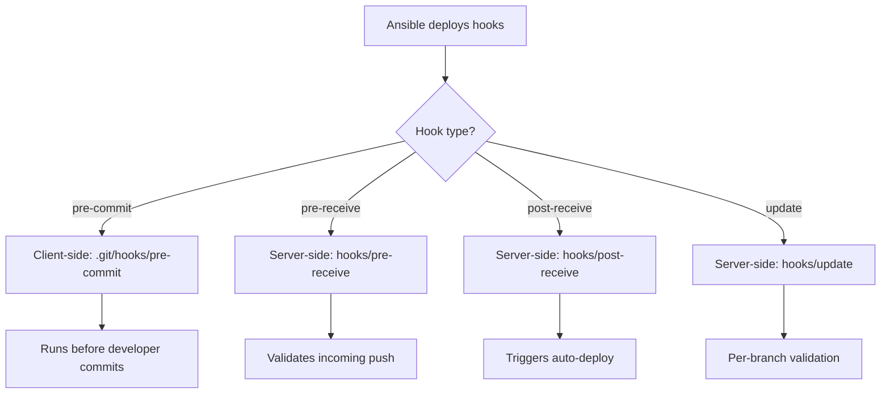

# How to Use Ansible to Manage Git Hooks

Author: [nawazdhandala](https://www.github.com/nawazdhandala)

Tags: Ansible, Git, Git Hooks, Automation

Description: Learn how to use Ansible to deploy and manage Git hooks on remote servers for enforcing commit policies, triggering builds, and automating repository workflows.

---

Git hooks are scripts that run automatically at certain points in the Git workflow: before commits, after pushes, before receiving pushes, and more. Managing these hooks across multiple servers and repositories with Ansible ensures consistency and makes it easy to enforce policies like commit message formats, code linting, and automated deployments.

## Git Hook Basics

Git hooks live in the `.git/hooks/` directory of each repository. Server-side hooks (on bare repositories) are especially important for enforcing policies. The most commonly managed hooks are:

- `pre-commit`: Runs before a commit is created
- `pre-push`: Runs before a push is sent
- `post-receive`: Runs after a push is received (server-side)
- `pre-receive`: Runs before a push is accepted (server-side)
- `update`: Runs per branch during a push (server-side)

## Deploying a pre-commit Hook

```yaml
# playbook-pre-commit.yml
# Deploys a pre-commit hook that runs linting before allowing commits
- name: Deploy pre-commit hook
  hosts: development_servers
  become: true
  vars:
    repo_path: /opt/myapp

  tasks:
    - name: Create pre-commit hook
      ansible.builtin.copy:
        content: |
          #!/bin/bash
          # Pre-commit hook managed by Ansible
          # Runs linting and formatting checks before each commit

          echo "Running pre-commit checks..."

          # Check for Python syntax errors
          python_files=$(git diff --cached --name-only --diff-filter=ACM | grep '\.py$')
          if [ -n "$python_files" ]; then
              echo "Checking Python files..."
              for f in $python_files; do
                  python3 -m py_compile "$f"
                  if [ $? -ne 0 ]; then
                      echo "Syntax error in $f"
                      exit 1
                  fi
              done
          fi

          # Check for trailing whitespace
          if git diff --cached --check; then
              echo "No whitespace issues found."
          else
              echo "Whitespace errors detected. Please fix before committing."
              exit 1
          fi

          echo "Pre-commit checks passed."
          exit 0
        dest: "{{ repo_path }}/.git/hooks/pre-commit"
        mode: "0755"
```

## Deploying a post-receive Hook (Auto-Deploy)

This is the classic push-to-deploy pattern:

```yaml
# playbook-post-receive.yml
# Sets up a bare Git repository with a post-receive hook for automatic deployment
- name: Set up push-to-deploy
  hosts: webservers
  become: true
  vars:
    bare_repo: /opt/git/myapp.git
    deploy_dir: /var/www/myapp

  tasks:
    - name: Create bare repository
      ansible.builtin.shell: |
        git init --bare {{ bare_repo }}
      args:
        creates: "{{ bare_repo }}/HEAD"

    - name: Create deployment directory
      ansible.builtin.file:
        path: "{{ deploy_dir }}"
        state: directory
        owner: www-data
        group: www-data

    - name: Deploy post-receive hook
      ansible.builtin.copy:
        content: |
          #!/bin/bash
          # Post-receive hook - managed by Ansible
          # Automatically deploys code when pushed to this repository

          DEPLOY_DIR="{{ deploy_dir }}"
          BRANCH="main"

          while read oldrev newrev refname; do
              branch=$(git rev-parse --symbolic --abbrev-ref "$refname")

              if [ "$branch" = "$BRANCH" ]; then
                  echo "Deploying $branch to $DEPLOY_DIR..."

                  # Checkout code
                  GIT_WORK_TREE=$DEPLOY_DIR git checkout -f $BRANCH

                  # Run post-deploy commands
                  cd $DEPLOY_DIR

                  # Install dependencies
                  if [ -f "requirements.txt" ]; then
                      pip install -r requirements.txt
                  fi

                  # Restart service
                  sudo systemctl restart myapp

                  echo "Deployment complete."
              fi
          done
        dest: "{{ bare_repo }}/hooks/post-receive"
        mode: "0755"
```

## Hook Deployment Flow



## Deploying a pre-receive Hook (Policy Enforcement)

```yaml
# playbook-pre-receive.yml
# Deploys a pre-receive hook that enforces commit message format and branch policies
- name: Deploy pre-receive policy hook
  hosts: git_servers
  become: true
  vars:
    bare_repo: /opt/git/myapp.git

  tasks:
    - name: Deploy pre-receive hook
      ansible.builtin.copy:
        content: |
          #!/bin/bash
          # Pre-receive hook - managed by Ansible
          # Enforces commit message format and branch protection

          while read oldrev newrev refname; do
              branch=$(echo "$refname" | sed 's|refs/heads/||')

              # Protect main branch from direct pushes
              if [ "$branch" = "main" ]; then
                  echo "ERROR: Direct pushes to main are not allowed."
                  echo "Please use a pull request."
                  exit 1
              fi

              # Validate commit messages
              commits=$(git log --format="%H %s" "$oldrev..$newrev" 2>/dev/null)
              while IFS= read -r line; do
                  sha=$(echo "$line" | cut -d' ' -f1)
                  msg=$(echo "$line" | cut -d' ' -f2-)

                  # Require conventional commit format
                  if ! echo "$msg" | grep -qE '^(feat|fix|docs|style|refactor|test|chore)(\(.+\))?: .+'; then
                      echo "ERROR: Commit $sha has invalid message format."
                      echo "Expected: type(scope): description"
                      echo "Got: $msg"
                      exit 1
                  fi
              done <<< "$commits"
          done

          exit 0
        dest: "{{ bare_repo }}/hooks/pre-receive"
        mode: "0755"
```

## Managing Hooks Across Multiple Repositories

```yaml
# playbook-bulk-hooks.yml
# Deploys the same set of hooks to multiple Git repositories
- name: Deploy hooks to all repositories
  hosts: git_servers
  become: true
  vars:
    hook_templates:
      pre-receive: templates/hooks/pre-receive.sh.j2
      post-receive: templates/hooks/post-receive.sh.j2
      update: templates/hooks/update.sh.j2

  tasks:
    - name: Find all bare repositories
      ansible.builtin.find:
        paths: /opt/git
        patterns: "*.git"
        file_type: directory
        recurse: false
      register: repositories

    - name: Deploy hooks to each repository
      ansible.builtin.template:
        src: "{{ item.1.value }}"
        dest: "{{ item.0.path }}/hooks/{{ item.1.key }}"
        mode: "0755"
      loop: "{{ repositories.files | product(hook_templates | dict2items) | list }}"
      loop_control:
        label: "{{ item.0.path | basename }}/{{ item.1.key }}"
```

## Practical Example: Webhook Notification Hook

```yaml
# playbook-webhook-hook.yml
# Deploys a post-receive hook that sends webhook notifications on push
- name: Deploy webhook notification hook
  hosts: git_servers
  become: true
  vars:
    bare_repo: /opt/git/myapp.git
    webhook_url: "{{ lookup('env', 'WEBHOOK_URL') }}"

  tasks:
    - name: Deploy webhook notification hook
      ansible.builtin.copy:
        content: |
          #!/bin/bash
          # Post-receive hook - sends webhook notifications
          # Managed by Ansible

          WEBHOOK_URL="{{ webhook_url }}"

          while read oldrev newrev refname; do
              branch=$(echo "$refname" | sed 's|refs/heads/||')
              author=$(git log -1 --format='%an' "$newrev")
              message=$(git log -1 --format='%s' "$newrev")
              commit_count=$(git log --oneline "$oldrev..$newrev" | wc -l)

              payload=$(cat <<EOF
          {
            "repository": "myapp",
            "branch": "$branch",
            "author": "$author",
            "message": "$message",
            "commits": $commit_count,
            "new_rev": "$newrev"
          }
          EOF
              )

              curl -s -X POST "$WEBHOOK_URL" \
                  -H "Content-Type: application/json" \
                  -d "$payload"
          done
        dest: "{{ bare_repo }}/hooks/post-receive"
        mode: "0755"
```

## Removing Hooks

```yaml
# playbook-remove-hooks.yml
# Removes specific Git hooks from repositories
- name: Remove Git hooks
  hosts: git_servers
  become: true
  vars:
    repo_path: /opt/git/myapp.git
    hooks_to_remove:
      - pre-receive
      - post-receive

  tasks:
    - name: Remove specified hooks
      ansible.builtin.file:
        path: "{{ repo_path }}/hooks/{{ item }}"
        state: absent
      loop: "{{ hooks_to_remove }}"
```

## Summary

Ansible is an excellent tool for managing Git hooks across your infrastructure. Deploy client-side hooks (pre-commit, pre-push) to development environments for code quality enforcement. Deploy server-side hooks (pre-receive, post-receive, update) to Git servers for policy enforcement and automated deployments. Use templates for hooks that need environment-specific values. The push-to-deploy pattern with post-receive hooks is a simple but effective deployment strategy. For enterprise environments, pre-receive hooks that validate commit messages and protect branches bring consistency to your Git workflow.
