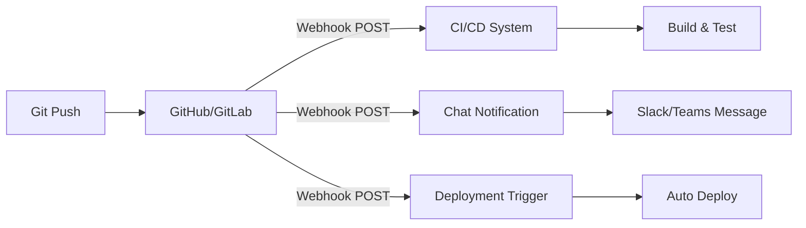

# How to Use Ansible to Manage GitHub/GitLab Webhooks

Author: [nawazdhandala](https://www.github.com/nawazdhandala)

Tags: Ansible, GitHub, GitLab, Webhooks

Description: Learn how to use Ansible to create, update, and manage webhooks on GitHub and GitLab repositories for automated CI/CD triggers and event notifications.

---

Webhooks connect your Git repositories to external systems like CI/CD pipelines, chat notifications, deployment triggers, and monitoring tools. Managing webhooks manually across many repositories is tedious and error-prone. Ansible can automate the entire lifecycle: creating, updating, listing, and deleting webhooks via the GitHub and GitLab APIs.

## Creating a GitHub Webhook

```yaml
# playbook-github-webhook.yml
# Creates a webhook on a GitHub repository for push events
- name: Create GitHub webhook
  hosts: localhost
  gather_facts: false
  vars:
    github_token: "{{ lookup('env', 'GITHUB_TOKEN') }}"
    github_org: myorg
    github_repo: myapp
    webhook_url: "https://ci.example.com/hooks/github"
    webhook_secret: "{{ lookup('env', 'WEBHOOK_SECRET') }}"

  tasks:
    - name: Create webhook
      ansible.builtin.uri:
        url: "https://api.github.com/repos/{{ github_org }}/{{ github_repo }}/hooks"
        method: POST
        headers:
          Authorization: "Bearer {{ github_token }}"
          Accept: "application/vnd.github.v3+json"
        body_format: json
        body:
          name: web
          config:
            url: "{{ webhook_url }}"
            content_type: json
            secret: "{{ webhook_secret }}"
            insecure_ssl: "0"
          events:
            - push
            - pull_request
            - release
          active: true
        status_code: [201, 422]
      register: webhook_result

    - name: Show webhook details
      ansible.builtin.debug:
        msg: "Webhook ID: {{ webhook_result.json.id | default('already exists') }}"
```

## Creating a GitLab Webhook

```yaml
# playbook-gitlab-webhook.yml
# Creates a webhook on a GitLab project for push and merge request events
- name: Create GitLab webhook
  hosts: localhost
  gather_facts: false
  vars:
    gitlab_url: "https://gitlab.example.com"
    gitlab_token: "{{ lookup('env', 'GITLAB_TOKEN') }}"
    project_id: 42
    webhook_url: "https://ci.example.com/hooks/gitlab"
    webhook_secret: "{{ lookup('env', 'WEBHOOK_SECRET') }}"

  tasks:
    - name: Create webhook
      ansible.builtin.uri:
        url: "{{ gitlab_url }}/api/v4/projects/{{ project_id }}/hooks"
        method: POST
        headers:
          PRIVATE-TOKEN: "{{ gitlab_token }}"
        body_format: json
        body:
          url: "{{ webhook_url }}"
          token: "{{ webhook_secret }}"
          push_events: true
          merge_requests_events: true
          tag_push_events: true
          pipeline_events: true
          enable_ssl_verification: true
        status_code: [201, 422]
      register: webhook_result

    - name: Show result
      ansible.builtin.debug:
        msg: "Webhook created: {{ webhook_result.json.url | default('error') }}"
```

## Webhook Event Flow



## Managing Webhooks Across Multiple Repositories

```yaml
# playbook-bulk-webhooks.yml
# Creates webhooks on multiple GitHub repositories at once
- name: Create webhooks on multiple repos
  hosts: localhost
  gather_facts: false
  vars:
    github_token: "{{ lookup('env', 'GITHUB_TOKEN') }}"
    github_org: myorg
    webhook_config:
      url: "https://ci.example.com/hooks/github"
      secret: "{{ lookup('env', 'WEBHOOK_SECRET') }}"
    repos:
      - frontend
      - backend
      - worker
      - shared-libs
      - infrastructure

  tasks:
    - name: Create webhook on each repository
      ansible.builtin.uri:
        url: "https://api.github.com/repos/{{ github_org }}/{{ item }}/hooks"
        method: POST
        headers:
          Authorization: "Bearer {{ github_token }}"
          Accept: "application/vnd.github.v3+json"
        body_format: json
        body:
          name: web
          config:
            url: "{{ webhook_config.url }}"
            content_type: json
            secret: "{{ webhook_config.secret }}"
          events:
            - push
            - pull_request
          active: true
        status_code: [201, 422]
      loop: "{{ repos }}"
      register: webhook_results

    - name: Show results
      ansible.builtin.debug:
        msg: "{{ item.item }}: {{ 'created' if item.status == 201 else 'already exists or error' }}"
      loop: "{{ webhook_results.results }}"
      loop_control:
        label: "{{ item.item }}"
```

## Listing Existing Webhooks

```yaml
# playbook-list-webhooks.yml
# Lists all webhooks configured on a GitHub repository
- name: List webhooks
  hosts: localhost
  gather_facts: false
  vars:
    github_token: "{{ lookup('env', 'GITHUB_TOKEN') }}"
    github_org: myorg
    github_repo: myapp

  tasks:
    - name: Get all webhooks
      ansible.builtin.uri:
        url: "https://api.github.com/repos/{{ github_org }}/{{ github_repo }}/hooks"
        headers:
          Authorization: "Bearer {{ github_token }}"
      register: webhooks

    - name: Display webhooks
      ansible.builtin.debug:
        msg: |
          
          ID: {{ hook.id }}
          URL: {{ hook.config.url }}
          Events: {{ hook.events | join(', ') }}
          Active: {{ hook.active }}
          ---
          
```

## Updating Webhooks

```yaml
# playbook-update-webhook.yml
# Updates an existing webhook to change its URL and events
- name: Update webhook
  hosts: localhost
  gather_facts: false
  vars:
    github_token: "{{ lookup('env', 'GITHUB_TOKEN') }}"
    github_org: myorg
    github_repo: myapp
    new_webhook_url: "https://new-ci.example.com/hooks/github"

  tasks:
    - name: Get existing webhooks
      ansible.builtin.uri:
        url: "https://api.github.com/repos/{{ github_org }}/{{ github_repo }}/hooks"
        headers:
          Authorization: "Bearer {{ github_token }}"
      register: existing_hooks

    - name: Find webhook by URL pattern
      ansible.builtin.set_fact:
        target_hook: >-
          {{ existing_hooks.json | selectattr('config.url', 'search', 'ci.example.com') | first | default(none) }}

    - name: Update webhook URL
      ansible.builtin.uri:
        url: "https://api.github.com/repos/{{ github_org }}/{{ github_repo }}/hooks/{{ target_hook.id }}"
        method: PATCH
        headers:
          Authorization: "Bearer {{ github_token }}"
        body_format: json
        body:
          config:
            url: "{{ new_webhook_url }}"
            content_type: json
          events:
            - push
            - pull_request
            - release
        status_code: 200
      when: target_hook is not none

    - name: Report
      ansible.builtin.debug:
        msg: "{{ 'Updated webhook ' ~ target_hook.id if target_hook is not none else 'No matching webhook found' }}"
```

## Deleting Webhooks

```yaml
# playbook-delete-webhook.yml
# Deletes a specific webhook from a GitHub repository
- name: Delete webhook
  hosts: localhost
  gather_facts: false
  vars:
    github_token: "{{ lookup('env', 'GITHUB_TOKEN') }}"
    github_org: myorg
    github_repo: myapp
    webhook_id: 123456789

  tasks:
    - name: Delete webhook by ID
      ansible.builtin.uri:
        url: "https://api.github.com/repos/{{ github_org }}/{{ github_repo }}/hooks/{{ webhook_id }}"
        method: DELETE
        headers:
          Authorization: "Bearer {{ github_token }}"
        status_code: 204
```

## Webhook Testing

```yaml
# playbook-test-webhook.yml
# Triggers a ping test on a GitHub webhook to verify it is working
- name: Test webhook delivery
  hosts: localhost
  gather_facts: false
  vars:
    github_token: "{{ lookup('env', 'GITHUB_TOKEN') }}"
    github_org: myorg
    github_repo: myapp

  tasks:
    - name: Get webhooks
      ansible.builtin.uri:
        url: "https://api.github.com/repos/{{ github_org }}/{{ github_repo }}/hooks"
        headers:
          Authorization: "Bearer {{ github_token }}"
      register: hooks

    - name: Ping each webhook
      ansible.builtin.uri:
        url: "https://api.github.com/repos/{{ github_org }}/{{ github_repo }}/hooks/{{ item.id }}/pings"
        method: POST
        headers:
          Authorization: "Bearer {{ github_token }}"
        status_code: 204
      loop: "{{ hooks.json }}"
      loop_control:
        label: "{{ item.config.url }}"

    - name: Check recent deliveries
      ansible.builtin.uri:
        url: "https://api.github.com/repos/{{ github_org }}/{{ github_repo }}/hooks/{{ hooks.json[0].id }}/deliveries"
        headers:
          Authorization: "Bearer {{ github_token }}"
      register: deliveries
      when: hooks.json | length > 0

    - name: Show delivery status
      ansible.builtin.debug:
        msg: |
          
          ID: {{ d.id }} Status: {{ d.status }} At: {{ d.delivered_at }}
          
      when: deliveries is defined
```

## Practical Example: CI/CD Webhook Setup

```yaml
# playbook-cicd-webhooks.yml
# Sets up complete CI/CD webhook configuration for a new project
- name: Complete CI/CD webhook setup
  hosts: localhost
  gather_facts: false
  vars:
    github_token: "{{ lookup('env', 'GITHUB_TOKEN') }}"
    org: myorg
    repo: new-project
    webhook_secret: "{{ lookup('password', '/dev/null length=32 chars=ascii_letters,digits') }}"

  tasks:
    - name: Create CI/CD webhook
      ansible.builtin.uri:
        url: "https://api.github.com/repos/{{ org }}/{{ repo }}/hooks"
        method: POST
        headers:
          Authorization: "Bearer {{ github_token }}"
        body_format: json
        body:
          config:
            url: "https://jenkins.example.com/github-webhook/"
            content_type: json
            secret: "{{ webhook_secret }}"
          events: [push, pull_request]
          active: true
        status_code: [201, 422]

    - name: Create deployment webhook
      ansible.builtin.uri:
        url: "https://api.github.com/repos/{{ org }}/{{ repo }}/hooks"
        method: POST
        headers:
          Authorization: "Bearer {{ github_token }}"
        body_format: json
        body:
          config:
            url: "https://deploy.example.com/hooks/github"
            content_type: json
            secret: "{{ webhook_secret }}"
          events: [release]
          active: true
        status_code: [201, 422]

    - name: Create Slack notification webhook
      ansible.builtin.uri:
        url: "https://api.github.com/repos/{{ org }}/{{ repo }}/hooks"
        method: POST
        headers:
          Authorization: "Bearer {{ github_token }}"
        body_format: json
        body:
          config:
            url: "https://hooks.slack.com/services/{{ lookup('env', 'SLACK_WEBHOOK_PATH') }}"
            content_type: json
          events: [push, pull_request, issues]
          active: true
        status_code: [201, 422]

    - name: Store webhook secret in vault
      ansible.builtin.debug:
        msg: "Webhook secret: {{ webhook_secret }} (store this securely)"
```

## Summary

Managing webhooks with Ansible through the GitHub and GitLab APIs gives you version-controlled, auditable webhook configuration. Use POST requests to create webhooks, PATCH to update them, DELETE to remove them, and GET to list and audit them. When managing webhooks across many repositories, loop over a list of repos. Always use secrets for webhook verification to prevent unauthorized webhook calls. Test webhooks after creation with the ping endpoint. Store webhook secrets in Ansible Vault and rotate them periodically as part of your security practices.
