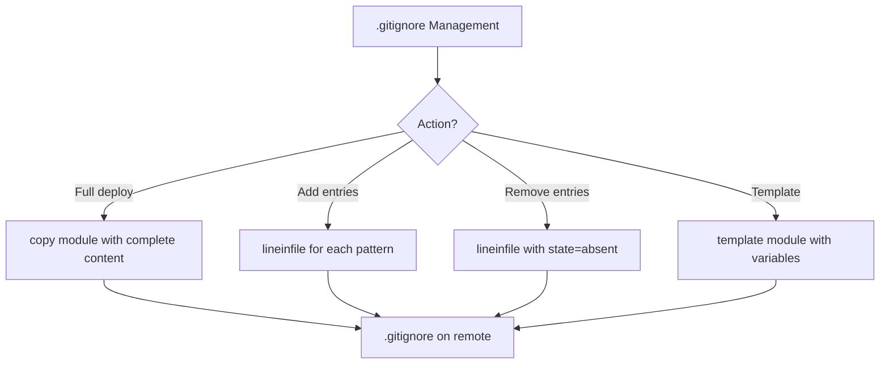

# How to Use Ansible to Manage .gitignore Files

Author: [nawazdhandala](https://www.github.com/nawazdhandala)

Tags: Ansible, Git, Gitignore, Configuration

Description: Learn how to use Ansible to create, update, and manage .gitignore files across repositories for consistent ignore patterns and preventing unwanted file tracking.

---

A well-crafted `.gitignore` file prevents unwanted files from being tracked: build artifacts, dependency directories, environment files, IDE settings, and OS-specific files. Managing these consistently across many repositories is a perfect job for Ansible.

## Deploying a Standard .gitignore

```yaml
# playbook-gitignore.yml
# Deploys a comprehensive .gitignore file to a project repository
- name: Deploy .gitignore
  hosts: webservers
  become: true
  vars:
    app_dir: /opt/myapp

  tasks:
    - name: Create .gitignore
      ansible.builtin.copy:
        content: |
          # Dependencies
          node_modules/
          vendor/
          .venv/
          venv/

          # Build output
          dist/
          build/
          *.egg-info/
          __pycache__/
          *.pyc
          *.pyo

          # Environment files
          .env
          .env.local
          .env.*.local

          # IDE and editor files
          .idea/
          .vscode/
          *.swp
          *.swo
          *~
          .project
          .settings/

          # OS files
          .DS_Store
          Thumbs.db
          Desktop.ini

          # Logs
          *.log
          logs/

          # Test coverage
          coverage/
          .coverage
          htmlcov/
          .pytest_cache/

          # Secrets and credentials
          *.pem
          *.key
          *.p12
          credentials.json
          service-account.json
        dest: "{{ app_dir }}/.gitignore"
        mode: "0644"
```

## Language-Specific .gitignore Templates

Use variables to compose language-specific ignore patterns:

```yaml
# playbook-lang-gitignore.yml
# Generates a language-specific .gitignore based on the project type
- name: Deploy language-specific .gitignore
  hosts: webservers
  become: true
  vars:
    project_type: python
    app_dir: /opt/myapp

    gitignore_patterns:
      common:
        - ".env"
        - ".env.local"
        - ".DS_Store"
        - "Thumbs.db"
        - "*.log"
        - ".idea/"
        - ".vscode/"
        - "*.swp"

      python:
        - "__pycache__/"
        - "*.py[cod]"
        - "*.egg-info/"
        - "dist/"
        - "build/"
        - ".venv/"
        - "venv/"
        - ".pytest_cache/"
        - ".coverage"
        - "htmlcov/"
        - ".mypy_cache/"
        - ".tox/"

      node:
        - "node_modules/"
        - "npm-debug.log"
        - "yarn-error.log"
        - ".yarn/"
        - "dist/"
        - "build/"
        - ".next/"
        - ".nuxt/"
        - ".cache/"
        - "coverage/"

      go:
        - "bin/"
        - "vendor/"
        - "*.exe"
        - "*.test"
        - "*.prof"

      java:
        - "target/"
        - "*.class"
        - "*.jar"
        - "*.war"
        - ".gradle/"
        - "build/"
        - ".settings/"
        - ".classpath"
        - ".project"

  tasks:
    - name: Build and deploy .gitignore
      ansible.builtin.copy:
        content: |
          # .gitignore - managed by Ansible
          # Project type: {{ project_type }}

          # Common patterns
          
          {{ pattern }}
          

          # {{ project_type | capitalize }} specific
          
          {{ pattern }}
          
        dest: "{{ app_dir }}/.gitignore"
        mode: "0644"
```

## Adding Entries to Existing .gitignore

Instead of replacing the file, add patterns without duplicating:

```yaml
# playbook-add-ignore.yml
# Adds new patterns to an existing .gitignore without duplicating entries
- name: Add entries to existing .gitignore
  hosts: webservers
  become: true
  vars:
    app_dir: /opt/myapp
    new_patterns:
      - "*.log"
      - "tmp/"
      - ".cache/"
      - "uploads/"

  tasks:
    - name: Ensure .gitignore exists
      ansible.builtin.file:
        path: "{{ app_dir }}/.gitignore"
        state: touch
        mode: "0644"
      changed_when: false

    - name: Add patterns to .gitignore
      ansible.builtin.lineinfile:
        path: "{{ app_dir }}/.gitignore"
        line: "{{ item }}"
        create: true
      loop: "{{ new_patterns }}"
```

## .gitignore Management Flow



## Global .gitignore (User Level)

Deploy a global .gitignore that applies to all repositories for a user:

```yaml
# playbook-global-gitignore.yml
# Deploys a global .gitignore for the system user and configures Git to use it
- name: Deploy global .gitignore
  hosts: all
  become: true

  tasks:
    - name: Create global gitignore
      ansible.builtin.copy:
        content: |
          # Global gitignore - managed by Ansible
          # Applied to ALL repositories for this user

          # OS generated files
          .DS_Store
          .DS_Store?
          ._*
          .Spotlight-V100
          .Trashes
          ehthumbs.db
          Thumbs.db
          Desktop.ini

          # Editor backups and temp files
          *~
          *.swp
          *.swo
          \#*\#
          .#*

          # IDE directories
          .idea/
          .vscode/
          *.sublime-project
          *.sublime-workspace
          .project
          .settings/
          .classpath
          *.iml
          .vs/
        dest: /etc/gitignore_global
        mode: "0644"

    - name: Configure Git to use global gitignore
      community.general.git_config:
        name: core.excludesfile
        value: /etc/gitignore_global
        scope: system
```

## Repository-Specific Excludes (Without Modifying .gitignore)

Sometimes you want to ignore files locally without modifying the shared `.gitignore`:

```yaml
# playbook-local-excludes.yml
# Adds local-only exclude patterns that are not tracked by Git
- name: Set up local excludes
  hosts: webservers
  become: true
  vars:
    app_dir: /opt/myapp

  tasks:
    - name: Add to local excludes file (not tracked by git)
      ansible.builtin.lineinfile:
        path: "{{ app_dir }}/.git/info/exclude"
        line: "{{ item }}"
        create: true
      loop:
        - "local_config.yml"
        - "debug.log"
        - "test_data/"
        - ".ansible_deploy_marker"
```

The `.git/info/exclude` file works just like `.gitignore` but is not committed to the repository.

## Checking for Missing .gitignore Entries

Audit repositories for patterns that should be ignored:

```yaml
# playbook-audit-gitignore.yml
# Audits a repository to find files that should be in .gitignore but are not
- name: Audit .gitignore coverage
  hosts: webservers
  become: true
  vars:
    app_dir: /opt/myapp
    should_be_ignored:
      - ".env"
      - "node_modules"
      - "__pycache__"
      - ".venv"
      - "*.pyc"

  tasks:
    - name: Read current .gitignore
      ansible.builtin.slurp:
        src: "{{ app_dir }}/.gitignore"
      register: gitignore_content
      failed_when: false

    - name: Check for missing patterns
      ansible.builtin.set_fact:
        missing_patterns: >-
          
          
          
          
          
          
          
          {{ missing }}

    - name: Report missing patterns
      ansible.builtin.debug:
        msg: |
          
          Missing .gitignore patterns:
          
          - {{ p }}
          
          
          All required patterns are present.
          
```

## Managing .gitignore Across Multiple Projects

```yaml
# playbook-fleet-gitignore.yml
# Ensures consistent .gitignore patterns across all project repositories
- name: Standardize .gitignore across projects
  hosts: webservers
  become: true
  vars:
    project_dirs:
      - /opt/frontend
      - /opt/backend
      - /opt/worker
    mandatory_patterns:
      - ".env"
      - ".env.local"
      - "*.log"
      - ".DS_Store"
      - ".idea/"
      - ".vscode/"
      - "*.swp"

  tasks:
    - name: Ensure mandatory patterns in all projects
      ansible.builtin.lineinfile:
        path: "{{ item.0 }}/.gitignore"
        line: "{{ item.1 }}"
        create: true
      loop: "{{ project_dirs | product(mandatory_patterns) | list }}"
      loop_control:
        label: "{{ item.0 | basename }}: {{ item.1 }}"
```

## Removing Tracked Files That Should Be Ignored

When a file was accidentally committed before being added to `.gitignore`:

```yaml
# playbook-untrack-files.yml
# Removes files from Git tracking that should have been gitignored
- name: Untrack files that should be ignored
  hosts: webservers
  become: true
  vars:
    app_dir: /opt/myapp
    files_to_untrack:
      - ".env"
      - "config/local.yml"
      - "*.pyc"

  tasks:
    - name: Ensure patterns are in .gitignore
      ansible.builtin.lineinfile:
        path: "{{ app_dir }}/.gitignore"
        line: "{{ item }}"
      loop: "{{ files_to_untrack }}"

    - name: Remove files from Git tracking (keep on disk)
      ansible.builtin.shell: |
        cd {{ app_dir }}
        git rm --cached {{ item }} 2>/dev/null || true
      loop: "{{ files_to_untrack }}"
      register: untrack_result
      changed_when: "'rm ' in untrack_result.stdout"
```

## Practical Example: Deployment-Safe .gitignore

```yaml
# playbook-deploy-gitignore.yml
# Creates a deployment-oriented .gitignore that protects runtime files
- name: Deploy .gitignore for deployment scenarios
  hosts: webservers
  become: true

  tasks:
    - name: Create deployment .gitignore
      ansible.builtin.copy:
        content: |
          # Runtime files that should not be overwritten by deploys
          .env
          .env.production
          config/local.yml
          config/secrets.yml

          # Runtime data directories
          uploads/
          media/
          data/

          # Logs
          logs/
          *.log

          # Cache
          .cache/
          tmp/

          # PID files
          *.pid

          # Build artifacts managed by CI
          node_modules/
          vendor/
          .venv/
        dest: /opt/myapp/.gitignore
        mode: "0644"
```

## Summary

Managing `.gitignore` files with Ansible ensures consistency across all your repositories. Use the `copy` module to deploy complete `.gitignore` files, `lineinfile` to add individual patterns without replacing existing ones, and the `.git/info/exclude` file for local-only exclusions. Compose language-specific patterns using variables and templates. Deploy global gitignore files at the system level for OS and editor patterns that apply everywhere. Audit existing gitignore files to catch missing patterns, and untrack accidentally committed files with `git rm --cached`. Consistent `.gitignore` management prevents secrets from being committed, keeps repositories clean, and makes deployments predictable.
