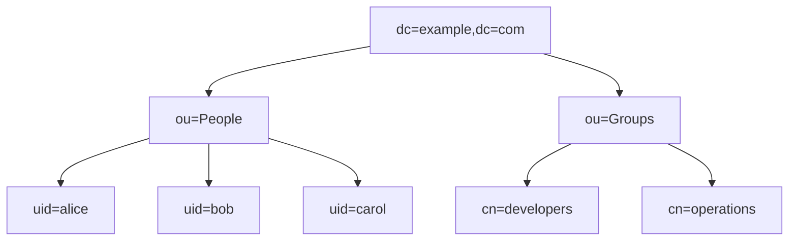
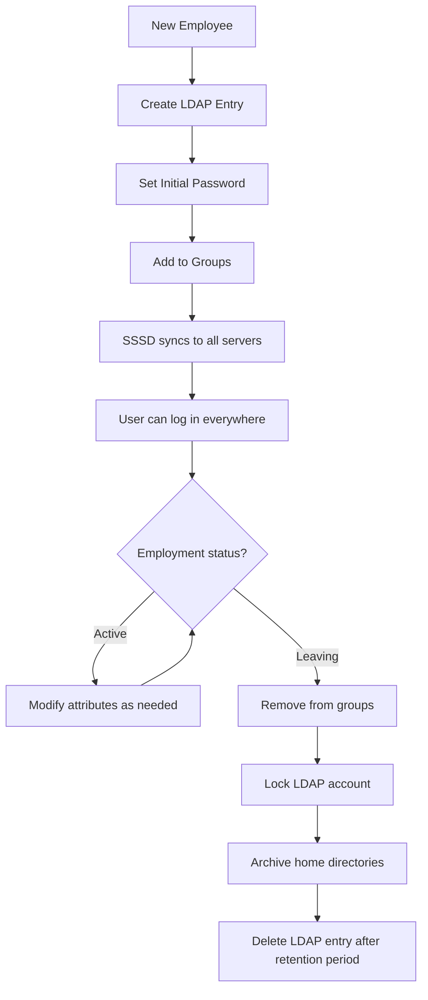

# How to Use Ansible to Manage LDAP Users

Author: [nawazdhandala](https://www.github.com/nawazdhandala)

Tags: Ansible, LDAP, User Management, Directory Services

Description: Learn how to manage LDAP users with Ansible using the ldap_entry and ldap_attrs modules for centralized user directory management.

---

LDAP (Lightweight Directory Access Protocol) is the backbone of centralized user management in many enterprises. Instead of managing users on each server individually, you manage them in a central directory, and servers authenticate against it. Ansible can automate LDAP user management through the `community.general.ldap_entry` and `community.general.ldap_attrs` modules. In this post, I will cover how to create, modify, and manage LDAP users with Ansible.

## Prerequisites

Before working with LDAP in Ansible, you need the `python-ldap` library on the control node and the `community.general` collection:

```bash
# Install the Python LDAP library
pip3 install python-ldap

# Install the community.general collection
ansible-galaxy collection install community.general
```

## Understanding the LDAP Structure

LDAP uses a tree structure (Directory Information Tree). Users typically live under an organizational unit (ou):



## Creating an LDAP User

Use the `ldap_entry` module to create a user entry in the directory:

```yaml
# create-ldap-user.yml - Create a user in LDAP
- name: Create LDAP user
  hosts: ldap_servers
  tasks:
    - name: Create user entry for Alice
      community.general.ldap_entry:
        dn: "uid=alice,ou=People,dc=example,dc=com"
        objectClass:
          - inetOrgPerson
          - posixAccount
          - shadowAccount
        attributes:
          cn: "Alice Johnson"
          sn: "Johnson"
          givenName: "Alice"
          uid: "alice"
          uidNumber: "10001"
          gidNumber: "10000"
          homeDirectory: "/home/alice"
          loginShell: "/bin/bash"
          mail: "alice@example.com"
          userPassword: "{SSHA}hashedpasswordhere"
        server_uri: "ldap://ldap.example.com"
        bind_dn: "cn=admin,dc=example,dc=com"
        bind_pw: "{{ vault_ldap_admin_password }}"
        state: present
```

Each LDAP attribute maps to a user property. The `objectClass` list defines what attributes are available. The `posixAccount` class provides Unix-specific attributes like `uidNumber` and `homeDirectory`.

## Creating Multiple LDAP Users

Use a loop to create multiple users from a variable list:

```yaml
# create-multiple-ldap-users.yml - Batch LDAP user creation
- name: Create multiple LDAP users
  hosts: ldap_servers
  vars:
    ldap_base: "dc=example,dc=com"
    ldap_people_ou: "ou=People,{{ ldap_base }}"
    ldap_users:
      - uid: alice
        cn: "Alice Johnson"
        sn: "Johnson"
        givenName: "Alice"
        uidNumber: "10001"
        gidNumber: "10000"
        mail: "alice@example.com"
      - uid: bob
        cn: "Bob Smith"
        sn: "Smith"
        givenName: "Bob"
        uidNumber: "10002"
        gidNumber: "10000"
        mail: "bob@example.com"
      - uid: carol
        cn: "Carol Williams"
        sn: "Williams"
        givenName: "Carol"
        uidNumber: "10003"
        gidNumber: "10001"
        mail: "carol@example.com"
  tasks:
    - name: Create LDAP user entries
      community.general.ldap_entry:
        dn: "uid={{ item.uid }},{{ ldap_people_ou }}"
        objectClass:
          - inetOrgPerson
          - posixAccount
          - shadowAccount
        attributes:
          cn: "{{ item.cn }}"
          sn: "{{ item.sn }}"
          givenName: "{{ item.givenName }}"
          uid: "{{ item.uid }}"
          uidNumber: "{{ item.uidNumber }}"
          gidNumber: "{{ item.gidNumber }}"
          homeDirectory: "/home/{{ item.uid }}"
          loginShell: "/bin/bash"
          mail: "{{ item.mail }}"
        server_uri: "ldap://ldap.example.com"
        bind_dn: "cn=admin,dc=example,dc=com"
        bind_pw: "{{ vault_ldap_admin_password }}"
        state: present
      loop: "{{ ldap_users }}"
      loop_control:
        label: "{{ item.uid }}"
```

## Modifying LDAP User Attributes

To update existing user attributes, use the `ldap_attrs` module:

```yaml
# modify-ldap-user.yml - Modify LDAP user attributes
- name: Modify LDAP user attributes
  hosts: ldap_servers
  tasks:
    # Update a user's email address
    - name: Update Alice's email
      community.general.ldap_attrs:
        dn: "uid=alice,ou=People,dc=example,dc=com"
        attributes:
          mail: "alice.johnson@example.com"
        state: exact
        server_uri: "ldap://ldap.example.com"
        bind_dn: "cn=admin,dc=example,dc=com"
        bind_pw: "{{ vault_ldap_admin_password }}"

    # Update the login shell
    - name: Change Alice's shell to zsh
      community.general.ldap_attrs:
        dn: "uid=alice,ou=People,dc=example,dc=com"
        attributes:
          loginShell: "/bin/zsh"
        state: exact
        server_uri: "ldap://ldap.example.com"
        bind_dn: "cn=admin,dc=example,dc=com"
        bind_pw: "{{ vault_ldap_admin_password }}"
```

The `state: exact` parameter means the attribute value will be set to exactly what you specify. Use `state: present` to add values to multi-valued attributes without removing existing ones.

## Setting LDAP User Passwords

Password management in LDAP requires generating the appropriate hash:

```yaml
# set-ldap-password.yml - Set LDAP user password
- name: Set LDAP user password
  hosts: ldap_servers
  tasks:
    # Generate SSHA hash and set password
    - name: Set password for alice
      community.general.ldap_passwd:
        dn: "uid=alice,ou=People,dc=example,dc=com"
        passwd: "{{ vault_alice_password }}"
        server_uri: "ldap://ldap.example.com"
        bind_dn: "cn=admin,dc=example,dc=com"
        bind_pw: "{{ vault_ldap_admin_password }}"
      no_log: yes
```

## Managing LDAP Groups

LDAP groups work differently from local groups. You add users to groups by modifying the group entry:

```yaml
# manage-ldap-groups.yml - Create LDAP groups and manage membership
- name: Manage LDAP groups
  hosts: ldap_servers
  vars:
    ldap_base: "dc=example,dc=com"
  tasks:
    # Create a POSIX group
    - name: Create developers group
      community.general.ldap_entry:
        dn: "cn=developers,ou=Groups,{{ ldap_base }}"
        objectClass:
          - posixGroup
        attributes:
          cn: "developers"
          gidNumber: "10000"
          memberUid:
            - alice
            - bob
        server_uri: "ldap://ldap.example.com"
        bind_dn: "cn=admin,{{ ldap_base }}"
        bind_pw: "{{ vault_ldap_admin_password }}"
        state: present

    # Add a member to an existing group
    - name: Add carol to developers group
      community.general.ldap_attrs:
        dn: "cn=developers,ou=Groups,{{ ldap_base }}"
        attributes:
          memberUid: carol
        state: present
        server_uri: "ldap://ldap.example.com"
        bind_dn: "cn=admin,{{ ldap_base }}"
        bind_pw: "{{ vault_ldap_admin_password }}"
```

## Removing LDAP Users

To remove a user from the directory:

```yaml
# remove-ldap-user.yml - Remove an LDAP user
- name: Remove LDAP user
  hosts: ldap_servers
  vars:
    ldap_base: "dc=example,dc=com"
    user_to_remove: olduser
  tasks:
    # Remove from all groups first
    - name: Remove user from developers group
      community.general.ldap_attrs:
        dn: "cn=developers,ou=Groups,{{ ldap_base }}"
        attributes:
          memberUid: "{{ user_to_remove }}"
        state: absent
        server_uri: "ldap://ldap.example.com"
        bind_dn: "cn=admin,{{ ldap_base }}"
        bind_pw: "{{ vault_ldap_admin_password }}"
      ignore_errors: yes

    # Remove the user entry
    - name: Delete user entry from LDAP
      community.general.ldap_entry:
        dn: "uid={{ user_to_remove }},ou=People,{{ ldap_base }}"
        state: absent
        server_uri: "ldap://ldap.example.com"
        bind_dn: "cn=admin,{{ ldap_base }}"
        bind_pw: "{{ vault_ldap_admin_password }}"
```

## Configuring LDAP Client on Servers

Beyond managing LDAP entries, you also need to configure servers to authenticate against LDAP. Here is how to set up SSSD (System Security Services Daemon):

```yaml
# configure-sssd-ldap.yml - Set up LDAP client authentication
- name: Configure LDAP client
  hosts: all
  become: yes
  tasks:
    - name: Install SSSD and LDAP packages
      ansible.builtin.apt:
        name:
          - sssd
          - sssd-ldap
          - ldap-utils
          - libpam-sss
          - libnss-sss
        state: present
      when: ansible_os_family == "Debian"

    - name: Configure SSSD for LDAP
      ansible.builtin.copy:
        dest: /etc/sssd/sssd.conf
        content: |
          [sssd]
          services = nss, pam
          config_file_version = 2
          domains = example.com

          [domain/example.com]
          id_provider = ldap
          auth_provider = ldap
          ldap_uri = ldap://ldap.example.com
          ldap_search_base = dc=example,dc=com
          ldap_tls_reqcert = demand
          ldap_tls_cacert = /etc/ssl/certs/ca-certificates.crt
          cache_credentials = true
          enumerate = false
        mode: '0600'
        owner: root
        group: root
      notify: restart sssd

    - name: Enable and start SSSD
      ansible.builtin.systemd:
        name: sssd
        enabled: yes
        state: started

  handlers:
    - name: restart sssd
      ansible.builtin.systemd:
        name: sssd
        state: restarted
```

## LDAP User Lifecycle Management

Here is a comprehensive workflow for LDAP user lifecycle:



## Searching LDAP with Ansible

Query LDAP to find users matching certain criteria:

```yaml
# search-ldap.yml - Search LDAP for user information
- name: Search LDAP directory
  hosts: ldap_servers
  tasks:
    - name: Search for all users in engineering
      community.general.ldap_search:
        dn: "ou=People,dc=example,dc=com"
        filter: "(&(objectClass=posixAccount)(departmentNumber=Engineering))"
        attrs:
          - uid
          - cn
          - mail
        server_uri: "ldap://ldap.example.com"
        bind_dn: "cn=admin,dc=example,dc=com"
        bind_pw: "{{ vault_ldap_admin_password }}"
      register: ldap_results

    - name: Display engineering users
      ansible.builtin.debug:
        msg: "{{ item.cn }} ({{ item.uid }}) - {{ item.mail }}"
      loop: "{{ ldap_results.results }}"
```

## Best Practices

1. **Always use TLS** for LDAP connections. Use `ldaps://` URIs or configure StartTLS. Plain LDAP sends credentials in clear text.

2. **Store bind credentials in Ansible Vault**. Never hard-code LDAP admin passwords in playbooks.

3. **Use SSSD on client servers** instead of direct LDAP PAM modules. SSSD provides caching, offline support, and better performance.

4. **Test changes in a development LDAP instance** before applying them to production. LDAP schema changes can be difficult to reverse.

5. **Maintain a UID/GID registry** separate from LDAP to prevent conflicts when creating new users.

6. **Remove group memberships before deleting users**. Some LDAP implementations do not cascade deletions.

Managing LDAP users with Ansible brings the same automation benefits you get with local user management, but at an enterprise scale. The centralized nature of LDAP means changes propagate to all servers automatically, and Ansible ensures those changes are consistent and auditable.
