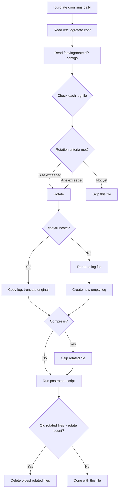

# How to Use Ansible to Manage Log Rotation Configuration

Author: [nawazdhandala](https://www.github.com/nawazdhandala)

Tags: Ansible, Linux, Logging, Configuration Management

Description: Learn how to use Ansible to deploy and manage logrotate configurations for applications and services to prevent disk space exhaustion.

---

Unmanaged log files are one of the most common causes of disk space exhaustion on Linux servers. A busy web server can generate gigabytes of logs daily, and without rotation, those logs will eventually fill the disk and bring services down. Logrotate is the standard tool for managing log file rotation on Linux, and Ansible makes it easy to deploy consistent logrotate configurations across your entire fleet.

## How logrotate Works

Logrotate reads configuration from `/etc/logrotate.conf` (the main config) and drop-in files in `/etc/logrotate.d/`. It runs daily via a cron job or systemd timer, rotating log files based on criteria like size, age, or number of rotated copies to keep.

The drop-in directory pattern is the recommended approach: each application gets its own file in `/etc/logrotate.d/`.

## Deploying a Basic logrotate Configuration

The simplest approach is using the `copy` module with inline content.

```yaml
# Deploy a logrotate configuration for a custom application
- name: Deploy logrotate config for myapp
  ansible.builtin.copy:
    content: |
      /var/log/myapp/*.log {
          daily
          rotate 14
          compress
          delaycompress
          missingok
          notifempty
          create 0640 myapp myapp
          sharedscripts
          postrotate
              systemctl reload myapp > /dev/null 2>&1 || true
          endscript
      }
    dest: /etc/logrotate.d/myapp
    owner: root
    group: root
    mode: '0644'
```

Let us break down what each directive does:

- **daily**: Rotate logs every day
- **rotate 14**: Keep 14 rotated log files
- **compress**: Compress rotated files with gzip
- **delaycompress**: Do not compress the most recently rotated file (useful when the app might still write to it briefly)
- **missingok**: Do not error if the log file is missing
- **notifempty**: Do not rotate if the file is empty
- **create 0640 myapp myapp**: Create a new log file with these permissions and ownership
- **sharedscripts**: Run postrotate only once, not per log file
- **postrotate**: Script to run after rotation (typically to signal the app to reopen its log file)

## Using Templates for Dynamic Configuration

When logrotate settings vary between environments or applications, templates are the way to go.

```yaml
# Deploy logrotate config from template
- name: Deploy application logrotate configuration
  ansible.builtin.template:
    src: templates/logrotate-app.j2
    dest: "/etc/logrotate.d/{{ app_name }}"
    owner: root
    group: root
    mode: '0644'
```

The template file.

```jinja2
# Logrotate configuration for {{ app_name }}
# Managed by Ansible - do not edit manually

{{ log_dir }}/{{ app_name }}/*.log {
    {{ rotation_frequency | default('daily') }}
    rotate {{ rotation_count | default(14) }}

    size {{ max_log_size }}

    compress
    delaycompress
    missingok
    notifempty
    create 0640 {{ app_user }} {{ app_group }}

    dateext
    dateformat -%Y%m%d

    sharedscripts

    postrotate
        {{ postrotate_command }}
    endscript

}
```

## Common Application Logrotate Configs

### Nginx

```yaml
# Deploy Nginx logrotate configuration
- name: Deploy nginx logrotate config
  ansible.builtin.copy:
    content: |
      /var/log/nginx/*.log {
          daily
          rotate 30
          compress
          delaycompress
          missingok
          notifempty
          create 0640 www-data adm
          sharedscripts
          postrotate
              if [ -f /var/run/nginx.pid ]; then
                  kill -USR1 $(cat /var/run/nginx.pid)
              fi
          endscript
      }
    dest: /etc/logrotate.d/nginx
    owner: root
    group: root
    mode: '0644'
```

### PostgreSQL

```yaml
# Deploy PostgreSQL logrotate configuration
- name: Deploy PostgreSQL logrotate config
  ansible.builtin.copy:
    content: |
      /var/log/postgresql/*.log {
          weekly
          rotate 12
          compress
          delaycompress
          missingok
          notifempty
          create 0640 postgres adm
          su postgres adm
      }
    dest: /etc/logrotate.d/postgresql
    owner: root
    group: root
    mode: '0644'
```

### Docker Containers

```yaml
# Manage Docker container JSON log rotation
- name: Deploy Docker log rotation config
  ansible.builtin.copy:
    content: |
      /var/lib/docker/containers/*/*.log {
          daily
          rotate 7
          compress
          delaycompress
          missingok
          notifempty
          copytruncate
          size 100M
      }
    dest: /etc/logrotate.d/docker-containers
    owner: root
    group: root
    mode: '0644'
```

The `copytruncate` directive is important for applications that hold the log file open and do not support signal-based log reopening. Instead of renaming the log file, it copies the content and truncates the original.

## Size-Based Rotation

Sometimes daily rotation is not enough for high-volume logs. Use `size` to rotate based on file size.

```yaml
# Rotate when logs exceed a specific size
- name: Deploy size-based logrotate for high-volume app
  ansible.builtin.copy:
    content: |
      /var/log/high-volume-app/*.log {
          size 500M
          rotate 10
          compress
          missingok
          notifempty
          create 0640 appuser appuser
          sharedscripts
          postrotate
              systemctl reload high-volume-app > /dev/null 2>&1 || true
          endscript
      }
    dest: /etc/logrotate.d/high-volume-app
    owner: root
    group: root
    mode: '0644'
```

## Managing Multiple Application Logs

Use a loop to deploy logrotate configs for multiple applications.

```yaml
---
- name: Deploy log rotation configurations
  hosts: all
  become: yes
  vars:
    logrotate_configs:
      - name: webapp
        paths:
          - /var/log/webapp/*.log
        frequency: daily
        count: 14
        user: webapp
        group: webapp
        postrotate: "systemctl reload webapp > /dev/null 2>&1 || true"
      - name: api-server
        paths:
          - /var/log/api/*.log
          - /var/log/api/access/*.log
        frequency: daily
        count: 30
        user: api
        group: api
        postrotate: "kill -USR1 $(cat /var/run/api-server.pid) > /dev/null 2>&1 || true"
      - name: batch-processor
        paths:
          - /var/log/batch/*.log
        frequency: weekly
        count: 8
        user: batch
        group: batch
        size: 200M

  tasks:
    - name: Deploy logrotate configs
      ansible.builtin.template:
        src: templates/logrotate-generic.j2
        dest: "/etc/logrotate.d/{{ item.name }}"
        owner: root
        group: root
        mode: '0644'
      loop: "{{ logrotate_configs }}"
```

The generic template.

```jinja2
# Logrotate for {{ item.name }} - managed by Ansible

{{ path }}

{
    {{ item.frequency | default('daily') }}
    rotate {{ item.count | default(14) }}

    size {{ item.size }}

    compress
    delaycompress
    missingok
    notifempty
    create 0640 {{ item.user }} {{ item.group }}
    dateext
    sharedscripts

    postrotate
        {{ item.postrotate }}
    endscript

}
```

## Validating logrotate Configuration

Always validate your logrotate configurations after deploying them.

```yaml
# Validate the logrotate configuration
- name: Validate logrotate configuration
  ansible.builtin.command:
    cmd: logrotate --debug /etc/logrotate.conf
  register: logrotate_validate
  changed_when: false
  failed_when: >
    'error' in logrotate_validate.stderr | lower
    and 'missingok' not in logrotate_validate.stderr | lower
```

## Forcing a Rotation

To test that rotation works correctly, you can force a rotation.

```yaml
# Force rotation for a specific config (useful for testing)
- name: Force log rotation for myapp
  ansible.builtin.command:
    cmd: logrotate -f /etc/logrotate.d/myapp
  register: force_rotate
  changed_when: true
```

## Removing Old logrotate Configs

When decommissioning an application, clean up its logrotate config.

```yaml
# Remove logrotate config for decommissioned app
- name: Remove old application logrotate config
  ansible.builtin.file:
    path: /etc/logrotate.d/old-app
    state: absent
```

## logrotate Decision Flow



## Monitoring Log Disk Usage

Pair log rotation with monitoring to catch issues early.

```yaml
# Check disk usage of log directories
- name: Check log directory sizes
  ansible.builtin.command:
    cmd: "du -sh {{ item }}"
  register: log_sizes
  changed_when: false
  loop:
    - /var/log
    - /var/log/myapp
    - /var/log/nginx

- name: Warn if log directory exceeds threshold
  ansible.builtin.debug:
    msg: "WARNING: {{ item.item }} is using {{ item.stdout.split()[0] }}"
  loop: "{{ log_sizes.results }}"
```

## Summary

Managing logrotate configurations with Ansible prevents the all-too-common "disk full" outages caused by unmanaged log files. Use drop-in files in `/etc/logrotate.d/` for each application, choose between time-based and size-based rotation depending on your log volume, and always configure `compress` to save disk space. The `postrotate` script is critical for applications that hold log files open. Templates with variable-driven configuration keep your playbooks DRY when managing many applications. Test your logrotate configs with the `--debug` flag after deployment, and remove configs when decommissioning applications.
