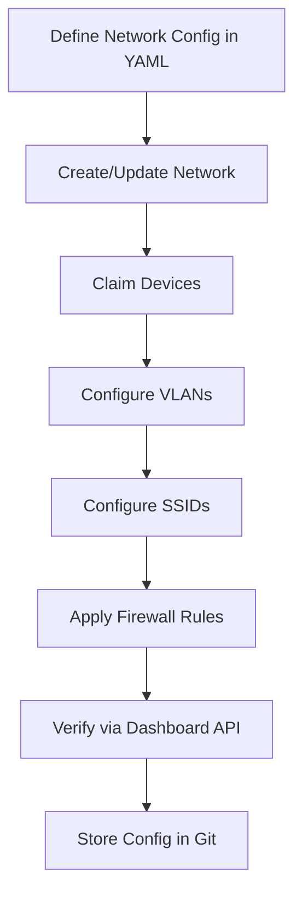

# How to Use Ansible to Manage Meraki Devices

Author: [nawazdhandala](https://www.github.com/nawazdhandala)

Tags: Ansible, Meraki, Cisco, Network Automation

Description: Automate Cisco Meraki device management with Ansible using the cisco.meraki collection for network, SSID, and firewall configuration.

---

Cisco Meraki's cloud-managed networking is popular for a good reason: it simplifies network management significantly. But when you are managing dozens of Meraki networks across multiple organizations, even the Meraki dashboard can get tedious. Ansible has a solid collection for Meraki that talks directly to the Meraki Dashboard API, letting you automate network creation, SSID configuration, firewall rules, and a lot more.

This guide walks through setting up Ansible for Meraki automation and covers the most common tasks you will encounter.

## Prerequisites

You need an API key from the Meraki Dashboard. Go to Organization > Settings > Dashboard API access and generate a key.

Install the Meraki collection and required Python library.

```bash
# Install the Cisco Meraki Ansible collection
ansible-galaxy collection install cisco.meraki

# Install the Meraki Python SDK
pip install meraki
```

## Authentication

Meraki uses a single API key for authentication. Store it in Ansible Vault.

```yaml
# group_vars/meraki/vault.yml (encrypt with ansible-vault)
meraki_api_key: "your-meraki-api-key-here"
meraki_org_name: "My Organization"
```

Since Meraki is cloud-managed, your inventory is different from traditional network devices. You target localhost because all API calls go to the Meraki cloud.

```ini
# inventory/meraki.ini
[meraki]
localhost ansible_connection=local
```

## Creating a Network

The first step in Meraki automation is usually creating or managing networks.

```yaml
# playbooks/create_network.yml
---
- name: Create Meraki Network
  hosts: localhost
  connection: local
  gather_facts: false

  vars_files:
    - ../group_vars/meraki/vault.yml

  collections:
    - cisco.meraki

  tasks:
    # Create a new combined network with wireless and switching
    - name: Create a new network
      meraki_network:
        auth_key: "{{ meraki_api_key }}"
        org_name: "{{ meraki_org_name }}"
        state: present
        name: "Branch-Office-NYC"
        type:
          - wireless
          - switch
          - appliance
        timezone: "America/New_York"
        tags:
          - branch
          - east-coast
      register: network_result

    - name: Show network details
      debug:
        var: network_result.data
```

## Configuring Wireless SSIDs

SSID management is probably the most frequent Meraki automation task. Here is a playbook that configures a corporate SSID with WPA2 Enterprise.

```yaml
# playbooks/configure_ssid.yml
---
- name: Configure Meraki Wireless SSIDs
  hosts: localhost
  connection: local
  gather_facts: false

  vars_files:
    - ../group_vars/meraki/vault.yml

  collections:
    - cisco.meraki

  tasks:
    # Configure the corporate SSID (index 0) with WPA2 Enterprise
    - name: Configure corporate SSID
      meraki_mr_ssid:
        auth_key: "{{ meraki_api_key }}"
        org_name: "{{ meraki_org_name }}"
        net_name: "Branch-Office-NYC"
        state: present
        number: 0
        name: "CorpWifi"
        enabled: true
        auth_mode: "8021x-radius"
        encryption_mode: "wpa"
        wpa_encryption_mode: "WPA2 only"
        radius_servers:
          - host: "10.0.1.50"
            port: 1812
            secret: "{{ vault_radius_secret }}"
        ip_assignment_mode: "Bridge mode"
      register: ssid_result

    # Configure a guest SSID (index 1) with a splash page
    - name: Configure guest SSID
      meraki_mr_ssid:
        auth_key: "{{ meraki_api_key }}"
        org_name: "{{ meraki_org_name }}"
        net_name: "Branch-Office-NYC"
        state: present
        number: 1
        name: "Guest-Wifi"
        enabled: true
        auth_mode: "open"
        splash_page: "Click-through splash page"
        ip_assignment_mode: "NAT mode"
        default_vlan_id: 100
```

## Managing MX Firewall Rules

Meraki MX appliances handle firewall rules. You can manage these through Ansible.

```yaml
# playbooks/manage_firewall_rules.yml
---
- name: Manage Meraki MX Firewall Rules
  hosts: localhost
  connection: local
  gather_facts: false

  vars_files:
    - ../group_vars/meraki/vault.yml

  collections:
    - cisco.meraki

  tasks:
    # Set L3 outbound firewall rules on the MX appliance
    - name: Configure L3 firewall rules
      meraki_mx_l3_firewall:
        auth_key: "{{ meraki_api_key }}"
        org_name: "{{ meraki_org_name }}"
        net_name: "Branch-Office-NYC"
        state: present
        rules:
          - comment: "Allow DNS"
            policy: "allow"
            protocol: "udp"
            dest_port: "53"
            dest_cidr: "any"
            src_cidr: "any"
          - comment: "Allow HTTPS"
            policy: "allow"
            protocol: "tcp"
            dest_port: "443"
            dest_cidr: "any"
            src_cidr: "any"
          - comment: "Block social media"
            policy: "deny"
            protocol: "tcp"
            dest_port: "443"
            dest_cidr: "157.240.0.0/16"
            src_cidr: "any"
```

## Configuring VLANs

VLAN management on Meraki MX appliances is straightforward with Ansible.

```yaml
# playbooks/configure_vlans.yml
---
- name: Configure Meraki VLANs
  hosts: localhost
  connection: local
  gather_facts: false

  vars_files:
    - ../group_vars/meraki/vault.yml

  collections:
    - cisco.meraki

  vars:
    # Define VLANs as a list for easy management
    vlans:
      - id: 10
        name: "Management"
        subnet: "10.0.10.0/24"
        appliance_ip: "10.0.10.1"
      - id: 20
        name: "Servers"
        subnet: "10.0.20.0/24"
        appliance_ip: "10.0.20.1"
      - id: 100
        name: "Guest"
        subnet: "10.0.100.0/24"
        appliance_ip: "10.0.100.1"

  tasks:
    # Enable VLANs on the network first
    - name: Enable VLANs on the network
      meraki_network:
        auth_key: "{{ meraki_api_key }}"
        org_name: "{{ meraki_org_name }}"
        state: present
        name: "Branch-Office-NYC"
        enable_vlans: true

    # Create each VLAN
    - name: Create VLANs
      meraki_vlan:
        auth_key: "{{ meraki_api_key }}"
        org_name: "{{ meraki_org_name }}"
        net_name: "Branch-Office-NYC"
        state: present
        vlan_id: "{{ item.id }}"
        name: "{{ item.name }}"
        subnet: "{{ item.subnet }}"
        appliance_ip: "{{ item.appliance_ip }}"
      loop: "{{ vlans }}"
```

## Claiming and Managing Devices

You can claim devices to networks and configure them through Ansible.

```yaml
# playbooks/claim_devices.yml
---
- name: Claim Devices to Meraki Network
  hosts: localhost
  connection: local
  gather_facts: false

  vars_files:
    - ../group_vars/meraki/vault.yml

  collections:
    - cisco.meraki

  tasks:
    # Claim devices using their serial numbers
    - name: Claim devices to network
      meraki_device:
        auth_key: "{{ meraki_api_key }}"
        org_name: "{{ meraki_org_name }}"
        net_name: "Branch-Office-NYC"
        state: present
        serial: "{{ item.serial }}"
        name: "{{ item.name }}"
        address: "{{ item.address }}"
        tags:
          - "{{ item.role }}"
      loop:
        - serial: "QXXX-XXXX-XXXX"
          name: "MX-NYC-01"
          address: "123 Main St, New York, NY"
          role: "appliance"
        - serial: "QYYY-YYYY-YYYY"
          name: "MS-NYC-01"
          address: "123 Main St, New York, NY"
          role: "switch"
```

## Meraki Automation Workflow



## Gathering Network Information

Pull data from Meraki for reporting and compliance.

```yaml
# playbooks/gather_info.yml
---
- name: Gather Meraki Network Information
  hosts: localhost
  connection: local
  gather_facts: false

  vars_files:
    - ../group_vars/meraki/vault.yml

  collections:
    - cisco.meraki

  tasks:
    # Get all networks in the organization
    - name: List all networks
      meraki_network:
        auth_key: "{{ meraki_api_key }}"
        org_name: "{{ meraki_org_name }}"
        state: query
      register: all_networks

    # Get device inventory
    - name: Get organization inventory
      meraki_device:
        auth_key: "{{ meraki_api_key }}"
        org_name: "{{ meraki_org_name }}"
        state: query
      register: all_devices

    - name: Show network count
      debug:
        msg: "Total networks: {{ all_networks.data | length }}, Total devices: {{ all_devices.data | length }}"
```

## API Rate Limiting

One thing to watch out for with Meraki automation is API rate limiting. Meraki limits you to 10 requests per second per organization. When running playbooks against many networks, add throttling.

```yaml
# Add throttle to limit concurrent API calls
- name: Configure SSIDs across all networks
  meraki_mr_ssid:
    auth_key: "{{ meraki_api_key }}"
    org_name: "{{ meraki_org_name }}"
    net_name: "{{ item }}"
    state: present
    number: 0
    name: "CorpWifi"
    enabled: true
  loop: "{{ network_names }}"
  throttle: 5  # Limit to 5 concurrent API calls
```

## Tips for Meraki Automation

1. Meraki API changes take effect immediately. There is no commit step. Test your playbooks against a lab network first.
2. Use `state: query` to gather information before making changes. This is great for building dynamic inventories.
3. SSID numbers (0-14) are fixed per network. You cannot create new SSIDs, only configure existing ones.
4. The API rate limit of 10 requests/second is organization-wide. If you have other integrations using the API, coordinate your automation windows.
5. Always store your Meraki API key in Ansible Vault. A leaked API key gives full access to your entire Meraki organization.

Meraki automation with Ansible is particularly powerful for multi-site deployments where you need consistent configuration across many branch offices. Define your configuration once in YAML and roll it out everywhere.
