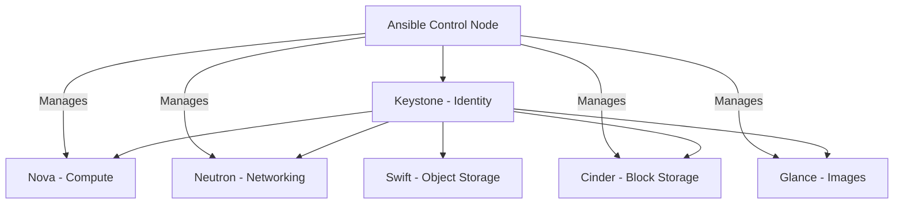

# How to Use Ansible to Manage OpenStack Infrastructure

Author: [nawazdhandala](https://www.github.com/nawazdhandala)

Tags: Ansible, OpenStack, Cloud Infrastructure, Private Cloud, Automation

Description: Learn how to manage OpenStack infrastructure with Ansible including projects, quotas, flavors, images, and user management.

---

OpenStack gives you a private cloud, but managing it through Horizon dashboards or raw API calls gets old quickly. Ansible has a solid set of OpenStack modules that let you manage everything from projects and users to networks and compute instances. If you are running OpenStack in production, automating the management layer with Ansible will save you significant time and reduce configuration drift.

This guide covers managing the OpenStack control plane itself: projects, users, quotas, flavors, images, and security groups. I will cover instance creation in a separate post.

## Prerequisites

You need:

- Ansible 2.12+ on your control node
- The `openstack.cloud` collection
- Python `openstacksdk` library
- A `clouds.yaml` file with your OpenStack credentials

```bash
# Install the OpenStack collection and SDK
ansible-galaxy collection install openstack.cloud
pip install openstacksdk
```

## OpenStack Authentication

Ansible's OpenStack modules read credentials from a `clouds.yaml` file. Place this in `~/.config/openstack/` or in the current directory.

```yaml
# clouds.yaml
clouds:
  production:
    auth:
      auth_url: https://openstack.lab.local:5000/v3
      project_name: admin
      project_domain_name: Default
      user_domain_name: Default
      username: admin
      password: "{{ vault_openstack_password }}"
    region_name: RegionOne
    identity_api_version: 3
  staging:
    auth:
      auth_url: https://openstack-staging.lab.local:5000/v3
      project_name: admin
      project_domain_name: Default
      user_domain_name: Default
      username: admin
      password: "{{ vault_openstack_staging_password }}"
    region_name: RegionOne
    identity_api_version: 3
```

## OpenStack Architecture Overview



## Managing Projects

Projects (formerly called tenants) are the organizational unit in OpenStack. Here is how to create and manage them.

```yaml
# playbooks/manage-projects.yml
---
- name: Manage OpenStack projects
  hosts: localhost
  gather_facts: false

  vars:
    cloud_name: production
    projects:
      - name: engineering
        description: "Engineering team project"
        domain: Default
      - name: data-science
        description: "Data science and ML workloads"
        domain: Default
      - name: staging
        description: "Staging environment"
        domain: Default

  tasks:
    # Create each project in OpenStack
    - name: Create OpenStack projects
      openstack.cloud.project:
        cloud: "{{ cloud_name }}"
        name: "{{ item.name }}"
        description: "{{ item.description }}"
        domain_id: "{{ item.domain }}"
        state: present
        enabled: true
      loop: "{{ projects }}"
      loop_control:
        label: "{{ item.name }}"
```

## Managing Users and Role Assignments

Create users and assign them to projects with appropriate roles.

```yaml
# playbooks/manage-users.yml
---
- name: Manage OpenStack users
  hosts: localhost
  gather_facts: false

  vars:
    cloud_name: production
    users:
      - name: jsmith
        email: jsmith@company.com
        password: "{{ vault_jsmith_password }}"
        project: engineering
        role: member
      - name: mwilson
        email: mwilson@company.com
        password: "{{ vault_mwilson_password }}"
        project: engineering
        role: admin
      - name: dtaylor
        email: dtaylor@company.com
        password: "{{ vault_dtaylor_password }}"
        project: data-science
        role: member

  tasks:
    # Create user accounts
    - name: Create OpenStack users
      openstack.cloud.identity_user:
        cloud: "{{ cloud_name }}"
        name: "{{ item.name }}"
        email: "{{ item.email }}"
        password: "{{ item.password }}"
        default_project: "{{ item.project }}"
        domain: Default
        state: present
        enabled: true
      loop: "{{ users }}"
      loop_control:
        label: "{{ item.name }}"
      no_log: true

    # Assign roles to users in their projects
    - name: Assign project roles
      openstack.cloud.role_assignment:
        cloud: "{{ cloud_name }}"
        user: "{{ item.name }}"
        project: "{{ item.project }}"
        role: "{{ item.role }}"
        state: present
      loop: "{{ users }}"
      loop_control:
        label: "{{ item.name }} -> {{ item.project }} ({{ item.role }})"
```

## Setting Quotas

Quotas prevent any single project from consuming all your OpenStack resources. Set them consistently across projects.

```yaml
# playbooks/manage-quotas.yml
---
- name: Manage OpenStack quotas
  hosts: localhost
  gather_facts: false

  vars:
    cloud_name: production
    project_quotas:
      - project: engineering
        instances: 50
        cores: 200
        ram: 524288
        floating_ips: 20
        security_groups: 30
        volumes: 100
        gigabytes: 5000
      - project: data-science
        instances: 30
        cores: 500
        ram: 1048576
        floating_ips: 10
        security_groups: 20
        volumes: 50
        gigabytes: 10000
      - project: staging
        instances: 20
        cores: 80
        ram: 163840
        floating_ips: 10
        security_groups: 15
        volumes: 40
        gigabytes: 2000

  tasks:
    # Set compute quotas for each project
    - name: Set compute quotas
      openstack.cloud.quota:
        cloud: "{{ cloud_name }}"
        name: "{{ item.project }}"
        instances: "{{ item.instances }}"
        cores: "{{ item.cores }}"
        ram: "{{ item.ram }}"
        floating_ips: "{{ item.floating_ips }}"
        security_groups: "{{ item.security_groups }}"
        volumes: "{{ item.volumes }}"
        gigabytes: "{{ item.gigabytes }}"
      loop: "{{ project_quotas }}"
      loop_control:
        label: "{{ item.project }}"
```

## Managing Flavors

Flavors define the compute resource templates available to users.

```yaml
# playbooks/manage-flavors.yml
---
- name: Manage OpenStack flavors
  hosts: localhost
  gather_facts: false

  vars:
    cloud_name: production
    flavors:
      - name: m1.small
        ram: 2048
        vcpus: 1
        disk: 20
        is_public: true
      - name: m1.medium
        ram: 4096
        vcpus: 2
        disk: 40
        is_public: true
      - name: m1.large
        ram: 8192
        vcpus: 4
        disk: 80
        is_public: true
      - name: m1.xlarge
        ram: 16384
        vcpus: 8
        disk: 160
        is_public: true
      - name: c1.gpu
        ram: 32768
        vcpus: 8
        disk: 100
        is_public: false
        extra_specs:
          "pci_passthrough:alias": "gpu-tesla-v100:1"

  tasks:
    # Create standard compute flavors
    - name: Create flavors
      openstack.cloud.compute_flavor:
        cloud: "{{ cloud_name }}"
        name: "{{ item.name }}"
        ram: "{{ item.ram }}"
        vcpus: "{{ item.vcpus }}"
        disk: "{{ item.disk }}"
        is_public: "{{ item.is_public | default(true) }}"
        state: present
      loop: "{{ flavors }}"
      loop_control:
        label: "{{ item.name }}"

    # Set extra specs on GPU flavor
    - name: Set extra specs for GPU flavor
      openstack.cloud.compute_flavor:
        cloud: "{{ cloud_name }}"
        name: "{{ item.name }}"
        extra_specs: "{{ item.extra_specs }}"
      loop: "{{ flavors | selectattr('extra_specs', 'defined') | list }}"
      loop_control:
        label: "{{ item.name }}"
```

## Managing Images

Upload and manage Glance images for your OpenStack cloud.

```yaml
# playbooks/manage-images.yml
---
- name: Manage OpenStack images
  hosts: localhost
  gather_facts: false

  vars:
    cloud_name: production
    images:
      - name: ubuntu-22.04
        filename: /var/lib/images/ubuntu-22.04-server-cloudimg-amd64.img
        disk_format: qcow2
        container_format: bare
        min_disk: 10
        min_ram: 512
        properties:
          os_type: linux
          os_distro: ubuntu
          os_version: "22.04"
      - name: centos-9-stream
        filename: /var/lib/images/CentOS-Stream-GenericCloud-9-latest.x86_64.qcow2
        disk_format: qcow2
        container_format: bare
        min_disk: 10
        min_ram: 512
        properties:
          os_type: linux
          os_distro: centos
          os_version: "9"

  tasks:
    # Upload images to Glance
    - name: Upload OS images
      openstack.cloud.image:
        cloud: "{{ cloud_name }}"
        name: "{{ item.name }}"
        filename: "{{ item.filename }}"
        disk_format: "{{ item.disk_format }}"
        container_format: "{{ item.container_format }}"
        min_disk: "{{ item.min_disk }}"
        min_ram: "{{ item.min_ram }}"
        properties: "{{ item.properties }}"
        is_public: true
        state: present
      loop: "{{ images }}"
      loop_control:
        label: "{{ item.name }}"
```

## Security Group Management

Define reusable security groups that projects can use.

```yaml
# playbooks/manage-security-groups.yml
---
- name: Manage OpenStack security groups
  hosts: localhost
  gather_facts: false

  vars:
    cloud_name: production

  tasks:
    # Create a security group for web servers
    - name: Create web server security group
      openstack.cloud.security_group:
        cloud: "{{ cloud_name }}"
        name: sg-web
        description: "Allow HTTP and HTTPS traffic"
        state: present

    # Add rules to the web security group
    - name: Allow HTTP
      openstack.cloud.security_group_rule:
        cloud: "{{ cloud_name }}"
        security_group: sg-web
        protocol: tcp
        port_range_min: 80
        port_range_max: 80
        remote_ip_prefix: 0.0.0.0/0
        direction: ingress

    - name: Allow HTTPS
      openstack.cloud.security_group_rule:
        cloud: "{{ cloud_name }}"
        security_group: sg-web
        protocol: tcp
        port_range_min: 443
        port_range_max: 443
        remote_ip_prefix: 0.0.0.0/0
        direction: ingress

    # Create a security group for database servers
    - name: Create database security group
      openstack.cloud.security_group:
        cloud: "{{ cloud_name }}"
        name: sg-database
        description: "Allow database traffic from app tier"
        state: present

    - name: Allow PostgreSQL from app subnet
      openstack.cloud.security_group_rule:
        cloud: "{{ cloud_name }}"
        security_group: sg-database
        protocol: tcp
        port_range_min: 5432
        port_range_max: 5432
        remote_ip_prefix: 192.168.20.0/24
        direction: ingress
```

## Full Infrastructure Audit

Use Ansible to gather and report on your OpenStack infrastructure state.

```yaml
# playbooks/audit-infrastructure.yml
---
- name: Audit OpenStack infrastructure
  hosts: localhost
  gather_facts: false

  vars:
    cloud_name: production

  tasks:
    - name: List all projects
      openstack.cloud.project_info:
        cloud: "{{ cloud_name }}"
      register: projects

    - name: List all flavors
      openstack.cloud.compute_flavor_info:
        cloud: "{{ cloud_name }}"
      register: flavors

    - name: List all images
      openstack.cloud.image_info:
        cloud: "{{ cloud_name }}"
      register: images

    - name: Generate audit report
      ansible.builtin.template:
        src: audit-report.j2
        dest: /tmp/openstack-audit-{{ ansible_date_time.date }}.txt
        mode: '0644'
      vars:
        project_list: "{{ projects.projects }}"
        flavor_list: "{{ flavors.flavors }}"
        image_list: "{{ images.images }}"
```

## Operational Tips

Here is what I have found works well when managing OpenStack with Ansible:

1. **Use clouds.yaml over environment variables.** It is easier to manage multiple OpenStack environments when credentials are in a structured file. Use `ansible-vault` to encrypt the passwords.
2. **Keep quotas in version control.** When a team asks for more resources, the change should go through a pull request. That gives you an audit trail.
3. **Create project templates.** Most new projects need the same basic setup: a network, a router, default security groups, and sensible quotas. Wrap this in an Ansible role and apply it every time.
4. **Schedule image updates.** Run a monthly playbook that downloads the latest cloud images and uploads them to Glance. Old images with known vulnerabilities are a common security gap.
5. **Test quota changes in staging.** Accidentally setting a quota to 0 will prevent all new instance launches in that project. Always validate in a non-production environment first.

Ansible gives you a clean, repeatable way to manage the OpenStack platform itself, not just the workloads running on it. That distinction matters because platform configuration drift is harder to detect and more impactful than application-level drift.
