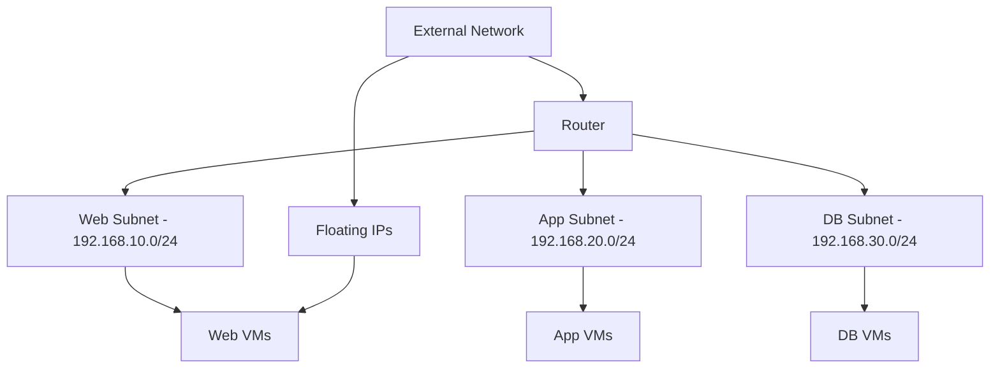

# How to Use Ansible to Manage OpenStack Networks

Author: [nawazdhandala](https://www.github.com/nawazdhandala)

Tags: Ansible, OpenStack, Neutron, Networking, Cloud Infrastructure

Description: Manage OpenStack Neutron networking with Ansible including networks, subnets, routers, floating IPs, and security groups.

---

Networking in OpenStack is handled by Neutron, and getting the network architecture right is critical for any cloud deployment. Misconfigured networks lead to connectivity issues that are painful to debug, especially when you have dozens of projects each with their own network topology. Ansible makes it possible to define your entire OpenStack network layout as code and apply it consistently.

This guide covers creating and managing networks, subnets, routers, ports, and floating IP pools using Ansible.

## Prerequisites

You need:

- Ansible 2.12+ with the `openstack.cloud` collection
- Python `openstacksdk` installed
- A `clouds.yaml` with admin credentials (network creation often requires admin)

```bash
ansible-galaxy collection install openstack.cloud
pip install openstacksdk
```

## OpenStack Networking Architecture



## Creating Networks and Subnets

The foundation of your OpenStack networking is the network and subnet pair. Each network needs at least one subnet to be useful.

```yaml
# playbooks/create-networks.yml
---
- name: Create OpenStack networks and subnets
  hosts: localhost
  gather_facts: false

  vars:
    cloud_name: production
    networks:
      - name: web-net
        subnet_name: web-subnet
        cidr: 192.168.10.0/24
        gateway: 192.168.10.1
        dns_nameservers:
          - 10.0.0.53
          - 10.0.0.54
        allocation_pool_start: 192.168.10.50
        allocation_pool_end: 192.168.10.250
      - name: app-net
        subnet_name: app-subnet
        cidr: 192.168.20.0/24
        gateway: 192.168.20.1
        dns_nameservers:
          - 10.0.0.53
          - 10.0.0.54
        allocation_pool_start: 192.168.20.50
        allocation_pool_end: 192.168.20.250
      - name: db-net
        subnet_name: db-subnet
        cidr: 192.168.30.0/24
        gateway: 192.168.30.1
        dns_nameservers:
          - 10.0.0.53
          - 10.0.0.54
        allocation_pool_start: 192.168.30.50
        allocation_pool_end: 192.168.30.250

  tasks:
    # Create the network first
    - name: Create networks
      openstack.cloud.network:
        cloud: "{{ cloud_name }}"
        name: "{{ item.name }}"
        state: present
        external: false
        shared: false
      loop: "{{ networks }}"
      loop_control:
        label: "{{ item.name }}"

    # Create subnets within each network
    - name: Create subnets
      openstack.cloud.subnet:
        cloud: "{{ cloud_name }}"
        name: "{{ item.subnet_name }}"
        network_name: "{{ item.name }}"
        cidr: "{{ item.cidr }}"
        gateway_ip: "{{ item.gateway }}"
        dns_nameservers: "{{ item.dns_nameservers }}"
        allocation_pool_start: "{{ item.allocation_pool_start }}"
        allocation_pool_end: "{{ item.allocation_pool_end }}"
        ip_version: 4
        enable_dhcp: true
        state: present
      loop: "{{ networks }}"
      loop_control:
        label: "{{ item.subnet_name }}"
```

## Creating Routers

Routers connect your internal networks to each other and to the external network for internet access.

```yaml
# playbooks/create-routers.yml
---
- name: Create OpenStack routers
  hosts: localhost
  gather_facts: false

  vars:
    cloud_name: production
    external_network: external-net

  tasks:
    # Create the main router with external gateway
    - name: Create project router
      openstack.cloud.router:
        cloud: "{{ cloud_name }}"
        name: prod-router
        network: "{{ external_network }}"
        state: present
        interfaces:
          - web-subnet
          - app-subnet
          - db-subnet
      register: router_result

    - name: Show router info
      ansible.builtin.debug:
        msg: "Router {{ router_result.router.name }} created with ID {{ router_result.router.id }}"
```

If you need more control over the router interfaces, add them separately.

```yaml
# playbooks/manage-router-interfaces.yml
---
- name: Manage router interfaces individually
  hosts: localhost
  gather_facts: false

  vars:
    cloud_name: production
    router_name: prod-router
    subnets_to_connect:
      - web-subnet
      - app-subnet
      - db-subnet
      - management-subnet

  tasks:
    # Attach each subnet to the router
    - name: Add subnet interfaces to router
      openstack.cloud.router:
        cloud: "{{ cloud_name }}"
        name: "{{ router_name }}"
        interfaces:
          - "{{ item }}"
        state: present
      loop: "{{ subnets_to_connect }}"
      loop_control:
        label: "{{ item }}"
```

## Managing the External Network

The external network is typically created by the cloud admin and provides the floating IP pool. Here is how to set it up.

```yaml
# playbooks/create-external-network.yml
---
- name: Create external network (admin only)
  hosts: localhost
  gather_facts: false

  vars:
    cloud_name: production

  tasks:
    # Create the external/provider network
    - name: Create external network
      openstack.cloud.network:
        cloud: "{{ cloud_name }}"
        name: external-net
        external: true
        provider_network_type: flat
        provider_physical_network: physnet1
        shared: false
        state: present

    # Create the external subnet with the public IP range
    - name: Create external subnet
      openstack.cloud.subnet:
        cloud: "{{ cloud_name }}"
        name: external-subnet
        network_name: external-net
        cidr: 203.0.113.0/24
        gateway_ip: 203.0.113.1
        allocation_pool_start: 203.0.113.100
        allocation_pool_end: 203.0.113.200
        enable_dhcp: false
        ip_version: 4
        state: present
```

## Creating Ports with Fixed IPs

When you need specific IP addresses for instances (common for database servers and load balancers), pre-create ports.

```yaml
# playbooks/create-ports.yml
---
- name: Create OpenStack ports with fixed IPs
  hosts: localhost
  gather_facts: false

  vars:
    cloud_name: production
    static_ports:
      - name: db-01-port
        network: db-net
        fixed_ip: 192.168.30.10
        security_groups: [sg-database, sg-ssh]
      - name: db-02-port
        network: db-net
        fixed_ip: 192.168.30.11
        security_groups: [sg-database, sg-ssh]
      - name: lb-01-port
        network: web-net
        fixed_ip: 192.168.10.10
        security_groups: [sg-web, sg-ssh]

  tasks:
    # Create ports with fixed IP assignments
    - name: Create ports
      openstack.cloud.port:
        cloud: "{{ cloud_name }}"
        name: "{{ item.name }}"
        network: "{{ item.network }}"
        fixed_ips:
          - ip_address: "{{ item.fixed_ip }}"
        security_groups: "{{ item.security_groups }}"
        state: present
      loop: "{{ static_ports }}"
      loop_control:
        label: "{{ item.name }} -> {{ item.fixed_ip }}"

    # Create an instance using the pre-created port
    - name: Create database instance on specific port
      openstack.cloud.server:
        cloud: "{{ cloud_name }}"
        name: db-01
        image: ubuntu-22.04
        flavor: m1.xlarge
        key_name: deploy-key
        nics:
          - port-name: db-01-port
        state: present
        wait: true
```

## Floating IP Management

Floating IPs are public addresses that can be associated with instances for external access.

```yaml
# playbooks/manage-floating-ips.yml
---
- name: Manage floating IPs
  hosts: localhost
  gather_facts: false

  vars:
    cloud_name: production
    floating_ip_network: external-net

  tasks:
    # Allocate a floating IP from the external pool
    - name: Allocate floating IP
      openstack.cloud.floating_ip:
        cloud: "{{ cloud_name }}"
        server: web-01
        network: "{{ floating_ip_network }}"
        state: present
        wait: true
        reuse: true
      register: fip_result

    - name: Show floating IP
      ansible.builtin.debug:
        msg: "Floating IP {{ fip_result.floating_ip.floating_ip_address }} assigned to web-01"

    # To detach a floating IP without deleting it
    - name: Detach floating IP from instance
      openstack.cloud.floating_ip:
        cloud: "{{ cloud_name }}"
        server: web-01
        network: "{{ floating_ip_network }}"
        state: absent
      when: detach_fip | default(false)
```

## Network Topology for Multi-Tier Applications

Here is a complete playbook that builds a full network topology for a three-tier application.

```yaml
# playbooks/full-network-topology.yml
---
- name: Build complete network topology
  hosts: localhost
  gather_facts: false

  vars:
    cloud_name: production
    external_network: external-net
    project_prefix: myapp

  tasks:
    # Create all three networks
    - name: Create tier networks
      openstack.cloud.network:
        cloud: "{{ cloud_name }}"
        name: "{{ project_prefix }}-{{ item.name }}"
        state: present
      loop:
        - { name: web, cidr: "10.10.1.0/24" }
        - { name: app, cidr: "10.10.2.0/24" }
        - { name: db, cidr: "10.10.3.0/24" }

    # Create subnets for each network
    - name: Create tier subnets
      openstack.cloud.subnet:
        cloud: "{{ cloud_name }}"
        name: "{{ project_prefix }}-{{ item.name }}-subnet"
        network_name: "{{ project_prefix }}-{{ item.name }}"
        cidr: "{{ item.cidr }}"
        dns_nameservers: [8.8.8.8, 8.8.4.4]
        enable_dhcp: true
        state: present
      loop:
        - { name: web, cidr: "10.10.1.0/24" }
        - { name: app, cidr: "10.10.2.0/24" }
        - { name: db, cidr: "10.10.3.0/24" }

    # Create the router and connect everything
    - name: Create application router
      openstack.cloud.router:
        cloud: "{{ cloud_name }}"
        name: "{{ project_prefix }}-router"
        network: "{{ external_network }}"
        interfaces:
          - "{{ project_prefix }}-web-subnet"
          - "{{ project_prefix }}-app-subnet"
          - "{{ project_prefix }}-db-subnet"
        state: present

    # Create security groups for each tier
    - name: Create web security group
      openstack.cloud.security_group:
        cloud: "{{ cloud_name }}"
        name: "{{ project_prefix }}-sg-web"
        description: "Web tier security group"
        state: present

    - name: Add web security rules
      openstack.cloud.security_group_rule:
        cloud: "{{ cloud_name }}"
        security_group: "{{ project_prefix }}-sg-web"
        protocol: tcp
        port_range_min: "{{ item }}"
        port_range_max: "{{ item }}"
        remote_ip_prefix: 0.0.0.0/0
        direction: ingress
      loop: [80, 443]

    - name: Create app security group
      openstack.cloud.security_group:
        cloud: "{{ cloud_name }}"
        name: "{{ project_prefix }}-sg-app"
        description: "App tier security group"
        state: present

    - name: Allow web to app communication
      openstack.cloud.security_group_rule:
        cloud: "{{ cloud_name }}"
        security_group: "{{ project_prefix }}-sg-app"
        protocol: tcp
        port_range_min: 8080
        port_range_max: 8080
        remote_ip_prefix: 10.10.1.0/24
        direction: ingress

    - name: Create db security group
      openstack.cloud.security_group:
        cloud: "{{ cloud_name }}"
        name: "{{ project_prefix }}-sg-db"
        description: "Database tier security group"
        state: present

    - name: Allow app to db communication
      openstack.cloud.security_group_rule:
        cloud: "{{ cloud_name }}"
        security_group: "{{ project_prefix }}-sg-db"
        protocol: tcp
        port_range_min: 5432
        port_range_max: 5432
        remote_ip_prefix: 10.10.2.0/24
        direction: ingress
```

## Network Cleanup

When tearing down environments, delete resources in the right order: instances first, then ports, then routers, then subnets, then networks.

```yaml
# playbooks/cleanup-networks.yml
---
- name: Clean up OpenStack networks
  hosts: localhost
  gather_facts: false

  vars:
    cloud_name: production
    project_prefix: myapp

  tasks:
    # Remove router interfaces first
    - name: Remove router
      openstack.cloud.router:
        cloud: "{{ cloud_name }}"
        name: "{{ project_prefix }}-router"
        state: absent

    # Delete subnets
    - name: Remove subnets
      openstack.cloud.subnet:
        cloud: "{{ cloud_name }}"
        name: "{{ project_prefix }}-{{ item }}-subnet"
        state: absent
      loop: [web, app, db]

    # Delete networks
    - name: Remove networks
      openstack.cloud.network:
        cloud: "{{ cloud_name }}"
        name: "{{ project_prefix }}-{{ item }}"
        state: absent
      loop: [web, app, db]

    # Delete security groups
    - name: Remove security groups
      openstack.cloud.security_group:
        cloud: "{{ cloud_name }}"
        name: "{{ project_prefix }}-sg-{{ item }}"
        state: absent
      loop: [web, app, db]
```

## Networking Lessons Learned

1. **Always specify DNS servers.** The default OpenStack DHCP does not include DNS unless you configure it. Your instances will have working network but no name resolution.
2. **Use allocation pools to reserve IPs.** Reserve the first 50 addresses in each subnet for static assignments (load balancers, database servers). Let DHCP hand out the rest.
3. **Delete in the right order.** Trying to delete a network with active ports will fail. Remove instances, then ports, then router interfaces, then subnets, then networks.
4. **Separate management and data traffic.** Use dedicated networks for management (SSH, monitoring) and keep application data traffic on separate networks. It makes security group rules much cleaner.
5. **Test connectivity between tiers.** After building the network, always verify that your security group rules actually allow the traffic you intend. A missing rule is the number one cause of "it worked in dev but not in staging" issues.
