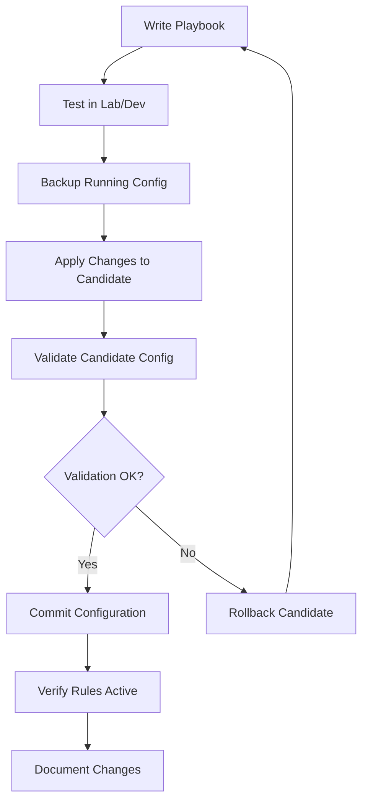

# How to Use Ansible to Manage Palo Alto Firewalls

Author: [nawazdhandala](https://www.github.com/nawazdhandala)

Tags: Ansible, Palo Alto, Firewall, Network Automation

Description: Learn how to automate Palo Alto firewall configuration and management using Ansible modules and playbooks for consistent security policies.

---

Managing Palo Alto firewalls manually through the web UI works fine when you have one or two devices. But once you are dealing with dozens of firewalls across multiple data centers, manual management becomes a serious bottleneck. Ansible provides a solid collection of modules specifically built for PAN-OS that let you automate everything from security rules to NAT policies.

In this post, I will walk through setting up Ansible for Palo Alto management, writing playbooks for common tasks, and handling the quirks that come with firewall automation.

## Prerequisites

You need a few things before getting started:

- Ansible 2.10 or later installed
- The `paloaltonetworks.panos` collection
- API access enabled on your Palo Alto firewall
- A service account with API privileges

Install the Palo Alto collection from Ansible Galaxy.

```bash
# Install the official Palo Alto Networks collection
ansible-galaxy collection install paloaltonetworks.panos
```

You also need the `pan-python` and `pan-os-python` libraries installed on your control node.

```bash
# Install the required Python libraries for PAN-OS communication
pip install pan-python pan-os-python
```

## Setting Up Authentication

Palo Alto firewalls use API keys for authentication. You can either pass credentials directly or generate an API key ahead of time. I strongly recommend using Ansible Vault to store your credentials.

Create a variables file for your firewall credentials.

```yaml
# group_vars/firewalls/vault.yml (encrypted with ansible-vault)
panos_ip: "192.168.1.1"
panos_username: "ansible-svc"
panos_password: "your-secure-password"
```

Set up an inventory file for your firewalls.

```ini
# inventory/firewalls.ini
[palo_alto]
fw-dc1 ansible_host=192.168.1.1
fw-dc2 ansible_host=192.168.2.1

[palo_alto:vars]
ansible_connection=local
ansible_python_interpreter=/usr/bin/python3
```

## Creating Security Rules

One of the most common tasks is managing security policies. Here is a playbook that creates a security rule allowing web traffic from a specific zone.

```yaml
# playbooks/create_security_rule.yml
---
- name: Manage Palo Alto Security Rules
  hosts: localhost
  connection: local
  gather_facts: false

  vars_files:
    - ../group_vars/firewalls/vault.yml

  collections:
    - paloaltonetworks.panos

  tasks:
    # Create a security rule allowing HTTP/HTTPS from the trust zone to untrust
    - name: Create web access rule
      panos_security_rule:
        provider:
          ip_address: "{{ panos_ip }}"
          username: "{{ panos_username }}"
          password: "{{ panos_password }}"
        rule_name: "Allow-Web-Traffic"
        description: "Allow HTTP and HTTPS from trust to untrust"
        source_zone: ["trust"]
        destination_zone: ["untrust"]
        source_ip: ["any"]
        destination_ip: ["any"]
        application: ["web-browsing", "ssl"]
        action: "allow"
        log_end: true
        location: "before"
        existing_rule: "Deny-All"
      register: rule_result

    - name: Show result
      debug:
        var: rule_result
```

## Managing Address Objects

Before you can reference hosts in rules, you typically need address objects. This playbook creates address objects for your servers.

```yaml
# playbooks/create_address_objects.yml
---
- name: Create Address Objects on Palo Alto
  hosts: localhost
  connection: local
  gather_facts: false

  vars_files:
    - ../group_vars/firewalls/vault.yml

  collections:
    - paloaltonetworks.panos

  vars:
    # Define address objects as a list for easy bulk creation
    address_objects:
      - name: "web-server-01"
        value: "10.0.1.10/32"
        description: "Production web server 1"
      - name: "web-server-02"
        value: "10.0.1.11/32"
        description: "Production web server 2"
      - name: "db-server-01"
        value: "10.0.2.10/32"
        description: "Production database server"

  tasks:
    # Loop through each address object and create it
    - name: Create address objects
      panos_address_object:
        provider:
          ip_address: "{{ panos_ip }}"
          username: "{{ panos_username }}"
          password: "{{ panos_password }}"
        name: "{{ item.name }}"
        value: "{{ item.value }}"
        description: "{{ item.description }}"
        address_type: "ip-netmask"
      loop: "{{ address_objects }}"

    # Create an address group containing the web servers
    - name: Create address group for web servers
      panos_address_group:
        provider:
          ip_address: "{{ panos_ip }}"
          username: "{{ panos_username }}"
          password: "{{ panos_password }}"
        name: "web-servers"
        static_value:
          - "web-server-01"
          - "web-server-02"
        description: "All production web servers"
```

## Committing Changes

One important detail about Palo Alto automation: changes are staged in the candidate configuration and require a commit before they take effect. Always include a commit task at the end of your playbooks.

```yaml
# playbooks/commit_changes.yml
---
- name: Commit Configuration to Palo Alto
  hosts: localhost
  connection: local
  gather_facts: false

  vars_files:
    - ../group_vars/firewalls/vault.yml

  collections:
    - paloaltonetworks.panos

  tasks:
    # Commit the candidate configuration to make changes active
    - name: Commit configuration
      panos_commit_firewall:
        provider:
          ip_address: "{{ panos_ip }}"
          username: "{{ panos_username }}"
          password: "{{ panos_password }}"
      register: commit_result

    - name: Display commit status
      debug:
        msg: "Commit job ID: {{ commit_result.jobid }}"
```

## Configuring NAT Rules

NAT configuration is another frequent task. Here is how to set up a source NAT rule.

```yaml
# playbooks/create_nat_rule.yml
---
- name: Configure NAT Rules
  hosts: localhost
  connection: local
  gather_facts: false

  vars_files:
    - ../group_vars/firewalls/vault.yml

  collections:
    - paloaltonetworks.panos

  tasks:
    # Create a source NAT rule for outbound internet access
    - name: Create source NAT for outbound traffic
      panos_nat_rule:
        provider:
          ip_address: "{{ panos_ip }}"
          username: "{{ panos_username }}"
          password: "{{ panos_password }}"
        rule_name: "Outbound-SNAT"
        description: "Source NAT for outbound internet traffic"
        source_zone: ["trust"]
        destination_zone: ["untrust"]
        source_ip: ["10.0.0.0/8"]
        destination_ip: ["any"]
        snat_type: "dynamic-ip-and-port"
        snat_address_type: "interface-address"
        snat_interface: "ethernet1/1"
```

## Backing Up Configuration

Always back up your configuration before making changes. This playbook exports the running configuration.

```yaml
# playbooks/backup_config.yml
---
- name: Backup Palo Alto Configuration
  hosts: localhost
  connection: local
  gather_facts: false

  vars_files:
    - ../group_vars/firewalls/vault.yml

  collections:
    - paloaltonetworks.panos

  tasks:
    # Export the running configuration to a local file
    - name: Export running configuration
      panos_export:
        provider:
          ip_address: "{{ panos_ip }}"
          username: "{{ panos_username }}"
          password: "{{ panos_password }}"
        category: "configuration"
        filename: "running-config-{{ ansible_date_time.date }}.xml"
      register: export_result

    - name: Save config locally
      copy:
        content: "{{ export_result.stdout }}"
        dest: "/backups/panos/{{ panos_ip }}-{{ ansible_date_time.date }}.xml"
```

## Workflow for Production Changes

Here is the recommended workflow for managing Palo Alto firewalls with Ansible in production.



## Handling Panorama

If you manage firewalls through Panorama, you can push configurations to device groups instead of individual firewalls. The modules support Panorama natively.

```yaml
# Target a device group on Panorama instead of a single firewall
- name: Create rule on Panorama device group
  panos_security_rule:
    provider:
      ip_address: "{{ panorama_ip }}"
      username: "{{ panorama_username }}"
      password: "{{ panorama_password }}"
    device_group: "DC-East-Firewalls"
    rule_name: "Allow-DNS"
    source_zone: ["trust"]
    destination_zone: ["untrust"]
    application: ["dns"]
    action: "allow"
```

## Tips from Production Experience

A few things I have learned managing Palo Alto firewalls with Ansible in production:

1. Always use `panos_commit_firewall` as a separate task so you can batch multiple changes before committing.
2. Set `commit: false` on individual module calls when you are making multiple changes in the same playbook run.
3. Use the `state: present` and `state: absent` parameters to make your playbooks idempotent.
4. Test against a lab firewall or use the PAN-OS API simulator before touching production.
5. Keep your firewall credentials in Ansible Vault and never hardcode them in playbooks.

The Palo Alto Ansible collection covers most of what you need for day-to-day firewall management. For anything not covered by existing modules, you can fall back to the `panos_type_cmd` module which lets you send raw XML API commands to the firewall. This gives you full access to every PAN-OS feature even if a dedicated module does not exist yet.
