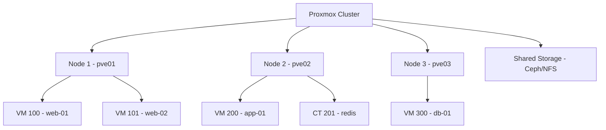

# How to Use Ansible to Manage Proxmox Virtual Machines

Author: [nawazdhandala](https://www.github.com/nawazdhandala)

Tags: Ansible, Proxmox, Virtualization, Homelab, KVM

Description: Automate Proxmox VE virtual machine management with Ansible for VM creation, cloning, snapshots, and cluster operations.

---

Proxmox Virtual Environment (VE) is a popular open-source virtualization platform that combines KVM for VMs and LXC for containers. It is widely used in homelabs, small businesses, and even some production environments. While the Proxmox web interface is excellent, managing dozens of VMs across multiple nodes is faster and more consistent with Ansible.

This guide shows you how to create, clone, manage, and monitor Proxmox VMs using Ansible playbooks.

## Prerequisites

You need:

- Ansible 2.12+ on your control node
- The `community.general` collection (includes Proxmox modules)
- A Proxmox VE cluster or standalone node
- An API token or user credentials with appropriate permissions
- Python `proxmoxer` and `requests` libraries

```bash
# Install required collection and Python libraries
ansible-galaxy collection install community.general
pip install proxmoxer requests
```

## Creating an API Token

API tokens are the recommended way to authenticate with Proxmox. Create one from the Proxmox web UI under Datacenter > Permissions > API Tokens, or use the command line.

```bash
# Create an API token on the Proxmox node
pveum user token add root@pam ansible-token --privsep=0
```

Store the credentials securely.

```yaml
# vars/proxmox_credentials.yml (encrypt with ansible-vault)
---
proxmox_host: pve01.lab.local
proxmox_user: root@pam
proxmox_token_id: ansible-token
proxmox_token_secret: "your-token-secret-here"
```

## Proxmox Architecture



## Creating a VM from Scratch

The `community.general.proxmox_kvm` module handles KVM virtual machine management.

```yaml
# playbooks/create-vm.yml
---
- name: Create a Proxmox VM
  hosts: localhost
  gather_facts: false
  vars_files:
    - ../vars/proxmox_credentials.yml

  tasks:
    # Create a new VM with specified hardware
    - name: Create web server VM
      community.general.proxmox_kvm:
        api_host: "{{ proxmox_host }}"
        api_user: "{{ proxmox_user }}"
        api_token_id: "{{ proxmox_token_id }}"
        api_token_secret: "{{ proxmox_token_secret }}"
        node: pve01
        vmid: 100
        name: web-01
        memory: 4096
        cores: 2
        sockets: 1
        cpu: host
        ostype: l26
        scsihw: virtio-scsi-single
        scsi:
          scsi0: "local-lvm:32,format=raw"
        ide:
          ide2: "local:iso/ubuntu-22.04-live-server-amd64.iso,media=cdrom"
        net:
          net0: "virtio,bridge=vmbr0"
        boot: order=scsi0;ide2;net0
        state: present
      register: vm_result

    - name: Show VM creation result
      ansible.builtin.debug:
        msg: "VM {{ vm_result.vmid }} created on {{ vm_result.node }}"
```

## Cloning VMs from Templates

Cloning from templates is much faster than creating from scratch. First, prepare a template in Proxmox.

```yaml
# playbooks/clone-vm.yml
---
- name: Clone VMs from template
  hosts: localhost
  gather_facts: false
  vars_files:
    - ../vars/proxmox_credentials.yml

  vars:
    template_vmid: 9000
    vms:
      - vmid: 110
        name: web-01
        node: pve01
        cores: 2
        memory: 4096
      - vmid: 111
        name: web-02
        node: pve01
        cores: 2
        memory: 4096
      - vmid: 120
        name: app-01
        node: pve02
        cores: 4
        memory: 8192
      - vmid: 130
        name: db-01
        node: pve03
        cores: 8
        memory: 16384

  tasks:
    # Clone each VM from the template
    - name: Clone VM from template
      community.general.proxmox_kvm:
        api_host: "{{ proxmox_host }}"
        api_user: "{{ proxmox_user }}"
        api_token_id: "{{ proxmox_token_id }}"
        api_token_secret: "{{ proxmox_token_secret }}"
        node: "{{ item.node }}"
        vmid: "{{ item.vmid }}"
        name: "{{ item.name }}"
        clone: "ubuntu-22.04-template"
        full: true
        storage: local-lvm
        timeout: 300
      loop: "{{ vms }}"
      loop_control:
        label: "{{ item.name }}"

    # Update hardware after cloning
    - name: Configure VM resources
      community.general.proxmox_kvm:
        api_host: "{{ proxmox_host }}"
        api_user: "{{ proxmox_user }}"
        api_token_id: "{{ proxmox_token_id }}"
        api_token_secret: "{{ proxmox_token_secret }}"
        node: "{{ item.node }}"
        vmid: "{{ item.vmid }}"
        cores: "{{ item.cores }}"
        memory: "{{ item.memory }}"
        update: true
      loop: "{{ vms }}"
      loop_control:
        label: "{{ item.name }}"

    # Start the VMs
    - name: Start cloned VMs
      community.general.proxmox_kvm:
        api_host: "{{ proxmox_host }}"
        api_user: "{{ proxmox_user }}"
        api_token_id: "{{ proxmox_token_id }}"
        api_token_secret: "{{ proxmox_token_secret }}"
        node: "{{ item.node }}"
        vmid: "{{ item.vmid }}"
        state: started
      loop: "{{ vms }}"
      loop_control:
        label: "{{ item.name }}"
```

## Cloud-Init Integration

Proxmox supports cloud-init for VM customization. This is the cleanest way to set hostname, IP address, and SSH keys during cloning.

```yaml
# playbooks/clone-with-cloudinit.yml
---
- name: Clone VM with cloud-init customization
  hosts: localhost
  gather_facts: false
  vars_files:
    - ../vars/proxmox_credentials.yml

  vars:
    vms:
      - vmid: 110
        name: web-01
        node: pve01
        ip: "192.168.1.110/24"
        gateway: "192.168.1.1"
      - vmid: 111
        name: web-02
        node: pve01
        ip: "192.168.1.111/24"
        gateway: "192.168.1.1"

  tasks:
    # Clone from cloud-init enabled template
    - name: Clone VM
      community.general.proxmox_kvm:
        api_host: "{{ proxmox_host }}"
        api_user: "{{ proxmox_user }}"
        api_token_id: "{{ proxmox_token_id }}"
        api_token_secret: "{{ proxmox_token_secret }}"
        node: "{{ item.node }}"
        vmid: "{{ item.vmid }}"
        name: "{{ item.name }}"
        clone: "ubuntu-cloudinit-template"
        full: true
        storage: local-lvm
        timeout: 300
      loop: "{{ vms }}"
      loop_control:
        label: "{{ item.name }}"

    # Configure cloud-init settings
    - name: Set cloud-init configuration
      community.general.proxmox_kvm:
        api_host: "{{ proxmox_host }}"
        api_user: "{{ proxmox_user }}"
        api_token_id: "{{ proxmox_token_id }}"
        api_token_secret: "{{ proxmox_token_secret }}"
        node: "{{ item.node }}"
        vmid: "{{ item.vmid }}"
        ciuser: deploy
        cipassword: "{{ vault_deploy_password }}"
        sshkeys: "{{ lookup('file', '~/.ssh/deploy.pub') }}"
        ipconfig:
          ipconfig0: "ip={{ item.ip }},gw={{ item.gateway }}"
        nameservers: "192.168.1.53"
        searchdomains: "lab.local"
        update: true
      loop: "{{ vms }}"
      loop_control:
        label: "{{ item.name }}"

    # Start VMs
    - name: Start VMs
      community.general.proxmox_kvm:
        api_host: "{{ proxmox_host }}"
        api_user: "{{ proxmox_user }}"
        api_token_id: "{{ proxmox_token_id }}"
        api_token_secret: "{{ proxmox_token_secret }}"
        node: "{{ item.node }}"
        vmid: "{{ item.vmid }}"
        state: started
      loop: "{{ vms }}"
      loop_control:
        label: "{{ item.name }}"
```

## Snapshot Management

Snapshots are critical for testing and rollback.

```yaml
# playbooks/manage-snapshots.yml
---
- name: Manage Proxmox VM snapshots
  hosts: localhost
  gather_facts: false
  vars_files:
    - ../vars/proxmox_credentials.yml

  tasks:
    # Take a snapshot before making changes
    - name: Create pre-upgrade snapshot
      community.general.proxmox_snap:
        api_host: "{{ proxmox_host }}"
        api_user: "{{ proxmox_user }}"
        api_token_id: "{{ proxmox_token_id }}"
        api_token_secret: "{{ proxmox_token_secret }}"
        vmid: 110
        snapname: pre-upgrade
        description: "Snapshot before system upgrade"
        vmstate: false
        state: present

    # Rollback to a snapshot if something goes wrong
    - name: Rollback to snapshot
      community.general.proxmox_snap:
        api_host: "{{ proxmox_host }}"
        api_user: "{{ proxmox_user }}"
        api_token_id: "{{ proxmox_token_id }}"
        api_token_secret: "{{ proxmox_token_secret }}"
        vmid: 110
        snapname: pre-upgrade
        state: rollback
      when: rollback_needed | default(false)

    # Clean up old snapshots
    - name: Remove old snapshot
      community.general.proxmox_snap:
        api_host: "{{ proxmox_host }}"
        api_user: "{{ proxmox_user }}"
        api_token_id: "{{ proxmox_token_id }}"
        api_token_secret: "{{ proxmox_token_secret }}"
        vmid: 110
        snapname: pre-upgrade
        state: absent
      when: cleanup_snapshots | default(false)
```

## Managing LXC Containers

Proxmox also supports LXC containers, which are lighter weight than VMs.

```yaml
# playbooks/create-container.yml
---
- name: Create Proxmox LXC container
  hosts: localhost
  gather_facts: false
  vars_files:
    - ../vars/proxmox_credentials.yml

  tasks:
    # Create an LXC container
    - name: Create Redis container
      community.general.proxmox:
        api_host: "{{ proxmox_host }}"
        api_user: "{{ proxmox_user }}"
        api_token_id: "{{ proxmox_token_id }}"
        api_token_secret: "{{ proxmox_token_secret }}"
        node: pve01
        vmid: 201
        hostname: redis-01
        ostemplate: "local:vztmpl/ubuntu-22.04-standard_22.04-1_amd64.tar.zst"
        storage: local-lvm
        disk: 10
        cores: 2
        memory: 2048
        swap: 512
        netif: '{"net0":"name=eth0,bridge=vmbr0,ip=192.168.1.201/24,gw=192.168.1.1"}'
        pubkey: "{{ lookup('file', '~/.ssh/deploy.pub') }}"
        onboot: true
        state: present

    - name: Start container
      community.general.proxmox:
        api_host: "{{ proxmox_host }}"
        api_user: "{{ proxmox_user }}"
        api_token_id: "{{ proxmox_token_id }}"
        api_token_secret: "{{ proxmox_token_secret }}"
        vmid: 201
        state: started
```

## VM Lifecycle Operations

Common operational tasks like starting, stopping, and migrating VMs.

```yaml
# playbooks/vm-operations.yml
---
- name: VM lifecycle operations
  hosts: localhost
  gather_facts: false
  vars_files:
    - ../vars/proxmox_credentials.yml

  tasks:
    # Graceful shutdown
    - name: Shutdown VM gracefully
      community.general.proxmox_kvm:
        api_host: "{{ proxmox_host }}"
        api_user: "{{ proxmox_user }}"
        api_token_id: "{{ proxmox_token_id }}"
        api_token_secret: "{{ proxmox_token_secret }}"
        node: pve01
        vmid: 110
        state: stopped
        force: false
        timeout: 120

    # Live migrate VM to another node
    - name: Migrate VM to pve02
      community.general.proxmox_kvm:
        api_host: "{{ proxmox_host }}"
        api_user: "{{ proxmox_user }}"
        api_token_id: "{{ proxmox_token_id }}"
        api_token_secret: "{{ proxmox_token_secret }}"
        node: pve01
        vmid: 110
        migrate: true
        migrate_target: pve02
        timeout: 600
```

## Bulk Operations with Tags

Use Proxmox tags to organize VMs and perform bulk operations.

```yaml
# playbooks/bulk-operations.yml
---
- name: Perform bulk operations on tagged VMs
  hosts: localhost
  gather_facts: false
  vars_files:
    - ../vars/proxmox_credentials.yml

  tasks:
    # Get all VMs from the cluster
    - name: Get VM list
      ansible.builtin.uri:
        url: "https://{{ proxmox_host }}:8006/api2/json/cluster/resources?type=vm"
        method: GET
        headers:
          Authorization: "PVEAPIToken={{ proxmox_user }}!{{ proxmox_token_id }}={{ proxmox_token_secret }}"
        validate_certs: false
      register: all_vms

    # Filter VMs by tag and snapshot them
    - name: Snapshot all production VMs
      community.general.proxmox_snap:
        api_host: "{{ proxmox_host }}"
        api_user: "{{ proxmox_user }}"
        api_token_id: "{{ proxmox_token_id }}"
        api_token_secret: "{{ proxmox_token_secret }}"
        vmid: "{{ item.vmid }}"
        snapname: "daily-backup"
        state: present
      loop: "{{ all_vms.json.data | selectattr('tags', 'defined') | selectattr('tags', 'search', 'production') | list }}"
      loop_control:
        label: "{{ item.name | default(item.vmid) }}"
```

## Practical Tips

1. **Use templates with cloud-init.** It is much faster to clone a template than to install from ISO. Prepare templates with cloud-init pre-installed for the smoothest experience.
2. **VMID naming conventions matter.** Use a consistent numbering scheme. I use 100-199 for web, 200-299 for app, 300-399 for database. It makes it easy to identify VMs at a glance.
3. **Shared storage for live migration.** VMs can only be live-migrated between nodes if they are on shared storage (Ceph, NFS, iSCSI). Local storage requires offline migration.
4. **API tokens over passwords.** API tokens can be revoked independently and do not expire with password changes. Always prefer tokens for automation.
5. **LXC for lightweight services.** If you just need to run a single service like Redis or a DNS server, an LXC container uses far fewer resources than a full VM.

Proxmox with Ansible gives you enterprise-level virtualization management without the enterprise price tag. The automation capabilities make it practical to manage large Proxmox environments with the same rigor as commercial platforms.
