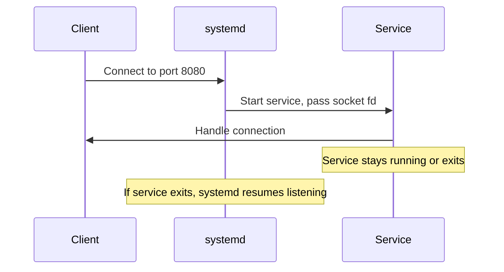

# How to Use Ansible to Manage Socket Units in systemd

Author: [nawazdhandala](https://www.github.com/nawazdhandala)

Tags: Ansible, systemd, Socket Activation, Linux

Description: Learn how to deploy and manage systemd socket units with Ansible for on-demand service activation and efficient resource usage.

---

Socket activation is one of the more powerful features of systemd that often gets overlooked. Instead of starting a service at boot and having it sit idle consuming memory, you can have systemd listen on a socket and only spawn the service when a connection actually arrives. This is the same pattern that inetd and xinetd used, but integrated into the modern init system with all the benefits of systemd's dependency tracking and resource controls.

In this guide, I will show you how to use Ansible to deploy and manage systemd socket units for on-demand service activation.

## How Socket Activation Works

The flow is straightforward:



systemd creates the socket, binds to the address, and listens. When a connection comes in, it starts the associated service and hands off the file descriptor. The service can then stay running for subsequent connections or exit and let systemd resume listening.

## When to Use Socket Activation

Socket activation makes sense for services that are accessed infrequently but need to be available. Think of internal admin panels, development tools, or backup services that only run when triggered by a network connection. It also helps with boot speed since you do not need to wait for every service to initialize before the system is ready.

## The Unit File Pair

Like timer units, socket units come in pairs. You need a `.socket` file and a `.service` file with the same name.

Jinja2 template for the socket unit:

```jinja2
# roles/systemd_socket/templates/socket.j2
[Unit]
Description=Socket for {{ socket_description | default(socket_name) }}

[Socket]

# TCP socket or Unix stream socket
ListenStream={{ socket_listen_stream }}


# UDP socket or Unix datagram socket
ListenDatagram={{ socket_listen_datagram }}


ListenSequentialPacket={{ socket_listen_sequential_packet }}



BindIPv6Only={{ socket_bind_ipv6_only }}



Backlog={{ socket_backlog }}



MaxConnections={{ socket_max_connections }}



# Per-connection service instances (inetd-style)
Accept=yes

Accept=no



FileDescriptorName={{ socket_file_descriptor_name }}



SocketUser={{ socket_socket_user }}



SocketGroup={{ socket_socket_group }}



SocketMode={{ socket_socket_mode }}


[Install]
WantedBy=sockets.target
```

Jinja2 template for the paired service:

```jinja2
# roles/systemd_socket/templates/service.j2
[Unit]
Description={{ socket_description | default(socket_name) }}
After=network.target


Requires={{ req }}



[Service]

# For Accept=yes, each connection gets its own process
Type=simple

Type={{ socket_service_type | default('simple') }}

User={{ socket_user | default('root') }}
Group={{ socket_group | default('root') }}
ExecStart={{ socket_exec_start }}

ExecStop={{ socket_exec_stop }}




Environment="{{ key }}={{ value }}"



# Do not start independently, only through socket activation

# Refuse manual start without socket


StandardOutput=journal
StandardError=journal
SyslogIdentifier={{ socket_name }}
```

## The Ansible Role Tasks

Deploy both unit files and manage the socket lifecycle:

```yaml
# roles/systemd_socket/tasks/main.yml
---
- name: Deploy the service unit
  ansible.builtin.template:
    src: service.j2
    dest: "/etc/systemd/system/{{ socket_name }}.service"
    owner: root
    group: root
    mode: '0644'
  notify: Reload systemd for socket

- name: Deploy the socket unit
  ansible.builtin.template:
    src: socket.j2
    dest: "/etc/systemd/system/{{ socket_name }}.socket"
    owner: root
    group: root
    mode: '0644'
  notify: Reload systemd for socket

- name: Flush handlers
  ansible.builtin.meta: flush_handlers

- name: Enable and start the socket
  ansible.builtin.systemd:
    name: "{{ socket_name }}.socket"
    state: started
    enabled: yes
    daemon_reload: yes
```

Handlers for the role:

```yaml
# roles/systemd_socket/handlers/main.yml
---
- name: Reload systemd for socket
  ansible.builtin.systemd:
    daemon_reload: yes

- name: Restart socket
  ansible.builtin.systemd:
    name: "{{ socket_name }}.socket"
    state: restarted
```

## Example: Socket-Activated Web Service

Let's deploy a simple Python HTTP service that only starts when someone connects to port 8080.

Playbook for deploying a socket-activated HTTP service:

```yaml
---
- name: Deploy socket-activated web service
  hosts: app_servers
  become: yes

  tasks:
    - name: Install Python3
      ansible.builtin.apt:
        name: python3
        state: present

    - name: Deploy the application script
      ansible.builtin.copy:
        dest: /opt/mywebapp/server.py
        mode: '0755'
        content: |
          #!/usr/bin/env python3
          """Simple HTTP server that works with systemd socket activation."""
          import socket
          import os
          import sys
          from http.server import HTTPServer, SimpleHTTPRequestHandler

          # Get the socket from systemd
          LISTEN_FDS_START = 3
          if os.environ.get('LISTEN_FDS'):
              # Socket was passed by systemd
              sock = socket.fromfd(LISTEN_FDS_START, socket.AF_INET, socket.SOCK_STREAM)
              server = HTTPServer(('', 8080), SimpleHTTPRequestHandler, bind_and_activate=False)
              server.socket = sock
          else:
              # Manual start fallback
              server = HTTPServer(('', 8080), SimpleHTTPRequestHandler)

          server.serve_forever()

    - name: Deploy socket-activated service
      ansible.builtin.include_role:
        name: systemd_socket
      vars:
        socket_name: mywebapp
        socket_description: "On-demand web application"
        socket_listen_stream: "8080"
        socket_exec_start: "/usr/bin/python3 /opt/mywebapp/server.py"
        socket_user: www-data
        socket_group: www-data
```

## Example: Unix Domain Socket

Socket activation works great with Unix domain sockets, commonly used for local IPC between services like Nginx and a backend application.

Deploy a Unix socket for a backend API:

```yaml
- name: Deploy Unix socket for backend API
  ansible.builtin.include_role:
    name: systemd_socket
  vars:
    socket_name: backend-api
    socket_description: "Backend API Unix socket"
    socket_listen_stream: "/run/backend-api/api.sock"
    socket_socket_user: www-data
    socket_socket_group: www-data
    socket_socket_mode: "0660"
    socket_exec_start: "/opt/backend-api/bin/server --socket /run/backend-api/api.sock"
    socket_user: appuser
    socket_group: appuser
```

Then configure Nginx to proxy to the Unix socket:

```yaml
- name: Configure Nginx to use the Unix socket
  ansible.builtin.template:
    src: nginx-upstream.conf.j2
    dest: /etc/nginx/conf.d/backend-api.conf
  notify: Reload Nginx
```

Where the Nginx config template looks like:

```nginx
upstream backend {
    server unix:/run/backend-api/api.sock;
}

server {
    listen 80;
    server_name api.example.com;

    location / {
        proxy_pass http://backend;
        proxy_set_header Host $host;
        proxy_set_header X-Real-IP $remote_addr;
    }
}
```

## Accept Mode: Per-Connection Instances

When you set `Accept=yes`, systemd spawns a new instance of the service for each incoming connection, similar to how inetd worked. The service name gets an `@` suffix with connection details.

Deploy an inetd-style per-connection service:

```yaml
- name: Deploy per-connection echo service
  ansible.builtin.include_role:
    name: systemd_socket
  vars:
    socket_name: echo-server
    socket_description: "Echo server (per-connection)"
    socket_listen_stream: "7777"
    socket_accept: true
    socket_max_connections: 100
    socket_exec_start: "/usr/local/bin/echo-handler"
    socket_service_type: simple
```

Note that when `Accept=yes`, the service file is named `echo-server@.service` (with the `@`). You need to adjust the template deployment:

```yaml
- name: Deploy service unit for accept mode
  ansible.builtin.template:
    src: service.j2
    dest: "/etc/systemd/system/{{ socket_name }}@.service"
    owner: root
    group: root
    mode: '0644'
  when: socket_accept | default(false)
  notify: Reload systemd for socket
```

## Monitoring Socket Status

After deployment, verify that your sockets are active and listening.

Check socket status with ad-hoc tasks:

```yaml
- name: List all listening sockets
  ansible.builtin.command: systemctl list-sockets --no-pager
  register: socket_list
  changed_when: false

- name: Show socket status
  ansible.builtin.debug:
    var: socket_list.stdout_lines

- name: Check specific socket
  ansible.builtin.command: "systemctl status {{ socket_name }}.socket"
  register: socket_status
  changed_when: false

- name: Show connections accepted
  ansible.builtin.command: "systemctl show {{ socket_name }}.socket --property=NAccepted"
  register: connections
  changed_when: false

- name: Report
  ansible.builtin.debug:
    msg: "{{ socket_name }} has accepted {{ connections.stdout.split('=')[1] }} connections"
```

## Stopping and Disabling

When you need to remove a socket-activated service, stop the socket first, then the service.

Properly tear down a socket-activated service:

```yaml
- name: Stop the socket
  ansible.builtin.systemd:
    name: "{{ socket_name }}.socket"
    state: stopped
    enabled: no

- name: Stop the service if running
  ansible.builtin.systemd:
    name: "{{ socket_name }}.service"
    state: stopped
  ignore_errors: yes

- name: Remove unit files
  ansible.builtin.file:
    path: "{{ item }}"
    state: absent
  loop:
    - "/etc/systemd/system/{{ socket_name }}.socket"
    - "/etc/systemd/system/{{ socket_name }}.service"

- name: Reload systemd
  ansible.builtin.systemd:
    daemon_reload: yes
```

## Summary

systemd socket activation lets you run services on demand, saving resources and improving boot times. With Ansible, you can template both the socket and service unit files, deploy them consistently across your fleet, and manage their lifecycle through handlers and the systemd module. The pattern is particularly useful for internal services, development tools, and any workload that does not need to be running 24/7 but should be available instantly when needed.
