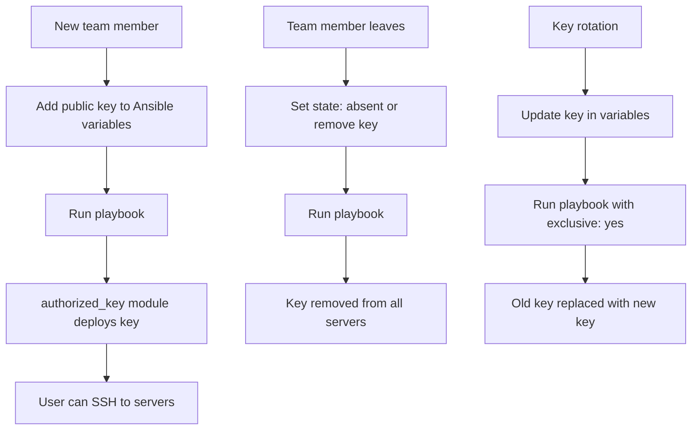

# How to Use Ansible to Manage SSH authorized_keys

Author: [nawazdhandala](https://www.github.com/nawazdhandala)

Tags: Ansible, SSH, Security, Linux

Description: Learn how to use the Ansible authorized_key module to manage SSH public keys for users across your infrastructure with proper security controls.

---

SSH key-based authentication is the standard for accessing Linux servers securely. Managing which public keys are authorized on which servers, for which users, across an entire fleet is exactly the kind of task Ansible excels at. The `authorized_key` module handles adding, removing, and managing SSH public keys in users' `~/.ssh/authorized_keys` files.

## Adding a Single SSH Key

The most basic use case is deploying a public key for a user.

```yaml
# Add an SSH public key for the deploy user
- name: Add deploy user SSH key
  ansible.posix.authorized_key:
    user: deploy
    key: "ssh-rsa AAAAB3NzaC1yc2EAAAADAQABAAABgQC7... deploy@workstation"
    state: present
```

The `user` parameter specifies whose `authorized_keys` file to modify. The `key` parameter is the full public key string (the same content you would find in an `id_rsa.pub` file).

## Loading Keys from Files

Instead of pasting key strings, you can load them from files in your Ansible project.

```yaml
# Add SSH key from a file in the project
- name: Add admin SSH key from file
  ansible.posix.authorized_key:
    user: admin
    key: "{{ lookup('file', 'files/ssh-keys/admin-key.pub') }}"
    state: present
```

Organize your keys in a directory structure.

```
roles/ssh-keys/files/
  ssh-keys/
    alice.pub
    bob.pub
    charlie.pub
    deploy-bot.pub
```

## Managing Multiple Keys for One User

Use a loop to add multiple keys for the same user.

```yaml
# Add multiple SSH keys for the admin user
- name: Add team SSH keys for admin access
  ansible.posix.authorized_key:
    user: admin
    key: "{{ lookup('file', item) }}"
    state: present
  loop:
    - files/ssh-keys/alice.pub
    - files/ssh-keys/bob.pub
    - files/ssh-keys/charlie.pub
```

## The exclusive Parameter

The `exclusive` parameter removes all keys that are not specified in the task. This is the strictest way to manage keys because it ensures only the keys you define are present.

```yaml
# Set the exact list of authorized keys - remove all others
- name: Set exact authorized keys for deploy user
  ansible.posix.authorized_key:
    user: deploy
    key: |
      ssh-rsa AAAAB3Nza... alice@company.com
      ssh-rsa AAAAB3Nza... bob@company.com
      ssh-rsa AAAAB3Nza... cicd-bot@jenkins
    exclusive: yes
```

When `exclusive: yes` is set, any key in the user's `authorized_keys` file that is not in the `key` parameter will be removed. This is powerful but dangerous if you forget to include a key.

```yaml
# Build exclusive key list from files
- name: Set exclusive authorized keys from key files
  ansible.posix.authorized_key:
    user: deploy
    key: "{{ lookup('file', keyfile) }}\n"
    exclusive: yes
  vars:
    deploy_key_files:
      - files/ssh-keys/alice.pub
      - files/ssh-keys/bob.pub
      - files/ssh-keys/cicd-bot.pub
```

## Removing SSH Keys

Remove a specific key when someone leaves the team or changes their key.

```yaml
# Remove a specific SSH key
- name: Remove former employee SSH key
  ansible.posix.authorized_key:
    user: deploy
    key: "ssh-rsa AAAAB3Nza... former-employee@company.com"
    state: absent
```

## Key Options

SSH authorized_keys supports options that restrict what a key can do. These are specified using the `key_options` parameter.

```yaml
# Add a key with restrictions
- name: Add backup service key with restrictions
  ansible.posix.authorized_key:
    user: backup
    key: "{{ lookup('file', 'files/ssh-keys/backup-bot.pub') }}"
    key_options: 'command="/opt/scripts/run-backup.sh",no-port-forwarding,no-X11-forwarding,no-agent-forwarding'

# Add a key that can only connect from specific IPs
- name: Add monitoring key with IP restriction
  ansible.posix.authorized_key:
    user: monitoring
    key: "{{ lookup('file', 'files/ssh-keys/monitor.pub') }}"
    key_options: 'from="10.0.1.100,10.0.1.101",no-pty'
```

Common key options:

| Option | Purpose |
|--------|---------|
| `command="..."` | Only allow running a specific command |
| `from="..."` | Restrict to specific source IPs |
| `no-port-forwarding` | Disable SSH port forwarding |
| `no-X11-forwarding` | Disable X11 forwarding |
| `no-agent-forwarding` | Disable agent forwarding |
| `no-pty` | Prevent allocation of a terminal |

## Variable-Driven Key Management

For managing keys at scale, define users and their keys in variables.

```yaml
# group_vars/all.yml
ssh_users:
  - name: alice
    state: present
    groups:
      - developers
      - docker
    keys:
      - "ssh-ed25519 AAAAC3Nza... alice@laptop"
      - "ssh-ed25519 AAAAC3Nza... alice@desktop"
  - name: bob
    state: present
    groups:
      - developers
    keys:
      - "ssh-rsa AAAAB3Nza... bob@workstation"
  - name: charlie
    state: absent
    keys: []
```

```yaml
# tasks/main.yml - Manage users and their SSH keys
- name: Create user accounts
  ansible.builtin.user:
    name: "{{ item.name }}"
    groups: "{{ item.groups | default([]) }}"
    state: "{{ item.state }}"
    remove: "{{ 'yes' if item.state == 'absent' else 'no' }}"
  loop: "{{ ssh_users }}"

- name: Deploy SSH keys for active users
  ansible.posix.authorized_key:
    user: "{{ item.0.name }}"
    key: "{{ item.1 }}"
    state: present
  loop: "{{ ssh_users | subelements('keys', skip_missing=True) }}"
  when: item.0.state == 'present'
```

## Fetching Keys from GitHub

You can pull SSH keys directly from a user's GitHub profile.

```yaml
# Add SSH keys from a GitHub user profile
- name: Add admin keys from GitHub
  ansible.posix.authorized_key:
    user: admin
    key: "https://github.com/username.keys"
    state: present
```

The `authorized_key` module can fetch keys from URLs. GitHub exposes public keys at `https://github.com/<username>.keys`.

## Using a Custom authorized_keys Path

By default, the module manages `~/.ssh/authorized_keys`. You can specify a different path.

```yaml
# Use a centralized authorized_keys location
- name: Add key to centralized authorized_keys
  ansible.posix.authorized_key:
    user: deploy
    key: "{{ lookup('file', 'files/ssh-keys/deploy.pub') }}"
    path: /etc/ssh/authorized_keys/deploy
    manage_dir: no
```

When using a custom path, set `manage_dir: no` if the directory is managed separately (for example, by your sshd_config `AuthorizedKeysFile` setting).

## A Complete SSH Key Management Role

```yaml
# roles/ssh-keys/tasks/main.yml
---
- name: Ensure .ssh directory exists for each user
  ansible.builtin.file:
    path: "/home/{{ item.name }}/.ssh"
    state: directory
    owner: "{{ item.name }}"
    group: "{{ item.name }}"
    mode: '0700'
  loop: "{{ managed_ssh_users }}"
  when: item.state == 'present'

- name: Deploy authorized keys (exclusive mode)
  ansible.posix.authorized_key:
    user: "{{ item.name }}"
    key: "{{ item.keys | join('\n') }}"
    exclusive: "{{ item.exclusive | default(false) }}"
    state: present
  loop: "{{ managed_ssh_users }}"
  when:
    - item.state == 'present'
    - item.keys | length > 0

- name: Remove keys for deactivated users
  ansible.posix.authorized_key:
    user: "{{ item.name }}"
    key: ""
    exclusive: yes
    state: present
  loop: "{{ managed_ssh_users }}"
  when: item.state == 'absent'
  ignore_errors: yes
```

## Key Management Workflow



## Security Best Practices

1. Use `exclusive: yes` on production servers to prevent unauthorized key additions
2. Prefer Ed25519 keys over RSA for new deployments
3. Use `key_options` to restrict service account keys to specific commands
4. Store key files in your Ansible repository and track changes with git
5. Run key management playbooks regularly to enforce compliance
6. Use `no_log: true` if you are dynamically generating keys

```yaml
# Enforce Ed25519 keys only by checking key type
- name: Validate key types before deployment
  ansible.builtin.assert:
    that:
      - "'ssh-ed25519' in item or 'ecdsa-sha2' in item"
    fail_msg: "Only Ed25519 and ECDSA keys are allowed: {{ item | truncate(40) }}"
  loop: "{{ user_ssh_keys }}"
```

## Summary

The `authorized_key` module gives you complete control over SSH key deployment across your infrastructure. Use it with `exclusive: yes` for strict key management on production servers, `key_options` for restricted service accounts, and variable-driven loops for managing keys at scale. Combine it with user management tasks for a complete onboarding and offboarding workflow. The ability to fetch keys from URLs (including GitHub) simplifies key distribution, while the `state: absent` option makes key revocation as simple as running a playbook. Consistent, automated SSH key management is one of the highest-value security practices you can implement with Ansible.
