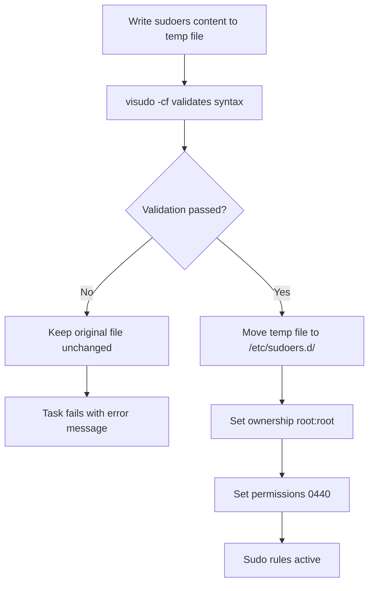

# How to Use Ansible to Manage sudoers File Safely

Author: [nawazdhandala](https://www.github.com/nawazdhandala)

Tags: Ansible, Security, Linux, Sudo

Description: Learn how to safely manage the sudoers file and drop-in configurations with Ansible using validation, templates, and the sudoers.d directory pattern.

---

The sudoers file controls who can run commands as root (or other users) on a Linux system. A syntax error in this file can lock everyone out of sudo access, which is why `visudo` exists as a safety mechanism. When managing sudoers with Ansible, you need the same safety. This guide covers the right ways to manage sudo permissions without risking lockouts.

## The Golden Rule: Always Validate

Never write directly to `/etc/sudoers` without validating the content first. Both the `copy` and `template` modules support the `validate` parameter, which runs a command against the file before moving it into place.

```yaml
# Deploy a sudoers file with validation
- name: Deploy main sudoers file
  ansible.builtin.template:
    src: templates/sudoers.j2
    dest: /etc/sudoers
    owner: root
    group: root
    mode: '0440'
    validate: '/usr/sbin/visudo -cf %s'
```

The `validate` parameter runs `visudo -cf %s` where `%s` is replaced with a temporary file path. If validation fails, the original `/etc/sudoers` remains unchanged. This is the most important safety mechanism.

## Using the sudoers.d Directory (Recommended)

The cleanest approach is to leave the main `/etc/sudoers` file alone and manage drop-in files in `/etc/sudoers.d/`. This is safer because a bad drop-in file does not corrupt the main sudoers config.

First, make sure the `#includedir` directive is present in the main sudoers file.

```yaml
# Ensure /etc/sudoers includes the sudoers.d directory
- name: Ensure sudoers.d include directive exists
  ansible.builtin.lineinfile:
    path: /etc/sudoers
    regexp: '^#includedir /etc/sudoers\.d'
    line: '#includedir /etc/sudoers.d'
    state: present
    validate: '/usr/sbin/visudo -cf %s'
```

Note: The `#includedir` line is not a comment. The `#` is part of the directive syntax.

Then deploy individual sudoers files for each team or application.

```yaml
# Grant the devops group passwordless sudo
- name: Deploy devops team sudoers file
  ansible.builtin.copy:
    content: |
      # Managed by Ansible - do not edit manually
      %devops ALL=(ALL) NOPASSWD: ALL
    dest: /etc/sudoers.d/devops
    owner: root
    group: root
    mode: '0440'
    validate: '/usr/sbin/visudo -cf %s'
```

## Common sudoers Patterns

### Passwordless sudo for a Group

```yaml
# Allow the deploy group to run any command without a password
- name: Grant deploy group passwordless sudo
  ansible.builtin.copy:
    content: |
      # Allow deploy group to run all commands as root without password
      %deploy ALL=(ALL) NOPASSWD: ALL
    dest: /etc/sudoers.d/deploy-team
    owner: root
    group: root
    mode: '0440'
    validate: '/usr/sbin/visudo -cf %s'
```

### Restricted Command Access

```yaml
# Allow monitoring user to run only specific commands
- name: Grant monitoring user limited sudo access
  ansible.builtin.copy:
    content: |
      # Allow monitoring user to restart services and view logs
      monitoring ALL=(root) NOPASSWD: /bin/systemctl restart myapp, /bin/systemctl status myapp, /bin/journalctl -u myapp
    dest: /etc/sudoers.d/monitoring
    owner: root
    group: root
    mode: '0440'
    validate: '/usr/sbin/visudo -cf %s'
```

### Application Service Account

```yaml
# Allow an application user to manage its own service
- name: Grant app user service management privileges
  ansible.builtin.copy:
    content: |
      # Allow myapp user to manage the myapp service
      myapp ALL=(root) NOPASSWD: /bin/systemctl start myapp
      myapp ALL=(root) NOPASSWD: /bin/systemctl stop myapp
      myapp ALL=(root) NOPASSWD: /bin/systemctl restart myapp
      myapp ALL=(root) NOPASSWD: /bin/systemctl reload myapp
      myapp ALL=(root) NOPASSWD: /bin/systemctl status myapp
    dest: /etc/sudoers.d/myapp-service
    owner: root
    group: root
    mode: '0440'
    validate: '/usr/sbin/visudo -cf %s'
```

## Using Templates for Dynamic sudoers Files

When the sudo rules depend on variables, use a template.

```yaml
# Deploy sudoers rules using a Jinja2 template
- name: Deploy application sudoers rules
  ansible.builtin.template:
    src: templates/app-sudoers.j2
    dest: "/etc/sudoers.d/{{ app_name }}"
    owner: root
    group: root
    mode: '0440'
    validate: '/usr/sbin/visudo -cf %s'
```

The template file.

```jinja2
# Sudoers rules for {{ app_name }} - managed by Ansible
# Deployed: {{ ansible_date_time.date }}

# Service management
{{ app_user }} ALL=(root) NOPASSWD: /bin/systemctl start {{ app_name }}
{{ app_user }} ALL=(root) NOPASSWD: /bin/systemctl stop {{ app_name }}
{{ app_user }} ALL=(root) NOPASSWD: /bin/systemctl restart {{ app_name }}
{{ app_user }} ALL=(root) NOPASSWD: /bin/systemctl reload {{ app_name }}


# Network troubleshooting tools
{{ app_user }} ALL=(root) NOPASSWD: /sbin/iptables -L
{{ app_user }} ALL=(root) NOPASSWD: /usr/sbin/ss -tlnp
{{ app_user }} ALL=(root) NOPASSWD: /usr/sbin/tcpdump -c *



{{ app_user }} ALL=(root) NOPASSWD: {{ cmd }}

```

## Managing Sudo for Multiple Teams

A role that manages sudoers for multiple teams from a variable definition.

```yaml
---
- name: Configure sudo access
  hosts: all
  become: yes
  vars:
    sudo_groups:
      - name: platform-engineering
        filename: platform-engineering
        rules:
          - "ALL=(ALL) NOPASSWD: ALL"
      - name: developers
        filename: developers
        rules:
          - "ALL=(root) NOPASSWD: /bin/systemctl restart app-*"
          - "ALL=(root) NOPASSWD: /bin/journalctl -u app-*"
          - "ALL=(root) NOPASSWD: /usr/bin/docker logs *"
      - name: dba
        filename: database-admins
        rules:
          - "ALL=(postgres) NOPASSWD: ALL"
          - "ALL=(root) NOPASSWD: /bin/systemctl * postgresql"

  tasks:
    - name: Deploy sudoers files for each team
      ansible.builtin.copy:
        content: |
          # Sudoers rules for {{ item.name }} - managed by Ansible
          
          %{{ item.name }} {{ rule }}
          
        dest: "/etc/sudoers.d/{{ item.filename }}"
        owner: root
        group: root
        mode: '0440'
        validate: '/usr/sbin/visudo -cf %s'
      loop: "{{ sudo_groups }}"
```

## Removing sudoers Entries

When you need to revoke sudo access, remove the drop-in file.

```yaml
# Remove sudo access for a decommissioned team
- name: Remove contractor sudo access
  ansible.builtin.file:
    path: /etc/sudoers.d/contractors
    state: absent
```

## Security Hardening

Add security-focused defaults to your sudoers configuration.

```yaml
# Deploy hardened sudoers defaults
- name: Deploy security defaults for sudo
  ansible.builtin.copy:
    content: |
      # Security defaults - managed by Ansible
      Defaults    env_reset
      Defaults    mail_badpass
      Defaults    secure_path="/usr/local/sbin:/usr/local/bin:/usr/sbin:/usr/bin:/sbin:/bin"
      Defaults    logfile="/var/log/sudo.log"
      Defaults    log_input,log_output
      Defaults    iolog_dir="/var/log/sudo-io/%{user}"
      Defaults    passwd_timeout=1
      Defaults    timestamp_timeout=5
      Defaults    use_pty
    dest: /etc/sudoers.d/00-security-defaults
    owner: root
    group: root
    mode: '0440'
    validate: '/usr/sbin/visudo -cf %s'
```

## Emergency Recovery

If something goes wrong despite validation, having an emergency plan is essential.

```yaml
# Create an emergency sudoers recovery mechanism
# This sets up a cron job that validates and restores sudoers if broken
- name: Deploy sudoers emergency recovery script
  ansible.builtin.copy:
    content: |
      #!/bin/bash
      # Check if sudoers is valid, restore backup if not
      if ! /usr/sbin/visudo -cf /etc/sudoers > /dev/null 2>&1; then
        cp /etc/sudoers.backup-known-good /etc/sudoers
        chmod 440 /etc/sudoers
        logger "ALERT: Restored sudoers from backup"
      fi
    dest: /usr/local/sbin/sudoers-recovery.sh
    mode: '0700'

- name: Save known-good sudoers backup
  ansible.builtin.copy:
    src: /etc/sudoers
    dest: /etc/sudoers.backup-known-good
    remote_src: yes
    mode: '0440'

- name: Schedule sudoers recovery check
  ansible.builtin.cron:
    name: "Sudoers recovery check"
    minute: "*/5"
    job: "/usr/local/sbin/sudoers-recovery.sh"
```

## sudoers Management Flow



## Summary

Managing sudoers with Ansible is safe as long as you follow two rules: always use the `validate` parameter with `visudo -cf %s`, and prefer drop-in files in `/etc/sudoers.d/` over editing the main sudoers file directly. The drop-in approach is modular (each team or application gets its own file), reversible (remove the file to revoke access), and safer (a bad drop-in does not corrupt the main file). Use templates for dynamic rules, loops for multi-team configurations, and always set permissions to `0440` with root ownership. These practices let you manage sudo access confidently across your entire infrastructure.
