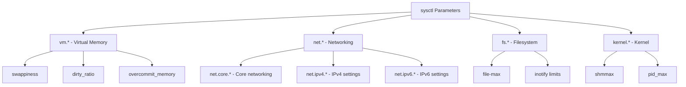

# How to Use Ansible to Manage sysctl Parameters

Author: [nawazdhandala](https://www.github.com/nawazdhandala)

Tags: Ansible, Linux, Performance Tuning, Networking

Description: Learn how to use the Ansible sysctl module to manage kernel parameters for performance tuning, security hardening, and network optimization.

---

Linux kernel parameters control everything from network buffer sizes to virtual memory behavior. Tuning these parameters is essential for high-performance servers, database hosts, and load balancers. The Ansible `sysctl` module manages these settings in `/etc/sysctl.conf` or `/etc/sysctl.d/` drop-in files, making the changes persistent across reboots and applying them immediately.

## Basic sysctl Management

The `sysctl` module sets a kernel parameter and applies it without requiring a reboot.

```yaml
# Increase the maximum number of open file descriptors system-wide
- name: Set system-wide max open files
  ansible.posix.sysctl:
    name: fs.file-max
    value: '2097152'
    sysctl_set: yes
    state: present
    reload: yes
```

The `sysctl_set: yes` parameter applies the setting immediately (equivalent to `sysctl -w`). The `reload: yes` ensures the sysctl daemon reloads the configuration.

## Network Performance Tuning

Network-heavy servers like load balancers, web servers, and proxy servers benefit from tuned network parameters.

```yaml
# Tune network parameters for a high-traffic web server
- name: Increase TCP connection backlog
  ansible.posix.sysctl:
    name: net.core.somaxconn
    value: '65535'
    sysctl_set: yes
    state: present

- name: Increase network device backlog
  ansible.posix.sysctl:
    name: net.core.netdev_max_backlog
    value: '65535'
    sysctl_set: yes
    state: present

- name: Enable TCP fast open
  ansible.posix.sysctl:
    name: net.ipv4.tcp_fastopen
    value: '3'
    sysctl_set: yes
    state: present

- name: Increase local port range
  ansible.posix.sysctl:
    name: net.ipv4.ip_local_port_range
    value: '10240 65535'
    sysctl_set: yes
    state: present

- name: Decrease TCP FIN timeout
  ansible.posix.sysctl:
    name: net.ipv4.tcp_fin_timeout
    value: '15'
    sysctl_set: yes
    state: present

- name: Enable TCP window scaling
  ansible.posix.sysctl:
    name: net.ipv4.tcp_window_scaling
    value: '1'
    sysctl_set: yes
    state: present
```

## Using Drop-in Files

Instead of modifying the main `/etc/sysctl.conf`, you can use drop-in files in `/etc/sysctl.d/` for better organization.

```yaml
# Use a custom sysctl file for application-specific tuning
- name: Set database server memory parameters
  ansible.posix.sysctl:
    name: "{{ item.name }}"
    value: "{{ item.value }}"
    sysctl_file: /etc/sysctl.d/90-database.conf
    sysctl_set: yes
    state: present
    reload: yes
  loop:
    - { name: 'vm.swappiness', value: '10' }
    - { name: 'vm.dirty_ratio', value: '40' }
    - { name: 'vm.dirty_background_ratio', value: '10' }
    - { name: 'vm.overcommit_memory', value: '2' }
```

Drop-in files are loaded in alphabetical order, so use numeric prefixes to control precedence.

## Security Hardening Parameters

Network security settings protect against common attacks.

```yaml
# Apply network security hardening
- name: Disable IP source routing
  ansible.posix.sysctl:
    name: "{{ item }}"
    value: '0'
    sysctl_file: /etc/sysctl.d/10-security.conf
    sysctl_set: yes
    state: present
  loop:
    - net.ipv4.conf.all.accept_source_route
    - net.ipv4.conf.default.accept_source_route

- name: Enable reverse path filtering
  ansible.posix.sysctl:
    name: "{{ item }}"
    value: '1'
    sysctl_file: /etc/sysctl.d/10-security.conf
    sysctl_set: yes
    state: present
  loop:
    - net.ipv4.conf.all.rp_filter
    - net.ipv4.conf.default.rp_filter

- name: Ignore ICMP broadcast requests
  ansible.posix.sysctl:
    name: net.ipv4.icmp_echo_ignore_broadcasts
    value: '1'
    sysctl_file: /etc/sysctl.d/10-security.conf
    sysctl_set: yes
    state: present

- name: Disable ICMP redirects
  ansible.posix.sysctl:
    name: "{{ item }}"
    value: '0'
    sysctl_file: /etc/sysctl.d/10-security.conf
    sysctl_set: yes
    state: present
  loop:
    - net.ipv4.conf.all.accept_redirects
    - net.ipv4.conf.default.accept_redirects
    - net.ipv4.conf.all.send_redirects
    - net.ipv4.conf.default.send_redirects

- name: Enable SYN flood protection
  ansible.posix.sysctl:
    name: net.ipv4.tcp_syncookies
    value: '1'
    sysctl_file: /etc/sysctl.d/10-security.conf
    sysctl_set: yes
    state: present

- name: Log martian packets
  ansible.posix.sysctl:
    name: net.ipv4.conf.all.log_martians
    value: '1'
    sysctl_file: /etc/sysctl.d/10-security.conf
    sysctl_set: yes
    state: present
```

## Variable-Driven sysctl Management

Define all sysctl settings in variables for clean, reusable playbooks.

```yaml
---
- name: Apply kernel tuning parameters
  hosts: all
  become: yes
  vars:
    sysctl_params:
      - name: vm.swappiness
        value: '10'
        file: /etc/sysctl.d/90-vm.conf
      - name: fs.file-max
        value: '2097152'
        file: /etc/sysctl.d/90-fs.conf
      - name: fs.inotify.max_user_watches
        value: '524288'
        file: /etc/sysctl.d/90-fs.conf
      - name: net.core.somaxconn
        value: '65535'
        file: /etc/sysctl.d/90-network.conf
      - name: net.ipv4.tcp_max_syn_backlog
        value: '65535'
        file: /etc/sysctl.d/90-network.conf

  tasks:
    - name: Apply sysctl parameters
      ansible.posix.sysctl:
        name: "{{ item.name }}"
        value: "{{ item.value }}"
        sysctl_file: "{{ item.file }}"
        sysctl_set: yes
        state: present
        reload: yes
      loop: "{{ sysctl_params }}"
```

## Database Server Tuning

Database servers have specific kernel tuning requirements.

```yaml
# Tune kernel for PostgreSQL
- name: Apply PostgreSQL kernel tuning
  ansible.posix.sysctl:
    name: "{{ item.name }}"
    value: "{{ item.value }}"
    sysctl_file: /etc/sysctl.d/90-postgresql.conf
    sysctl_set: yes
    state: present
    reload: yes
  loop:
    # Reduce swap usage - databases manage their own cache
    - { name: 'vm.swappiness', value: '1' }
    # Shared memory - required for large shared_buffers
    - { name: 'kernel.shmmax', value: '{{ (ansible_memtotal_mb * 1024 * 1024 * 0.75) | int }}' }
    - { name: 'kernel.shmall', value: '{{ (ansible_memtotal_mb * 1024 * 1024 * 0.75 / 4096) | int }}' }
    # Dirty page settings for write-heavy workloads
    - { name: 'vm.dirty_ratio', value: '40' }
    - { name: 'vm.dirty_background_ratio', value: '10' }
    - { name: 'vm.dirty_expire_centisecs', value: '500' }
    - { name: 'vm.dirty_writeback_centisecs', value: '100' }
    # Huge pages if needed
    - { name: 'vm.nr_hugepages', value: '{{ (pg_shared_buffers_mb / 2) | int }}' }
  vars:
    pg_shared_buffers_mb: 8192
```

## Load Balancer Tuning

```yaml
# Tune kernel for a load balancer handling many connections
- name: Apply load balancer kernel tuning
  ansible.posix.sysctl:
    name: "{{ item.name }}"
    value: "{{ item.value }}"
    sysctl_file: /etc/sysctl.d/90-loadbalancer.conf
    sysctl_set: yes
    state: present
  loop:
    - { name: 'net.core.somaxconn', value: '65535' }
    - { name: 'net.core.netdev_max_backlog', value: '65535' }
    - { name: 'net.ipv4.tcp_max_syn_backlog', value: '65535' }
    - { name: 'net.ipv4.ip_local_port_range', value: '1024 65535' }
    - { name: 'net.ipv4.tcp_tw_reuse', value: '1' }
    - { name: 'net.ipv4.tcp_fin_timeout', value: '15' }
    - { name: 'net.core.rmem_max', value: '16777216' }
    - { name: 'net.core.wmem_max', value: '16777216' }
    - { name: 'net.ipv4.tcp_rmem', value: '4096 87380 16777216' }
    - { name: 'net.ipv4.tcp_wmem', value: '4096 87380 16777216' }
    - { name: 'net.nf_conntrack_max', value: '1048576' }
```

## IP Forwarding for Routers and Containers

Hosts that need to forward packets (routers, Docker hosts, Kubernetes nodes) need IP forwarding enabled.

```yaml
# Enable IP forwarding for container hosts
- name: Enable IPv4 forwarding
  ansible.posix.sysctl:
    name: net.ipv4.ip_forward
    value: '1'
    sysctl_set: yes
    state: present
    reload: yes

- name: Enable IPv6 forwarding
  ansible.posix.sysctl:
    name: net.ipv6.conf.all.forwarding
    value: '1'
    sysctl_set: yes
    state: present
    reload: yes

# Bridge network filter for Kubernetes
- name: Enable bridge-nf-call-iptables
  ansible.posix.sysctl:
    name: "{{ item }}"
    value: '1'
    sysctl_set: yes
    state: present
  loop:
    - net.bridge.bridge-nf-call-iptables
    - net.bridge.bridge-nf-call-ip6tables
```

## sysctl Categories Overview



## Summary

The Ansible `sysctl` module provides safe, idempotent management of Linux kernel parameters. Use drop-in files in `/etc/sysctl.d/` for clean organization, variable-driven loops for scalable configuration, and role-specific tuning profiles for different server types. Network tuning, security hardening, memory management, and container networking all rely on sysctl parameters, making this module a critical part of any server provisioning playbook. Always use `sysctl_set: yes` to apply changes immediately and test parameter values in a staging environment before rolling them out to production.
